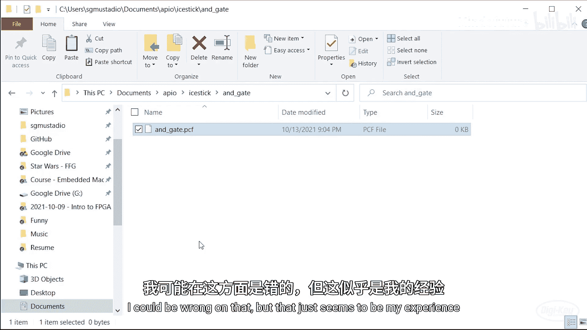
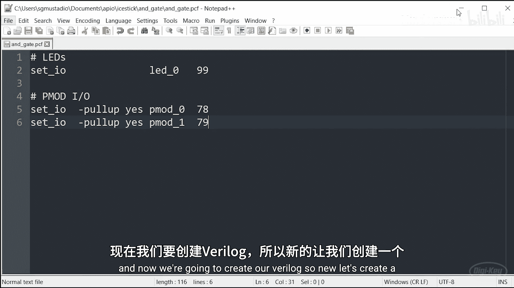
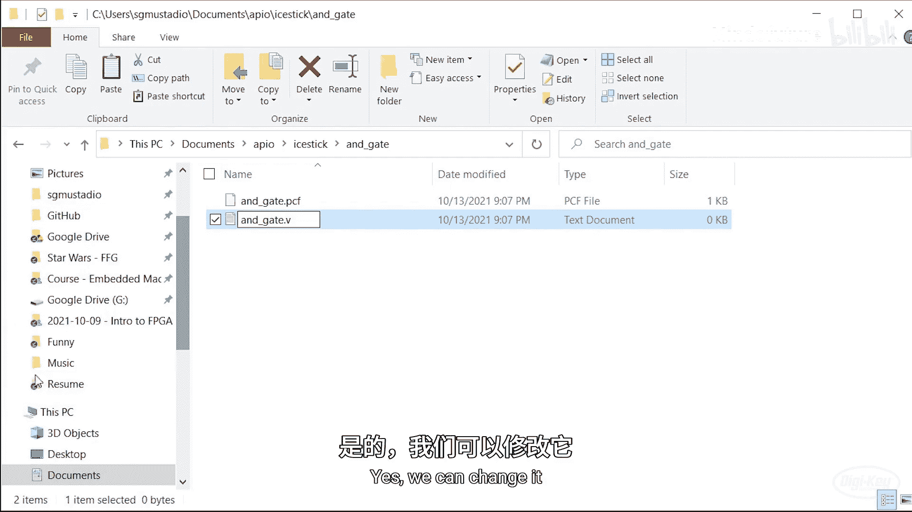
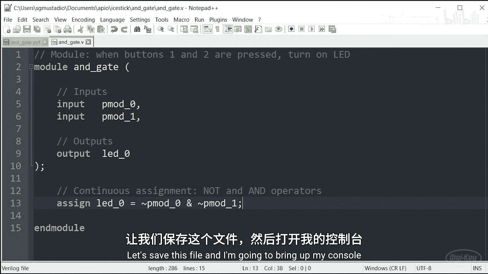
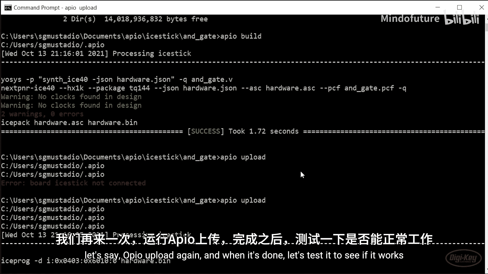
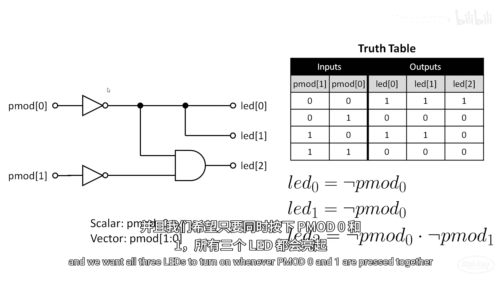
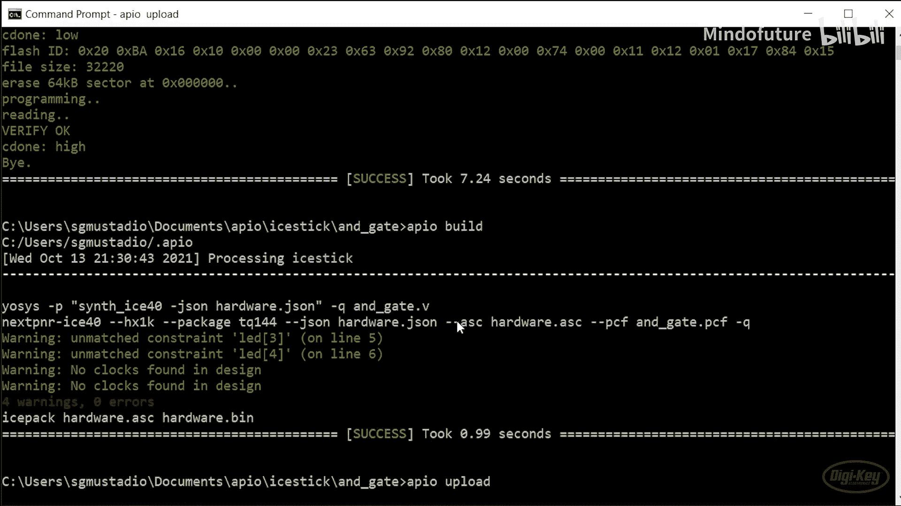
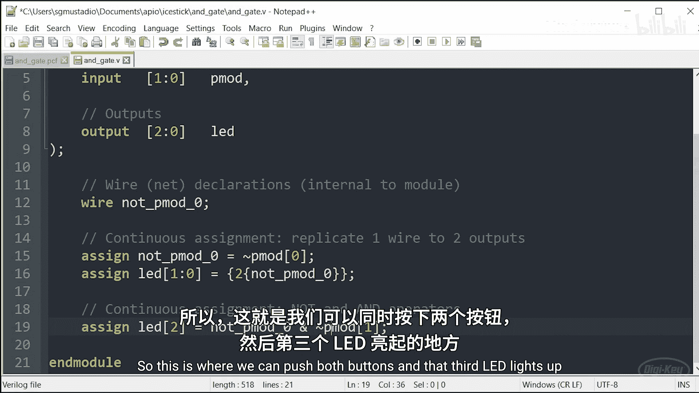

# 003：Verilog入门与组合逻辑电路设计 🚀

在本节课中，我们将学习如何使用Verilog语言创建基本的数字设计，并了解这些设计如何在FPGA的查找表中实现。我们将从连接硬件开始，逐步编写代码，最终实现一个简单的与门电路和一个更复杂的向量控制电路。

---

## 硬件连接与引脚约束 🔌

上一节我们安装了FPGA工具链，现在可以开始创建自己的数字设计了。本节中，我们首先需要连接硬件并定义引脚约束。

我们将使用iCEstick开发板末端的PMOD连接器。这个连接器提供了电源、地线以及两侧的一些输入/输出引脚。这种连接器格式由Digilent公司推广，在许多FPGA开发板上都能找到，方便连接常见的扩展板以添加按钮、LED、传感器等功能。

以下是iCEstick上该连接器的引脚定义：
*   引脚6和12是3.3V电源。
*   引脚5和11是地线。
*   其余引脚是直接连接到FPGA的IO引脚。

我们将从连接按钮开始。将按钮连接到右侧的引脚1至4。请注意，这些引脚对应FPGA上的物理引脚78、79、80和81。本视频只需要三个按钮，但连接四个也无妨。

以下是连接示意图：



请注意，我们**不需要**为按钮添加外部上拉电阻。我们可以在FPGA内部为每个引脚启用上拉电阻，稍后会展示如何操作。

---

## 第一个电路：与门设计 💡

这是我们即将制作的第一个电路。它是一个非常基础的与门。准确地说，它是一个在每个输入端都带有非门的与门。这是因为当我们按下按钮时，线路会从高电平变为低电平（从1变为0）。我们希望只有当两个按钮同时被按下时，其中一个LED才会点亮。

该电路的另一种表示方法是使用真值表：

| 输入A (按钮0) | 输入B (按钮1) | 输出 (LED) |
| :------------ | :------------ | :--------- |
| 0             | 0             | 1          |
| 0             | 1             | 0          |
| 1             | 0             | 0          |
| 1             | 1             | 0          |

从表中可以看到，当两个输入都为0时，输出为1，这意味着LED应该点亮。否则，LED应保持熄灭。

如果你熟悉布尔代数，可能会知道我们可以使用德摩根定律将这个等式简化为 `LED = ~(pmod0 | pmod1)`。但实际上我们不需要这样做。这里重要的是真值表，以及我们的代码要易于理解。

---


## 创建项目文件与引脚约束文件 📁

首先，我们需要创建一个文件夹来存放所有文件，包括Verilog文件和物理约束文件。

1.  进入之前创建`icestick`示例项目的目录。
2.  创建一个新文件夹，命名为 `and_gate`。

接下来，创建引脚约束文件。

1.  创建一个新的空白文本文档。
2.  将其命名为与项目相同的名称：`and_gate.pcf`。
3.  如果操作系统询问，确认更改文件后缀名。



**注意**：`nextpnr`工具会在特定文件夹中查找第一个可用的`.pcf`文件。根据经验，最好不要有多个`.pcf`文件，因为看起来只有第一个会被使用。

用文本编辑器（如Notepad++）打开这个`.pcf`文件。`.pcf`文件的语法与Verilog完全不同，注释使用井号`#`。

以下是定义LED和按钮引脚的示例：

```pcf
# 定义LED引脚
set_io LED0 99

# 定义PMOD IO引脚并启用内部上拉电阻
set_io --pullup yes pmod0 78
set_io --pullup yes pmod1 79
```



*   `LED0` 对应物理引脚99，连接到iCEstick上的D1 LED。
*   `pmod0` 和 `pmod1` 是我们为按钮定义的网络名称，分别连接到物理引脚78和79。`--pullup yes` 参数启用了这些引脚的内置上拉电阻。

保存这个文件。

---

## 编写第一个Verilog模块 ⌨️

现在，创建我们的Verilog源文件。

1.  创建一个新文档。
2.  将其重命名为与项目相同的名称：`and_gate.v`。
3.  用文本编辑器打开它。

我们将开始编写实际的Verilog代码。Verilog支持C风格的注释（`//` 和 `/* */`）。

首先，我们定义一个模块。模块是Verilog中的一个关键字，用于定义一个功能代码块。请记住，这**不一定**是顺序执行的代码，它不会逐行运行。当我们运行综合时，这个功能块会被实现为硬件。

```verilog
// 当两个按钮同时按下时，点亮LED
module and_gate (
    // 输入
    input pmod0,
    input pmod1,
    // 输出
    output LED0
);
```

*   `module and_gate` 声明了一个名为 `and_gate` 的模块。模块名不必与文件名相同，但保持一致是个好习惯。
*   在括号内，我们定义了模块的接口，即输入和输出。输入输出之间用逗号分隔。
*   我们命名输入为 `pmod0` 和 `pmod1`，输出为 `LED0`。这些名称应与`.pcf`文件中创建的名称对齐。

保持输入和输出的良好组织很重要，特别是当模块有很多端口时。使用制表符或空格对齐可以使代码更易读。

接下来，完成模块的功能定义，并以 `endmodule` 结束。

```verilog
    // 连续赋值：创建一个与门，输入取反后相与，结果连接到输出
    assign LED0 = ~pmod0 & ~pmod1;

endmodule
```

*   `assign LED0 = ~pmod0 & ~pmod1;` 这是一个**连续赋值**语句。在Verilog或HDL中，这不是在处理器上执行的代码。相反，我们是在定义硬件。
*   我们是在说：创建一个与门（`&`），将 `pmod0` 和 `pmod1` 线路取反（`~`）后的信号进行“与”操作，然后将结果连接到我们的输出线路 `LED0`。
*   因为按钮是低电平有效（按下时变为0），所以我们需要使用非运算符（`~`）。
*   “连续”意味着没有时钟，没有代码执行。你可以把它想象成在面包板上连接硬件。

保存这个文件。



---

## 构建与上传到FPGA ⚙️

现在，打开命令行终端，进入我们的项目目录。

1.  首次构建前，需要运行 `apio init` 并指定开发板型号。
    ```bash
    apio init --board icestick
    ```
    这会创建一个 `.ini` 文件，告诉Apio我们使用iCEstick作为目标板。
2.  运行构建命令。
    ```bash
    apio build
    ```
    如果一切顺利，你会看到构建成功的消息。暂时可以忽略关于“no clocks”的警告，我们将在后续课程中讨论时钟。
3.  将开发板连接到电脑，然后上传比特流文件。
    ```bash
    apio upload
    ```

上传完成后，测试电路功能。单独按下任一按钮，LED不会亮。只有同时按下两个按钮时，LED才会点亮。这表明我们的设计成功了！




---

## FPGA内部原理：查找表 🔍

让我们花点时间了解一下FPGA内部实际发生了什么。

查看iCE40的数据手册，可以找到一个显示单个逻辑单元内部结构的框图。一个逻辑单元有两个主要部分：一个**查找表**和一个D触发器（我们稍后会研究D触发器）。现在让我们关注查找表。

请注意，查找表有四个输入，标记为I0到I3。下图展示了我们简单与门示例的完整真值表在查找表中的映射。我们假设 `pmod0` 和 `pmod1` 被映射到了这个特定查找表的I0和I1。



与我们最初的想象不同，查找表**不是**逻辑门的集合。相反，它是一块简单的**内存**，有16个条目，每个条目包含1位数据。

在启动时，FPGA从外部闪存读取配置数据，找到如何编程这个特定查找表中随机存取存储器（RAM）的信息。真值表的输出部分被复制到LUT的内存中。四个输入线随后被用作索引来寻址内存，因为输入的值包含了应该读取哪个内存元素的地址。这类似于使用一个16选1的多路复用器从各个内存元素中选择输出。查找表的输出是一个单比特：0或1。

实际上，在综合过程中将我们代码的组合逻辑部分转换为查找表值，正是FPGA魔力的重要体现。

---

## 进阶示例：使用向量 🎛️

现在让我们看一个稍微复杂一点的例子，并引入**向量**的概念。


Verilog中的向量是一种将输入、输出和其他命名的容器分组在一起的方式。这类似于在C或Python等其他编程语言中使用数组。我们不再为每个输入和输出分配单独的名称，而是将它们分组在一起。我们在上一个示例中使用的单个命名网络被称为**标量**。

以下是我们想要实现的功能真值表。注意，我们现在有多个输出。

| pmod[1] | pmod[0] | LED[2] | LED[1] | LED[0] | 描述                     |
| :------ | :------ | :----- | :----- | :----- | :----------------------- |
| 0       | 0       | 0      | 0      | 0      | 无按钮按下               |
| 0       | 1       | 0      | 1      | 1      | 按下按钮0，点亮LED0和LED1 |
| 1       | 0       | 0      | 0      | 0      | 按下按钮1，无变化         |
| 1       | 1       | 1      | 1      | 1      | 同时按下按钮0和1，点亮所有LED |

我们可以写出布尔方程如下：
*   `LED[0] = ~pmod[0]`
*   `LED[1] = ~pmod[0]`
*   `LED[2] = ~pmod[0] & ~pmod[1]`

我们希望当按下 `pmod[0]` 按钮时，LED0和LED1点亮；当 `pmod[0]` 和 `pmod[1]` 同时被按下时，所有三个LED都点亮。

让我们在Verilog代码中实现它。

首先，修改`.pcf`文件以使用向量形式定义引脚。

```pcf
# 定义LED引脚向量
set_io LED[4] 95
set_io LED[3] 96
set_io LED[2] 97
set_io LED[1] 98
set_io LED[0] 99

# 定义按钮引脚向量并启用上拉
set_io --pullup yes pmod[0] 78
set_io --pullup yes pmod[1] 79
```
注意，LED引脚95到99的顺序看起来是反的，这是因为开发板上的物理布局如此。我们定义了5个LED位，但本设计只使用0、1和2，预计在构建过程中会收到3和4未使用的警告。

接着，更新Verilog模块的接口定义。

```verilog
module and_gate_vector (
    // 输入：2位宽的按钮向量，pmod[1]是最高位
    input [1:0] pmod,
    // 输出：5位宽的LED向量，LED[4]是最高位，但我们只使用低3位
    output [4:0] LED
);
```

*   `input [1:0] pmod` 定义了一个名为 `pmod` 的2位宽输入向量，位序为 `[1:0]`（最高位在前）。
*   `output [4:0] LED` 定义了一个5位宽的输出向量，但我们只使用 `LED[0]`、`LED[1]` 和 `LED[2]`。

现在，在模块内部使用连续赋值来实现逻辑。

```verilog
    // 定义一个内部连线（wire），用于存储取反后的pmod[0]信号
    wire not_pmod0;
    assign not_pmod0 = ~pmod[0];

    // 使用复制操作：将not_pmod0的值复制两份，分别赋值给LED[1]和LED[0]
    assign LED[1:0] = {2{not_pmod0}};

    // 实现第三个LED的逻辑：当pmod[0]和pmod[1]都取反后相与时点亮
    assign LED[2] = ~pmod[0] & ~pmod[1];

    // 将未使用的LED输出置零以避免警告（可选，但更规范）
    assign LED[4:3] = 2'b00;

endmodule
```

**代码解释：**
1.  `wire not_pmod0;`：在模块内部定义了一个名为 `not_pmod0` 的**连线**。它不是一个变量（尽管这是最接近C语言的类比），而是一个命名的网络，用于在模块内部进行连接。你可以把它想象成PCB布局中命名的网络或导线。
2.  `assign not_pmod0 = ~pmod[0];`：`assign` 关键字本质上是在硬件中建立一个连接。我们将取反后的 `pmod[0]` 信号连接到这个命名的网络上。
3.  `assign LED[1:0] = {2{not_pmod0}};`：这是Verilog中的**复制**操作。花括号 `{}` 通常用于连接，但这里 `{2{not_pmod0}}` 表示将 `not_pmod0` 这个信号复制两份。因此，`LED[1]` 和 `LED[0]` 都接到了 `not_pmod0` 这个网络上。这相当于一个T型连接点，将一根线分成了两路。
4.  `assign LED[2] = ~pmod[0] & ~pmod[1];`：这是第三个LED的逻辑，当两个按钮同时按下（取反后相与为1）时点亮。
5.  `assign LED[4:3] = 2'b00;`：将未使用的LED输出显式地驱动为低电平，这是一个更规范的做法，可以避免综合工具警告。

保存并构建这个项目。由于是同一个项目，可以直接运行 `apio build` 而无需再次运行 `apio init`。预计会收到关于L3和L4未使用的警告。构建成功后，上传到板子。



测试功能：按下第一个按钮（对应 `pmod[0]`），LED0和LED1点亮。只有同时按下两个按钮时，第三个LED才会与前两个一起点亮。

---

## 挑战任务：实现一个全加器 🏆

你的挑战是：在Verilog中实现一个**全加器**，并在你的设备上运行它。



全加器是一个非常重要的电路，它执行两个比特之间的基本加法操作。它在构成中央处理器（CPU）计算部分的算术逻辑单元（ALU）中扮演着关键角色。

你可以参考维基百科的“全加器”条目，那里提供了真值表和逻辑图，帮助你理解如何在Verilog中实现它。


**注意**：如果你希望按钮按下代表逻辑高电平，可能需要对输入进行取反。

以下是我的iCEstick上全加器的工作情况：
*   当我按下任意一个按钮时，“和”输出LED点亮。
*   当我按下任意两个按钮时，“进位”输出LED点亮。
*   当我按下所有三个按钮时，“和”与“进位”输出LED都点亮。


---

## 总结与下节预告 📚

本节课中，我们一起学习了：
1.  如何为FPGA项目创建引脚约束文件（`.pcf`）。
2.  如何编写一个基本的Verilog模块，使用连续赋值语句描述组合逻辑电路。
3.  理解了FPGA如何利用查找表来实现组合逻辑功能。
4.  引入了向量的概念，以更简洁的方式处理多位宽信号。
5.  完成了一个简单的与门和一个多输出逻辑电路的实现与测试。

到目前为止，我们只研究了**连续赋值**，其中输出的变化或多或少会立即响应输入的变化，中间可能包含一些组合逻辑。

**下一次课**，我们将学习如何引入**时钟和触发器**，这样我们就可以存储数据并在一个时钟周期到下一个时钟周期之间传递数据。


祝你编程愉快！