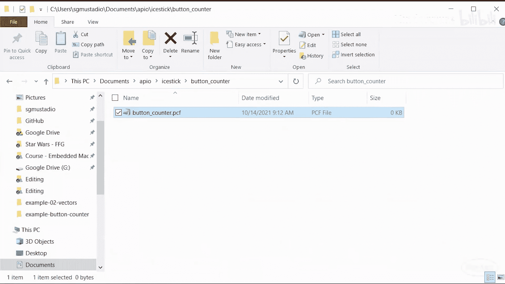
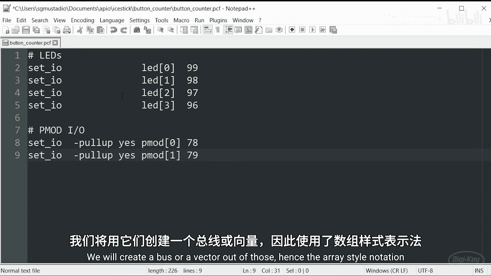
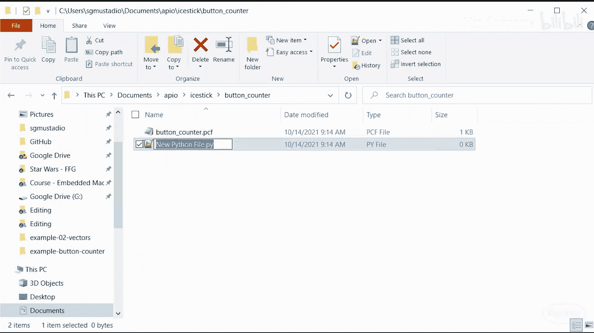
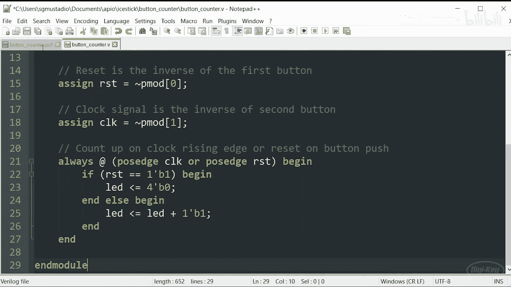
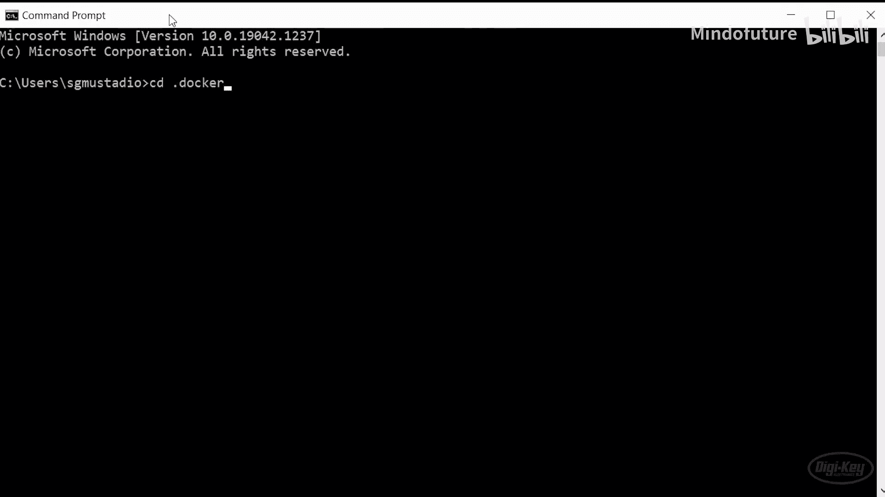
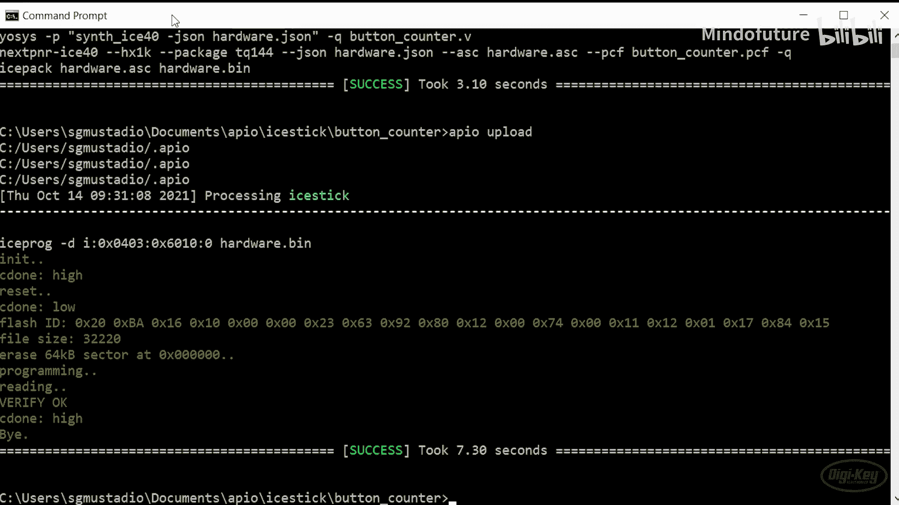
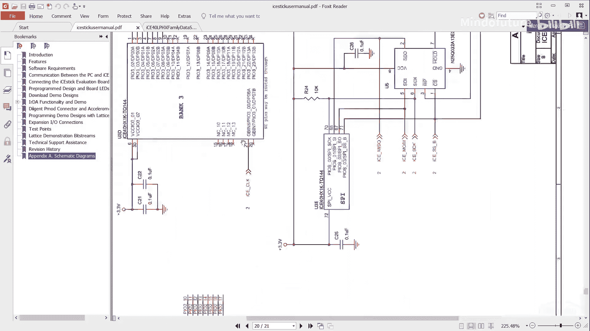
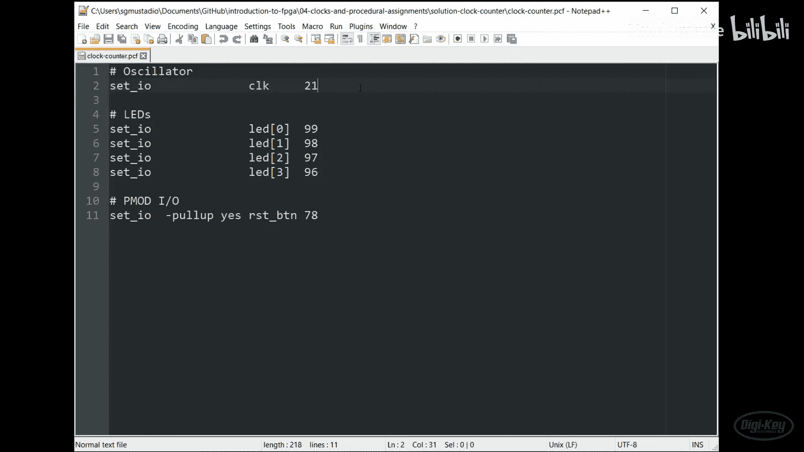

# 004：时钟与过程赋值

在本节课中，我们将学习如何在Verilog中利用FPGA逻辑单元中的D触发器，来创建按顺序执行的过程代码。我们将通过构建一个4位计数器来演示这一概念。

上一节我们介绍了如何在Verilog中创建连续赋值块。本节中，我们来看看如何利用D触发器来编写顺序执行的代码。

## D触发器简介

查看iCE40数据手册时，可以看到逻辑单元中还有一个我们尚未讨论的部分，那就是D触发器。这是一个由晶体管和电阻构成的基本数字逻辑元件。它允许我们在时钟脉冲之间存储一位信息。

在逻辑单元图中，一位输入可以来自查找表。时钟信号可以来自多个源。我们还有一个复位引脚和一个使能引脚来控制输出。单元的输出可以来自D触发器，也可以通过多路复用器绕过触发器。

以下是D触发器的简化工作原理：
*   我们有一个时钟信号作为输入之一。
*   每当D触发器检测到时钟的上升沿（也称为正边沿）时，它会采样输入端的值。
*   如果输入为低电平，则输出线变为低电平。
*   如果输入为高电平，则输出线变为高电平。
*   输出线将保持该状态，直到下一个时钟上升沿到来。

本课中我们不使用使能线。使能线用于允许或阻止在时钟边沿进行采样。如果使能线为高电平，触发器正常工作。如果使能线为低电平，无论输入线如何变化，触发器都将保持输出线上的值。

最后是复位线。如果复位线变为高电平，输出线将被驱动为低电平。这可以异步发生，意味着它不需要在时钟边沿发生。只要复位线为高电平，输出线就保持低电平，即使有上升时钟沿。

由于FPGA首次初始化时，输出线可能随机为高或低，我们可以使用复位线为触发器设置初始状态。因此，通常会看到同一个复位线连接到许多不同的触发器。

## 构建4位计数器

我们可以将触发器与组合逻辑结合，创建各种数字电路。例如，我们将在Verilog中创建一个4位计数器并在FPGA上测试它。

以下是计数器的逻辑图。请注意，我们实际上不需要实现加法器，因为Verilog支持加法等基本数学符号。综合工具会找出实现比特相加目标的最佳逻辑，可能是我们设计的全加器，也可能是其他组合逻辑。

我们在逻辑中添加触发器，使得在每个正时钟边沿，我们的4位数加一。如果需要递增下一个比特，则使用进位输出来通知计数器的下一级需要将其值增加一。

你可能注意到我们的输出或Q总线没有设置初始值。为此，我们需要给复位线一个脉冲，以便将输出设置为0，这将使计数器从头开始计数。

## 计数器时序图

以下是4位计数器的时序图。虽然FPGA首次启动时可能将Q0到Q3线初始化为低电平，但最好不要假设它们一定是低电平。因此，在给出复位脉冲之前，我们认为这些线的状态是未知的。

一旦复位线变为高电平，整个总线被设置为0。然后在每个上升时钟边沿，Q值加一。这使我们能够使用四条线和一些数字逻辑创建一个从0到15的计数器。当输出为15（二进制1111）时，下一个正时钟边沿将导致计数器复位或回滚到0。

计数器是非常有用的电路，用于计时事件或构成脉宽调制信号的基础。如果你使用过微控制器，可能遇到过计数器（也可称为定时器）。它们是几乎完全像这样操作的硬件逻辑，允许我们设置定时事件，在特定间隔发生，而无需浪费CPU周期。我们还可以生成硬件中断信号，每当定时器达到某个值或发生回滚事件时触发。

## 在Verilog中实现4位计数器

和之前一样，我们进入包含项目的文件夹，为要创建的新项目创建一个新文件夹，命名为`button_counter`。进入该文件夹，创建物理约束文件`button_counter.pcf`。

约束文件内容与之前类似。我们将创建一个连接到LED的引脚向量（一个4位宽的总线），并对两个按钮（特别是连接到物理引脚78和79的按钮）做同样处理，创建一个总线或向量。

接着创建Verilog文件。我们将创建一个加载到FPGA上的模块。目标是按下按钮时，将其作为时钟信号，每次按下按钮计数器加一，计数值以二进制形式显示在LED上。

我们声明按钮引脚（PMOD引脚0和1）为输入，它们将作为时钟信号或敏感信号。注意，我们将LED引脚声明为`reg`类型。`reg`（寄存器）关键字告诉综合工具，我们希望将这些线连接到D触发器，这意味着它们将成为过程赋值的一部分。

和之前一样，我们声明几条`wire`，因为想重命名按钮，并假设按钮信号（按下按钮）将像时钟信号一样工作，只是由按钮控制其高低电平切换。同样，复位信号也是如此。拥有一个公共复位信号是个好主意，这样当开始一个`always`块时，它可能不知道某些变量应处于什么状态。

我们想让复位和时钟信号为高电平有效，这与按钮的工作方式相反。因此，我们进行连续赋值，第一个按钮的信号通过一个非门，成为复位信号。对时钟信号也做同样的处理，只是重命名第二个按钮的反相信号。

我们使用`always`关键字定义过程块或过程代码。此块内的任何内容都顺序执行，类似于C或Python等编程语言的执行方式，但由于信号可以通过D触发器传播，事情按顺序发生。然后我们需要定义一个敏感列表，告诉硬件信号应如何传播或何时传播，这是通过使用时钟信号或复位信号来完成的，它寻找这些信号的上升沿或下降沿，以执行`always`块内的内容。

第一种情况，我们定义正边沿，即时钟信号的上升沿。这里，它是按钮按下的反相。所以当我们按下按钮时，根据我们创建的这条线，它算作一个上升沿，并将执行`always`块内的任何内容。

现在需要指出，由于这些简单按钮存在大量去抖动问题，每次按钮按下可能会执行多次，这是预期行为。在FPGA中实现按钮去抖动是可行的，如果你想挑战，可以尝试解决按钮去抖动问题，但这不会是本课的挑战。

一个`always`块可以根据多个信号的输入来执行。这里，时钟上升沿或复位上升沿都会导致此块执行。注意，你也可以使用负边沿。

`begin`在这里的作用类似于C或C++中的花括号，表示`always`块的内容。然后我们创建一个`if`语句，其工作方式与你在C或Python中见过的`if`语句非常相似。

这里，条件在括号内给出。如果复位信号等于1，则执行`if`语句下的内容。注意，Verilog中的常量可能有点奇怪，通常需要定义位数，因为这决定了进行比较所需的线或导线数量。这里只需要一位，复位只能是0或1。

然后我们说用二进制定义，这是1。所以这可以是`1‘b0`或`1’b1`，这是一位宽二进制数的唯一选项。这里我们希望它是1。我们调用`begin`，并在其下缩进以便阅读。这里是我们对LED总线或向量的赋值。所以如果有复位信号变为高电平（这里是按钮按下），那么我们希望将4位宽的二进制数0（也可以更明确地写成4‘b0000）赋值或加载到LED总线中。这里我们有4位用于LED[3:0]。记住我们将其声明为`reg`，所以可以进行此赋值。

我们使用这个特殊的`<=`运算符，它不代表小于等于，而是表示将这个数字加载到这个总线中。所以`4‘b0000`意味着我们LED阵列上的所有线都将变为低电平。

我们用`end`结束那个`if`语句。正如你可能预期的，我们有一个`else`语句，并再次用`begin`打开它。这基本上等同于这样做，但该语法在Verilog中无效，所以我们用`else begin`。

如果因为复位线变高而执行此块，那么它应该执行第一个`if`部分，因为复位线为高。或者，如果因为时钟变高而执行此块，并且你仍然按住复位线（即按住按钮），那么0将持续加载到这个LED总线中。

然而，如果复位线为低（即你没有按下按钮）且时钟变高（对我们来说就是另一个按钮），那么我们想增加该总线上的值。所以这个值被读取，这里一个二进制1被加到该值上，然后存回LED。这就是我们在这里使用这种赋值运算符风格的部分原因，因为这都是寄存的。它不像导线那样连续发生。这样做不行，你可能会将低线连接到高线，这不好。所以我们使用这种顺序或过程赋值风格，表示：读取这个LED值（这里是总线上的4位值），加1，然后存回该值，因为它是寄存的。这样工作正常。

注意，这里的`+`运算符有效。综合工具知道如何处理基本加法，这意味着综合工具能够创建某种加法器电路来实现此功能。它可以通过多种不同方式实现这个加法电路，可能是你作为上一个挑战设计的全加器，也可能是其他东西。但综合工具知道如何处理`+`，这很好，它可以创建执行各种算术运算所需的逻辑电路。请记住这一点，并建议查阅一些Verilog语法，看看它支持哪些操作。但请记住，很多都取决于综合工具能支持什么。这里，加法没问题。

我们结束`if-else`块，然后结束`always`块。在这里可以看到，我们可以将连续赋值（创建一些逻辑电路）和这些过程赋值结合到一个功能模块中，加载到我们的FPGA上。

保存文件后，我们打开命令提示符，进入刚创建的`button_counter`示例文件夹。调用`apio init -b iTick`来定义开发板并创建初始化文件。然后告诉它构建，希望综合工具正常工作且不抛出任何错误。最后用`apio upload`将其发送到已插入并通电的iTick开发板。

## 测试与挑战

上传成功后，让我们测试它。每当时钟信号变低时，计数值递增。我也可以按下复位按钮来重启计数器。注意，由于按钮去抖动，每次按下按钮时，我的计数器可能会跳过几个值。我们现在不处理按钮去抖动问题。

使用按钮作为时钟信号似乎有点傻，但它是一个有用的演示。查看iCE40数据手册，可以看到开发板上有一个12 MHz振荡器。这个振荡器连接到FPGA的物理引脚21，这应该是一个更好的时钟信号。

你可以在PCF文件中给时钟信号命名，就像我们对FPGA上的所有其他IO引脚所做的那样。这将给我们一条以12 MHz速率切换的线。

你的挑战是为这条线创建一个时钟分频器，并用它来驱动你的计数器，而不是使用按钮。你的分频器输出应该是一个1 Hz的方波，以便你的计数器每秒递增一次。提示：你可能需要创建第二个计数器来实现这一点。另外请注意，你可以在Verilog模块中拥有多个`always`块。

祝你好运，我们都指望你了。在下一集中，我们将看看状态机。祝你编程愉快。

## 总结

本节课我们一起学习了FPGA中D触发器的工作原理，以及如何在Verilog中使用`always`块和过程赋值（`<=`）来创建顺序执行的逻辑。我们通过一个使用按钮作为时钟的4位计数器实例，演示了复位、时钟敏感列表以及寄存器类型变量的使用。最后，我们提出了一个挑战：利用板载12MHz晶振，通过时钟分频生成1Hz信号来驱动计数器，这需要你运用多个`always`块和计数器来实现。