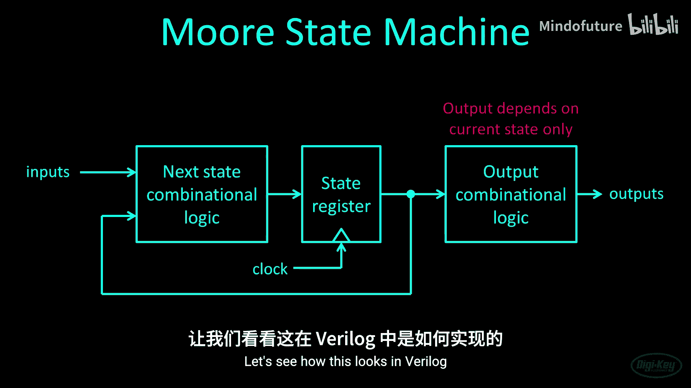
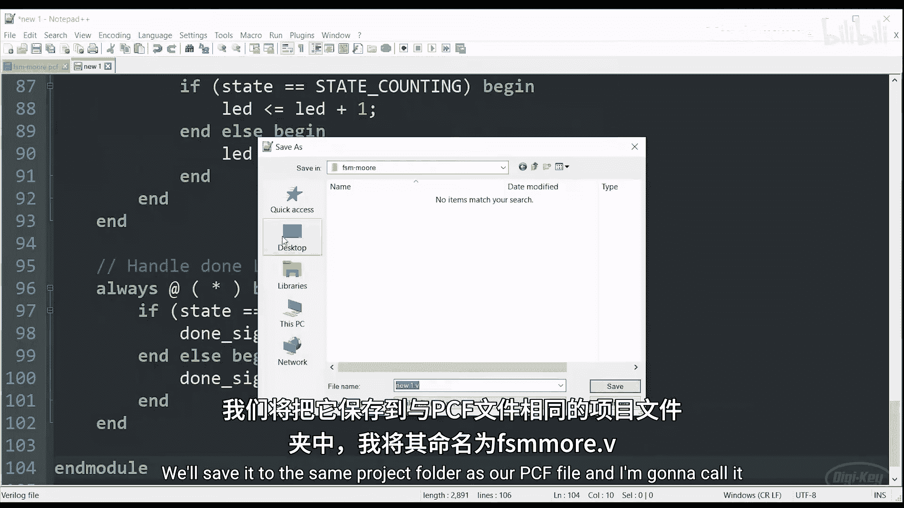
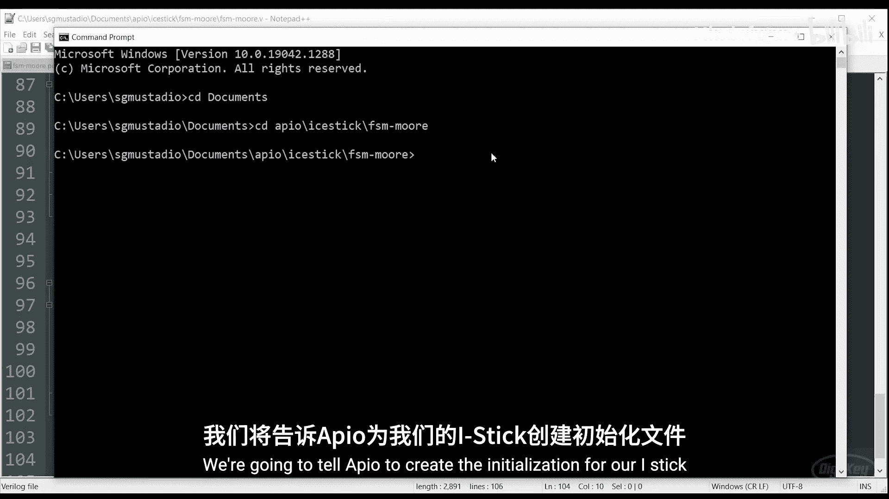
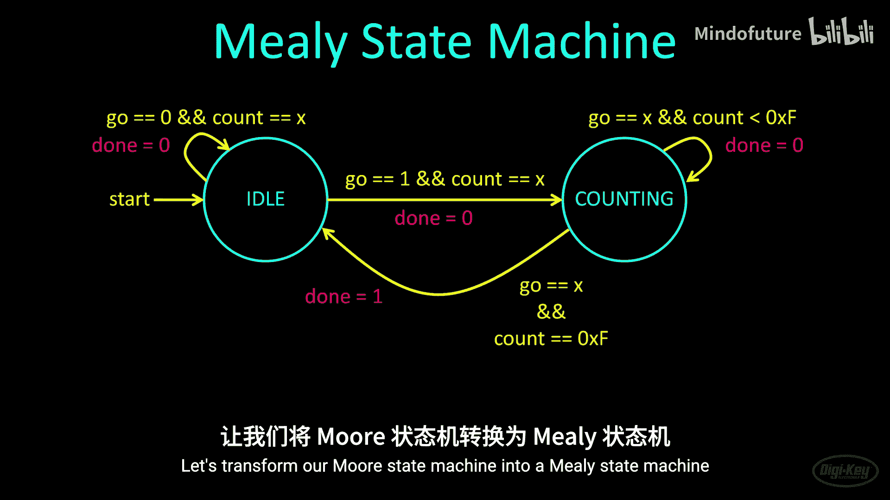
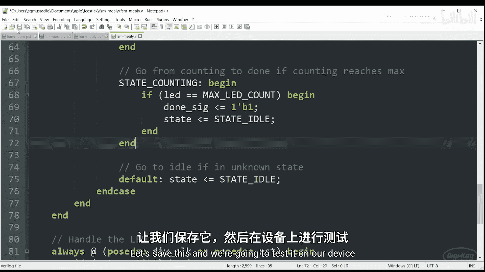
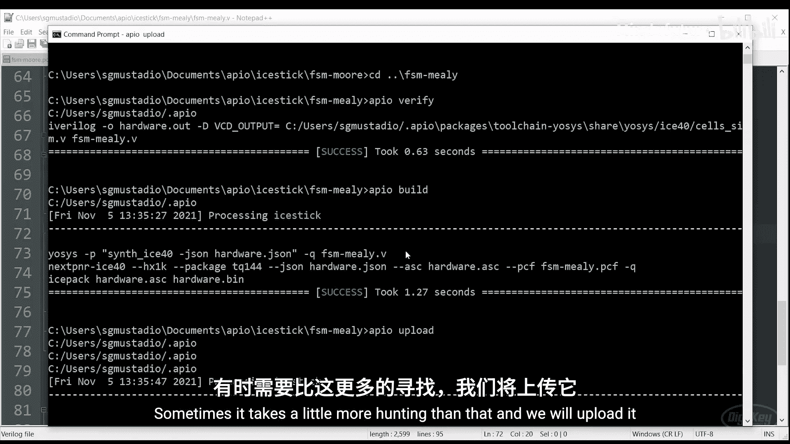

# 005：有限状态机 🧮

在本节课中，我们将要学习有限状态机（FSM）这一核心概念。有限状态机是用于表示顺序控制流的数学模型，在FPGA设计中能帮助你组织思路并保持代码整洁有序。我们将探讨两种主要类型的状态机：摩尔型和米利型，并通过Verilog代码示例来理解它们的实现与区别。

## 概述

有限状态机包含一个或多个离散状态，代码或硬件在这些状态之间转移。与处理器不同，FPGA没有“等待”的概念，因此我们需要构建能够延迟操作的硬件逻辑。状态机提供了一种基于输入条件顺序执行操作的简单结构。

## 摩尔型状态机 🏗️



上一节我们介绍了状态机的基本概念，本节中我们来看看第一种类型：摩尔型状态机。在摩尔型状态机中，输出仅与当前状态有关，而与输入无关。

我们将构建一个简单的计数状态机，计数完成后会输出一个脉冲信号。以下是我们需要定义的状态：
*   **空闲状态**：状态机等待启动信号。
*   **计数状态**：计数器从零开始递增。
*   **完成状态**：输出一个脉冲信号，然后返回空闲状态。

### 硬件设计与代码实现

以下是该状态机的核心Verilog代码结构。我们使用多个`always`块来并行处理不同功能，例如时钟分频和状态转移。

```verilog
// 状态定义
localparam STATE_IDLE  = 2'd0;
localparam STATE_COUNT = 2'd1;
localparam STATE_DONE  = 2'd2;

// 状态寄存器
reg [1:0] state, next_state;

// 状态转移逻辑（时序逻辑）
always @(posedge clk_div or posedge reset) begin
    if (reset) begin
        state <= STATE_IDLE;
    end else begin
        state <= next_state;
    end
end

// 下一状态逻辑（组合逻辑）
always @(*) begin
    case (state)
        STATE_IDLE: begin
            if (go) next_state = STATE_COUNT;
            else    next_state = STATE_IDLE;
        end
        STATE_COUNT: begin
            if (led_counter == MAX_COUNT) next_state = STATE_DONE;
            else                          next_state = STATE_COUNT;
        end
        STATE_DONE: begin
            // 无条件返回空闲状态
            next_state = STATE_IDLE;
        end
        default: next_state = STATE_IDLE;
    endcase
end

// 输出逻辑（仅取决于当前状态 - 摩尔型特点）
assign done = (state == STATE_DONE);
```

在摩尔型状态机中，输出信号（如`done`）仅在当前状态为`STATE_DONE`时置为高电平，并持续一个时钟周期。

## 阻塞赋值与非阻塞赋值 ⚙️

在编写状态机时，理解赋值操作符至关重要。Verilog中有两种赋值方式：

*   **阻塞赋值 (`=`)**：顺序执行。该行赋值完成后，才执行下一行代码。通常用于组合逻辑的`always`块中。
    ```verilog
    // 示例：执行后，a和b的值都变为1
    always @(posedge clk) begin
        a = b;
        b = a; // 此时a已是新值（等于b的旧值）
    end
    ```

*   **非阻塞赋值 (`<=`)**：并行执行。块内所有赋值语句同时计算右侧表达式，然后在时间步结束时统一更新左侧变量。**推荐在时序逻辑的`always`块中使用**。
    ```verilog
    // 示例：执行后，a和b的值互换
    always @(posedge clk) begin
        a <= b;
        b <= a; // 同时计算，a和b使用彼此原来的值
    end
    ```

## 米利型状态机 🔄

现在，让我们看看第二种类型：米利型状态机。它与摩尔型的关键区别在于，其输出不仅取决于当前状态，还取决于当前的输入。

这意味着输出可以写在状态转移箭头上。有时，米利型状态机可以用更少的状态实现相同的功能。例如，我们的计数例子可以省去独立的`完成状态`，在从`计数状态`转移到`空闲状态`的瞬间产生输出脉冲。

### 代码转换

将摩尔型转换为米利型，主要修改输出逻辑部分：

```verilog
// 状态定义（减少一个状态）
localparam STATE_IDLE  = 1'b0;
localparam STATE_COUNT = 1'b1;





// 输出逻辑（取决于当前状态和输入 - 米利型特点）
always @(*) begin
    case (state)
        STATE_IDLE: begin
            done = 1'b0; // 空闲时输出低
        end
        STATE_COUNT: begin
            // 在计数状态，当计数器达到最大值时（可视为一个条件输入），输出高
            // 注意：这里done作为转移时的输出
            if (led_counter == MAX_COUNT)
                done = 1'b1;
            else
                done = 1'b0;
        end
        // 注意：没有独立的STATE_DONE
    endcase
end

// 状态转移逻辑也需要调整
always @(*) begin
    case (state)
        STATE_IDLE: begin
            if (go) next_state = STATE_COUNT;
            else    next_state = STATE_IDLE;
        end
        STATE_COUNT: begin
            if (led_counter == MAX_COUNT)
                next_state = STATE_IDLE; // 直接回到空闲，而不是完成状态
            else
                next_state = STATE_COUNT;
        end
        default: next_state = STATE_IDLE;
    endcase
end
```



米利型状态机有时硬件利用率更高，但逻辑可能稍难理解。摩尔型状态机则更直观，易于调试。

## 实践挑战：按键消抖 🎯

我们可以运用状态机解决一个实际问题：按键消抖。回顾第4部分的简单计数器，由于机械按键抖动，按一次可能触发多次计数。

**你的挑战是**：设计一个状态机来实现按键消抖逻辑，确保每次按下按键，计数器只增加一次。你可以选择使用摩尔型或米利型状态机。

消抖状态机通常包含以下状态：
*   **等待**：等待按键按下。
*   **消抖**：按键按下后，进入一个延时状态（如20ms），过滤抖动。
*   **确认**：延时结束后确认按键有效，产生单次脉冲信号。
*   **释放等待**：等待按键释放，同样可能需要消抖处理。

## 总结





本节课中我们一起学习了有限状态机（FSM）在FPGA设计中的重要作用。我们详细探讨了：
1.  **摩尔型状态机**：输出仅与当前状态有关。
2.  **米利型状态机**：输出与当前状态和输入都有关，有时效率更高。
3.  **Verilog实现关键**：包括状态编码、多`always`块设计、阻塞与非阻塞赋值的正确使用。
4.  **实际应用**：通过将状态机应用于按键消抖挑战，巩固了学习内容。


状态机是构建复杂数字逻辑和控制流程的基石，熟练掌握它们将极大提升你的FPGA设计能力。下一课，我们将学习如何使用模块和参数来创建复杂的层次化设计。