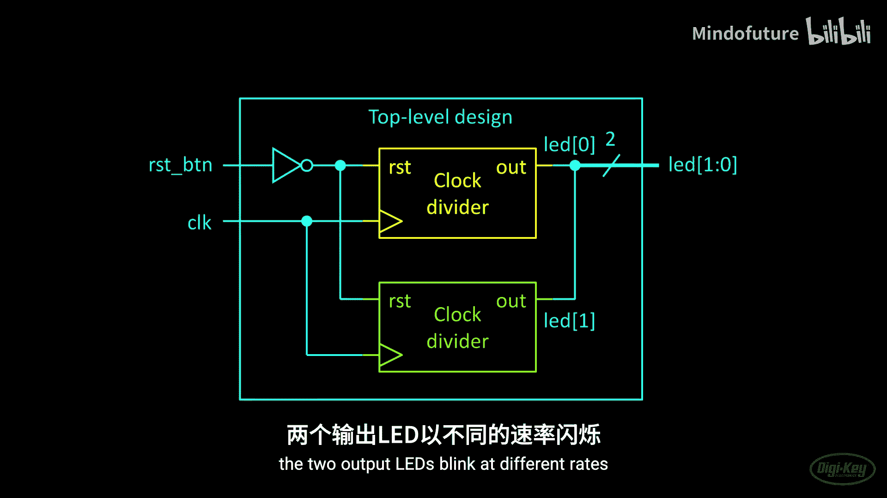
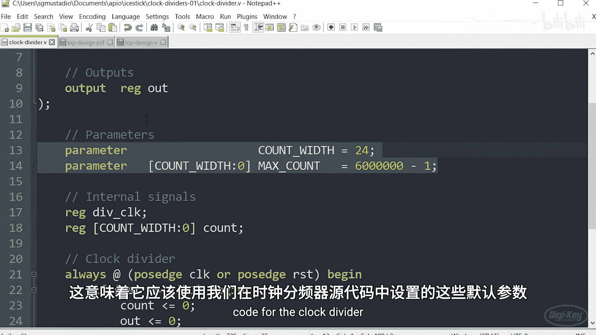
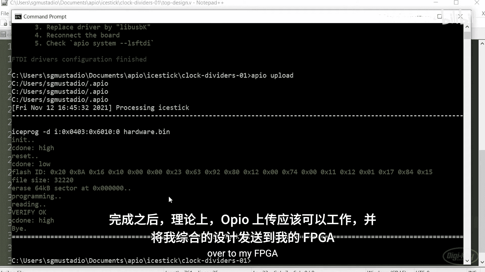
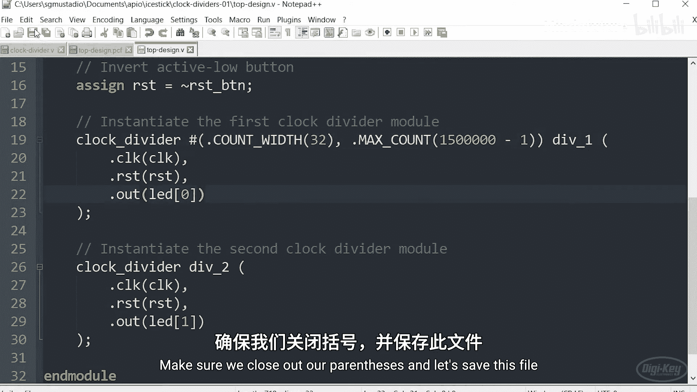
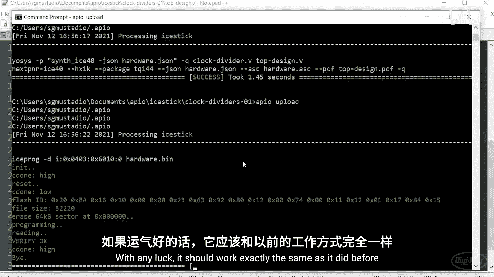

# 006：Verilog模块与参数 🧩

## 概述
在本节课中，我们将学习如何将Verilog代码组织成模块，并使用参数来定制模块的行为。通过模块化设计，我们可以创建可重用的代码块，从而构建更复杂的数字系统。

---

## 从单一模块到模块化设计
到目前为止，我们一直将所有Verilog代码放在单个文件的单个模块中。对于非常简单的设计来说，这没有问题。但可以想象，随着代码量的增加，这种方式会很快变得难以控制且难以调试。本节我们将学习如何创建模块化代码，以便开始构建更复杂的设计。

在之前的章节中，我提出了一个挑战：创建一个驱动计数器的时钟分频器。我们将专门为这个时钟分频器创建一个模块，以便它能独立于其他逻辑使用。

为基本构建块创建模块的一大优势是，我们可以轻松地实例化该模块的多个副本，从而避免重写或复制粘贴代码。通常，建议将一个Verilog模块的代码放在单个文件中，这样便于查找和调试模块中的错误。

因此，我们的时钟分频器代码将放在一个文件中，并实例化它的两个副本（也称为实例）。为此，我们需要另一个文件来存放我们的顶层设计。这个顶层模块将实例化两个具有不同参数的时钟分频器，并包含一些必要的“胶合”逻辑，例如反转复位按钮信号，以及将输入和输出连接到我们的物理引脚名称。



通过允许顶层模块使用不同参数实例化时钟分频器，我们可以在实例化时改变每个分频器的功能，而无需添加额外的信号线或逻辑。请注意，我将两个分频器的输出合并到一个总线中。在图表中，有时会用较粗的线表示总线，或者用一条斜线加数字来标明该总线包含多少条线。

在本例中，我们将设置分频器的参数，使两个输出LED以不同的速率闪烁。让我们用Verilog来实现这个设计。

---

## 创建时钟分频器模块
首先，为我们的项目创建一个新文件夹，我将其命名为 `clock_dividers_1`。我们将在这里展示两个不同的例子。

以下是创建基本模块的步骤，如果你做过任何面向对象编程，这应该与创建一个类非常相似。我们将能够创建这个模块的实例。

创建模块的声明与我们之前做过的所有其他例子非常相似。我们将声明端口，在本例中是输入和输出。请注意，输出需要被寄存，因为我们将使用时钟来控制它，并在模块的输出端存储其信号电平。

之前我们使用 `localparam` 来为模块定义常量。现在我将引入一个名为 `parameter` 的新关键字。`localparam` 仅在模块内部定义，不能在模块外部更改。而 `parameter` 则不同，我们在这里声明它，它会创建一个初始值，可以在整个模块中用作常量。然而，参数可以在模块外部更改。在我们的顶层设计中，当实例化一个特定对象（或更准确地说，是这个模块的一个实例）时，我们将能够更改这些参数。

我在这里为每个参数设置默认值。这样，如果在实例化此特定模块时没有定义它们，它们仍然会获得某个值。请注意，我可以使用参数来定义总线宽度。例如，`COUNT_WIDTH` 我设置为24位。因此，当我创建 `MAX_COUNT` 值时，我可以声明该总线的宽度，在本例中是24位，因为我使用这个变量（更确切地说是常量）来声明这个向量的宽度。

和以前一样，我们可以声明内部信号，如 `wire` 和 `reg`，以帮助存储值，或者为模块内的特定连线命名。如果你完成了之前关于计数器的挑战（需要创建自己的时钟分频器），那么这里的大部分代码应该看起来很熟悉。实际上，我使用的代码与我的解决方案中的代码相同。唯一的区别是，这里没有任何反转复位信号的逻辑，因为现在我假设它是高电平有效。我们将把反转该信号的任务留给顶层设计，因为我们将把它连接到一个按钮上（但如果你使用时钟分频器，情况可能并非总是如此）。

**代码示例：时钟分频器模块 (`clock_divider.v`)**
```verilog
module clock_divider #(
    parameter COUNT_WIDTH = 24,
    parameter MAX_COUNT   = 12000000 - 1
)(
    input wire clk,
    input wire rst,
    output reg out
);
    reg [COUNT_WIDTH-1:0] counter;

    always @(posedge clk) begin
        if (rst) begin
            counter <= 0;
            out <= 0;
        end else begin
            if (counter == MAX_COUNT) begin
                counter <= 0;
                out <= ~out;
            end else begin
                counter <= counter + 1;
            end
        end
    end
endmodule
```

---

## 创建物理约束文件
接下来，我需要创建物理约束文件。和之前一样，我将声明几个命名的信号或连线，并将它们与FPGA上的物理引脚关联起来。

在本例中，我将连接到物理引脚21的线命名为 `clk`，因为它连接到iCE40板上的12 MHz振荡器。我还为我的LED（引脚98和99）连接了两个引脚。最后，我有一个复位按钮，它使用了我们在前几集中使用的四个按钮的相同硬件连接，但这里只需要一个，即复位按钮。

**代码示例：物理约束文件 (`top.pcf`)**
```
set_io clk 21
set_io rst 99
set_io led0 98
set_io led1 97
```

---

## 编写顶层设计
现在让我们来编写顶层设计。和任何模块一样，我将声明模块名称及其端口（输入和输出）。请注意，即使我的时钟分频器模块的输出是寄存的，我也不能将其直接连接到另一个寄存元件。我只能将模块的输出连接到 `wire`。这是因为模块的输出可能随时改变（类似于按钮按下）。然后，你可以寄存那个输出，但必须通过类似 `always` 块的东西连接它，然后用时钟驱动该输出并将其保存在一个寄存元件中。

正如我们在图中看到的，我们将获取复位按钮并在这里创建一点胶合逻辑：我们只是反转该信号，称其为 `rst`，然后将该信号发送给我们两个实例化的时钟分频器。

要实例化一个模块，首先调用模块名称 `clock_divider`（这应该与 `clock_divider.v` 文件中的模块名一致）。综合工具接受我们提供的Verilog文件。在本例中，Apio会将它在项目文件夹中找到的所有文件（本例中是 `clock_divider.v` 和 `top.v`）发送给Yosys，Yosys会识别出：我在这里调用 `clock_divider` 来实例化模块，这与我在此另一个文件中找到的 `clock_divider` 模块名称一致。

目前，我建议将一个项目的所有文件保存在同一文件夹中，以便Apio能找到它们。然而，你可能会遇到更复杂的设计，其中不同的模块和测试平台存储在不同的文件夹中，你必须将它们整合在一起。在那种情况下，你可能需要直接调用Yosys并指定这些源文件的位置。

回到我们的顶层设计。一旦我们调用了该模块并赋予它一个名称（本例中我称它为 `div1` 代表分频器一），我们然后将这个顶层设计内部的连线和寄存元件连接到被实例化模块内部的输入和输出。为此，我们使用 `.端口名(连线名)` 的语法。例如，`.clk(clk)` 表示时钟分频器模块内的 `clk` 端口连接到顶层设计中的 `clk` 连线。这两者现在通过一根线连接在一起。我们将对时钟分频器中的复位信号做同样的处理，它连接到 `rst` 连线（这是复位按钮信号的反相信号）。

为了设置这个实例化单元（或模块）中的参数，我们将使用 `defparam` 关键字。在本例中，我们将定义仅在 `div1` 实例化模块中找到的 `COUNT_WIDTH` 参数，将默认的24位覆盖为32位（实际上这里并不需要32位，但假设出于某种原因你希望它是32位宽）。我们还将用 `15000000-1` 覆盖 `MAX_COUNT` 的默认参数值，这应该使LED的闪烁速度比此处设置的默认值快一些。

请注意，这是一种定义参数的旧方法。我将向你展示新的方法（随着2001版Verilog更新），但这种方式可以让你了解 `defparam`，以防你在其他人的代码中遇到它。

现在，我将实例化第二个时钟分频器模块，称它为 `div2`。用于实例化的代码看起来与实例化第一个时钟分频器模块的代码相同，但我们将输出连接到 `led1`。你会注意到，它与第一个时钟分频器共享时钟和复位线。我们也不会为 `div2` 定义参数，这意味着它应该使用我们在时钟分频器源代码中设置的默认参数。

**代码示例：顶层设计 - 旧式参数传递 (`top_old.v`)**
```verilog
module top (
    input wire clk,
    input wire rst_button,
    output wire led0,
    output wire led1
);
    wire rst;
    assign rst = ~rst_button; // 反转复位按钮信号（假设按钮低电平有效）

    // 实例化第一个时钟分频器 (div1) 并使用 defparam 覆盖参数
    clock_divider div1 (
        .clk(clk),
        .rst(rst),
        .out(led0)
    );
    defparam div1.COUNT_WIDTH = 32;
    defparam div1.MAX_COUNT = 15000000 - 1;

    // 实例化第二个时钟分频器 (div2)，使用默认参数
    clock_divider div2 (
        .clk(clk),
        .rst(rst),
        .out(led1)
    );
endmodule
```

---



## 构建与上传
我们将打开一个终端，导航到我们的 `clock_dividers` 项目目录。我将调用 `apio init --board icestick` 来指定我的开发板。验证代码以确保理论上应该能综合是一个好习惯。然后我们将调用 `apio build`。综合完成后，如果没有错误，我们将把设计上传到我们的开发板。

如果你使用Windows，可能会遇到“LibUSB open failed”的错误。如果你已经使用Zadig安装了驱动程序并且一切正常，但突然发现它不再工作，可能有两种情况：首先，检查你是否没有插入其他FTDI设备（例如我的Analog Discovery）。确认后，尝试将iCEstick（或你用于此的任何FTDI设备）移到最初安装驱动程序的USB端口。Windows喜欢记住你将特定USB设备插入哪个端口，然后当设备插入该端口时总是使用该驱动程序。所以，尝试将其移到不同的端口，看看是否再次工作。

如果更换端口仍然不行，你可能需要使用 `apio drivers --ftdi-enable` 重新安装驱动程序。使用下拉列表，确保为你的FPGA开发板选择了 `Interface 0`。在这种情况下，Windows可能试图使用FTDI总线驱动程序，而我们希望将其切换回 `libusbK`。点击“替换驱动程序”并让其安装。

一旦完成，`apio upload` 理论上应该可以工作，并将我综合后的设计发送到我的FPGA。正如你所看到的，两个LED以不同的速率闪烁。第一个应该以大约4 Hz的频率闪烁，第二个应该以大约1 Hz的频率闪烁。

---

## ANSI风格的参数定义
2001版Verilog引入了一种定义和使用参数的新方法。它更接近于C语言中参数在函数间传递的方式。因此，这种风格在Verilog中通常被称为ANSI风格参数或C风格参数。我们来使用它们。

回到我们的时钟分频器模块。我们不在模块内部定义参数，而是将其定义为一组额外的、类似于端口列表的东西，只不过这是一个在端口之前定义的参数列表。我们用井号 `#` 和一组新的括号来表示这个参数列表。端口列表被推到下面，因为我们先定义参数。就像我们看到端口一样，参数以列表样式定义，每个参数用逗号分隔（而不是我们之前使用的分号）。我们仍然可以使用等号为它们提供默认值。

**代码示例：时钟分频器模块 - ANSI风格 (`clock_divider_ansi.v`)**
```verilog
module clock_divider #(
    parameter COUNT_WIDTH = 24,
    parameter MAX_COUNT   = 12000000 - 1
)(
    input wire clk,
    input wire rst,
    output reg out
);
    // ... 模块内部逻辑与之前相同 ...
endmodule
```



有了这种ANSI风格的参数定义，你不再需要在这里调用 `defparam` 关键字。相反，你可以在声明实例化模块的名称之前，使用另一个井号 `#` 和另一组括号。在这个新列表中，我们将再次使用点符号，将 `COUNT_WIDTH` 设置为32，将 `MAX_COUNT` 设置为 `15000000-1`。

**代码示例：顶层设计 - ANSI风格参数传递 (`top_ansi.v`)**
```verilog
module top (
    input wire clk,
    input wire rst_button,
    output wire led0,
    output wire led1
);
    wire rst;
    assign rst = ~rst_button;

    // 实例化第一个时钟分频器，使用ANSI风格覆盖参数
    clock_divider #(
        .COUNT_WIDTH(32),
        .MAX_COUNT(15000000 - 1)
    ) div1 (
        .clk(clk),
        .rst(rst),
        .out(led0)
    );

    // 实例化第二个时钟分频器，使用默认参数
    clock_divider div2 (
        .clk(clk),
        .rst(rst),
        .out(led1)
    );
endmodule
```

验证代码，如果看起来没问题，就构建它并发送到FPGA。如果一切顺利，它的工作方式应该和之前完全一样。确实，LED的闪烁方式与之前完全相同。

---

## 本课挑战 🎯
本部分的挑战是创建一个模块化设计，使LED先向上计数，然后向下计数。有多种方法可以实现这一点，但我建议使用我们刚刚制作的时钟分频器来驱动两个不同的计数状态机，这两个状态机被实例化为模块。当一个模块完成向上计数时，它向另一个模块发送一个信号，后者将开始向下计数。你必须思考胶合逻辑应该是什么样子，以便让两个不同的模块控制同一组LED。





祝你好运，这个挑战可能有点棘手。下次，我们将学习如何使用模块化代码创建测试平台。能够模拟我们的设计可以避免在实际硬件上调试的许多麻烦。

---

## 总结
在本节课中，我们一起学习了：
1.  **模块化设计的重要性**：将代码组织成独立的模块，提高可重用性和可维护性。
2.  **创建Verilog模块**：如何定义模块的端口、内部信号和行为。
3.  **使用参数**：利用 `parameter` 关键字创建可配置的模块，区分了 `parameter`（可在实例化时覆盖）和 `localparam`（模块内常量）。
4.  **模块实例化**：如何在顶层设计中实例化其他模块，并通过 `.端口名(连线名)` 语法进行连接。
5.  **参数传递的两种方式**：
    *   旧式：使用 `defparam` 关键字。
    *   ANSI风格（推荐）：在实例化时使用 `#(.参数名(值))` 的语法，更清晰、更现代。
6.  **实践流程**：从编写模块、约束文件到顶层设计，最后进行综合、构建和上传到FPGA的完整过程。


通过掌握模块和参数，你已经迈出了构建复杂、结构化数字系统的关键一步。