# 007：Verilog测试平台与仿真 🧪

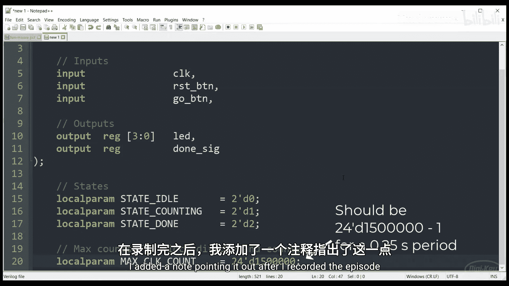

在本节课中，我们将学习如何为Verilog模块编写测试平台（Testbench），并使用仿真工具来验证硬件设计的正确性，而无需每次都将其烧录到实际的FPGA硬件上。这是一种高效发现和修复设计缺陷的方法。

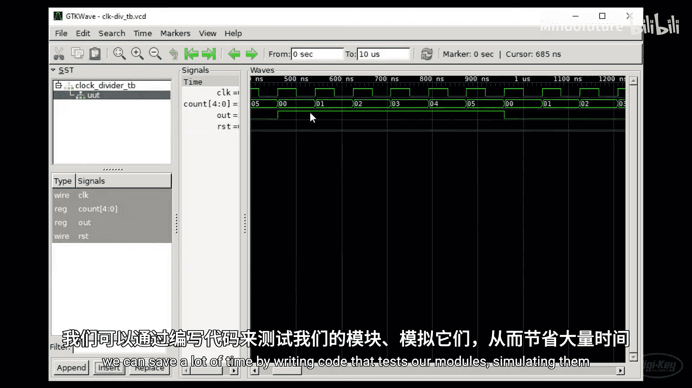

## 概述

在之前的第5集中，我们的有限状态机代码存在一个错误。当时我们是在人类可感知的时间尺度上操作，LED多亮一个时钟周期并不明显。然而，在严格的时序要求下，一个时钟周期的偏差可能导致错过采样周期或无意中降低系统速度。为了调试运行在千赫兹或兆赫兹频率的硬件，通常需要示波器或逻辑分析仪等设备。

将设计综合并上传到FPGA需要时间。我们可以通过编写测试代码来模拟模块，并用波形查看器观察输出，从而节省大量调试时间。本节将展示如何创建基本的Verilog测试平台，使用Icarus Verilog进行仿真，并使用GTKWave查看输出波形。

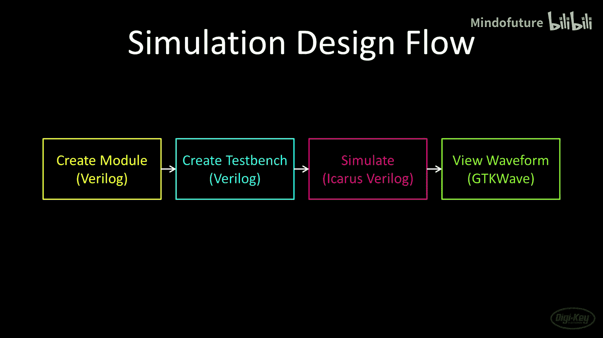

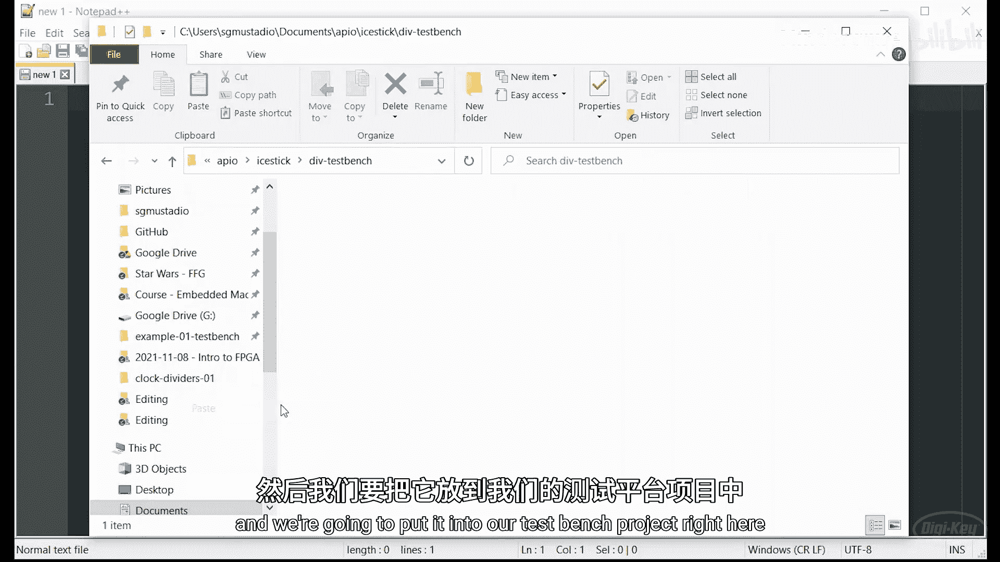

## 测试平台基础

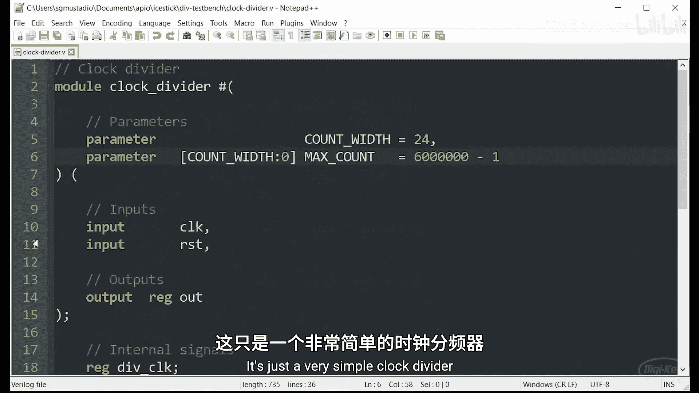

与顶层设计类似，测试平台会实例化我们想要测试的模块。这个被测试的模块通常被称为“被测单元”（Unit Under Test, UUT）。一个测试平台可以同时测试多个模块，但本节我们只测试一个。

在上一集中，顶层设计用于连接多个模块，并将输入/输出信号连接到物理引脚。测试平台是纯仿真的，没有物理引脚，因此我们使用测试平台逻辑来驱动输入信号。我们可以添加一些“胶合逻辑”，但主要关注的是切换测试模块的输入引脚，以便测量输出波形是否符合预期。

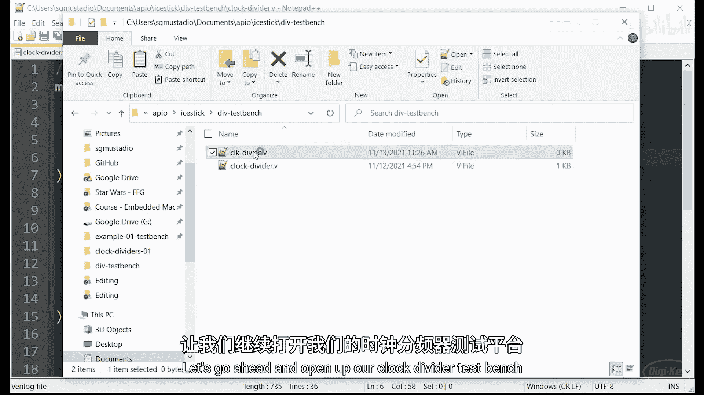

需要注意的是，在测试平台中，我们可以使用Verilog中**不一定可综合**的部分。例如，我们可以使用延迟和`for`循环来创建波形。然而，综合工具无法处理这些命令，因为它们并非用于转换为FPGA上的实际硬件。

## 仿真流程

以下是仿真设计的基本步骤：
1.  **编写或复制**要测试的模块。
2.  **编写测试平台**：使用Verilog实例化模块，并切换必要的信号以执行测试。
3.  **使用Icarus Verilog仿真**：仿真器将输出一个“值变化转储”（Value Change Dump, VCD）文件，记录测试中所有信号的变化。
4.  **查看波形**：在波形查看器（如GTKWave）中加载VCD文件，查看信号变化。

请注意，通常需要了解你使用的仿真器类型，因为这会影响测试平台中使用的某些函数和关键字。

## 动手实践：为时钟分频器创建测试平台

让我们通过一个具体例子来实践。我们将为之前创建的时钟分频器模块编写一个测试平台。

首先，进入项目目录并创建一个名为`testbench`的文件夹。我们将测试之前编写的时钟分频器模块。将该模块的Verilog文件复制到测试平台项目中。

接下来，创建测试平台文件，命名为`clock_div_tb.v`。使用`_tb`后缀是因为一些工具（如本项目使用的F4PGA工具链）会识别此后缀以表明这是一个测试文件。

以下是测试平台代码的详细解析：

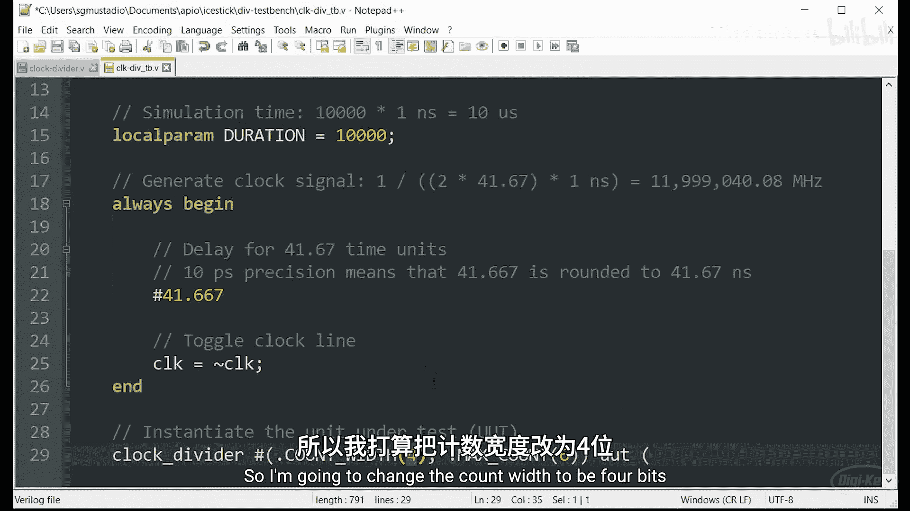

### 1. 定义时间尺度
```verilog
`timescale 1ns/10ps
```
`timescale`编译器指令用于设置仿真时间单位。`1ns`表示时间单位为1纳秒，`10ps`表示仿真精度为10皮秒。这意味着代码中的延迟（如 `#41.667`）将以纳秒为单位，并且时间值会四舍五入到最近的10皮秒。这个指令是Icarus Verilog特有的，不同仿真器可能语法不同。

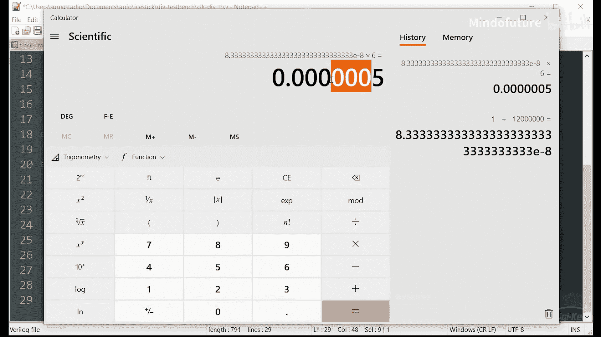

### 2. 定义测试模块
```verilog
module clock_div_tb;
    // 内部信号声明
    reg clk = 0;
    reg rst = 0;
    wire out;
```
测试平台模块没有输入输出端口列表，因为所有信号都在内部。我们定义了寄存器`clk`和`rst`来驱动被测单元的输入，并定义了线网`out`来观察其输出。注意，我们为寄存器设置了初始值`0`，这在仿真中是允许的，但在可综合代码中需谨慎使用。

### 3. 定义仿真参数
```verilog
    localparam DURATION = 10000;
```
`DURATION`定义了仿真运行的总时间单位数（这里是10000个1纳秒，即10微秒）。限制仿真时间可以防止VCD文件无限增大。

### 4. 生成时钟信号
```verilog
    always begin
        #41.667 clk = ~clk;
    end
```
这个`always`块没有敏感列表，在仿真中它会永远运行。它每隔41.667纳秒就翻转一次`clk`信号，从而生成一个周期约为83.334纳秒（频率接近12MHz）的时钟。这种使用`#`延迟的代码是不可综合的，仅用于仿真。

### 5. 实例化被测单元
```verilog
    clock_div #(
        .COUNT_WIDTH(4),
        .MAX_COUNT(6)
    ) uut (
        .clk_in(clk),
        .rst_in(rst),
        .clk_out(out)
    );
```
这里实例化了`clock_div`模块，并覆盖了其默认参数。我们将计数器宽度设为4位，最大计数值设为6。在硬件中，这会使输出时钟每6个输入时钟周期翻转一次（理论周期500纳秒）。我们将其命名为`uut`。

### 6. 控制复位信号
```verilog
    initial begin
        #10 rst = 1;
        #1  rst = 0;
    end
```
`initial`块在仿真开始时只执行一次。这里，我们在仿真开始10纳秒后将`rst`拉高，保持1纳秒后再拉低，产生一个复位脉冲。`initial`块通常只用于仿真代码。

### 7. 设置波形转储
```verilog
    initial begin
        $dumpfile("clock_div_tb.vcd");
        $dumpvars(0, clock_div_tb);
        #(DURATION) $display("Finished!");
        $finish;
    end
endmodule
```
另一个`initial`块用于控制仿真过程。
*   `$dumpfile`：指定输出的VCD文件名。
*   `$dumpvars(0, clock_div_tb)`：指示仿真器记录`clock_div_tb`模块及其所有子模块（层级0表示所有层级）中的所有信号变化。
*   `#(DURATION)`：等待定义的仿真时长。
*   `$display`：在控制台打印信息。
*   `$finish`：结束仿真。**务必添加此语句**，否则仿真可能不会停止。

## 运行仿真与查看结果

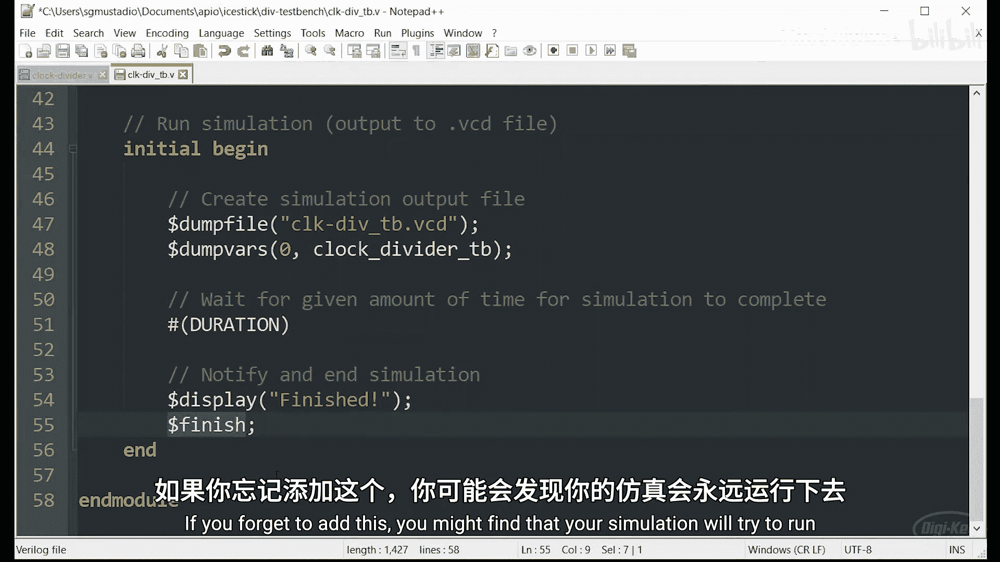

保存测试平台文件后，在终端中进入项目目录，使用工具链命令（例如`opio sim`）运行仿真。该命令会调用Icarus Verilog进行仿真，生成VCD文件，并自动用GTKWave打开。

在GTKWave中：
1.  左侧面板找到测试平台模块（`clock_div_tb`）及其内部的被测单元（`uut`）。
2.  选择想要观察的信号（如`clk`、`rst`、`out`以及`uut`内部的`counter`），点击“Insert”将其添加到波形视图。
3.  使用鼠标滚轮缩放，拖动波形进行查看。
4.  可以添加标记（Marker）来测量时间间隔。例如，测量输出时钟`out`的周期。

通过观察波形，我们发现了一个问题：输出时钟的周期略大于500纳秒。将标记拖动到理论上的500纳秒位置，发现`out`信号并未翻转。这表明我们的计算有误。

**问题根源**：计数器从0开始计数。当`MAX_COUNT`设为6时，计数器需要经历0,1,2,3,4,5,6（共7个状态）才会使`out`翻转，这需要7个时钟周期，而不是6个。

**解决方案**：将参数设置为`MAX_COUNT(6-1)`或`MAX_COUNT(5)`。这样，计数器从0数到5（共6个状态）后翻转，周期正好是6个输入时钟周期。

修改测试平台中的参数后，重新运行仿真。现在可以看到输出时钟的周期准确地为500纳秒了。

## 保存GTKWave设置

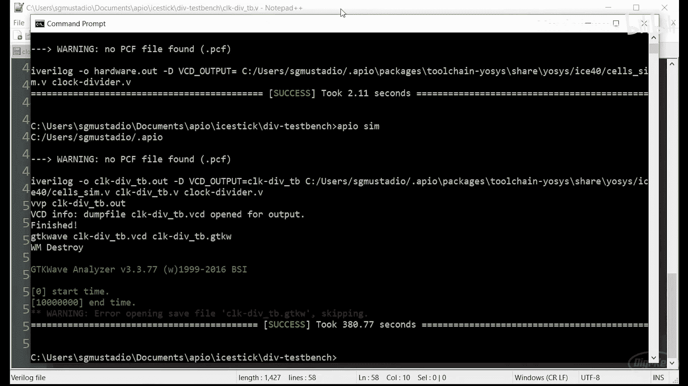

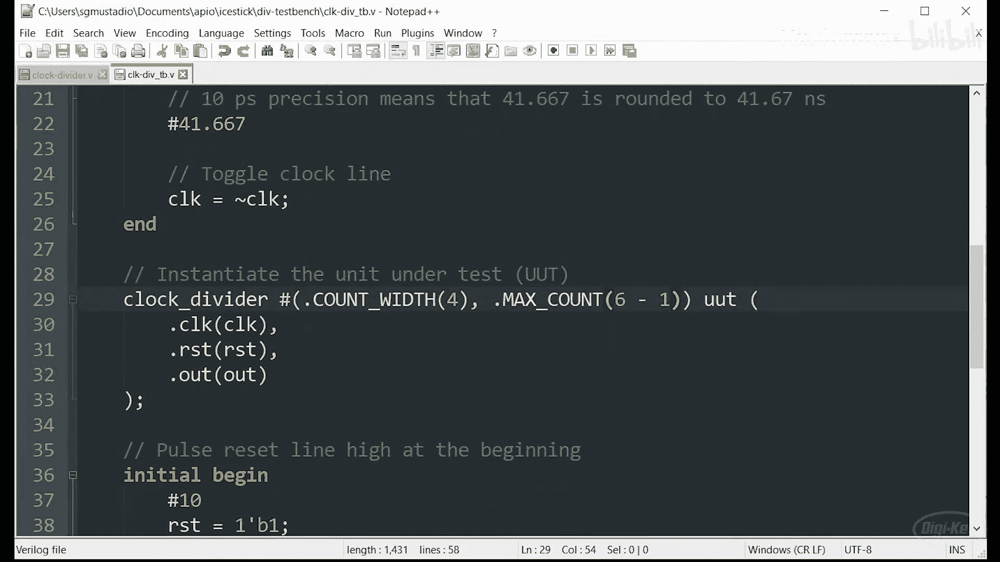

在GTKWave中配置好要显示的信号后，可以点击`File -> Save Waveform As...`保存为一个`.gtkw`文件。下次用GTKWave打开同一个VCD文件时，可以点击`File -> Read Save File...`加载这个`.gtkw`文件，自动恢复之前的信号布局和视图设置，非常方便。

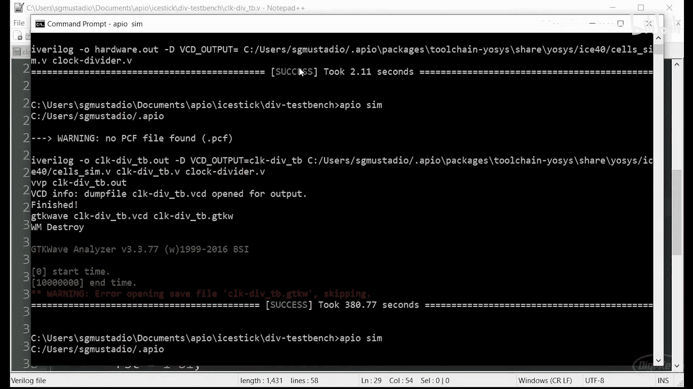

## 挑战任务

你的任务是：为第5集中编写的按钮消抖代码编写一个测试平台并进行仿真。

**要求**：
*   每次“递增”按钮被按下（信号从高到低并保持一段时间），LED计数器应加1。
*   你可能需要修改消抖代码，使其更适合作为模块测试（例如，将最大时钟计数值改为参数）。
*   尝试查看状态机的内部状态。
*   **提示**：为了不让VCD文件过大，可以将消抖的稳定时间参数（如40毫秒）在测试中改为一个较小的值（如400微秒）。
*   **进阶提示**：测试平台中可以使用`for`循环和`integer`类型变量。你还可以研究如何使用`$random`生成随机数，来模拟按钮的抖动或噪声。

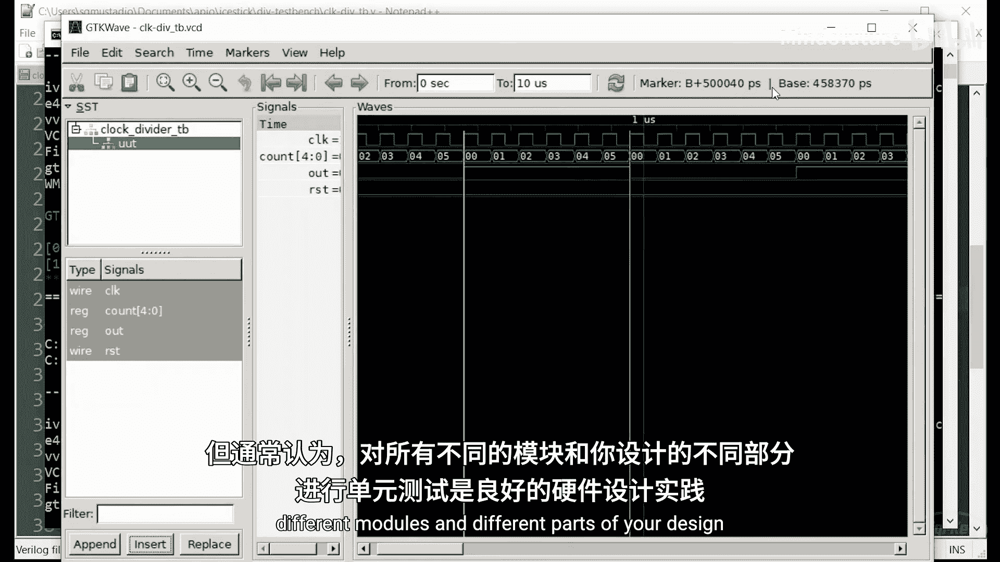

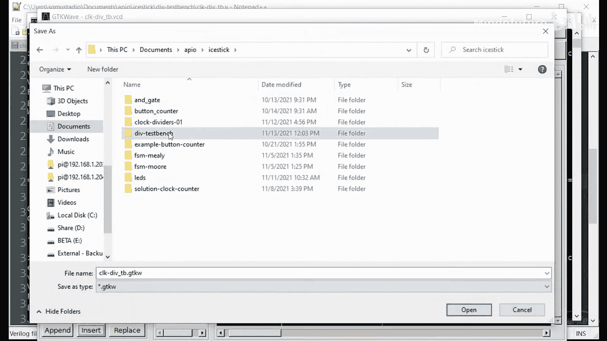

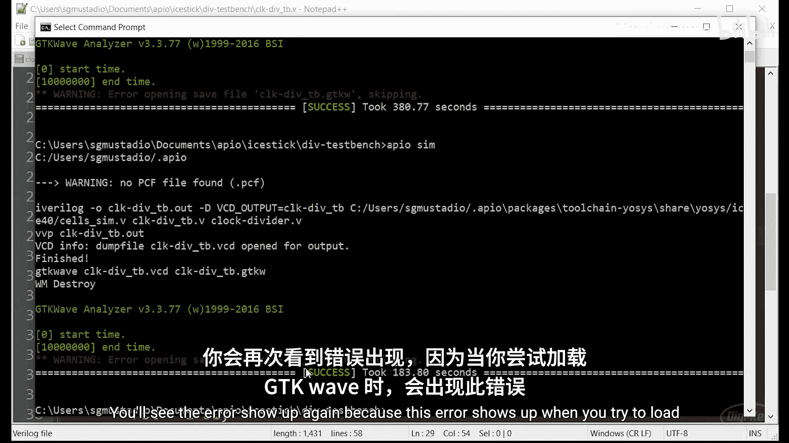

## 总结

本节课中，我们一起学习了Verilog测试平台的编写与仿真。我们了解了测试平台的基本结构，如何生成时钟和复位信号，如何实例化被测单元，以及如何使用系统任务`$dumpvars`来记录波形。通过使用Icarus Verilog和GTKWave，我们成功地发现并修复了时钟分频器模块中的一个时序错误。仿真技术是硬件设计，尤其是FPGA设计中极其重要的一环，它能帮助我们在设计早期快速验证功能、排查问题，从而大大提高开发效率。

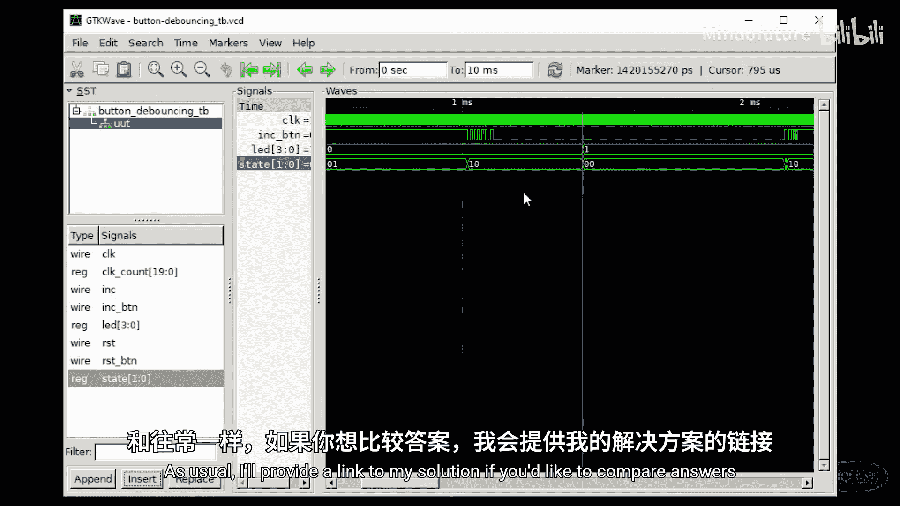


在下一集中，我们将探索如何在FPGA中使用各种类型的存储器来存储数据。祝你好运，一如既往，享受创造的乐趣！