# 008：存储器与块RAM

在本节课中，我们将要学习如何在FPGA中存储数据。我们将探讨使用逻辑单元中的D触发器、查找表构成的分布式RAM，以及FPGA中专门的块RAM。重点是学习如何用Verilog代码描述块RAM，并让综合工具自动推断出硬件结构。

## 概述：FPGA中的数据存储方式

数据在FPGA中可以通过多种方式存储。

正如之前提到的，你可以使用逻辑单元中的D触发器。然而，每个D触发器只能存储1比特数据。如果需要存储超过几个字节的数据，将会消耗大量逻辑单元。

在某些情况下，你也可以将数据存储在查找表中。如果不需要很大的存储空间，这被称为分布式RAM。你的综合工具可能会决定使用一些查找表来创建分布式RAM，而不是使用块RAM。

大多数FPGA提供独立于可编程逻辑块的RAM块。这些有时被称为嵌入式块RAM或EBR。

你可以将它们配置为单端口、双端口或先入先出存储器块，并且可以设置不同的宽度和深度。例如，你可以创建256个元素，每个元素16比特宽。这将占用一个4K的RAM块。你也可以将块配置为2比特宽、2048个元素深。

这个配置图表对于确定地址和数据端口需要多少比特宽非常有用。

## 块RAM的硬件结构

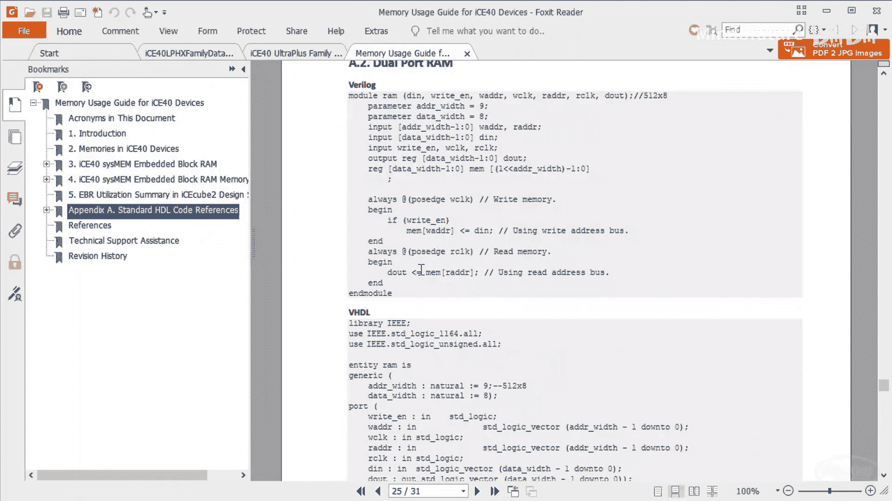

大多数FPGA厂商会为每个FPGA系列提供存储器使用指南。如果你正在使用器件内部的存储器块，强烈建议查阅这份指南。

让我们来看看iCE40系列的嵌入式块RAM。下图展示了双端口RAM在FPGA硬件上的实现方式。


请注意，你可以在独立的数据总线上进行读写操作，读写地址也有不同的总线，你甚至可以使用独立的时钟进行读写。为了简化，我们不会使用掩码或时钟使能线，并且将使用同一个时钟进行读写。

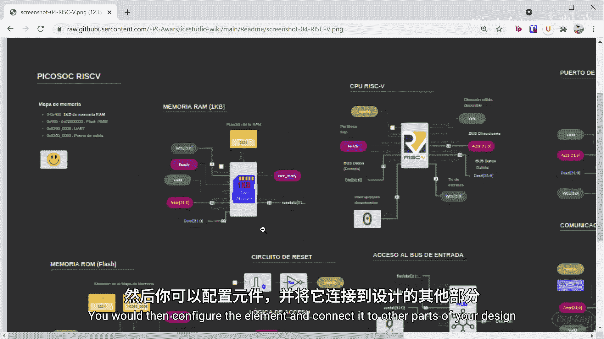

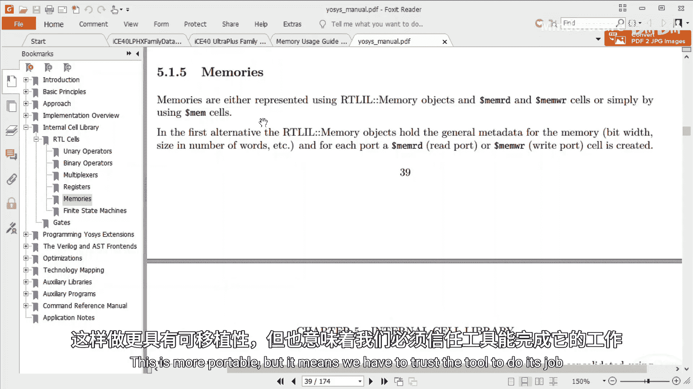

我们不会深入探讨先入先出配置，但要知道这些配置在某些设计中非常有用。附录A提供了一些创建单端口和双端口存储器配置的示例代码，如果需要入门帮助，建议查看。

## 在Verilog中实现块RAM

上一节我们介绍了块RAM的硬件结构，本节中我们来看看如何用Verilog代码来描述它。

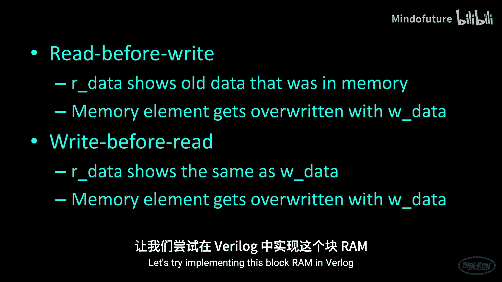

如果你使用像iCEcube2或开源工具链这样的图形化开发环境，通常可以将存储器元素拖放到画布上，然后配置该元素并将其连接到设计的其他部分。

有时，你的综合工具允许你直接使用系统函数或任务来实例化块存储器。在这种情况下，你需要遵循特定综合软件的说明。

我们将采用另一种方法：使用纯Verilog编写块存储器代码，并让综合工具从我们的代码中推断出块存储器。这种方法更具可移植性，但意味着我们必须信任工具能正确完成工作。

下图展示了我们将要创建的块存储器结构。


请注意，我省略了数据手册中显示的一些信号，我们不需要它们。这是一个相当小的存储器集合，只有16个元素，每个元素8比特宽。

我们将要写入的数据设置在 `w_data` 总线上，将要写入的地址设置在 `w_addr` 总线上。注意，我们的 `w_addr` 总线有4比特，这是寻址最多16个元素所需的宽度。我们也只有一条时钟线，同时作为读写数据的时钟。

在读取侧，我们设置要读取的地址，并在下一个时钟边沿（很可能是上升沿）设置 `r_enable` 线，数据将出现在 `r_data` 总线上。在极少数情况下，如果你试图在同一时间对同一地址进行读写，你需要查阅数据手册以了解会发生什么。根据对iCE40的一些测试，我发现存储器中的旧数据会先被读取到 `r_data`，然后新值才会被写入。这被称为“先读后写”。有些FPGA可能实现“先写后读”，即新数据会出现在 `r_data` 总线上。

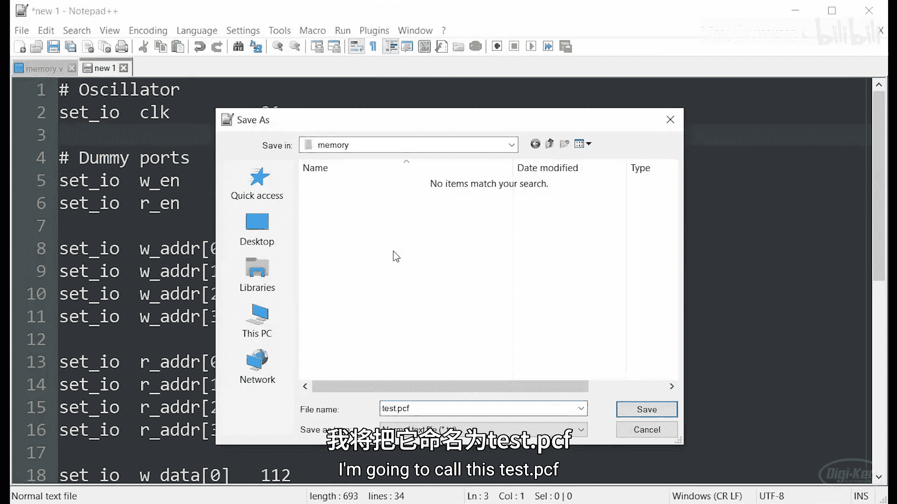

## 编写Verilog代码

让我们尝试在Verilog中实现这个块RAM。

用Verilog编写代码，让综合工具推断出一块块存储器并不困难。我们需要做的就是声明一个存储器模块，然后创建一个 `always` 块来展示我们如何与该存储器模块交互。综合工具将（或希望会）由此意识到我们打算实例化或使用片上的块存储器。

我们首先定义输入，包括时钟 `clk`、写使能 `w_en`、读使能 `r_en`、写地址 `w_addr`、读地址 `r_addr`（两者都是4比特宽），写入数据 `w_data`（输入，8比特宽）和读取数据 `r_data`（输出，8比特宽）。

以下是核心的Verilog模块代码：

```verilog
module memory (
    input wire clk,
    input wire w_en,
    input wire r_en,
    input wire [3:0] w_addr,
    input wire [3:0] r_addr,
    input wire [7:0] w_data,
    output reg [7:0] r_data
);

    // 声明一个8比特宽、16个元素深的存储器数组
    reg [7:0] mem [0:15];

    always @(posedge clk) begin
        // 写操作
        if (w_en) begin
            mem[w_addr] <= w_data;
        end
        // 读操作
        if (r_en) begin
            r_data <= mem[r_addr];
        end
    end

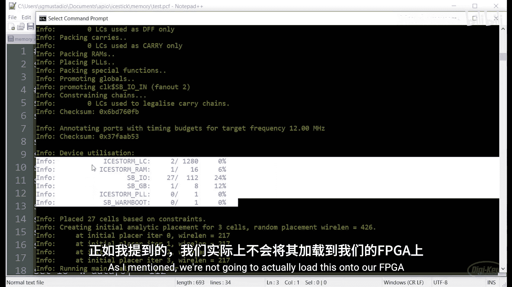

endmodule
```

要声明存储器，只需创建一个寄存器类型的信号名。这里我称它为 `mem`。我们在 `reg` 关键字后声明总线宽度（这里是8比特，与我们的写入和读取数据对齐），然后声明存储器的深度（这里是16个元素）。

接下来，我们需要告诉综合工具我们打算如何与块RAM交互。我们将其放入一个 `always` 块中，操作发生在时钟的上升沿。在某些情况下，你可以使用时钟的下降沿，或者如果使用双端口存储器，你可能有两个不同的时钟，一个用于读，一个用于写。

在每个时钟上升沿，硬件会查看写使能位是否设置为高电平。如果是，它会将 `w_data` 总线上的数据复制到由 `w_addr` 变量给出的地址处的存储器中。

此外，如果读使能线为高电平，它会将 `r_addr` 给出的读地址处的存储器值复制到 `r_data` 输出总线。

我们省略了其他一些功能，如掩码和读写时钟使能线，但我们不需要担心这些。这足以让一个基于单时钟的、非常简单的双端口存储器工作。

## 综合与资源利用

保存文件并运行综合后，我们可以查看器件利用率报告。这将告诉我们使用了哪些逻辑单元、多少RAM以及与我们特定FPGA相关的任何其他外设。

在这种情况下，我们使用了1280个逻辑单元中的2个，这在设计中使用的逻辑单元不多，这很好。然而，这确实意味着我们使用了一个RAM块，而我们总共只有16个。请记住，无论我们在Verilog代码中定义和声明的特定存储器有多小，我们都必须至少使用一个RAM块。综合工具可能会决定使用分布式RAM并改用你的查找表，但在本例中，它决定从那些4K的RAM块中取出一个，用于我们的特定存储器设计。

因此，当你在设计中声明RAM时，必须非常小心你使用了多少块RAM。

## 编写测试平台

正如我们之前所做的那样，我们将编写一个测试平台来验证存储器功能。

我们将定义时间尺度，创建测试模块，实例化我们的存储器单元（称为被测单元或UUT），并连接所有信号。

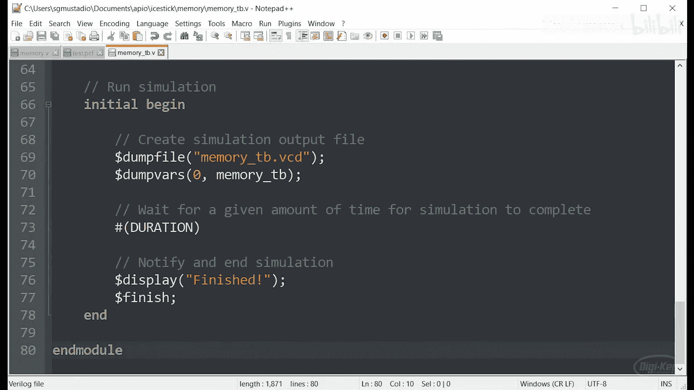

对于第一个测试，我们将等待几个时钟周期，然后将读地址设置为 `hex10`，将读使能设置为1，再等待几个时钟周期（这应允许存储器在读取数据线上输出该地址的值之前，将读地址时钟输入），然后重置读地址和读使能线。

请注意，一个前面没有任何内容的单引号或撇号意味着我告诉综合工具（或本例中的仿真工具），当我写 `hex 10` 时，它应该自行确定合适的比特数。如果你之前已经定义了比特数，并且不想每次写常量时都在这里重新定义，这很有用。

类似地，我可以在这里写没有基数的数字，这通常意味着我暗示一个十进制数。这对于像0或1这样的数字很有用，任何基数在这里都有效，综合工具将尝试理解我的意思。你总是可以更明确地设置比特数，使用撇号或单引号，后跟基数字符，然后是你希望表达的数字，但有时我只是偷懒，不写比特数和基数。

在第一个测试中，我们将读取地址 `Hex 10` 处的任何内容。因为我们没有初始化存储器，我预计这将是零或垃圾值，即当时从存储器中读出的任何内容。然后，我们将在该地址写入一些内容（本例中为 `Hex A5`），通过设置写入数据总线、写入地址总线和使能写入线来实现。我们将等待一个时钟周期以允许该值被注册到存储器中，然后重置这些值。

之后，我们将执行与第一个测试基本相同的操作：设置读地址和读使能，等待一个时钟周期，然后重置它们。这有望在我们的读取数据线上打印出我们写入存储器的内容（本例中为 `Hex A5`）。

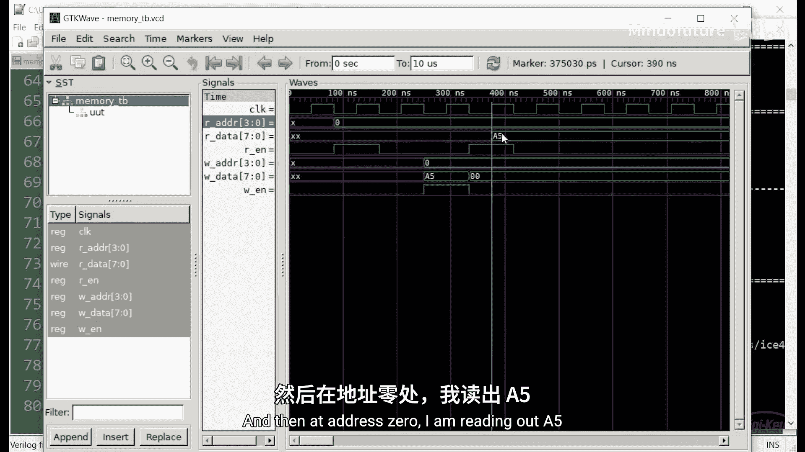

## 仿真与调试

运行仿真并在GTKWave中查看波形后，我们发现了一个问题：我们试图写入第16个元素（地址 `hex10`，即十进制的16），但我们的存储器深度只有16个元素（地址0到15）。地址16不存在。

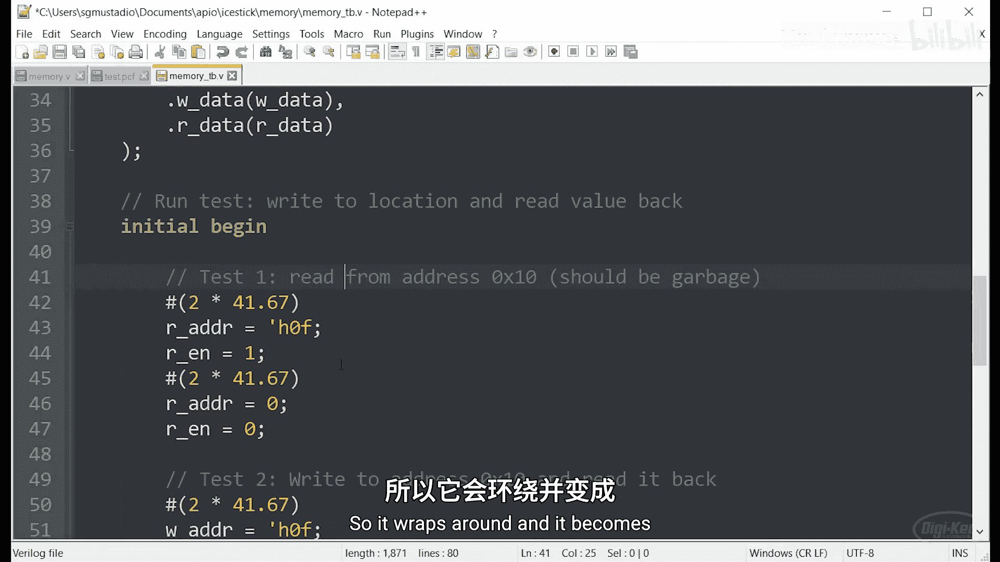

这揭示了Verilog的一个重要特性：如果我创建一个只有4比特宽的东西，并尝试做一个5比特的操作（例如，尝试将其设置为一个5比特的数字），它只会使用能放入该总线的最低有效4比特。这正好验证了正在发生的情况，因为 `10`（十六进制，即十进制的16）不存在，所以它回绕并变成了0。

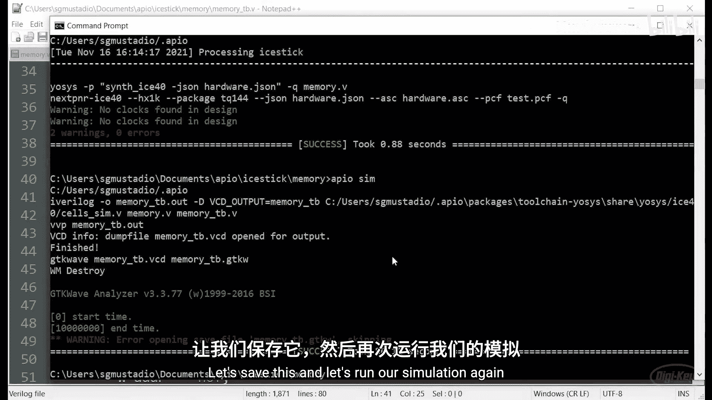

为了解决这个问题，我们将写入最后一个元素，将地址从 `10` 改为 `F`（十六进制，即十进制的15）。对初始读取也做同样的修改。

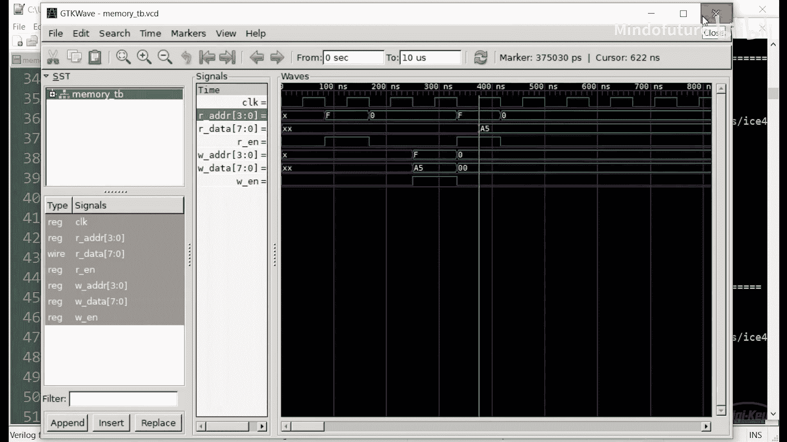

重新运行仿真后，我们可以看到读地址现在是 `F`，我们得到了垃圾值（因为之前我们得到的是0，所以那里一定被设置了什么），但除非你特别设置存储器，否则你必须假设它将是垃圾值或未知值。然后我们将 `A5` 写入地址 `F`，当我们读取它时，我们得到了 `A5` 输出，这验证了这块块存储器确实在工作。

## 初始化存储器值

让我们讨论一下如何为存储器设置初始值。一种可能性是，你可能会找到一种方法创建一个 `for` 循环，遍历每个元素并将其设置为零。但我有一个更好的方法：在综合期间从文件读取并设置这些初始值，以便在FPGA上电配置后立即准备就绪。

要从文件读取，我们首先需要创建该文件。在大多数情况下，你可以使用逗号分隔、空格分隔或换行分隔的值集。这里我将使用换行分隔的值集，并从0计数到7，然后跳过一些，再从 `B8` 到 `BF`。这些显然是十六进制数。它们是8比特宽，应该与我们的存储器宽度和深度（16个值）对齐。

我们将其命名为 `mem_init.txt`，它是一个基本的文本文件。

回到我们的存储器模块，在 `always` 块下方，我们将放置一个 `initial` 块。这是我们可以将 `initial` 块放入可综合Verilog代码的特殊情况之一。

在这个 `initial` 块中，如果设置了 `init_file` 参数（我们稍后会在顶部定义），它将调用系统函数 `$readmemh`，并从我们定义为该参数一部分的文件中读取，并将所有值设置到 `mem` 中。

就像我们之前对模块所做的那样，我们将声明一个参数，可以在初始化或实例化这块存储器时设置。我会说 `init_file` 默认为 `null`。如果我们不设置这个参数，`init_file` 将默认为 `null`，这意味着这个 `initial` 块不会运行，存储器也不会用任何初始值实例化。

回到测试平台，在我们实例化被测单元的地方，我将定义那个参数为文本文件的名称 `mem_init.txt`。这应该告诉综合工具它需要读取该文件，并将所有存储器元素设置为我们在该文本文件中定义的各个值。

在运行仿真之前，让我们从存储器中读取所有数据，而不是仅仅读取一个特定元素。我将用一个简单的 `for` 循环来实现，读地址将是 `i`（一个我们需要声明的变量）。当 `for` 循环运行时，它应该从每个地址0到15读取，我们应该看到那些值（来自存储器初始化文本文件的值）出现在我们的数据上。

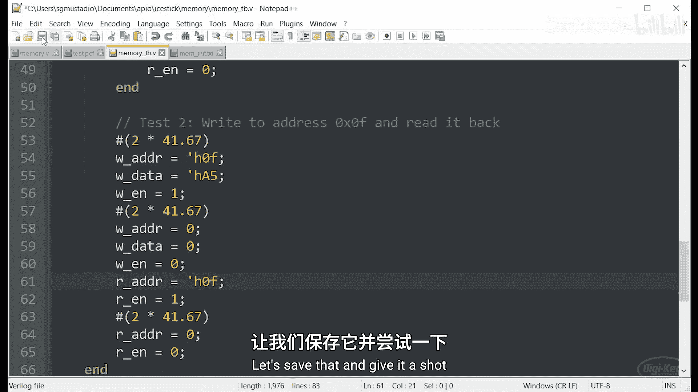

运行仿真并查看波形，可以确认每当读使能在时钟的特定上升沿变高时，你应该得到我们在文本文件中初始化的值。首先是0，然后是1，依此类推，直到 `BF`。然后第二个测试运行，在地址 `Hex F` 处，`A5` 被加载进去，然后在这个时钟周期被读取，`A5` 出现在输出端。这验证了存储器正在工作，并且我们可以默认使用文本文件中的值来初始化它。

## 创建只读存储器

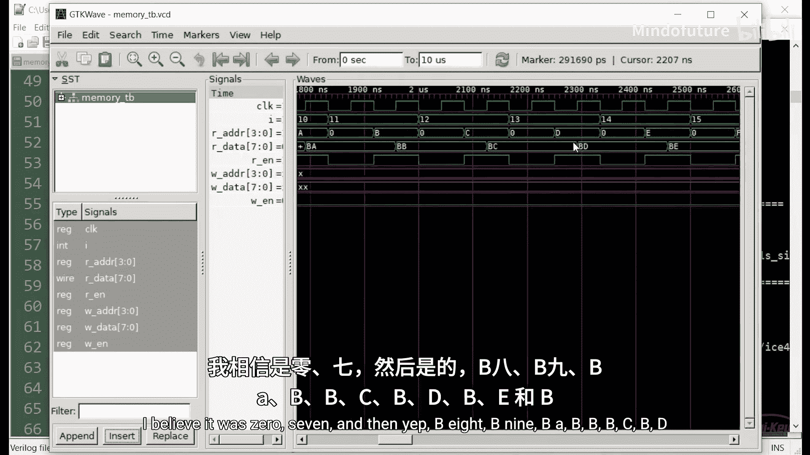

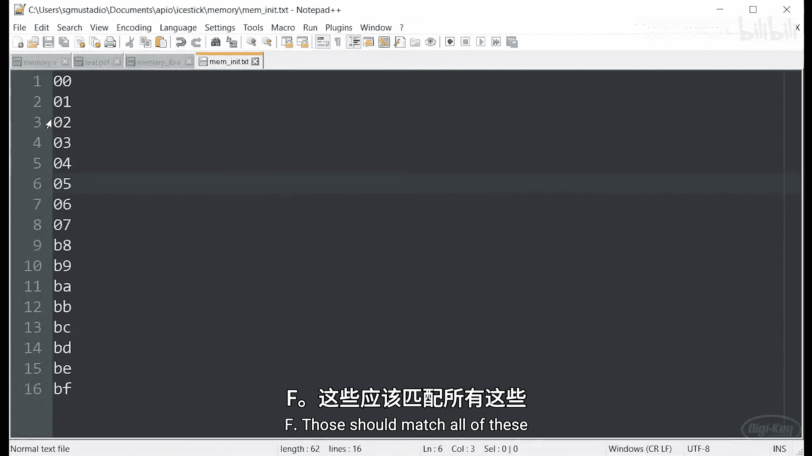

这对于查找表甚至处理器的指令等用途非常有用。在这种情况下，你可能实际上需要只读存储器。

你可以通过去掉写入能力来创建只读存储器。如果我在这里去掉各种写使能、写地址和写数据线，我就创建了只读存储器。将值放入其中的唯一方法是通过这个文本文件。这是创建某种不变存储器的好方法，例如，你可以为CPU读取指令。如果你想编写汇编程序，甚至更好的是，你可以创建自己的汇编器，甚至编译器，将像C这样的高级语言转换为汇编语言，然后汇编器创建单独的指令，你将它们输出到这样的文本文件中，这些指令被加载到你的RAM中，然后由你的处理器执行。

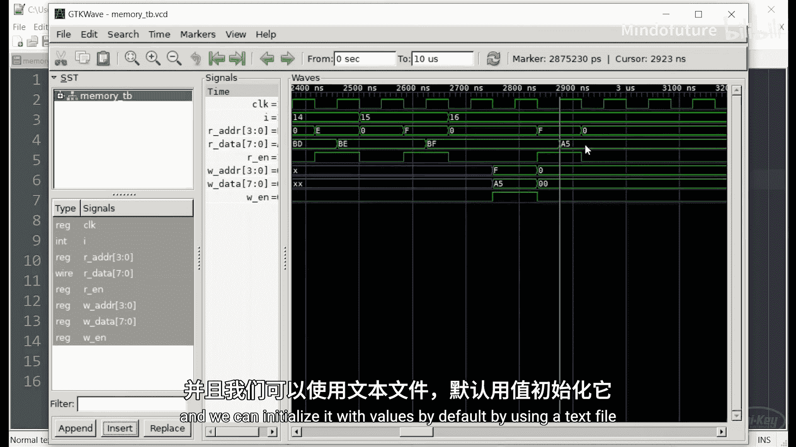

## 挑战：制作一个基本的LED音序器

在音乐制作中，音序器是一种将声音或音符按顺序组合在一起的设备或软件。它们可以被录制或预设。然后，音序器连续循环播放音符或声音以创建音乐。音乐家可以与音序器一起演奏，或从不同的音序器叠加声音。

你的挑战是制作一个超级基本的LED音序器。不用担心在每个步骤或时间点（比如每秒或半秒）产生声音。FPGA在LED上显示一个2比特的值。

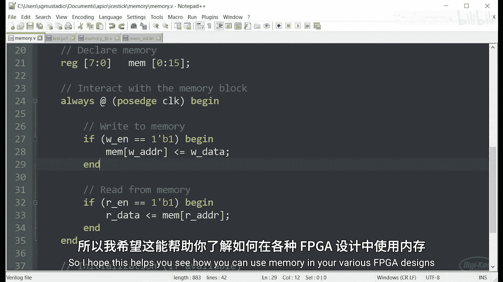


我将按住模式按钮上的一个2比特值，然后按下设置按钮。这会将右侧两个按钮上的模式 `0,0` 记录到第一个存储器元素中。我再做另一个模式，比如 `0,1`，并将其设置到下一个存储器元素中。我将继续记录 `0,0`, `0,1`, `1,0`, `1,1`, `0` 和 `0,1`。音序器将这些值记录到存储器中。它只需要8个元素长。在整个过程中，音序器在LED上一次播放一个元素的序列。当它循环回到开头时，它应该准确地向我回放那个序列：`0,1,0,1,2,3,2,1`。

请注意，你可能需要使用许多早期课程中的概念和模块。我使用了单独的模块用于时钟分频器、按钮消抖和块RAM。我也强烈建议为你的设计编写一个或多个测试平台。它们在追踪错误时对我帮助极大。

祝你这个挑战好运。

## 总结

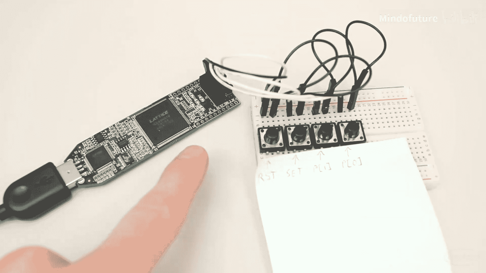

在本节课中，我们一起学习了FPGA中存储数据的多种方式，重点是如何使用Verilog描述和推断块RAM。我们了解了块RAM的硬件结构，编写了可综合的双端口RAM代码，并通过仿真验证了其读写功能。我们还学习了如何通过文本文件初始化存储器内容，以及如何创建只读存储器。最后，我们提出了一个制作LED音序器的实践挑战，以巩固所学知识。

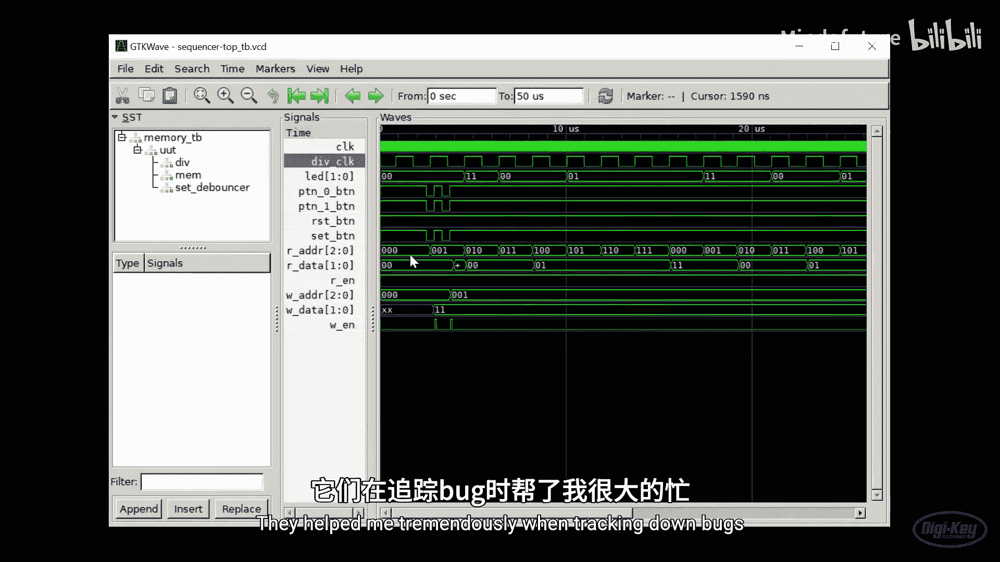


在下一节课中，我们将看看FPGA中的锁相环，看看是否可以使用它将时钟速度提升到几百兆赫兹。