# 009：锁相环(PLL)与毛刺

在本节课中，我们将学习如何使用FPGA内部的锁相环来生成更高频率的时钟信号，并探讨在高速数字设计中可能出现的信号毛刺问题。

## 概述

到目前为止，我们一直在iCEstick开发板上使用12 MHz的时钟。这对于许多应用来说已经足够，但我们可以利用FPGA的锁相环来生成高达数百MHz的时钟。然而，随着时钟频率的提高，信号传播延迟和毛刺等问题会变得更加突出。本节将指导你配置和使用PLL，并理解高速设计中的基本时序问题。

## 使用锁相环提升时钟频率

上一节我们使用了板载的固定频率时钟。本节中，我们来看看如何利用FP相环来生成我们所需的高频时钟。

锁相环是一种有用的电路，它可以产生一个与输入信号频率和相位相匹配的重复波形（如正弦波或方波）。

锁相环的基本工作原理如下：
*   **压控振荡器** 产生一个信号。
*   **鉴相器** 将输出信号与参考信号进行比较，每当两个信号的频率或相位不匹配时，就会产生一系列脉冲。波形偏差越大，产生的脉冲越多。
*   该输出信号通过一个**低通滤波器**进行平滑，得到一个接近直流的电压。
*   该电压被馈送到**VCO**，VCO根据给定的电压调整输出频率。

这个过程持续进行，直到输出波形的频率和相位与参考信号相同。

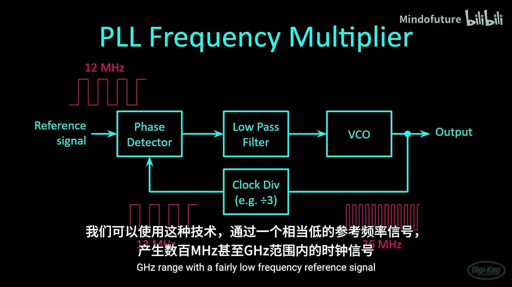

锁相环有多种用途，例如同步或解调信号。我们的目标是从12 MHz信号创建一个时钟倍频器。需要注意的是，我们FPGA中的PLL是为处理数字信号而非模拟波形而设计的。

我们在振荡器和鉴相器之间添加一个简单的时钟分频电路。现在，VCO必须产生一个频率是参考信号三倍的波形。因此，一个36 MHz的方波被三分频，产生一个与输入信号匹配的12 MHz波形。我们可以利用这种技术，以一个相当低的参考频率信号，产生数百MHz甚至GHz范围的时钟信号。

Lattice公司有一份系统时钟设计和使用指南，值得翻阅以了解如何使用片内PLL。在第3章，你可以找到锁相环的框图。

PLL有时设计和调谐起来比较棘手。所以我们需要查看手册，了解我们可以获得哪些频率。这个PLL比我们刚才看的简单模型有更多的设置。

我们需要关心的设置是输入分频器、滤波器范围、VCO分频器和反馈分频器。向下滚动，你可以看到每个参数的可接受值。请注意，其中`a0`实际上意味着除以一。因此，分频器数字需要偏移一位。

我们还想将`PLLOUT`参数设置为`GEN_CLK`，这样内部生成的PLL信号就没有相移。再向下滚动，你会找到一些用于计算PLL输出的公式。我们将使用简单的反馈路径，因此公式在3.5.2节中给出。

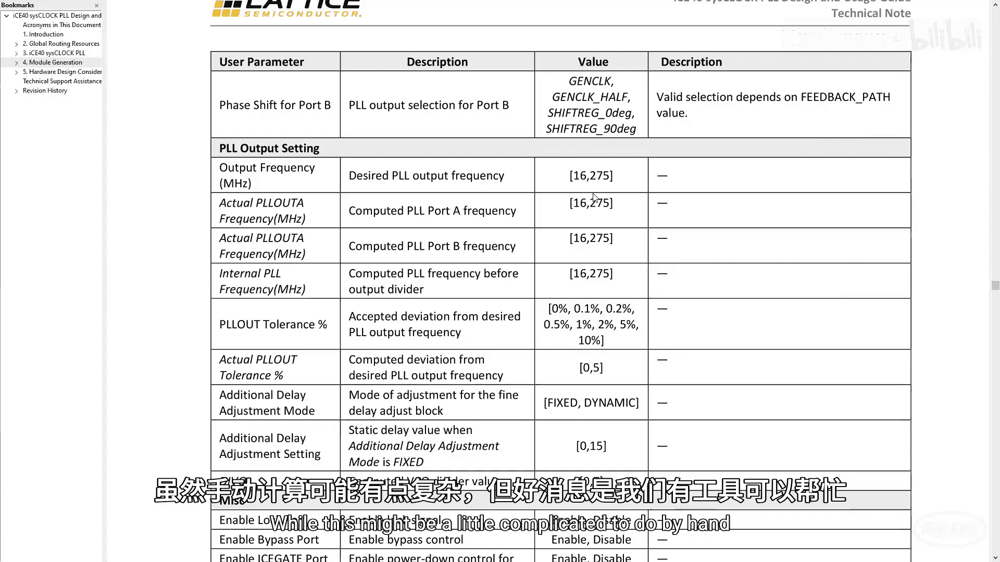

在第4节，你可以找到一些参数限制。参考时钟需要在10 MHz到133 MHz之间。我们将给它12 MHz时钟，所以应该没问题。请注意，VCO的输出必须在533 MHz到1066 MHz之间。我们可以对该输出进行分频来得到输出频率，输出频率必须在16 MHz到275 MHz之间。

虽然手动计算可能有点复杂，但好消息是我们有一个工具可以帮助我们。我们将使用`icepll`工具来帮助我们进行一些计算，并为我们提供那些时钟分频器的推荐值。

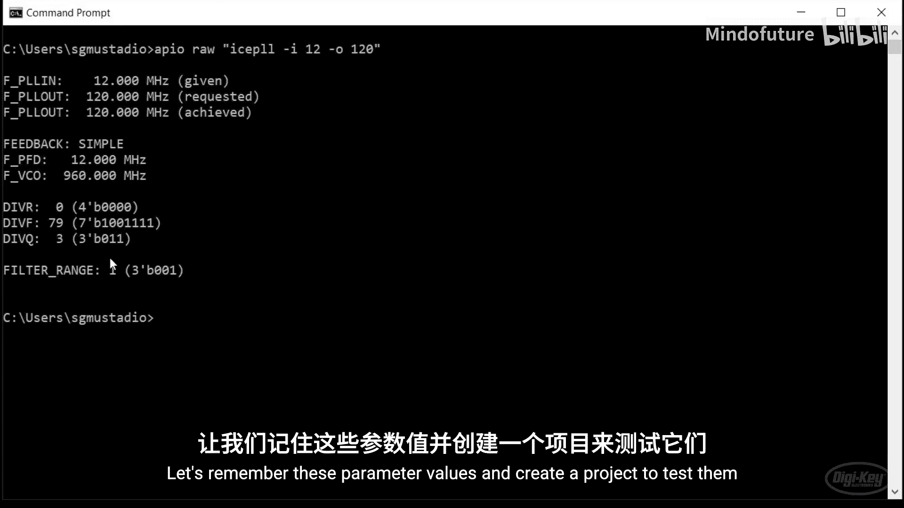

要使用它，我们调用`icepll -i`，然后输入我们想要的输入时钟频率（以MHz为单位），本例中是12，以及`-o`我们想要的输出时钟频率。

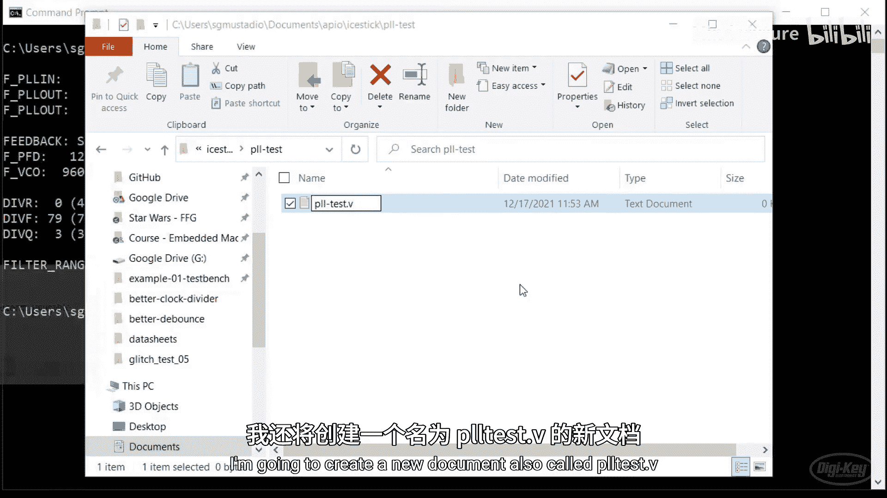

在本例中，我们想要120 MHz。当我们运行这个工具时，它应该为我们计算分频器和滤波器范围。

我们希望`DIVR`设置为0，`DIVF`设置为79，`DIVQ`设置为3，滤波器范围设置为1。这些是我们需要记住的参数，以便在代码中使用PLL。它还为我们提供了一些关于压控振荡器的信息，它说VCO应该运行在960 MHz，但这会被分频到我们输出的120 MHz。

让我们记住这些参数值并创建一个项目来测试它们。

## 在Verilog中实例化PLL

了解了PLL的基本原理和参数后，本节我们动手在代码中配置并使用它。

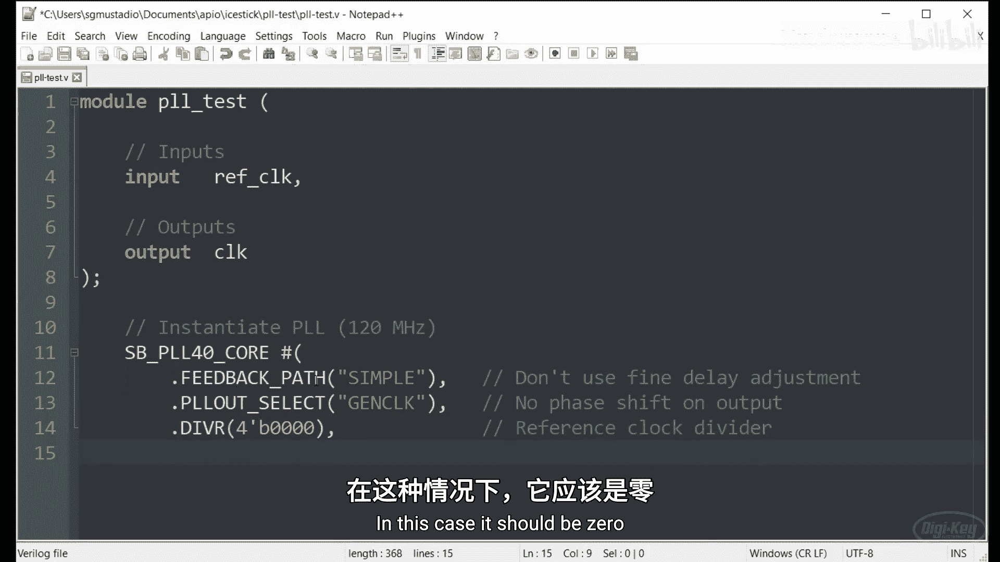

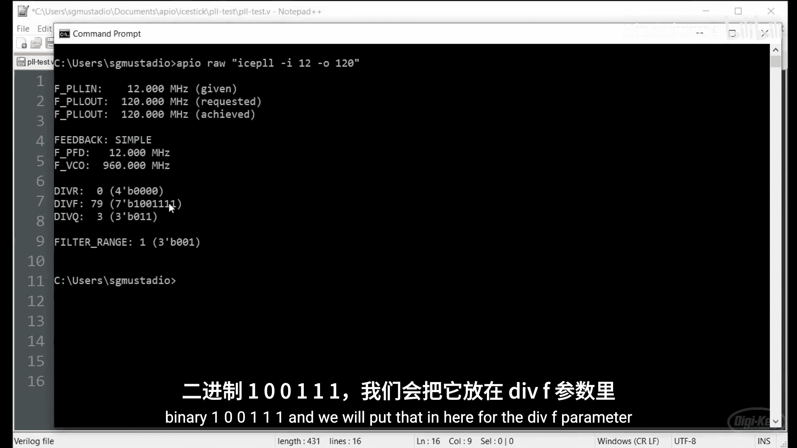

我们将创建一个新项目，称之为`pll_test`。在这里，我将创建一个新文档，也叫做`pll_test.v`。

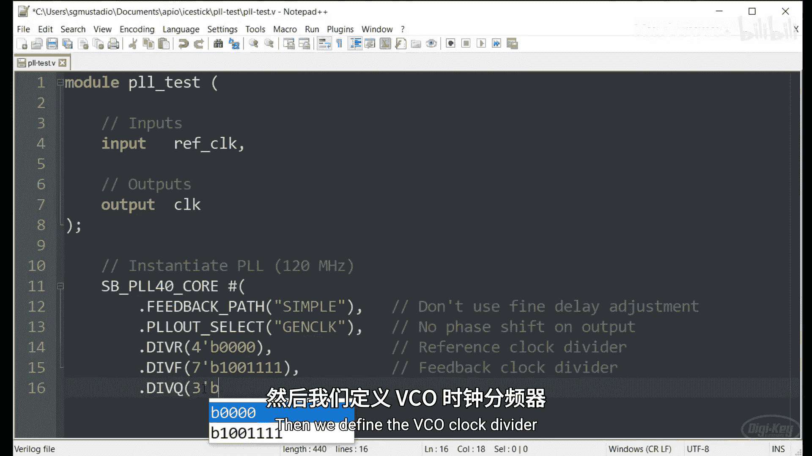

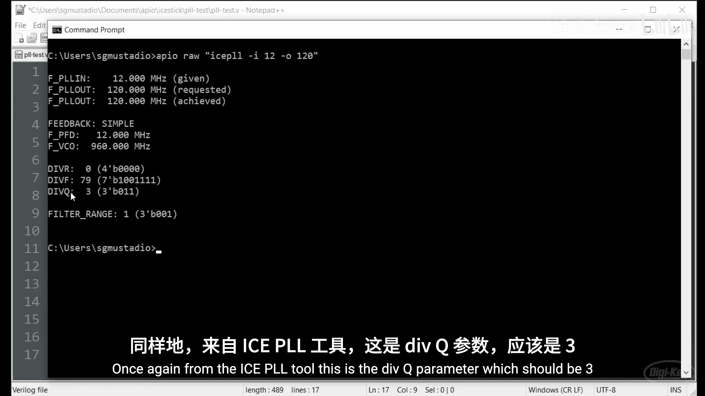

让我们在你喜欢的文本编辑器中打开它。这将是一个非常简单的模块。我们要做的就是输入我们的参考时钟，并输出一个PLL时钟（本例中是倍频后的时钟）。我们将输入12 MHz，输出120 MHz。

为此，我们将使用这个`SB_PLL40_CORE`原语，它是我们iCE40器件特有的。这很像一个模块，我们将给它一些参数、输入和输出信号。它将告诉综合工具需要使用我们iCE40 FPGA内部的PLL核心。

正如我们在数据手册中看到的，我们希望使用简单的反馈路径。这意味着我们不会使用任何精细的延迟调整，这是目前最容易实现和测试的。接下来，我们希望将`PLLOUT_SELECT`参数设置为`GEN_CLK`。这告诉PLL核心我们不希望输出有任何相移。我们再次尝试保持简单。

第一个值是参考时钟分频器。这是我们从`icepll`工具得到的数字之一。在本例中，它应该是0。接下来，我们定义反馈时钟分频器。如果你还记得工具的输出，这是十进制79或二进制`1001111`。我们将把它放在这里作为`DIVF`。

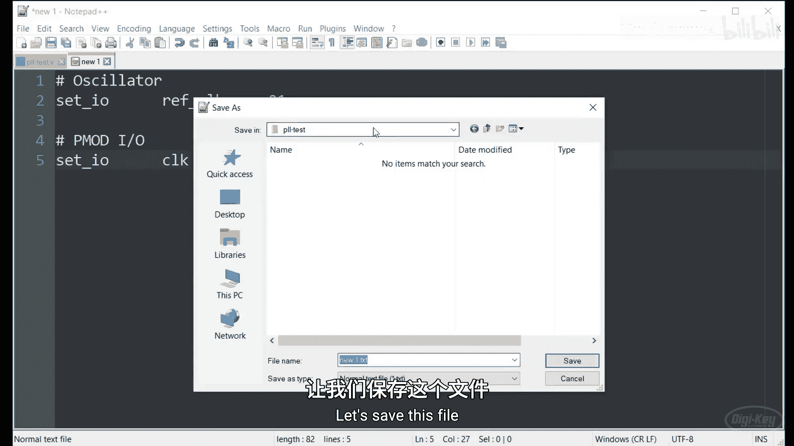

然后我们定义VCO时钟分频器，同样来自`icepll`工具，这是`DIVQ`参数，应该是3。最后，我们定义滤波器范围。

根据我们的`icepll`工具，它应该是1。我们将给这个模块命名，并将我们的输入参考时钟连接到锁相环中的参考时钟信号。输出时钟信号叫做`PLLOUTCORE`，因此我们将我们的输出时钟信号连接到那个端口。

锁相环可以做的其中一件事是给我们一个锁定信号作为输出。这个信号让你知道PLL正在工作，并且已将输出相位锁定到输入相位。有时你可能想等待那个信号再做其他事情，但现在我们并不特别关心它。所以我们不会在我们的顶层设计中将该信号连接到任何东西。

这个特定的PLL有一个低电平有效的复位。所以我们实际上只想给它一个静态的高电平信号让它运行。最后，我们希望禁用PLL中的旁路，以便我们可以使用它作为输出。

这就是我们Verilog代码需要做的全部。然而，我们确实想创建一个物理约束文件，我将把输入参考时钟定义为`P21`，那是我们iCEstick上12 MHz时钟连接的物理引脚21。我们还有一个输出时钟信号，我们想用示波器测量，它将连接到物理引脚`P87`，该引脚在Pmod连接器上。

将该文件保存为我们的引脚约束文件后，我们将打开命令提示符并进入我们的`pll_test`目录。在这里，我们想为我们的iCEstick初始化项目，就像我们为所有项目做的那样。至少如果你在使用iCEstick，最好验证你的代码，确保一切看起来正常。

我们将调用`apio build`，没有错误。然后我们将调用`apio upload`。看起来一切已上传到iCEstick，所以让我们连接示波器确保它工作。

当我用示波器测量iCEstick上引脚87的输出时，你可以看到时钟信号。我测量频率，看起来是120 MHz，正如我们预测的那样。请注意，这不是一个非常漂亮的方波。当我们开始使用更高的频率时，线路中的电容和电感开始成为问题，这将使波形变形。我的示波器也遇到了带宽限制。

在FPGA内部，这可能不是大问题，但如果你在布局PCB或将外部部件连接到FPGA，这是你必须记住的事情。

## 理解传播延迟与毛刺

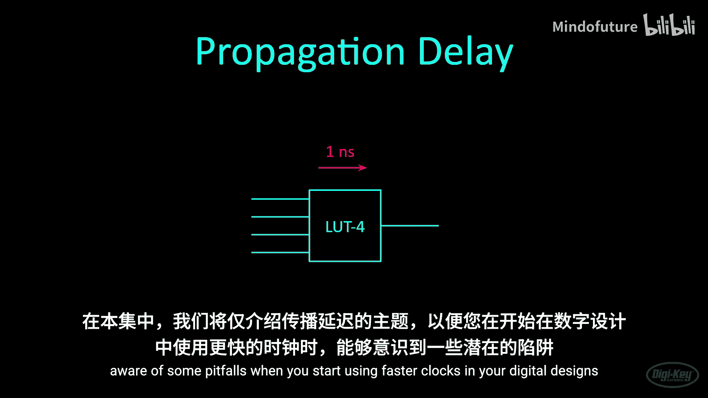

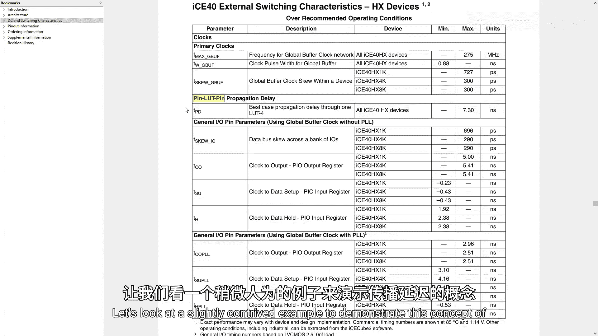

成功生成了高速时钟后，我们需要意识到随之而来的设计挑战。本节我们将探讨数字电路中的传播延迟及其导致的毛刺现象。

当我们创建数字设计时，我们经常想象一个理想的世界，输出会随着输入的变化而立即变化。然而，这在现实世界中并不会发生。所有导线和门都有传播延迟。电压电平的变化需要一小段时间才能出现在导线或门的另一端。

在FPGA内部，我们通常可以假设大多数导线几乎没有传播延迟，因为它们非常短。然而，门可能会有明显的延迟。例如，这个非门在接收到输入变化后，可能需要一纳秒来更新其输出。请记住，FPGA使用查找表而不是真正的门来创建你的可编程逻辑。所以实际上，传播延迟发生在查找表之间，而不是在门级。

时序和传播延迟可能很快变得非常复杂，可以成为它自己的视频系列。我们将在本节中介绍传播延迟这个话题，以便你在数字设计中开始使用更快的时钟时，能够意识到一些陷阱。

如果你查看iCE40数据手册，你可以找到我们特定器件传播延迟的最大值。但请注意，这是引脚到引脚信号的延迟，即信号从一个外部引脚通过一个查找表再到另一个引脚所需的时间。数据手册没有提到内部信号。所以我们必须假设这种传播延迟可以忽略不计，或者布局布线工具将确保能够满足我们设计的任何时序要求。

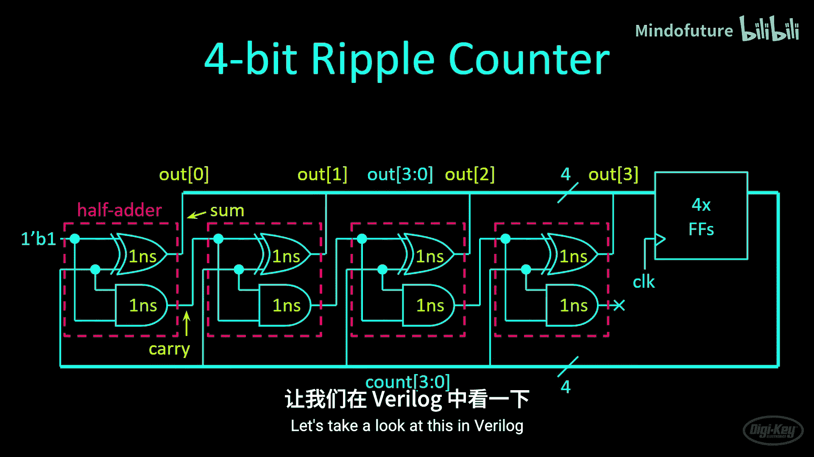

让我们看一个稍微设计的例子来演示传播延迟这个概念。这是一个由四个半加器和四个触发器组成的四位纹波计数器。每个半加器的和构成了计数器输出的一位。进位输出位被馈送到下一个半加器级。输出在每个时钟周期被寄存，以产生四位计数输出。

一旦该值被寄存，电路就将该值加一以产生新的输出，然后该输出再次被寄存。只要有时钟信号，这个过程就会一直持续下去。

当我们引入门延迟时，事情变得有点复杂。就在计数更新后，第一个输出在一纳秒后更新。然后第二位在那之后一纳秒更新。第三位在一纳秒后更新，最后第四位在一纳秒后更新。输出值更新总共需要4纳秒，在此期间，输出会随着位的变化而变化，然后才稳定在正确的值上。

再次强调，这是一个理论上的例子，因为FPGA使用查找表而不是门来实现这一点，并且内部延迟可能更小。此外，当你在Verilog代码中使用加法时，综合工具可能会实现纹波进位加法器以外的其他东西来完成这个功能，以避免此类延迟。

让我们在Verilog中看看这个。

## 仿真观察毛刺

理论了解了传播延迟，现在我们通过仿真来直观地观察毛刺是如何产生的。

与其让你看我手动写出这个测试，我创建了一个`glitch_test`项目。请注意，`apio`需要测试平台之外的某种Verilog代码才能工作，但我要在测试平台内部完成所有事情。所以我创建了一个空的Verilog文件只是为了满足`apio`的要求。如你所见，里面什么都没有。我把所有东西都放在这个测试平台里。我知道我提到过你可能应该每个文件使用一个模块，但由于我们要做一些不可综合的事情，我把一个硬件模块（本例中是我们的半加器）和测试平台作为单独的模块放在同一个文件中。

这是半加器。它非常简单。它只是一个异或门和一个与门，带有和输出与进位输出。然而，使用我们的仿真工具，我们可以使用`#`符号来表示延迟，就像我们之前做的那样。但如果我们在赋值之前使用它，就像你在这里看到的，它意味着等待一个时间单位，在更新这个值或该逻辑的输出之前获得这个值。

请注意，有更好的工具可以进行门级仿真。有一种方法可以让Icarus Verilog进行门级仿真，但就我们目前使用的东西而言，它默认不执行门级仿真。所以我们可以尝试通过这种方式来模拟它，比如假设计算这个异或逻辑需要一个时间单位（本例中是一纳秒）。当你进行实际的门级仿真时，你用于那些门的模型应该与实际FPGA（比如你的iCE40）中的查找表延迟紧密匹配。然而，没有这些模型，我们必须依靠这个来演示传播延迟。

所以我手动创建了带有模拟门延迟的半加器。我们将定义我们的测试平台。如果你看过测试平台的视频，这一切看起来应该很熟悉。

我们将创建一些内部信号，我们将创建一些寄存器。在本例中，`out`应该与你在图中看到的匹配，它是纹波计数器的输出，而`count`是该寄存值的输出。对于这个例子，我们将生成接近120 MHz的时钟，以演示当你开始使用更快的时钟速度时可能发生的情况。

我们将实例化我们的半加器。在本例中，我们将我们的信号连接在一起。请注意，第一个半加器的进位输出连接到下一个半加器的`a`输入，那个半加器的进位输出连接到下一个半加器的`a`输入，而计数值是另一个输入。请记住，那是寄存后的输出值。半加器的和构成了我们的`out`向量或`out`总线的位。

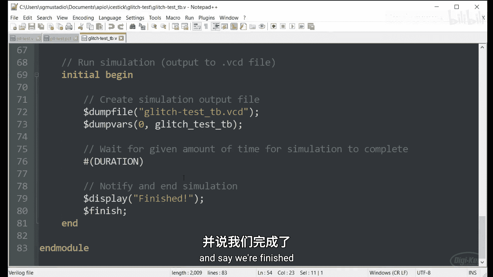

这是作为四位纹波计数器一部分的寄存器。在每个时钟周期，`out`值被寄存到`count`值。一旦`count`更新，就会导致半加器链开始工作，并立即（减去一些传播延迟）更新它们的输出值，然后这些值再次被时钟采样，这个循环继续。

我这里有一个异步复位信号，只是为了复位一切。这就是我们要为这个测试做的全部。我们要做的就是脉冲那个复位线，然后让计数器做它的事情。

这一切看起来应该很熟悉，我们运行仿真，创建值变化转储文件，然后说我们完成了。

让我们打开命令提示符，进入我们的`glitch_test`项目。我相信我已经为iCEstick初始化了项目，但以防万一，让我们再做一次。让我们验证一下，然后我们将进行仿真。一旦GTKWave启动，请随意移动并观察发生了什么。

一旦我们更新计数值（或者它从零开始初始化），几纳秒后，输出就更新了。现在让我们移动到值被寄存的地方。我们有一个时钟上升沿，`count`取`out`的值。如果我们递增1，它应该是2。然而，你注意到在很短的时间内，这个值是0。这就是这个值不正确的一纳秒。1加1应该是2。为什么这里是0？这被称为毛刺。

这是因为这些值在半加器中需要时间更新。所以第一个半加器更新它的值，它说`a`需要是0，然后它变成了0。第二个半加器更新它的值需要一纳秒。所以我将在这里和这里放置标记，这样你可以看到它更新需要一纳秒。所以在很短的时间内，这个值是不正确的，这是一个毛刺。一旦它更新到2，希望时钟的上升沿会发生，正如我们在这里看到的，`count`总线用那个输出值更新，所以2来到这里，我们看到更多的毛刺，因为将2递增到3，我们不应该看到1和7，但正如你所看到的，这些位需要时间（每个一纳秒）来更新它们的值，然后才实际变成3。

在这个设计中，这通常不是问题。当你使用这样的计数器时，你通常关心的是这个寄存值，这个`count`值。如果你看这里，它是0, 1, 2, 3，依此类推。只有当你在观察这个`out`值，如果你在使用这个值时，才可能是个问题。但在大多数使用计数器的情况下，你关心的是这个寄存后的输出。这就是为什么如果你使用这样的计数器，你可能不会看到这成为问题。

## 高速下的时序挑战

然而，当你开始提高时钟速度时，如果我们假设这些传播延迟是正确的，并且它们不随我们提高时钟速度而改变，那么我们开始采样点越来越接近这些变化发生的地方。如果我们把时钟速度提高到，比如说，300或400 MHz，你可以开始看到我们可能在这里采样。在这种情况下，这个7被寄存到这个计数值中，这是一个真正的问题。

这个毛刺被寄存并成为新的计数输出，计数器不再工作，因为我们违反了这些时序限制。这开始涉及一些相当高级的FPGA设计讨论，关于如何适当地进行布局布线或创建避免此类毛刺的逻辑。

目前，我们的iCEstick应该能够管理我们想做的一些基本事情，比如加法器和计数器，这些应该不会违反任何时序限制。就本入门课程而言，这只是你在进行FPGA设计时需要记住的事情。在你开始进入更快的时钟速度之前，或者如果你开始看到奇怪的事情发生，你应该不需要担心这些。要知道那可能是一个毛刺，你必须开始查看你的测试平台，并可能运行专门的门级仿真软件工具来捕捉这些，因为毛刺可能很难发现、追踪和修复。

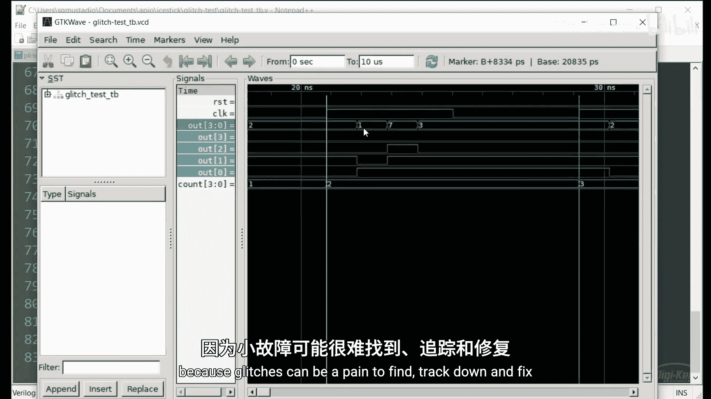

## 总结与挑战

本节课中，我们一起学习了如何配置和使用FPGA内部的锁相环来生成高频时钟，并深入探讨了数字电路中因传播延迟而产生的毛刺现象。我们了解到，在低速设计中，毛刺可能不是问题，但随着时钟频率的提高，它们可能导致电路功能错误。

纹波进位计数器是一个简单的设计，但在高时钟速度下容易产生毛刺。这是给你的挑战：你能想出另一种实现计数器的方法，消除或至少减少毛刺的数量吗？看看你能否为你的设计搭建一个测试平台。如果你想比较答案，我将在描述中发布我的解决方案链接。

在下一节中，我们将讨论亚稳态和跨时钟域问题。祝你编程愉快。

