# 010：亚稳态与跨时钟域处理 ⚙️

在本节课中，我们将要学习FPGA设计中一个关键且常见的问题：亚稳态。当设计需要处理异步信号或跨越不同时钟域时，就可能遇到这个问题。我们将了解亚稳态的成因、影响以及如何通过同步器等技术来避免它，从而确保设计的稳定性和可靠性。

## 亚稳态的成因 ⚡

上一节我们介绍了同步设计的概念。本节中我们来看看当设计不再完全同步时会发生什么。

大多数我们目前接触的设计都是同步的，这意味着它们工作在同一个时钟信号下。然而，你可能会遇到需要采样异步信号，或者与工作在完全不同时钟信号下的模块交互的情况。这可能导致一个被称为亚稳态的问题。

让我们观察一个基本的D触发器。我们假设这个触发器在时钟脉冲的上升沿寄存数据。仔细观察这个边沿。实际上，输入信号需要在采样时钟边沿之前的某个时间段内保持其预期值。输入信号D在时钟事件发生前需要保持稳定的这段时间被称为**建立时间**。信号在时钟边沿之后也必须保持该电平一段时间，输出才能稳定。这被称为**保持时间**。

只要输入信号不在建立时间和保持时间窗口内发生变化，输出Q就会更新为寄存的值，并保证是稳定的。

然而，如果D在建立或保持时间窗口内发生变化，就构成了时序违规。这可能导致D触发器无法正确锁存输入信号，并进入亚稳态。此时，触发器的输出在一段不确定的时间内处于未知状态。通常，输出会迅速达到稳定状态，但这种亚稳态输出可能会根据电压稳定所需的时间长短，在你的设计中产生错误的信号和值。

需要注意的是，在建立或保持时间内的毛刺或短脉冲也属于违规，同样可能引发亚稳态。大多数建立和保持时间都在纳秒量级。你无法保证时序违规一定会导致亚稳态，因为这是概率性的。你最多只能计算平均故障间隔时间来了解其发生的可能性。我们不会深入这个计算，因为它属于更高级的主题。

此外，你可能无法在示波器上直接观察到这种亚稳态，因为它只发生在FPGA内部的触发器上。大多数FPGA在触发器输出和物理引脚之间有一些逻辑和缓冲器。这意味着亚稳态输出在引脚上看起来可能只是一个电平变化。然而，如果你反复监控这个引脚并记录亚稳态输出，你会看到由于亚稳态的概率特性，电平变化发生的时间点会有所不同。

如果我们查看数据手册，可以看到HX1器件列出的建立和保持时间。但请注意，与传播延迟一样，这些时间仅针对来自物理引脚的信号给出，内部时序并未给出。因此我们必须假设布局布线工具会确保所有内部路径满足时序要求。

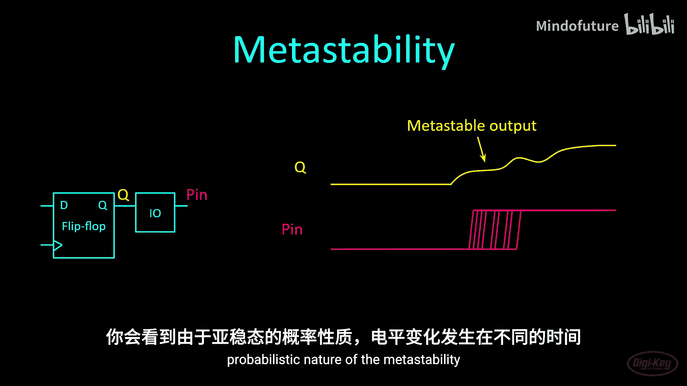

有趣的是，建立时间竟然是负值。这意味着你的信号变化实际上可以在时钟边沿之后略微到达，但仍然没有问题。

Colin O‘Flynn有一篇优秀的文章，他通过寄存一个分频时钟信号，然后以不同量延迟时钟，来演示亚稳态。你可以在这里看到他的测试设置。他使用一个48 MHz时钟信号来驱动触发器的信号线和时钟线。信号线被分频到24 MHz，以便可以采样上升沿和下降沿。然后他仔细调整时钟相位，直到发生建立或保持时间违规。你可以在这里看到他的结果。如果没有违规，数据输出信号看起来很干净。然而，当发生亚稳态事件时，数据输出线的转换会随机延迟一段时间。

我曾尝试复现这个实验。但是，为了让亚稳态事件更明显，你需要降低FPGA的核心电压。我发现我需要拆焊几个元件来控制核心电压。虽然我肯定能做到，但我不想冒险损坏我唯一的iCEstick，因为我知道目前很难买到它们。

## 解决方案：同步器 🔄

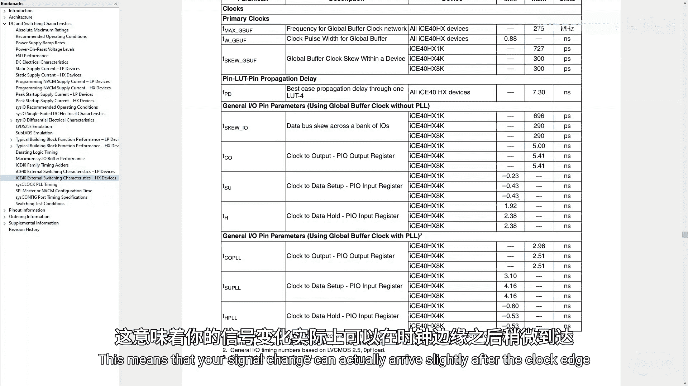

上一节我们了解了亚稳态的成因和风险。本节中我们来看看如何解决这个问题。

如果你正在处理异步信号或跨时钟域，标准的修复方法是**在采样链中添加第二个触发器**。虽然这不能完全消除亚稳态，但它会降低其对最终输出的影响和发生几率。即使第一个触发器经历了亚稳态，第二个触发器也会采样那个未知状态，并有更大的机会产生一个稳定状态。

请注意，这确实会在你的设计中引入一个延迟，因为输入值现在需要额外一个时钟周期才能出现在输出上。有时你甚至可能看到三个或更多触发器串联在一起，以真正降低亚稳态的几率。使用这样的触发器链来减少亚稳态被称为**同步器**。

以下是一个简单的触发器示例，其中输入可能是一个异步信号，我们用它来创建一个同步器：

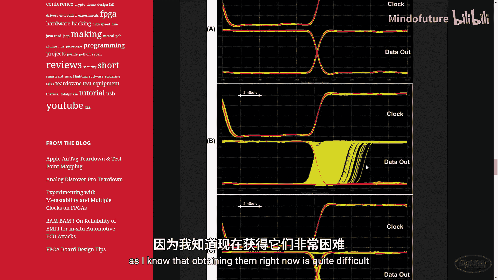

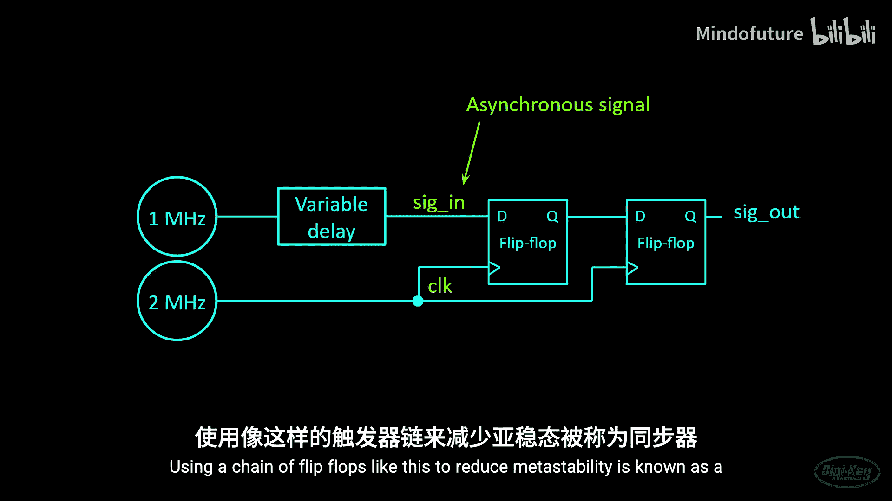

```verilog
// 定义一个同步器
reg pipe_0;
reg output_reg;

always @(posedge clk) begin
    pipe_0 <= async_input; // 第一级寄存
    output_reg <= pipe_0;  // 第二级寄存
end
```

我们定义一个新的寄存器元素，称之为`pipe_0`。然后我们使用非阻塞赋值将输入信号寄存到`pipe`寄存器。我们添加另一行，将`pipe`寄存器的内容寄存到输出寄存器。这样就完成了。

## 时钟域与跨时钟域处理 🕐

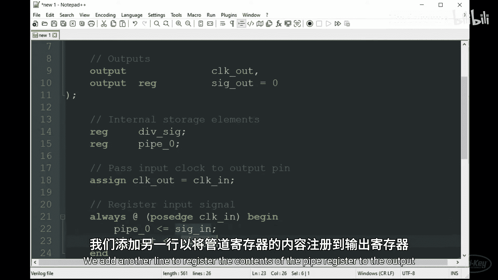

到目前为止，在我们的设计中，我们主要工作在单个时钟域中。这意味着我们所有的逻辑和触发器都由单一源时钟驱动，对我来说就是板载的12 MHz振荡器。然而，你可能会遇到其他模块使用独立时钟，且该时钟与你的系统时钟相位不对齐的情况。

**时钟域**是指所有由单一时钟信号或其分频版本驱动的逻辑。

假设`clock1`由某个外部传感器生成。它可能是一个5 MHz的SPI信号，我们无法保证它与我们内部的系统时钟（称之为`clock2`）相位对齐。我们想要采样输入数据以用于计算，因此我们创建了这样一个电路。然而，正如我们刚才所示，这两个时钟域之间的边界是危险的，因为有可能发生亚稳态。这种情况被称为**跨时钟域**，它可能导致很多令人头疼的问题。亚稳态是随机的，可能引发难以追踪的bug，也可能不会。

通常，解决方案是在接收时钟域创建一个同步器电路，正如我在这里展示的。在大多数情况下，这将降低亚稳态发生的可能性。

为了让你的设计保持简单，尤其是当你刚刚入门时，你可能希望尽量避免跨时钟域。尽可能让你的设计同步在单一时钟域内。

在早期的课程中，我们制作了简单的时钟分频器，看起来像这样：我们的12 MHz时钟输入一个简单的分频电路，然后我们使用该信号以较慢的速率驱动设计的其余部分。当你刚开始学习使用FPGA时，这样做是可以的。然而，这被认为是糟糕的设计。逻辑和触发器可能会引入延迟，现在你从技术上创建了一个独立的时钟域。你应该避免使用其他触发器的输出来驱动时钟输入。

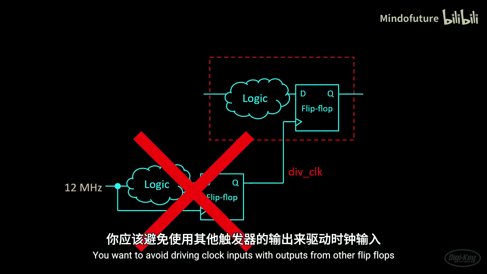

我要感谢Patrick Lehman向我展示了一种更好的创建时钟分频器的方法。以下是那个更好的时钟分频器：

```verilog
module better_clk_divider #(
    parameter MAX_COUNT = 120
)(
    input wire clk,
    output reg tick
);
    localparam COUNTER_BITS = $clog2(MAX_COUNT);
    reg [COUNTER_BITS-1:0] count = 0;

    always @(posedge clk) begin
        if (tick) begin
            count <= 0;
        end else begin
            count <= count + 1;
        end
    end

    assign tick = (count == MAX_COUNT - 1);
endmodule
```

我们像以前一样，给出一个最大计数值作为参数。但请注意，现在输出不是分频时钟，而是这个`tick`输出。我们使用内置的`$clog2`函数来计算计数器需要多少位。这里的关键在于，与其产生一个分频时钟，`tick`信号在计数结束时仅在一个时钟周期内变为高电平，然后计数器重新开始。`always`块持续递增计数器，并在`tick`为高时（即计数器达到模数参数值时）复位计数器。


以下是这个分频器在仿真中的示例。模数参数设为120，所以每当`count`达到119时，`tick`线会变为高电平一个时钟脉冲。

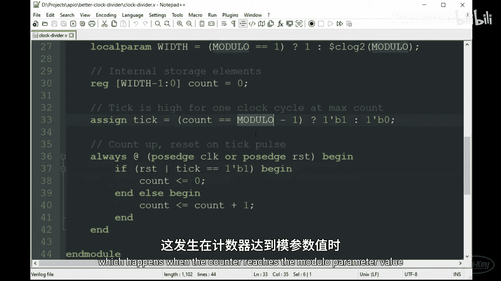

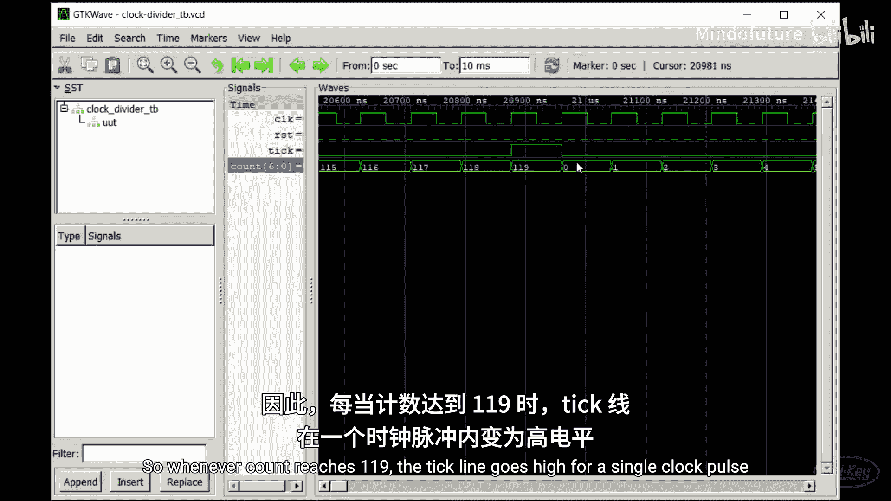

以下是我们如何使用这个新分频器的例子。这是我们在系列课程开始时看到的1Hz闪烁LED示例：

```verilog
better_clk_divider #(.MAX_COUNT(12_000_000)) clk_div_inst (
    .clk(clk_12mhz),
    .tick(one_hz_tick)
);

always @(posedge clk_12mhz) begin
    if (one_hz_tick) begin
        led <= ~led; // 每秒翻转一次LED
    end
end
```

我们实例化时钟分频器。与其使用其输出驱动敏感列表，我们只需在执行操作前条件检查`tick`线是否为高。在这个例子中，我们只是翻转LED。这种方法使所有逻辑都与我们的主时钟完美同步，我们无需担心亚稳态。我将在描述中发布此示例以及更好的按键消抖方法的链接。请随意查看并在你自己的FPGA上尝试。

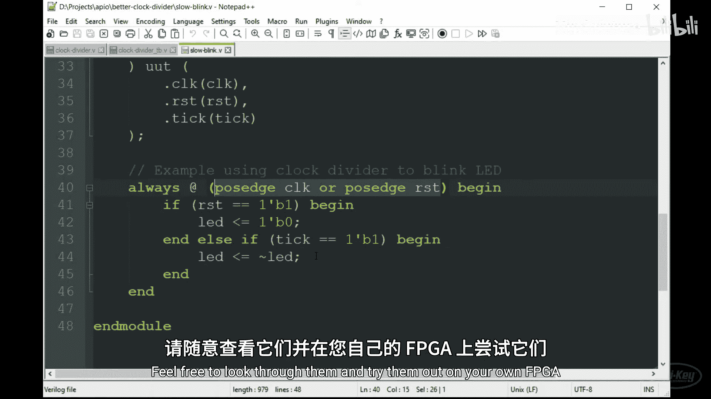

## 先进先出队列 📥

**FIFO**是跨时钟域工作时另一个极好的工具。你可能也知道它叫队列。它是一种使用一块内存块在发送方和接收方之间传递数据的方式。

假设我们有一个已经存储了两个元素的FIFO。发送方将另一段数据写入FIFO，该数据存储在其他两个数据之后。接收进程可以异步地从FIFO读取数据。这将把位于FIFO前端的元素取出，其他元素则向下滑动。

创建或使用FIFO时需要遵循一些规则。以下是需要记住的几个要点：
*   元素按照写入FIFO的顺序被读取。
*   任何已被读取的元素都会从FIFO中移除。
*   你需要一种方法来检查FIFO是空还是满，因为你不想从空的FIFO读取，也不想向满的FIFO写入。如果你这样做，可能会破坏FIFO或无意中覆盖部分内存。

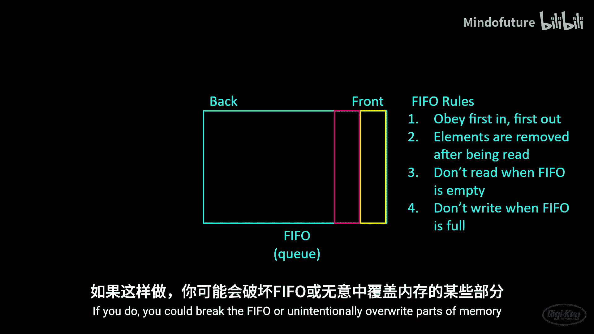

让我们再看一下数据手册中块内存的框图。你会注意到iCE40的块RAM有两个不同的时钟输入：读时钟和写时钟。这允许我们在不同的时钟域中对块RAM进行读写操作。因此，我们可以围绕这块内存构建一些逻辑来创建一个异步FIFO。

这样的队列非常有用，因为它们允许你在时钟域之间传递数据。例如，你可以从传感器采集样本，并将结果存储在FIFO中。然后，一个独立的微控制器可以使用其自己的时钟域从FIFO读取结果。

然而，创建一个能抵抗亚稳态问题的FIFO可能有点棘手。幸运的是，数字设计专家们已经为我们创建了健壮的FIFO。以下是Clifford Cummings在其2002年提交给Synopsys用户组的论文中的一个例子。虽然他提到有第二个FIFO设计获得了奖项，但我建议坚持使用这第一个设计。我强烈建议阅读这篇论文，看看Clifford是如何创建这个设计的。

在第9页，你会看到FIFO的框图。你可以看到逻辑是如何围绕双端口块RAM构建以构成FIFO的。注意，他使用了两个同步器电路在两个时钟域之间传递读写地址。再往下翻，你可以看到源代码已经慷慨地提供给我们使用。

你的挑战是实现这个FIFO，然后用Verilog编写一个测试平台来证明它能工作。以下是我的仿真示例。你可以看到我将值0、1、2和3写入FIFO。当我读取它们时，我在每个读时钟周期得到0、1、2和3，并且注意两个时钟频率是不同的。每当FIFO为空时，读空线变为高电平。如果我填满了FIFO，写满线变为高电平，并且FIFO会忽略之后给出的任何值。当我读出数值时，你可以看到十六进制F之后没有给出任何值，因为FIFO已经满了。

## 总结与展望 🎯

本节课中我们一起学习了FPGA设计中的亚稳态问题及其解决方案。我们了解到，当信号在触发器的建立或保持时间窗口内发生变化时，会引发亚稳态，导致输出在一段不确定时间内处于未知状态。为了解决跨时钟域通信带来的亚稳态风险，我们引入了同步器（使用两级或多级触发器链）和异步FIFO这两种关键技术。同时，我们学习了使用使能脉冲（`tick`信号）而非分频时钟来驱动低速逻辑，以保持设计在单一同步时钟域内，这是避免亚稳态问题的最佳实践。

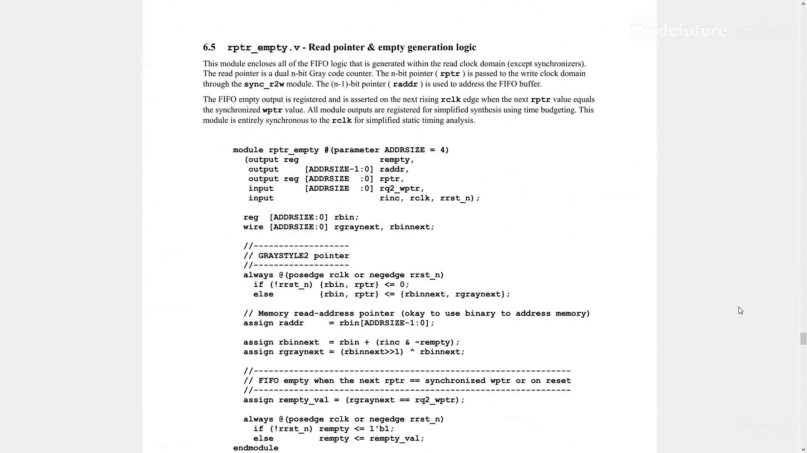

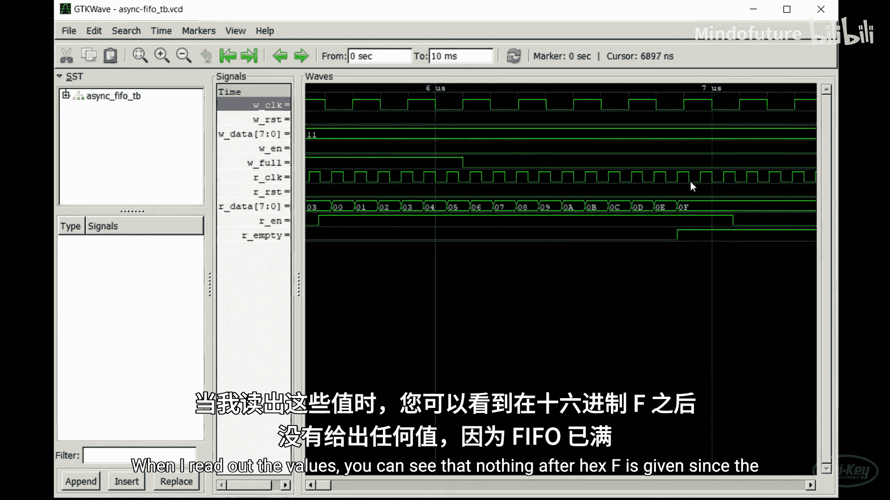

至此，你应该已经掌握了在FPGA中开始创建自己设计所需的大部分基本构建模块。虽然这结束了本系列的入门部分，但我想在接下来的两节课中讨论一个有趣的话题：软核处理器。我将向你展示如何使用一个现有的RISC-V实现，并让它运行在iCEstick上。然后我们将修改设计，加入一个自定义的硬件外设。


祝你编程愉快！