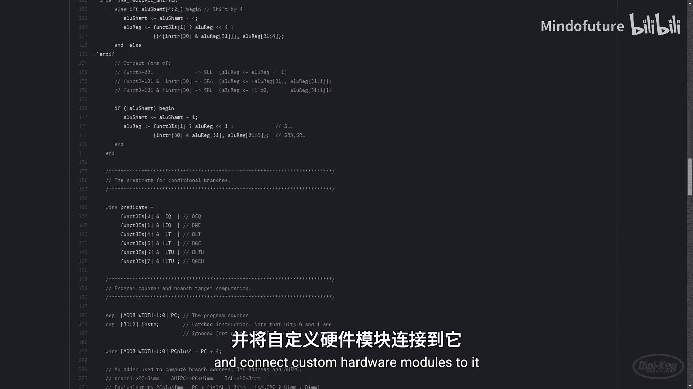
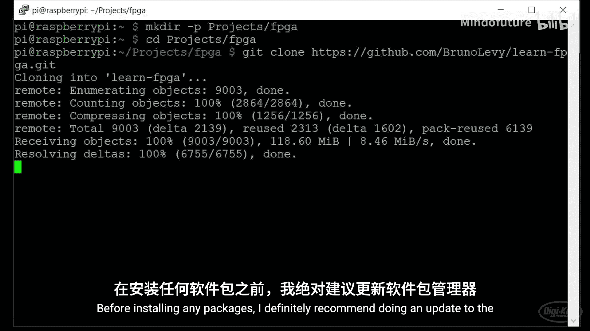
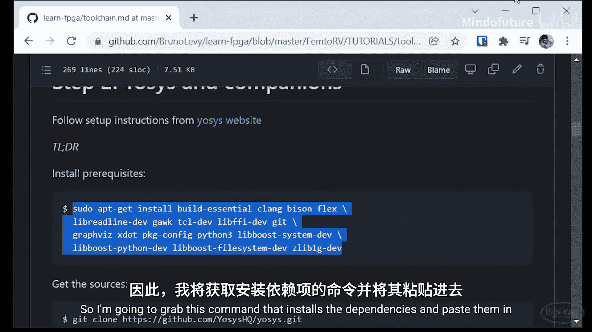
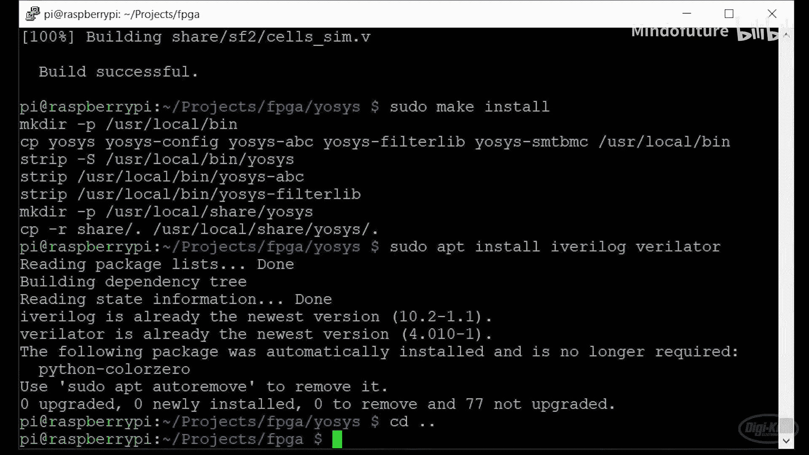
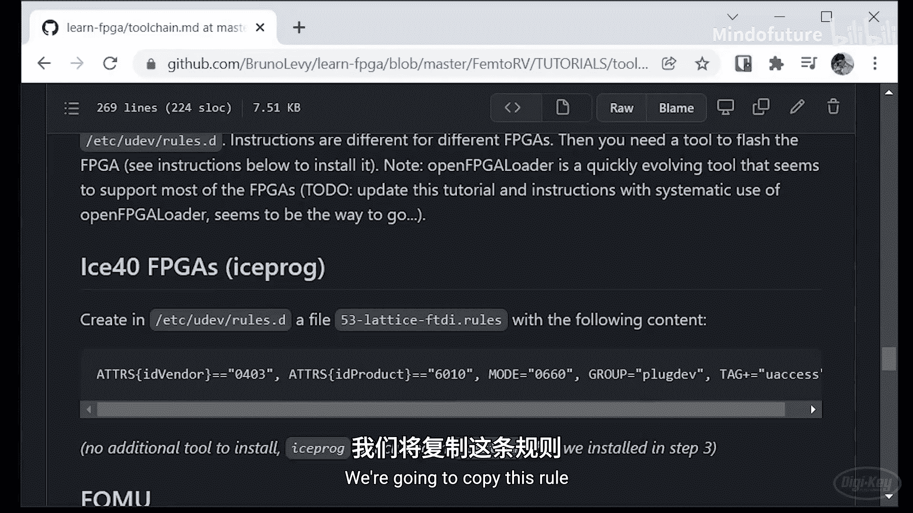
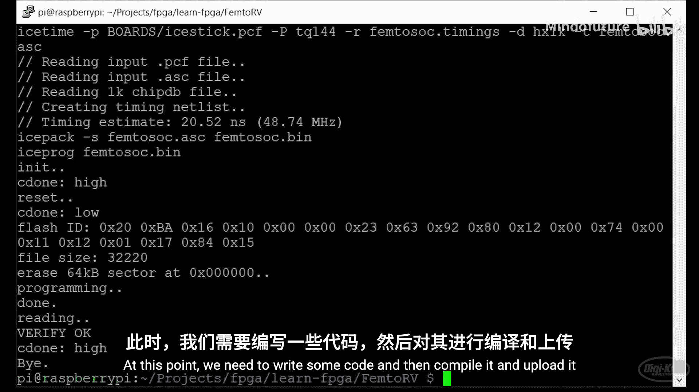
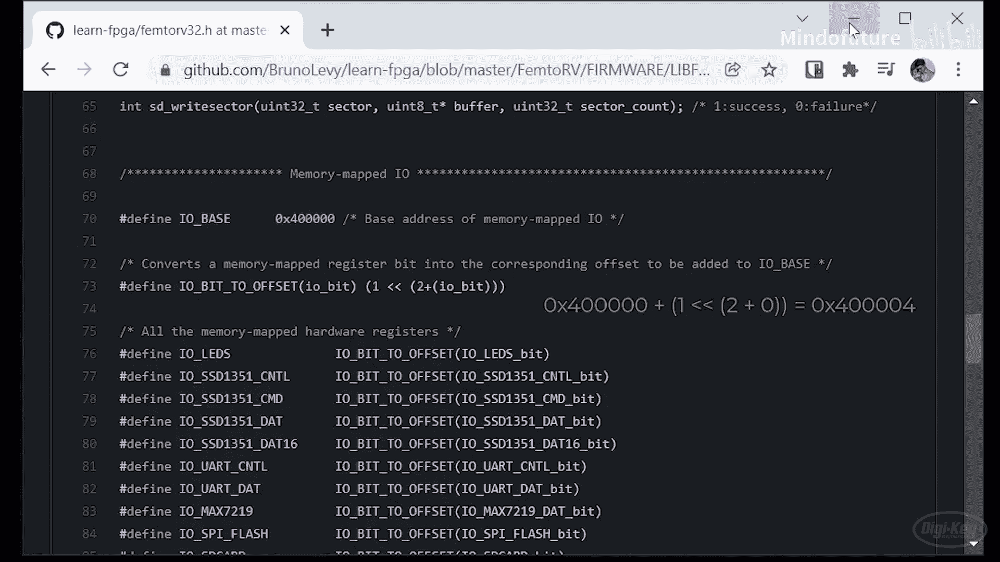
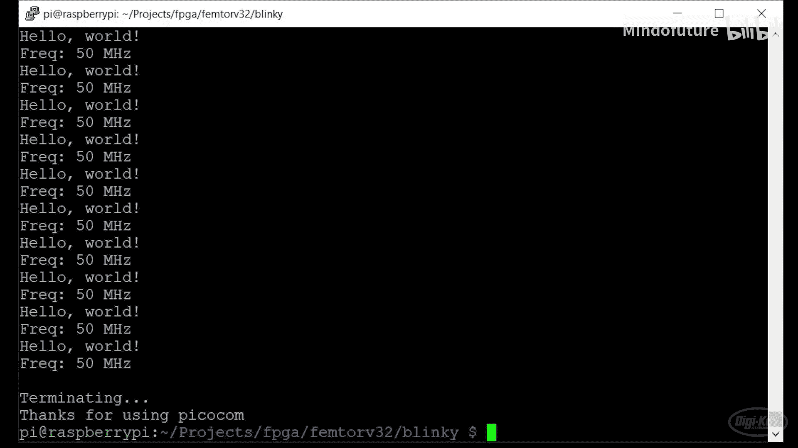
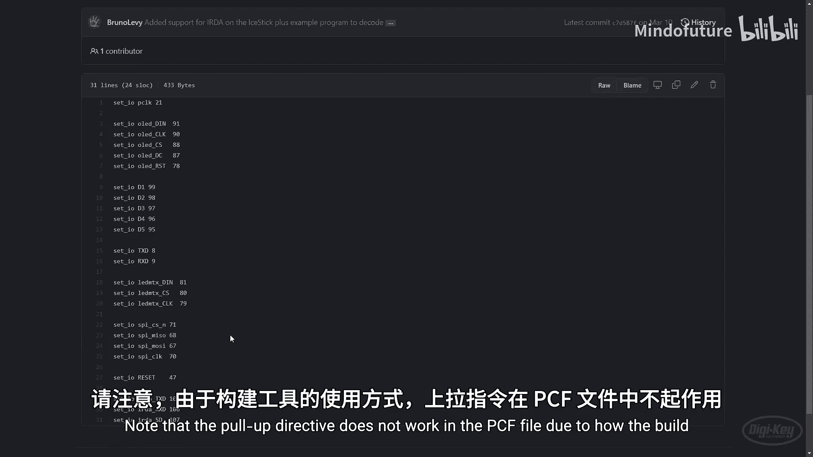

# 011：在FPGA上运行RISC-V软核处理器 🚀

在本节课中，我们将学习如何在FPGA上构建并运行一个开源的RISC-V软核处理器。我们将使用一个名为FemtoRV32的轻量级实现，并将其部署到iCEstick开发板上，最终编写一个简单的C程序来控制板载LED。

## 概述

RISC-V是一种开源指令集架构，这意味着任何人都可以免费使用它来开发CPU。通过将RISC-V CPU实现在FPGA上，我们可以深入了解CPU的工作原理。本节教程将指导你完成一个现有RISC-V实现的构建过程，并运行代码进行测试。

## 准备工作与环境搭建

上一节我们介绍了项目背景，本节中我们来看看如何搭建开发环境。我们将使用Raspberry Pi作为开发主机，但理论上任何Linux系统都可以。



首先，我们需要安装一系列工具链，包括FPGA开发工具和RISC-V编译器。



以下是安装步骤：

1.  **更新系统包管理器**：在开始安装任何软件包之前，建议先更新系统。
    ```bash
    sudo apt update
    ```



2.  **安装Yosys依赖并编译**：Yosys是一个开源的Verilog综合工具。
    ```bash
    # 安装依赖
    sudo apt install build-essential clang bison flex \
    libreadline-dev gawk tcl-dev libffi-dev git \
    graphviz xdot pkg-config python3 libboost-system-dev \
    libboost-python-dev libboost-filesystem-dev zlib1g-dev

    # 克隆并编译Yosys
    git clone https://github.com/YosysHQ/yosys.git
    cd yosys
    make -j$(nproc)
    sudo make install
    cd ..
    ```

3.  **安装仿真工具**：安装Icarus Verilog和Verilator用于仿真测试。
    ```bash
    sudo apt install iverilog verilator
    ```

4.  **安装Project IceStorm**：这是Lattice iCE40 FPGA的开源工具链。
    ```bash
    # 安装依赖
    sudo apt install libftdi-dev

    # 克隆并编译
    git clone https://github.com/YosysHQ/icestorm.git
    cd icestorm
    make -j$(nproc)
    sudo make install
    cd ..
    ```



5.  **安装nextpnr**：这是一个开源的FPGA布局布线工具。
    ```bash
    git clone --recursive https://github.com/YosysHQ/nextpnr.git
    cd nextpnr
    cmake -DARCH=ice40 -DCMAKE_INSTALL_PREFIX=/usr/local .
    make -j$(nproc)
    sudo make install
    cd ..
    ```

6.  **配置USB规则**：为了让Linux系统能够通过USB与iCEstick通信，需要添加udev规则。
    ```bash
    sudo nano /etc/udev/rules.d/53-lattice-ftdi.rules
    ```
    在打开的文件中添加以下内容并保存：
    ```
    # 允许普通用户访问FTDI设备
    SUBSYSTEM=="usb", ATTR{idVendor}=="0403", ATTR{idProduct}=="6010", MODE="0660", GROUP="plugdev"
    ```
    保存后，重新加载udev规则：
    ```bash
    sudo udevadm control --reload-rules
    sudo udevadm trigger
    ```

## 获取并配置FemtoRV32项目

环境搭建完成后，我们开始处理具体的RISC-V处理器项目。

首先，克隆FemtoRV32的代码仓库：
```bash
git clone https://github.com/BrunoLevy/learn-fpga.git
cd learn-fpga/FemtoRV32
```



接下来，我们需要根据iCEstick开发板的资源限制来配置处理器，禁用不需要的外设以节省逻辑资源。

进入配置目录并编辑配置文件：
```bash
nano RTL/CONFIGS/icestick.vh
```

在配置文件中，找到并注释掉你不需要的外设定义。例如，对于基础的LED闪烁实验，可以注释掉红外、OLED屏幕和LED矩阵等外设：
```verilog
// `define NRV_IO_IRDA
// `define NRV_IO_MAX7219
// `define NRV_IO_SSD1351
```

确保使用的是最小的处理器内核（Quark版本）并从SPI Flash启动：
```verilog
`define NRV_FEMTORV32_QUARK
`define NRV_RUN_FROM_SPI_FLASH
```
RAM大小设置为8KB，其中2KB用于处理器寄存器，剩余6KB可供程序使用。

## 构建并烧录处理器到FPGA

配置完成后，就可以将处理器设计综合并烧录到FPGA了。

首先，将iCEstick开发板连接到电脑的USB口。

然后，在 `FemtoRV32` 目录下执行构建命令。**注意**：第一次运行时会下载并安装RISC-V工具链，这可能需要较长时间。
```bash
make ICESTICK
```

当你在终端看到 `Programming done. Reading verify OK. Bye.` 的信息时，说明RISC-V处理器及其外设系统已经成功合成、布局布线并烧录到了你的FPGA中。现在，FPGA里有一个“空白”的处理器，正等待执行指令。

## 编写并运行第一个C程序



处理器已经在FPGA中运行，接下来我们需要为它编写程序。我们将创建一个简单的程序，让LED闪烁并向串口打印信息。

首先，为你的项目创建一个新目录并进入：
```bash
mkdir -p ~/fpga/femtorv32_projects
cd ~/fpga/femtorv32_projects
mkdir blinky
cd blinky
```

创建一个C源文件 `main.c`：
```c
#include <femtorv32.h>

int main() {
    // 配置串口，波特率115200
    femtosoc_tty_init();
    // 打印欢迎信息
    printf("Hello, RISC-V World!\n");
    // 打印CPU频率
    printf("CPU Frequency: %d Hz\n", FEMTORV32_FREQ);

    while(1) {
        // 点亮前两个LED (二进制 0011)
        *(volatile uint32_t*)(IO_LEDS) = 3;
        // 延时500毫秒
        delay(500);
        // 关闭所有LED
        *(volatile uint32_t*)(IO_LEDS) = 0;
        // 再次延时500毫秒
        delay(500);
        // 在循环中打印消息
        printf("LED Blink!\n");
    }
    // 程序理论上不会运行到这里
    return 0;
}
```

**代码解释**：
*   `IO_LEDS` 是一个在 `femtorv32.h` 中定义的宏，它对应着控制LED的硬件寄存器的内存映射地址。
*   通过向这个地址写入数据（如 `3`，二进制 `0011`），我们可以控制LED的亮灭。
*   `delay()` 函数用于产生延时。
*   `printf()` 函数会将文本发送到串口，你可以在电脑上通过串口终端查看。



接下来，创建一个简单的 `Makefile` 来编译和烧录程序：
```makefile
include ../../learn-fpga/FemtoRV32/makefile.inc
```

最后，编译程序并将其烧录到FPGA的SPI Flash中：
```bash
make main.prog
```
这个命令会调用RISC-V编译器编译你的C代码，然后将生成的可执行文件通过SPI Flash编程器烧录到开发板上。

## 查看运行结果

程序烧录完成后，处理器会自动从Flash中读取并执行它。

要查看串口打印的信息，你需要在电脑上打开一个串口终端工具（如 `picocom`, `screen`, `minicom` 或 `PuTTY`）。

连接参数如下：
*   **波特率**: 115200
*   **数据位**: 8
*   **停止位**: 1
*   **校验位**: 无
*   **流控制**: 无

在Linux上，可以使用以下命令（具体设备名可能是 `/dev/ttyUSB0` 或 `/dev/ttyUSB1`）：
```bash
sudo picocom -b 115200 /dev/ttyUSB0
```

如果一切正常，你将首先看到 `Hello, RISC-V World!` 和CPU频率信息，然后会周期性地看到 `LED Blink!` 输出。同时，iCEstick开发板上的前两个LED应该会以1秒的周期闪烁。

按 `Ctrl+A`，再按 `Ctrl+X` 退出picocom。

## 挑战任务：添加按钮输入



现在你已经让处理器输出了，下一个挑战是添加输入功能。

你的任务是修改设计，使板载按钮能够作为输入来控制LED。这需要你：
1.  **修改硬件描述**：查看 `RTL/femtorv32.v` 文件，了解按钮引脚是如何定义的。对于iCEstick，你可能需要禁用一些默认的外设（如Pmod引脚上的外设）来释放引脚给按钮使用。你还需要修改 `ICESTICK.pcf` 引脚约束文件，将按钮连接到具体的FPGA引脚。
2.  **注意**：在PCF文件中使用 `PULLUP` 指令可能无效。你需要查阅Lattice iCE40的技术库文档，使用 `SB_IO` 原语直接在Verilog代码中配置引脚的上拉电阻和输入模式。
3.  **编写C程序测试**：在C程序中，读取按钮对应的内存映射寄存器地址，根据其值（按下或松开）来控制LED的闪烁行为。例如，可以实现“当按下第一个按钮时，LED常亮；松开时，LED熄灭或恢复闪烁”。

这是一个综合性的练习，需要你阅读和理解现有的Verilog和C代码。建议你从FemtoRV32仓库中已有的外设驱动代码（如LED驱动）开始模仿和学习。



## 总结

本节课中我们一起学习了如何在FPGA上构建和运行一个RISC-V软核处理器。我们完成了从环境搭建、项目配置、处理器烧录到编写并运行C程序的完整流程。你掌握了：
*   配置和综合一个开源RISC-V处理器（FemtoRV32）到iCE40 FPGA。
*   理解内存映射I/O的概念，并通过C语言访问硬件外设（如LED）。
*   使用串口与FPGA上的处理器进行通信。


通过挑战任务，你将进一步加深对软核处理器系统、硬件描述语言和嵌入式编程之间联系的理解。下一节课，我们将探索如何修改这个处理器，并添加自定义的硬件外设模块。