# 012：RISC-V自定义外设 🧩

在本节课中，我们将学习如何为Femto RV RISC-V处理器创建一个自定义的硬件外设。我们将制作一个简单的PWM（脉冲宽度调制）驱动来控制LED的亮度，并将其集成到我们的片上系统中。

## 概述

上一节我们成功将RISC-V处理器上传到FPGA，并运行了让LED闪烁的代码。本节中，我们将更进一步，创建自己的硬件外设来完成这个任务。为此，我们需要先理解Femto RV实现中的内存寻址机制。

## 内存寻址机制

Femto RV实现中的RISC-V核心使用32位寻址方案。但为了降低逻辑单元数量以适配小型FPGA（如iCEstick），其在内存处理上采用了一些技巧。

内存寻址方式如下：
*   地址的前8位和后2位被完全忽略。忽略后2位是因为内存按字（4字节）寻址。
*   第22和23位用于确定内存的目标或“页面”。
    *   如果设置为 `00`，则寻址到RAM（iCEstick的块RAM）。
    *   如果设置为 `01`，则意味着我们要与硬件外设通信。注意，这个I/O页面没有分配实际的内存。硬件看到我们正在寻址I/O页面，然后使用地址中红色的位（指特定比特位）来读写该外设。
    *   如果设置为 `10`，则寻址到iCEstick的SPI Flash，这是CPU查找程序指令的地方。

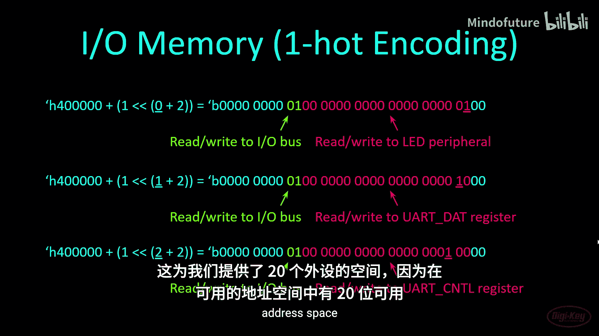

寻址方案如下所示：
*   `0x00000000` 到 `0x003FFFFC`：寻址到RAM。iCEstick只有8KB块RAM空间，其中2KB留给通用寄存器，因此实际RAM只有6KB。
*   `0x00400000` 到 `0x00480000`：是我们的I/O页面。它使用独热编码方案与外设通信。
*   `0x00800000` 到 `0x00BFFFFC`：用于SPI Flash。

以下是寻址LED外设的示例。如果我们向地址 `0x00400004` 写入数据，就是向LED硬件驱动器写入。驱动器接收数据并执行相应操作（例如，点亮或熄灭LED）。

以下是UART数据寄存器和控制寄存器地址的示例。注意，地址不是顺序递增的，它使用独热编码方案，即地址空间中每次只有一个比特位为高电平。虽然这损失了大量潜在的外设地址空间，但节省了许多逻辑单元，因为驱动器每次只需检查一个比特位来确定是否被寻址。

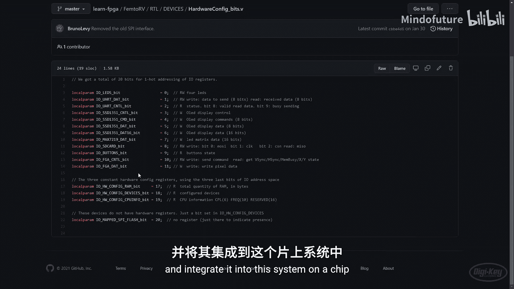

在我们的C代码中，我们通过以下公式计算外设地址：
`基地址 + (1 << (2 + 外设编号))`
其中基地址为 `0x400000`。这为我们提供了20个外设的空间，因为可用地址空间中有20个比特位。

## 配置外设槽位

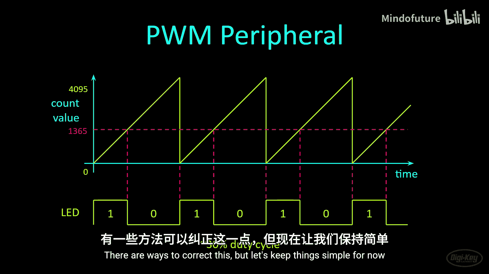

如果我们查看Femto RV的RTL代码中的 `devices` 目录，可以找到一个 `hardware_config_bits.v` 文件。打开它，可以看到已经为iCEstick预定义了12个外设。我们禁用了其中一些不需要的（如OLED控制器、LED矩阵和SD卡），以节省宝贵的逻辑单元。最后三个外设槽位被具有常量值的寄存器占用，因此也无法使用。这为我们留下了第12到第16号槽位来添加自己的外设。

我们将制作一个简单的硬件PWM驱动器来控制其中一个LED的亮度，并将其集成到这个片上系统中。

## PWM外设工作原理

以下是PWM外设的工作方式：
1.  我们将创建一个简单的12位计数器，持续从0计数到4095，然后重置为0并重新开始。
2.  我们创建一个寄存器来存储PWM值。通过向一个I/O内存地址写入数据，我们可以写入这个寄存器。
3.  例如，假设我们向该寄存器写入值1365。现在，每当计数器值小于此值时，LED点亮；当计数器值等于或大于此值时，LED熄灭。在这个PWM值下，LED将具有约30%的占空比。只要LED切换速度足够快，在人眼看来它就是稳定发光的。由12MHz时钟控制的计数器速度足够快。
4.  注意，这是一个简单的PWM方案，意味着我们可以将LED完全关闭，但无法将其完全点亮。有方法可以修正这一点，但为了简单起见，我们暂时保持现状。

## 创建PWM硬件外设

以下是我的PWM硬件外设代码。如果你一直跟随本系列，这里的大部分内容应该看起来很熟悉。

```verilog
module pwm #(parameter COUNTER_BITS = 12) (
    input wire clk,
    input wire io_wstrb,
    input wire io_select,
    input wire [31:0] io_wdata,
    output reg led
);
    reg [COUNTER_BITS-1:0] counter = 0;
    reg [COUNTER_BITS-1:0] pwm_count = 0;

    always @(posedge clk) begin
        if (io_select && io_wstrb) begin
            pwm_count <= io_wdata[COUNTER_BITS-1:0];
            counter <= 0;
        end else begin
            counter <= counter + 1;
        end

        if (counter < pwm_count) begin
            led <= 1;
        end else begin
            led <= 0;
        end
    end
endmodule
```

代码解析：
*   我定义了PWM模块，并给它一个参数 `COUNTER_BITS` 来定义PWM计数器的最大计数值位数（默认为12位，即计数从0到4095）。
*   有一个时钟输入（全局12MHz时钟）和一个写选通信号 `io_wstrb`。这是由SOC硬件控制的信号。每当硬件确定我们正尝试写入特定地址时，此线会拉高或产生一个时钟周期的高脉冲，这让我们知道正在尝试写入一个内存地址（可能不是真实内存地址，而是硬件驱动器）。我们需要查看该选通信号是否变高，以便寄存 `io_wdata` 中的值。
*   仅当 `io_select` 线也为高时，此驱动器才接受数据。因此，当 `io_wstrb` 变高且 `io_select` 为高时，我们需要寄存该数据。
*   理想情况下控制4个LED，但实际上我只控制其中一个。你可以根据需要扩展以控制多个LED。
*   有一些内部寄存器元素来帮助我们记录计数值以及从代码设置的已寄存的最大计数值。
*   在每个时钟周期，首先检查 `io_select` 和 `io_wstrb` 线是否为高。如果是，则获取IO总线上传入的 `io_wdata` 数据，并将其存储在此驱动器内部的 `pwm_count` 寄存器中。同时重置计数器。
*   如前所述，我将这些寄存器元素初始化为某个值。这在Yosys中有效，但并非对所有综合工具或所有FPGA都有效。对于Yosys和iCE40 FPGA，这种初始化设置可以节省引入复位线的需要。
*   如果 `io_select` 和 `io_wstrb` 线不为高，计数器将持续递增。一旦达到最大值，它将回滚到0。
*   我们将当前计数值与从IO总线写入代码设置的最大计数值进行比较。如果当前计数值小于该值，则驱动LED为高电平；如果当前计数值大于或等于该值，则LED为低电平。这就产生了我们之前看到的快速闪烁效果，从而可以控制占空比，进而控制LED的亮度或电机的速度。

## 仿真测试

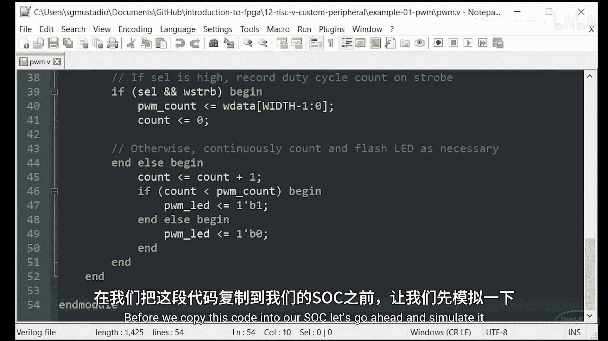

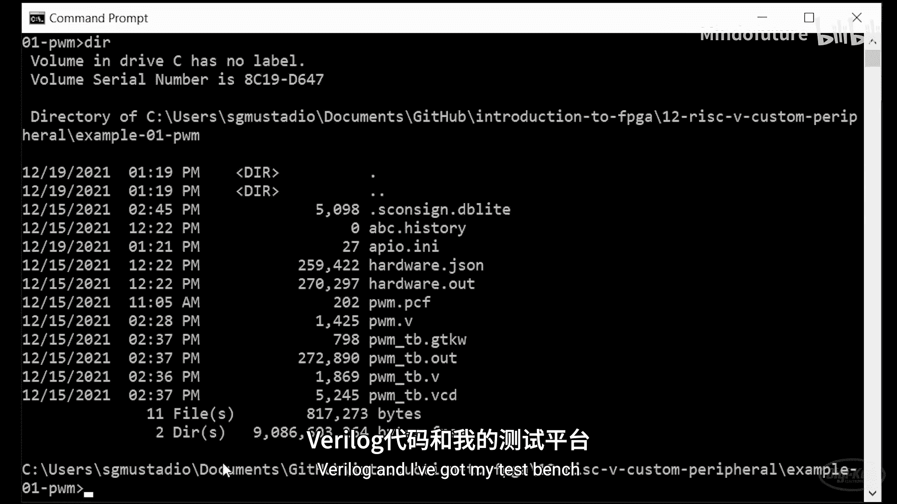

在将代码复制到SOC之前，我们先进行仿真。我位于PWM文件夹中，里面有我的Verilog代码和测试平台。

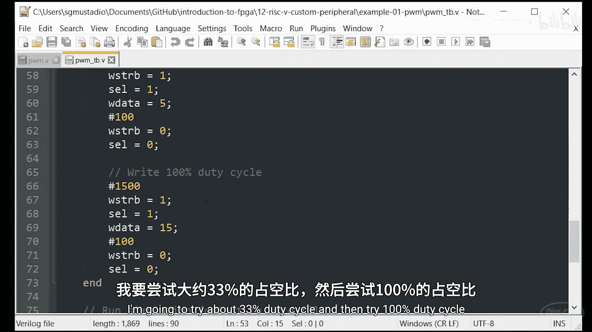

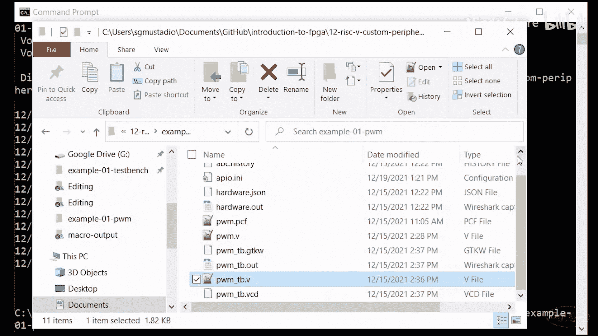

测试平台实例化了驱动器。我将写入0%占空比，设置 `strobe` 和 `select` 为1，向PWM计数寄存器写入0。然后等待几个时钟周期，将 `strobe` 和 `select` 线设回0。让其运行一段时间后，尝试约33%的占空比，然后是100%的占空比，最后结束仿真。

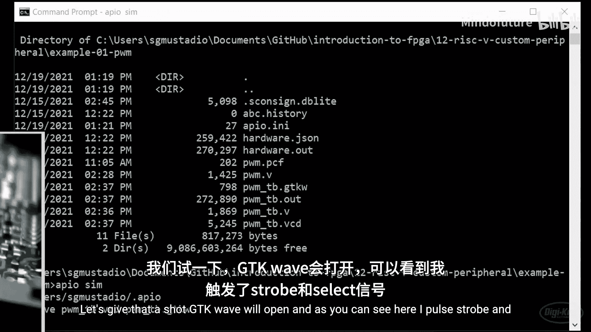

运行仿真后，GTKWave打开。可以看到，我脉冲了 `strobe` 和 `select`，这应该导致 `wdata` 被写入驱动器寄存器，并且计数器在这个时钟周期重新开始。果然，LED在整个过程中保持恒定的低电平。

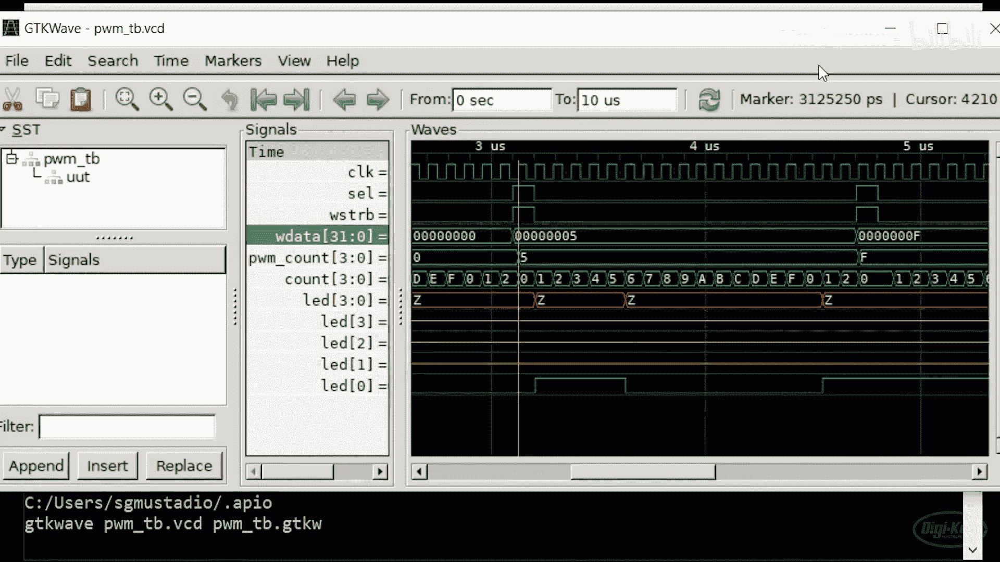

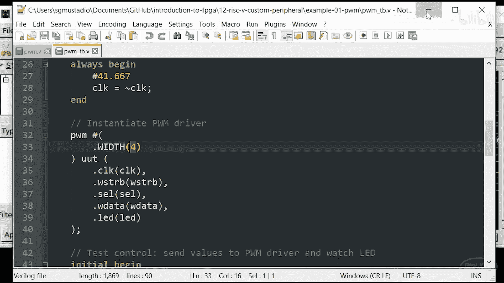

然后，我向PWM计数值写入5。需要说明的是，在测试平台中，我没有使用全部12位，而是只用了4位，这样我们可以用更少的时钟周期看到PWM工作，而不必等待4000个时钟周期。因此，它应该只计数到十六进制F。

果然，可以看到计数器计数到十六进制F，然后回滚到0。然而，一旦达到5，LED熄灭，并保持熄灭状态，直到计数器值从0回滚到1，然后再次点亮。

同样，如果我们将F设置为PWM值，理想情况下LED应常亮。但由于我们的方案限制，在这个简单的PWM控制器中，它将有一个周期是熄灭的。对于我的目的来说，这可以接受。有方法可以制作更精确的PWM驱动器，实现常关和常开，但这需要额外的硬件。为了简单起见，我对LED不能始终完全点亮感到满意。

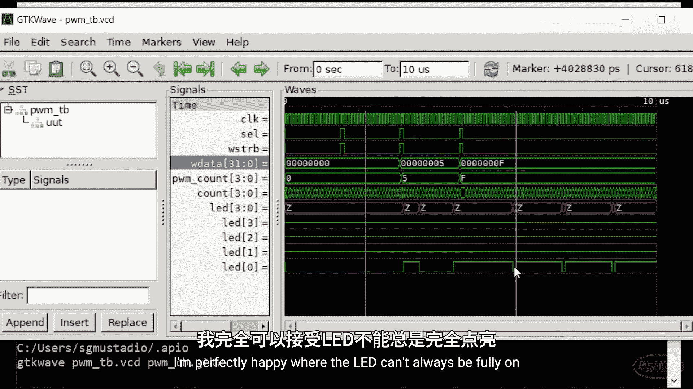

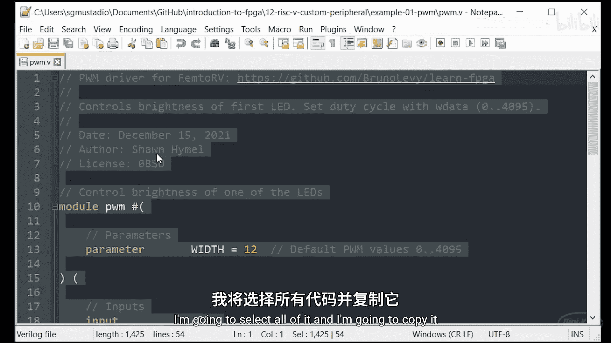

## 集成到SOC

现在，让我们将PWM代码集成到系统中。

首先，打开PWM代码，复制全部内容。然后，进入Raspberry Pi上的 `learn_fpga` 目录，再进入 `femtorv`，接着进入 `rtl` 下的 `devices` 目录。这里可以找到所有硬件外设的源代码。我创建自己的文件 `pwm.v`，并将所有代码粘贴进去，保存。

返回 `femtorv` 目录，我们需要开始集成刚创建的PWM驱动器。首先，修改 `hardware_config_bits.v` 文件。在这里，我添加自己的本地参数，定义PWM驱动器的地址位置。第12到16号槽位可用，因此让我们使用第12号作为地址。我将其定义为可写地址，可以向该寄存器写入占空比值以控制LED亮度。保存文件。

接下来，编辑大的SOC Verilog文件（`femtorv_soc.v`）。首先，在包含列表中包含我的PWM驱动器，就像在C/C++中使用头文件一样，这会在综合设计时将代码复制到此处。然后，向下找到端口列表。我寻找 `NRV_IO_LEDS` 并复制类似的内容。注意，这并不完全健壮，因为我们只能有LED或PWM定义之一。如果你尝试同时实例化两者，可能会失败，因为我们将使用D1、D2、D3、D4命名法来驱动这些引脚。你可能需要做一些额外的工作以使两者协同工作。但在这里，我只想用PWM控制板载LED（本例中仅一个），所以它们会有一点冲突。我们将在其他地方创建 `NRV_IO_PWM` 定义，但请注意，如果包含它，将启用D1到D5输出。如前所述，这些与LED定义冲突，因此你只能启用LED或PWM之一。你可以自由寻找允许你同时使用两者的方法，但现在我们只使用PWM驱动器，不实例化LED驱动器。

向下滚动，找到处理器实例化的地方。我将在此处添加PWM驱动器的实例化代码。你可以查看上面的内容，了解其他驱动器是如何实例化的。我将遵循他们的注释风格。查看其他外设（如SD卡）的实例化方式，可以了解连接方式和参数设置。这基本上是在一个 `ifdef` 块内实例化你的驱动器。

同样，我们将说如果定义了 `NRV_IO_PWM`，就实例化我们的PWM模块。即使12是默认值，我们也在此处明确为计数器位宽定义12。我们将其命名为 `pwm`，并连接一些线路：时钟连接到主时钟信号，写选通线连接到 `io_wstrb`，选择线连接到 `io_select[12]`（因为我们定义了 `IO_PWM_BIT` 参数为12），写入数据通过 `io_wdata` 总线完成，LED输出连接到 `D1`。完成后，关闭 `ifdef` 块。

你可能会问，我们如何避免错误地写入此外设？如果第12位是1，无论我们写入什么地址，都会选中此外设。这与 `io_wstrb` 位有关。如果我们向上滚动，就在SPI Flash部分之后，可以看到写选通线仅在 `mem_write_strobe` 为高且内存地址的 `io` 位为高时才变高。这是通过查看第22位实现的，正如我们之前在幻灯片中看到的，只有当尝试写入I/O页面时，第22位才为高。如果为低，意味着我们正尝试写入RAM或SPI Flash。通过这个与门，我们就知道正在写入的是硬件外设，而不是RAM或闪存。

保存文件。

如前所述，我们需要确保LED硬件驱动器不与新的PWM外设冲突。为此，进入 `configs` 目录，然后找到我们特定板子的配置文件。在这里，可以看到 `NRV_IO_LEDS` 被定义了，我们将其注释掉，使其不被定义。然后添加我们自己对 `IO_PWM` 的定义。这将启用我们在 `femtorv_soc.v` 文件中定义的PWM驱动器。保存此文件。

现在，运行 `make icestick` 命令。这将编译（综合）所有内容，然后将其上传到我的iCEstick。请确保从 `femtorv` 目录调用此命令。这将需要几分钟时间进行综合、布局布线和上传。

## 软件端设置

希望一切已正确综合并上传到FPGA。现在，是时候处理软件端了。虽然我们添加了从硬件端控制驱动器所需的所有钩子，但软件端还缺少一些东西。

例如，如果你查看 `femtorv32.h` 头文件，可以看到里面定义了许多内容，包括帮助你和所有硬件外设正确地址空间通信的IO宏。你可以更新此头文件以包含PWM外设地址，但我不打算这样做，因为我将直接在C语言中手动完成所有操作。

退出头文件，进入 `femtorv32` 项目空间，我在这里保存该处理器的所有软件。可以看到我们在上一节创建的 `blinky` 项目。我将创建一个 `pwm_test` 项目并进入该目录。

和上次一样，我将包含那个 `femtorv32.h` 头文件，并定义 `main` 函数。我将创建一个永久循环，在其中从0计数到4095。这里我使用了魔数，你真正应该做的是在 `femtorv32.h` 头文件中，根据你在PWM设备驱动器或外设中创建的内容来定义一些常量。

我将向这个地址空间写入计数值。这个地址空间是 `0x404000`。简单说明一下，这应该是我的基地址 `0x400000` 加上 `(1 << (2 + 12))` 的结果，其中12是我们在写入PWM外设时要查找的比特位。计算器验证：`0x400000 + (1 << 14) = 0x404000`，这就是我们得到的值。

我将延迟一毫秒，以便你能实际看到LED在亮度增加之前保持其亮度片刻。我们将缓慢增加LED的亮度，然后将其降回零，基本上创建一个亮度上的锯齿波。最后返回0以符合 `int main` 函数要求，尽管程序永远不应执行到这里。

保存文件。我们需要创建Makefile，并包含那个 `makefile.include` 文件，它应该包含我们使用RISC-V编译器构建此程序所需的所有内容，然后将其上传到iCEstick的闪存。

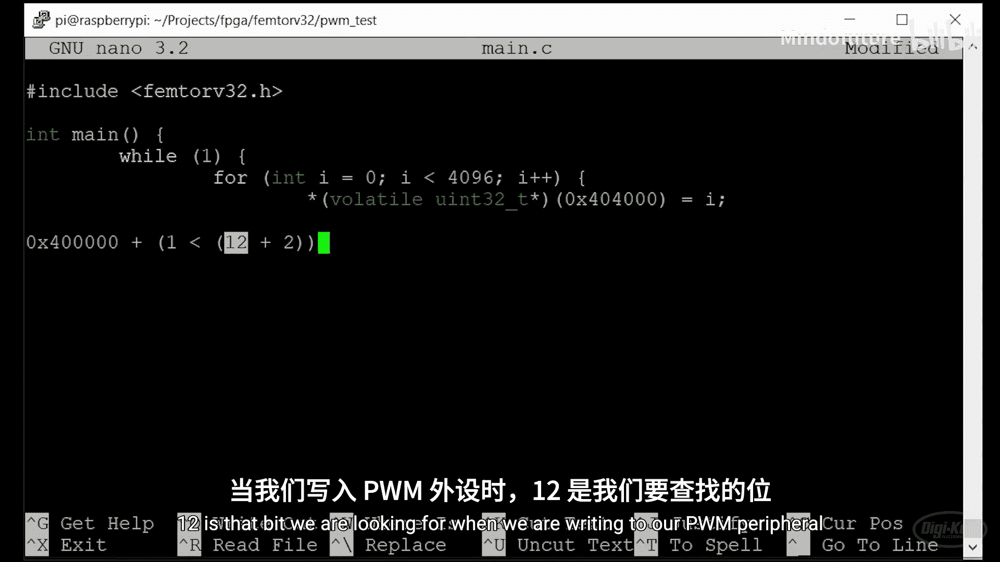

保存Makefile。输入命令 `make main.prog`，意思是构建 `main.c` 文件（`main` 是我们的目标），然后 `.prog` 表示将其上传到iCEstick。这应该很快。

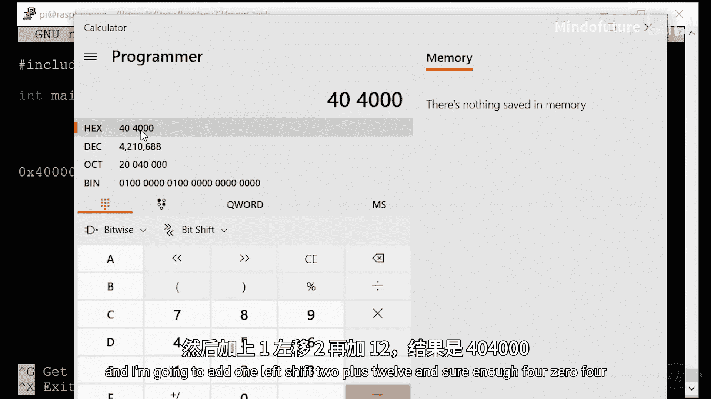

## 测试结果

检查一下是否工作。运气好的话，我们应该看到LED慢慢变亮，然后在重置为关闭状态之前达到最亮。因为它需要经过超过4000个步骤，每个步骤等待一毫秒，所以完成一个周期可能需要超过四秒钟。

## 总结

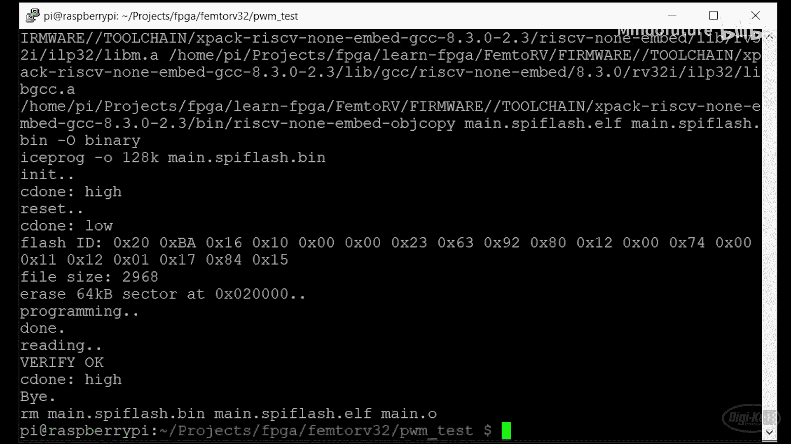

本节课中，我们一起学习了如何为Femto RV RISC-V处理器创建并集成一个自定义的硬件PWM外设。我们从理解其内存寻址机制开始，然后设计了PWM驱动器的工作原理，编写并仿真了Verilog代码，最后将其集成到SOC中并编写了控制软件。这个过程涵盖了硬件描述、仿真验证、系统集成和软件驱动开发的基本流程。

本节没有具体的挑战任务，但我鼓励你尝试为Femto RV处理器制作自己的硬件外设。这可以是任何你想要的东西，比如SPI驱动器或控制NeoPixel的东西。如果你用Femto RV做了很酷的东西，或者实现了此外设，欢迎在Twitter上标记我们。


本FPGA入门系列到此结束。希望你在观看视频和尝试挑战时和我制作它们时一样开心。感谢你坚持到最后。一如既往，祝你 hacking 愉快！