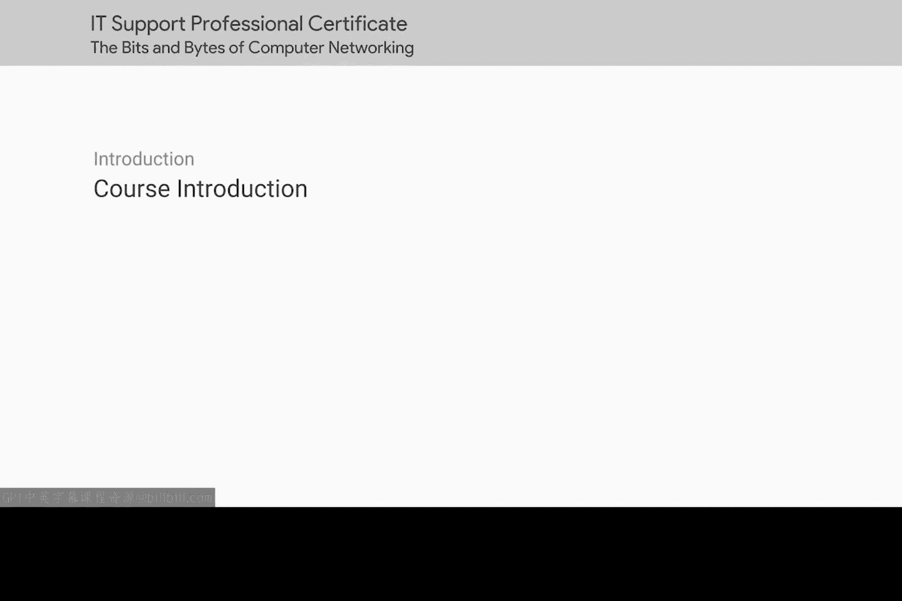
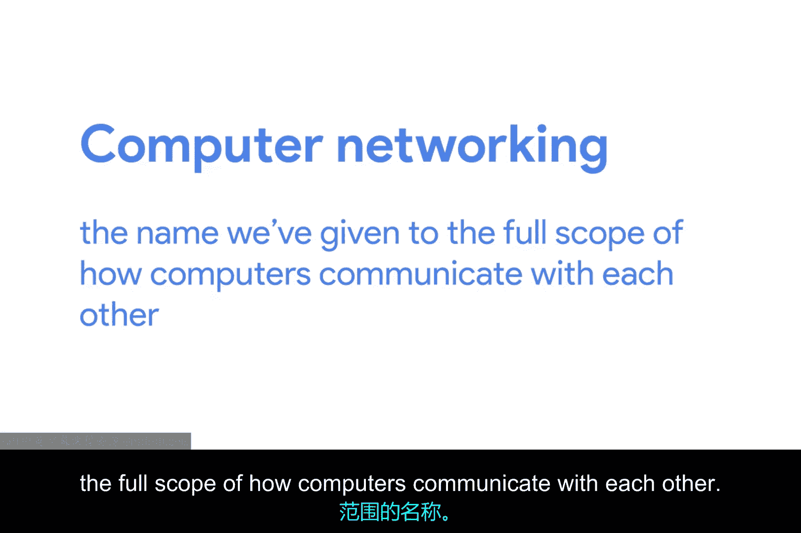

# 001：网络基础与协议模型 🖧

在本节课中，我们将学习计算机网络的基本概念，了解计算机如何像人类一样进行通信，并介绍用于描述网络通信层次的核心模型。理解这些基础是成为一名优秀IT支持专家的关键。

## 课程介绍与讲师背景

大家好，我是维克多·埃斯科维多，目前是一名企业运营工程师。我对IT的热情始于九岁时，父亲带回了家里的第一台电脑。他是一名机械工程师，用电脑辅助CAD工作。这是我第一次接触计算机，后来我意识到可以在上面安装新软件，包括电脑游戏。在摆弄电脑的过程中，我对其工作原理越来越感兴趣，并开始打开机箱一探究竟。

我通过反复试验进行学习，虽然当时无法确切解释，但我发现所有部件协同工作的机制非常迷人。回想起来，这些经历为我后来的职业生涯埋下了种子。但在我成长的环境中，上大学和追求职业发展并非主流话题。作为第一代墨西哥裔美国人，我认识的人里很少从事科技行业。我的学校和家庭资源有限，父母虽然鼓励我努力学习计算机，但他们自身缺乏相关经验，无法在大学或科技职业规划上给我具体建议。

我决定上大学并尝试计算机科学专业，以满足我对计算机底层工作原理的好奇心。我发现，拥有这些基础知识让我能够理解IT职业中一些更高级的重要概念。在校期间，我在一家本地小公司找到了第一份IT工作。至今，我已从事IT行业12年，其中最近7年在谷歌工作。

目前，我负责管理公司大型内部IT项目的部署工作。我运用从最初服务台角色中积累的知识，确保理解我的工作对用户和各种支持团队的影响。作为一名企业运营工程师，我需要理解变更对公司基础设施的影响。因此，网络技能至关重要。我不仅需要了解应用程序在单个系统上的运行方式，还需要理解它们如何与公司内外的所有其他系统交互。

## 计算机如何通信

现在大家对我有了一些了解，让我们深入探讨网络的“比特与字节”。

计算机之间的通信与人类非常相似。以口头交流为例：两个人需要说同一种语言，并且能够听到对方，才能有效沟通。如果环境嘈杂，一方可能需要请另一方重复。如果一方对解释的概念理解不深，可能会要求澄清。一个人可能只对另一个人说话，也可能对一群人说话。通常，对话会有问候和结束的方式。

关键在于，人类在交流时遵循一系列规则，计算机也必须如此。计算机为了正确通信而必须遵循的这一套既定标准，就叫做**协议**。

**计算机网络**是我们赋予计算机之间如何进行完整通信的总称。网络涉及确保计算机能够“听到”彼此、它们说的协议能被其他计算机理解，以及它们能重传未完全送达的消息——就像人类交流一样。

## 网络分层模型

有多种模型用于描述计算机网络中不同层次的作用。在本课程中，我们选择**TCP/IP五层模型**。我们也会提及另一个主要的网络模型——拥有七层的**OSI模型**。

如果你不知道这些模型是什么或它们如何工作，不用担心，我们将在整个课程中深入探讨这些主题。

了解这类分层模型对于学习计算机网络至关重要，因为网络本身就是一个高度分层的事务。每一层的协议承载着其上层的协议，以便将数据从一处传送到另一处。

可以这样思考：用于将数据从网络电缆一端传送到另一端的协议，与用于将数据从地球一端传送到另一端的协议完全不同。但是，要使互联网和企业网络以现有方式工作，这两种协议必须同时协同工作。

## 学习目标与重要性

有时，互联网或企业网络上的计算机在尝试相互通信时会遇到问题，而通常需要IT支持专家来解决这些问题。这就是理解计算机网络如此重要的原因。

到本课程结束时，你将能够：
*   解释我们模型的全部五个层次。
*   描述计算机如何确定消息的发送目的地。
*   说明DNS和DHCP等网络服务的工作原理。
*   使用强大的工具来帮助诊断网络问题。

你准备好了吗？让我们开始深入学习吧。

## 总结

本节课我们一起学习了计算机网络的基本类比，了解了协议在通信中的核心作用，并初步认识了TCP/IP和OSI这两种关键的网络分层模型。我们还了解了学习这些知识对于IT支持工作的重要性，并明确了本课程的学习目标。在接下来的章节中，我们将对这些分层模型进行深入剖析。