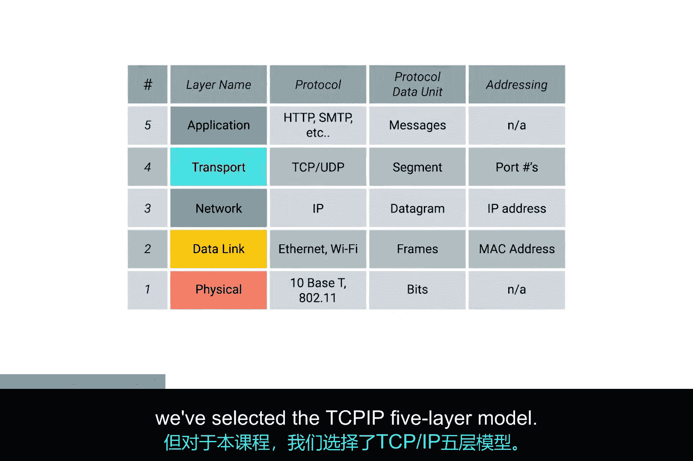

# 002：课程介绍 🖥️

在本节课中，我们将学习计算机网络的“比特与字节”基础。课程将介绍计算机网络的基本概念、通信协议以及用于描述网络通信的分层模型。通过学习，你将理解计算机如何像人类一样遵循规则进行通信，并初步认识网络模型的重要性。

## 讲师介绍

我是维克多·埃斯科维多，现任企业运营工程师。我对信息技术的热情始于九岁时，父亲带回家第一台电脑。他是一名机械工程师，使用电脑辅助CAD工作。这是我首次接触计算机，后来我意识到可以在上面安装新软件，包括电脑游戏。

在摆弄电脑的过程中，我对其工作原理越来越感兴趣，最终开始打开机箱查看内部结构。我发现有些部件可以拆卸，甚至有些本不该拆卸。通过不断的尝试和错误，我学到了很多。虽然当时无法确切解释，但我对各个部件如何协同工作的机制感到着迷。回想起来，这些经历为我后来的职业生涯播下了种子。

在我成长的环境中，上大学和追求职业发展并非普遍谈论或强烈鼓励的话题。作为第一代墨西哥裔美国人，我认识的人中很少有人投身科技行业。我的朋友和家人主要关注高中毕业和确保有工作，并未过多考虑长远的职业生涯。我的学校资源有限，无法提供许多技术课程。尽管父亲从事机械工程，但电脑对他而言只是一个工具，如同铣尺或锤子。

我的父母鼓励我努力学习并探索计算机领域，但他们自身缺乏相关经验，无法在大学或科技职业规划上给我具体建议。当我决定上大学时，我选择了计算机科学专业，以满足我对计算机更基础工作原理的好奇心。我意识到，拥有这些基础知识能让我更好地理解IT职业中一些重要的高级概念。

在校期间，我在一家本地小公司获得了第一份IT工作。至今，我已从事IT行业12年，其中最近7年在谷歌工作。目前，我负责管理公司大型内部IT项目的部署工作。我将早年担任服务台角色时积累的知识应用于此，以确保理解我的工作如何影响用户及各支持团队。

作为企业运营工程师，我的职责是理解变更对公司基础设施的影响。因此，网络技能至关重要。我不仅需要理解应用程序在单个系统上的运行方式，还需了解它们如何与公司内乃至外部的所有其他系统交互。

## 计算机网络基础

既然你对我有了一些了解，现在让我们深入探讨计算机网络的“比特与字节”。

计算机之间的通信与人类非常相似。以口头交流为例：两个人需要说同一种语言，并且能够听到对方，才能有效沟通。如果环境嘈杂，一方可能要求另一方重复。如果一方对解释的概念理解不深，可能会要求澄清。一个人可能只与另一个人对话，也可能对一群人讲话。通常，对话会有问候和结束的方式。

关键在于，人类在交流时遵循一系列规则，计算机也必须如此。计算机为了正确通信而必须遵循的这一套既定标准，称为**协议**。**计算机网络**是我们赋予计算机之间如何进行完整通信范畴的名称。网络涉及确保计算机能够“听到”彼此、它们使用的协议能被其他计算机理解，以及在信息未完全送达时重复发送消息——正如人类的交流方式。

## 网络模型简介

有多种模型用于描述计算机网络中不同层次的作用。在本课程中，我们选择**TCP/IP五层模型**。我们也会提及另一个主要的网络模型——**OSI模型**，它包含七层。

如果你不知道这些模型是什么或它们如何工作，请不要担心。我们将在整个课程中深入探讨这些主题。

了解这类分层模型对于学习计算机网络至关重要，因为网络本身就是一个高度分层的事务。每一层的协议承载其上层协议的数据，以便将数据从一处传输到另一处。可以这样想：用于将数据从网络电缆一端传输到另一端的协议，与用于将数据从地球一端传输到另一端的协议完全不同。但要使互联网和企业网络以现有方式工作，这两种协议必须同时协同工作。

有时，互联网或企业网络上的计算机在尝试相互通信时会遇到问题。通常，这需要IT支持专家来解决。这就是理解计算机网络如此重要的原因。

## 课程目标

在本课程结束时，你将能够解释我们模型的全部五层。不仅如此，你还将能够描述计算机如何确定消息的发送目的地，以及DNS和DHCP等网络服务如何工作。你还将学会使用强大的工具来帮助诊断网络问题。

你准备好了吗？让我们开始深入学习吧。

## 总结

本节课我们一起学习了课程的整体介绍和计算机网络的基本概念。我们认识了讲师维克多·埃斯科维多，了解了他的职业背景。我们明确了计算机通信依赖于**协议**，并初步接触了**TCP/IP五层模型**和**OSI模型**这两个关键的网络分层模型。最后，我们了解了本课程的学习目标，即掌握网络各层原理、关键服务（如DNS、DHCP）以及网络故障诊断工具。下一节，我们将开始深入探索网络模型的第一层。