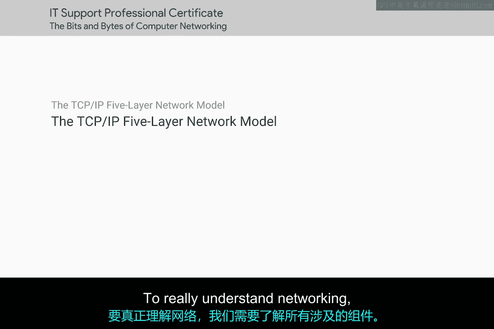
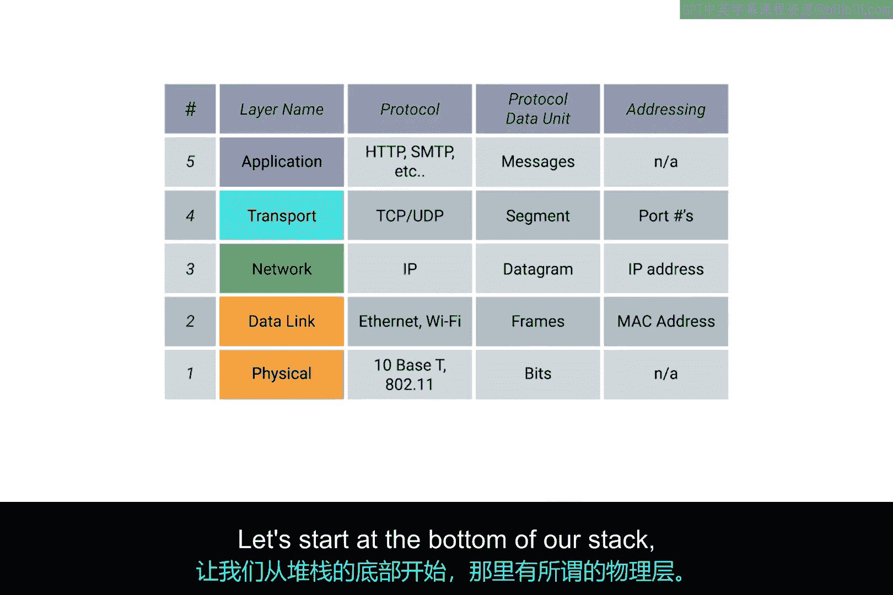
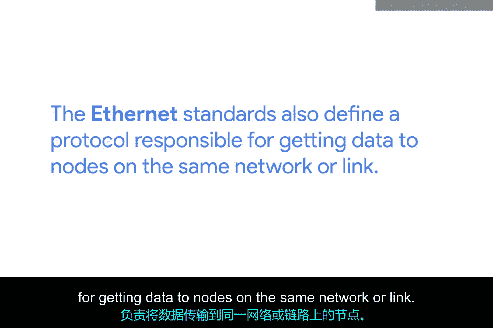
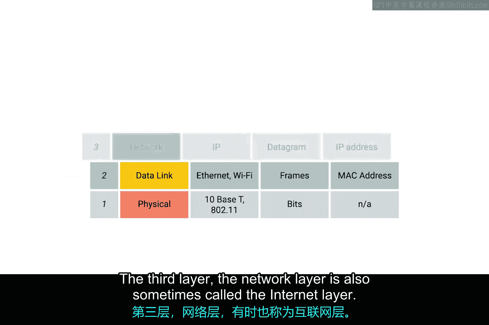
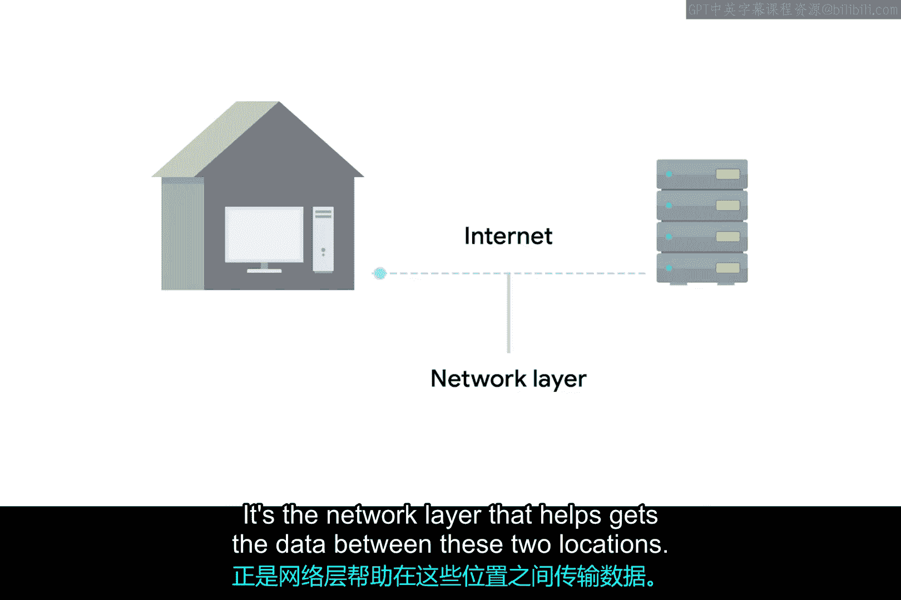
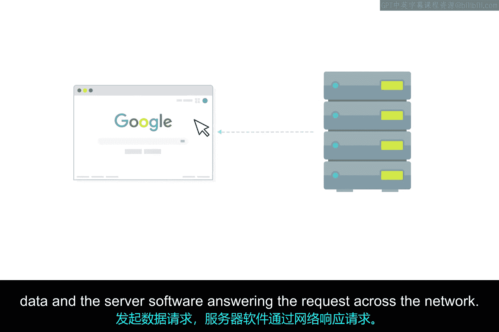
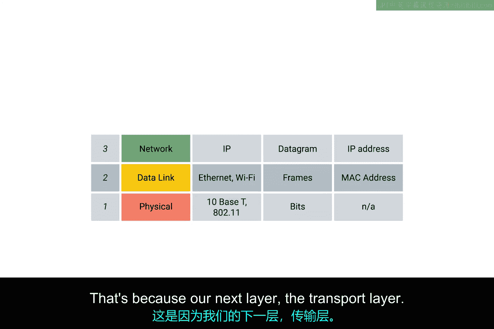
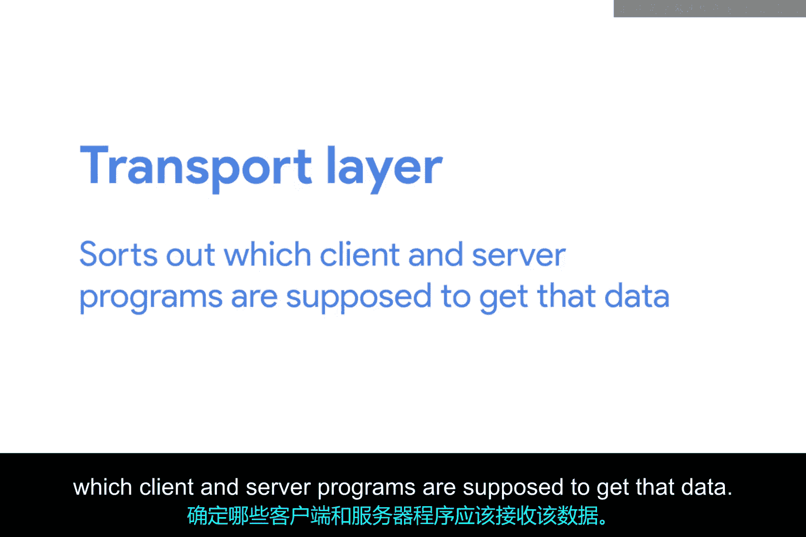
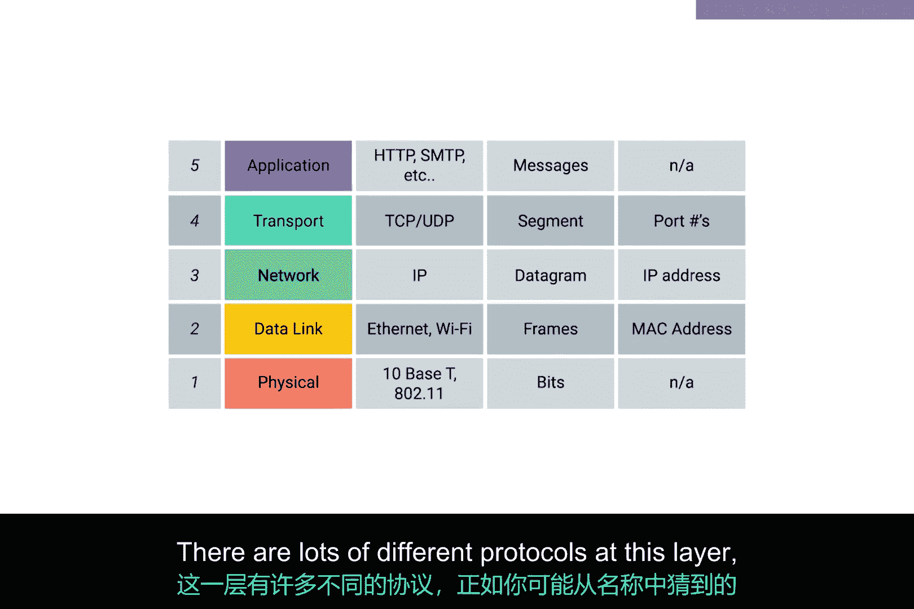
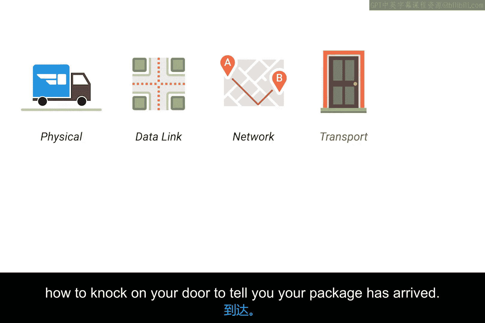

# 003：TCP/IP五层网络模型 🏗️

在本节课中，我们将要学习一个用于理解网络通信的核心框架——TCP/IP五层模型。我们将从最底层的物理连接开始，逐层向上，了解每一层的作用和关键协议，从而理解数据是如何在网络中传输的。

要真正理解网络，我们需要了解所有相关的组件。这包括连接设备之间的线缆，以及设备之间用于通信的协议。有多种模型可以帮助解释网络设备如何通信，但在本课程中，我们将重点介绍一个五层模型。学完本课后，你将能够识别和描述每一层及其作用。

## 物理层 🔌

让我们从模型的最底层开始，即物理层。

物理层正如其名。它代表了连接计算机的物理设备。这包括网络线缆的规格、连接设备在一起的接头，以及描述信号如何通过这些连接发送的规范。

## 数据链路层 🔗

上一节我们介绍了物理连接，本节中我们来看看数据链路层。

我们模型的第二层被称为数据链路层。有些资料会称此层为网络接口层或网络接入层。在这一层，我们引入了第一个协议。物理层关注的是线缆、接头和信号发送，而数据链路层则负责定义一种通用的方式来解释这些信号，以便网络设备能够通信。

以下是数据链路层的关键点：
*   存在许多协议，但最常见的是以太网协议，尽管无线技术正变得越来越流行。
*   除了规定物理层属性，以太网标准还定义了一个负责将数据传送到同一网络或链路上的节点的协议。

## 网络层 🌐

接下来，我们进入负责跨网络通信的第三层。

第三层，网络层，有时也被称为互联网层。正是这一层允许不同的网络通过称为路由器的设备相互通信。

以下是网络层的核心概念：
*   通过路由器连接在一起的网络集合称为互联网网络，其中最著名的就是互联网。
*   数据链路层负责数据跨越单个链路，而网络层则负责数据跨越一系列网络的传递。
*   当你家庭网络上的设备与互联网上的服务器通信时，正是网络层帮助数据在这两个位置之间传递。
*   这一层最常用的协议是IP，即互联网协议。IP是互联网和全球大多数小型网络的核心。

## 传输层 🚚

上一节我们了解了数据如何跨网络路由，本节中我们来看看传输层如何确保数据到达正确的应用程序。

网络软件通常分为客户端和服务器两类，客户端应用程序发起数据请求，服务器软件通过网络响应请求。一个节点可能同时运行多个客户端或服务器应用程序。例如，你可以在电脑上同时运行电子邮件程序和网页浏览器这两个客户端应用程序，而你的电子邮件和网页服务器可能运行在同一台服务器上。那么，电子邮件如何进入你的邮件应用，而网页如何进入你的浏览器呢？这是因为我们的下一层——传输层。

虽然网络层负责在两个独立节点之间传递数据，但传输层负责理清哪些客户端和服务器程序应该接收这些数据。

以下是传输层的关键协议：
*   当你听到网络层协议IP时，你可能想到了TCP/IP这个常见短语。这是因为第四层（传输层）最常用的协议被称为TCP，即传输控制协议。
*   其他传输协议也使用IP来传输数据，包括一种称为UDP（用户数据报协议）的协议。
*   两者之间的最大区别在于，TCP提供了确保数据可靠传递的机制，而UDP没有。

现在，重要的是要知道网络层（在我们的例子中是IP）负责将数据从一个节点传送到另一个节点。同时，请记住传输层（主要是TCP和UDP）负责确保数据到达运行在这些节点上的正确应用程序。

## 应用层 📦

最后但同样重要的是，第五层被称为应用层。

这一层有许多不同的协议，正如你从名称中猜到的那样，它们是特定于应用程序的协议。用于让你浏览网页或收发电子邮件的协议就是一些常见的例子。应用层中的协议对你来说最为熟悉，因为它们可能是你以前直接交互过的，即使你没有意识到。

你可以将各层想象成包裹递送的不同方面：
*   物理层是送货卡车和道路。
*   数据链路层是送货卡车如何从一个十字路口反复到达下一个十字路口。
*   网络层确定需要走哪些道路才能从地址A到达地址B。
*   传输层确保送货司机知道如何敲你的门来告诉你包裹已送达。
*   应用层则是包裹本身的内容。

## 总结 📝

本节课中我们一起学习了TCP/IP五层网络模型。我们从底层的物理连接（物理层）开始，学习了如何解释信号进行本地通信（数据链路层），然后了解了数据如何跨越不同网络进行路由（网络层）。接着，我们探讨了如何确保数据被交付到正确的应用程序（传输层），最后认识了直接为用户服务的各种应用协议（应用层）。理解这个分层模型是诊断和解决网络问题的基础。