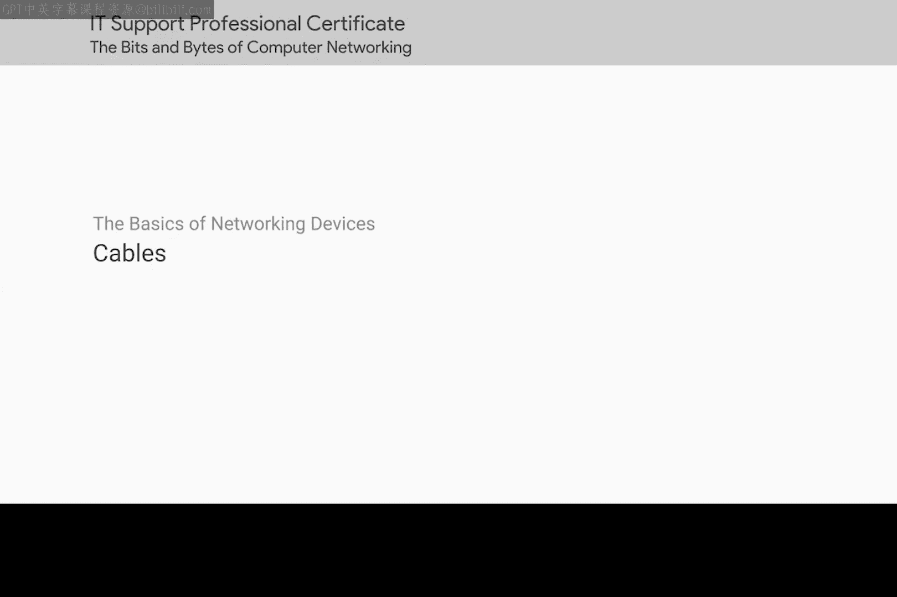
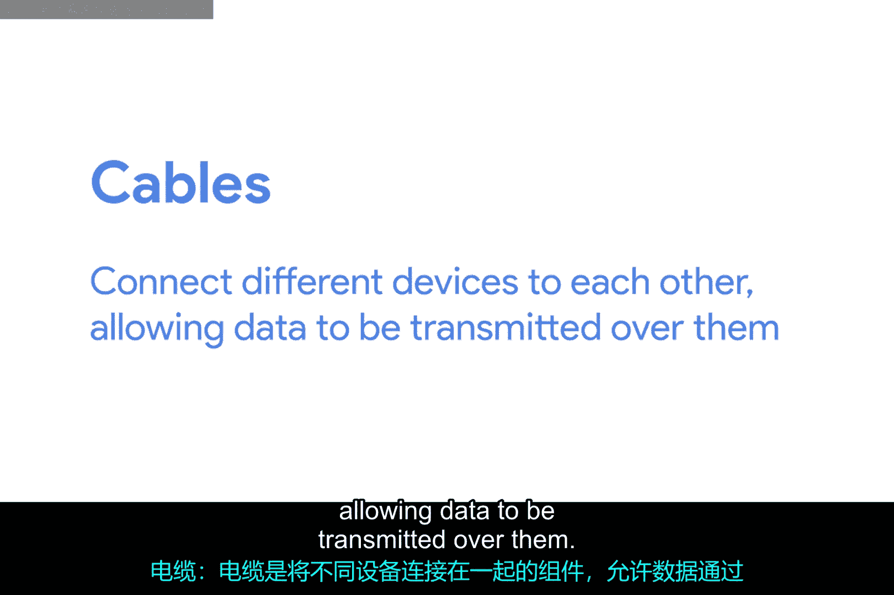
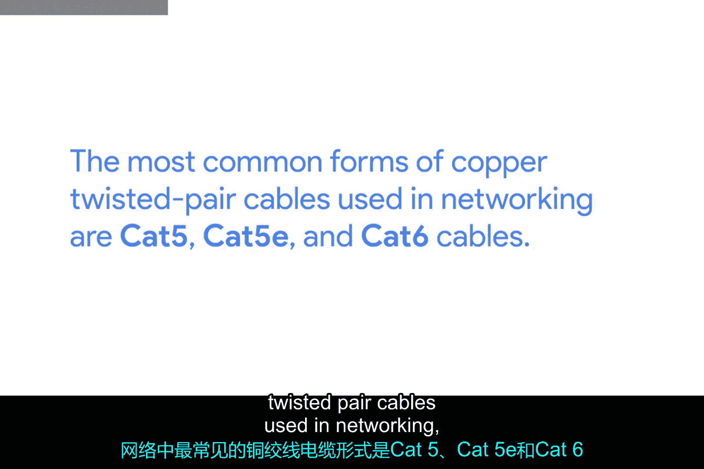
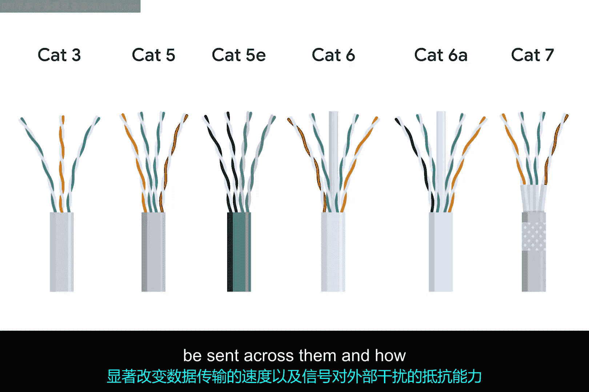
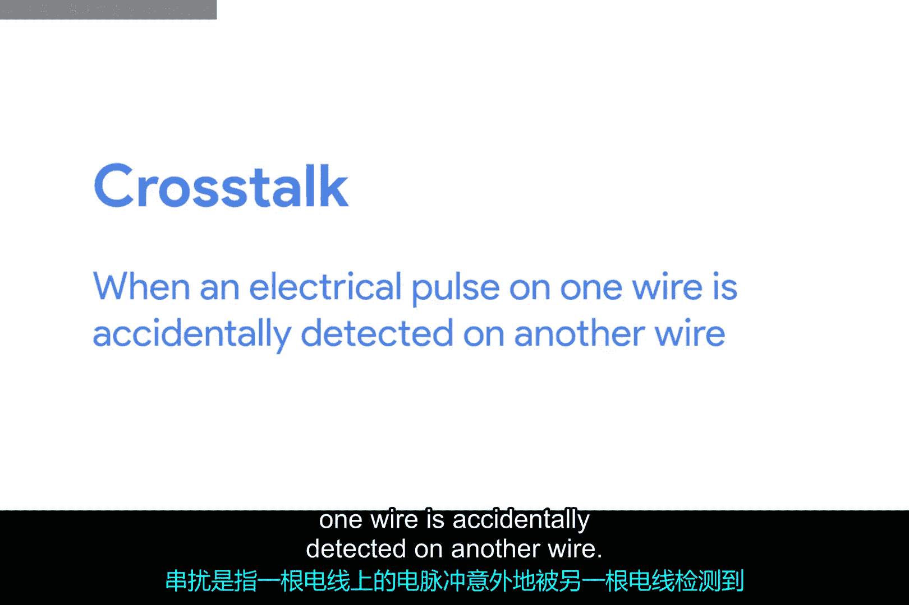
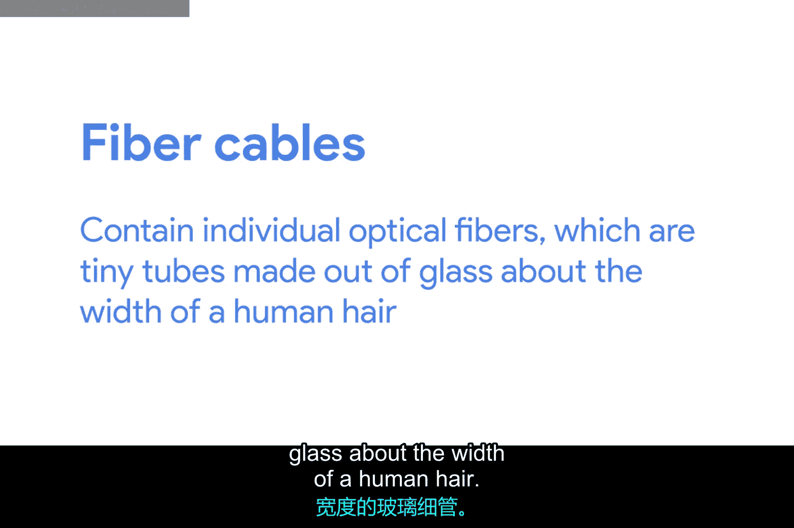
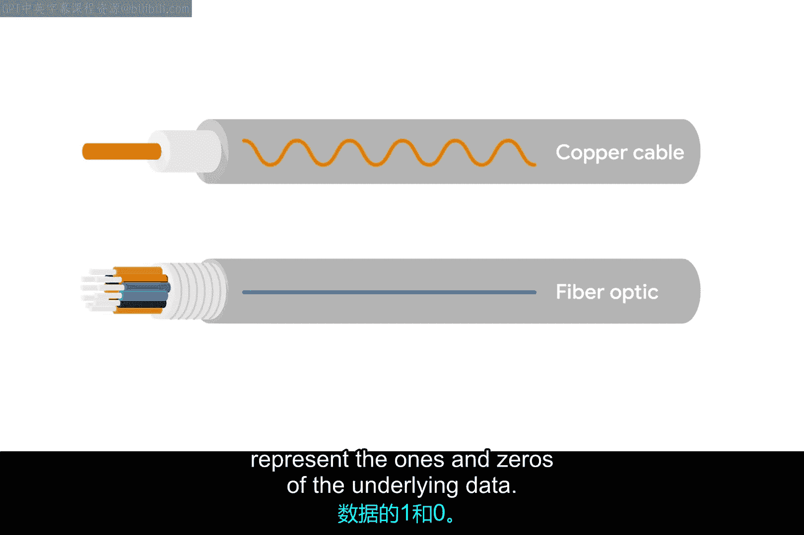
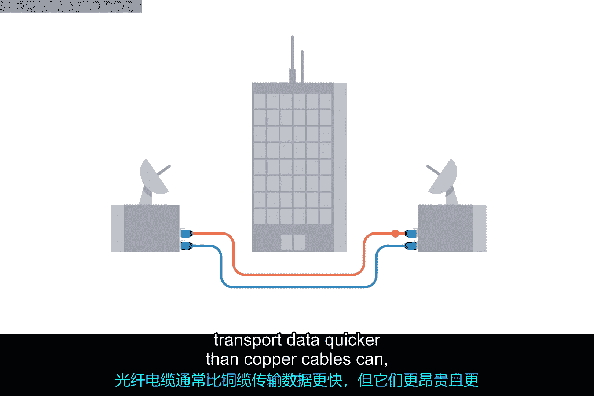

# 005：网络电缆与设备 🖧

在本节课中，我们将学习计算机网络中用于连接设备、传输数据的核心物理组件——电缆与设备。你将能够识别并描述不同类型的网络电缆和网络设备，这是IT支持专业人员日常工作的基础。

## 网络电缆：连接的基础

上一节我们介绍了网络通信的基本概念，本节中我们来看看实现这些连接的具体物理媒介——电缆。电缆连接不同的设备，使数据能够在它们之间传输。

当今使用的大多数网络电缆可分为两大类：**铜缆**和**光纤**。

### 铜缆：最常见的网络电缆

铜缆是最常见的网络电缆形式。它们由包裹在塑料绝缘层内的多对铜线组成。

你可能已经知道，计算机使用二进制进行通信，人们用1和0来表示。发送设备通过改变铜线两端的电压范围来传输二进制数据。接收端的系统能够将这些电压变化解释为二进制的1和0，进而转换成不同形式的数据。

以下是网络中最常见的几种双绞线铜缆：

*   **Cat 5**：较老的型号，已基本被Cat 5e和Cat 6取代。
*   **Cat 5e**：对内部结构进行了改进，以减少串扰。
*   **Cat 6**：遵循更严格的规范，数据传输更快、更可靠，但在高速下最大传输距离较短。

这些类别（Cat 5、Cat 6）具有不同的物理特性，例如铜线对的绞合次数，这导致了不同的可用长度和传输速率。从外部看，它们看起来差不多，内部结构肉眼看来也非常相似。重要的是，这些电缆内部双绞线的排列方式差异，会极大地影响数据传输速度以及信号抵抗外界干扰的能力。

**Cat 5e**电缆之所以基本取代了旧的**Cat 5**电缆，是因为其内部结构减少了**串扰**。串扰是指一条电线上的电脉冲意外地被另一条电线检测到，导致接收端无法理解数据，从而造成网络错误。

更高级的网络协议有方法检测丢失的数据并请求重传，但这当然会占用更多时间。**Cat 5e**电缆更高质量的规格使其需要重传数据的可能性降低。这意味着在相同时间内，平均可以传输更多数据。

**Cat 6**电缆遵循更严格的规范以避免串扰，因此价格更昂贵。**Cat 6**电缆比**Cat 5e**电缆能更快、更可靠地传输数据，但由于其内部结构，在更高速度下使用时，最大传输距离较短。

### 光纤：高速远距离传输

第二种主要的网络电缆形式是**光纤**，即光纤电缆的简称。

光纤电缆内含独立的光纤，这是由玻璃制成的微小细管，宽度大约相当于人类头发。与使用电压的铜缆不同，这些玻璃管可以传输光束。光纤电缆使用光脉冲来表示底层数据的1和0。

光纤有时专门用于存在大量来自外部源的电磁干扰的环境，因为这种干扰会影响通过铜缆发送的数据。光纤电缆通常能比铜缆更快地传输数据，但它们更昂贵且更脆弱。

光纤还能在比铜缆长得多的距离上传输数据，而不会遭受潜在的数据丢失。现在你对光纤电缆的优缺点有了更多了解，但请记住，你在计算机数据中心遇到光纤电缆的可能性远大于在办公室或家中。

## 网络设备：构建网络的枢纽

了解了连接介质后，我们来看看管理和引导这些数据流的设备。许多不同的网络设备用于帮助计算机之间正确通信。

以下是几种关键的网络设备及其功能：

*   **集线器**：一种物理层设备，将多个网络设备连接在一起。它接收数据包后，会简单地将其复制并发送到所有连接的设备。
*   **交换机**：一种更智能的数据链路层设备，也用于连接多个设备。但交换机会学习哪些设备连接在它的哪个端口上，并能将数据包只发送到目标设备，这使网络更高效。
*   **路由器**：一种网络层设备，顾名思义，它负责在网络之间路由数据。路由器帮助数据包在互连的网络中找到最佳路径，例如在你家的网络和互联网之间。
*   **调制解调器**：一种设备，负责在数字信号和模拟信号之间进行转换。它使数字数据能够通过模拟线路（如电话线或电缆线）进行传输，是连接广域网（如互联网）的关键设备。

## 总结

本节课中我们一起学习了计算机网络的基础物理组件。我们探讨了两种主要的网络电缆：使用电信号的**铜缆**（包括Cat 5e, Cat 6）和使用光信号的**光纤**，并比较了它们的特性与应用场景。接着，我们介绍了构建网络所需的几种核心设备：**集线器**、**交换机**、**路由器**和**调制解调器**，了解了它们在网络不同层级中的作用。掌握这些电缆和设备的区别与用途，是理解和维护现代计算机网络的重要一步。