# 006：集线器与交换机 🖧

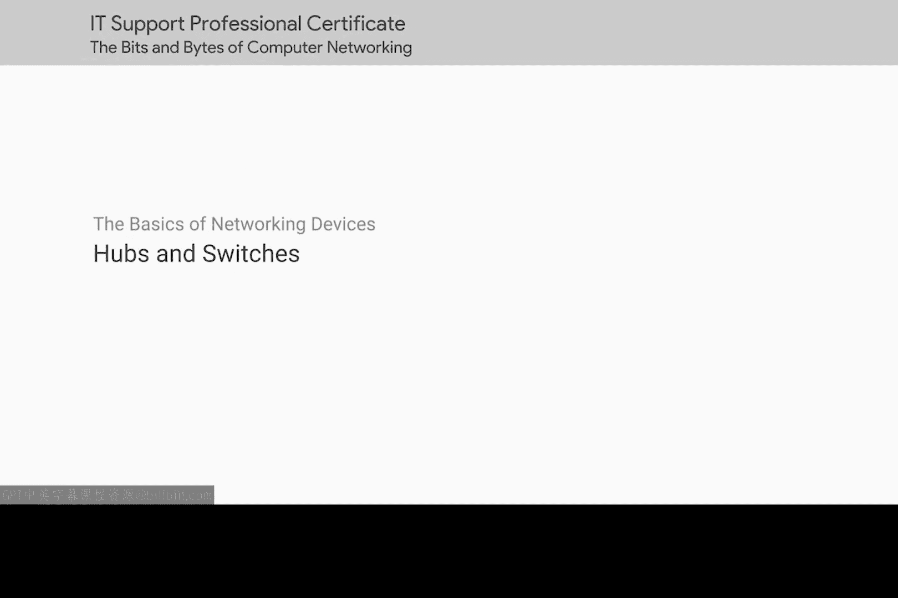

在本节课中，我们将学习两种基础的网络设备：集线器和交换机。我们将了解它们的工作原理、区别以及各自在网络通信中扮演的角色。

## 网络设备概述

在本视频和下一个视频中，我们将对网络设备进行概述。几乎每一位IT专家都需要定期与这类设备打交道。

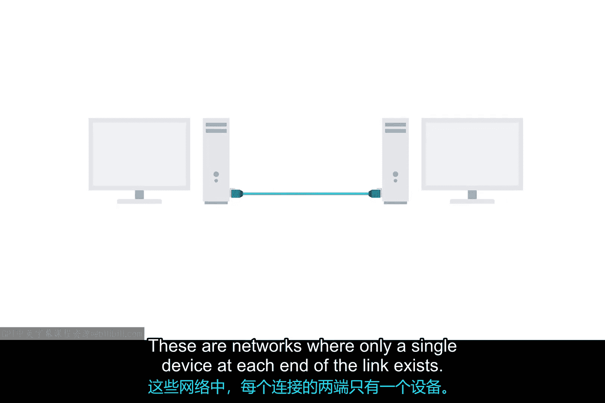

## 点对点连接

首先，我们来了解点对点网络连接。**电缆**允许你建立点对点的网络连接。在这种网络中，链路的每一端只存在一个设备。

## 从点到多点：集线器的引入

虽然点对点连接有其用途，但在一个拥有数十亿计算机的世界里，它们并不十分实用。幸运的是，存在允许许多计算机相互通信的网络设备。这些设备中最简单的是**集线器**。

集线器是一种物理层设备，允许同时连接多台计算机。连接到集线器的所有设备最终会同时与其他所有设备通信。由连接到集线器的每个系统来决定传入的数据是否是发送给自己的，如果不是则忽略它。

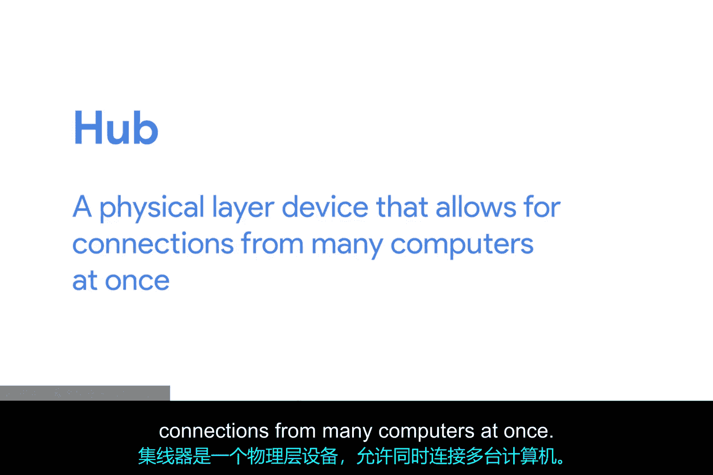

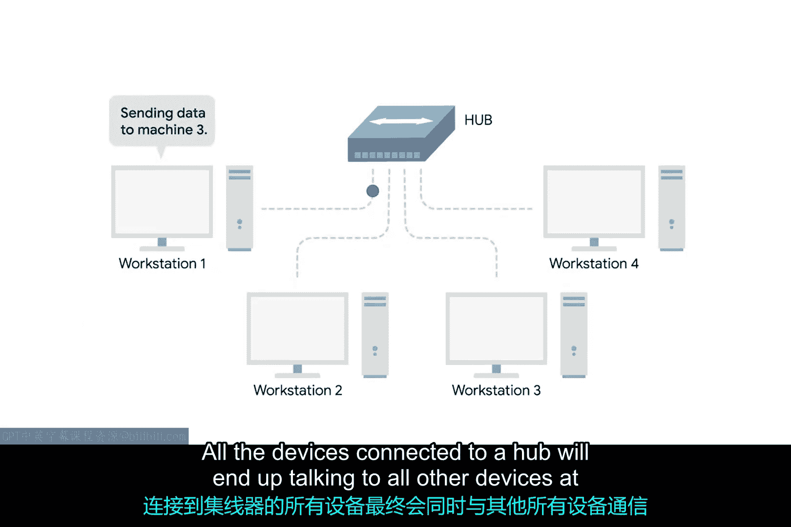
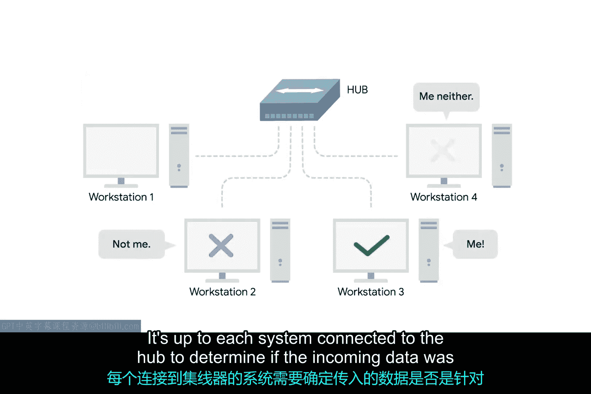

## 理解冲突域

上一节我们介绍了集线器的工作方式，本节中我们来看看它带来的问题。这种方式会在网络上产生大量“噪音”，并形成所谓的**冲突域**。

冲突域是一个网络段，其中一次只能有一个设备进行通信。

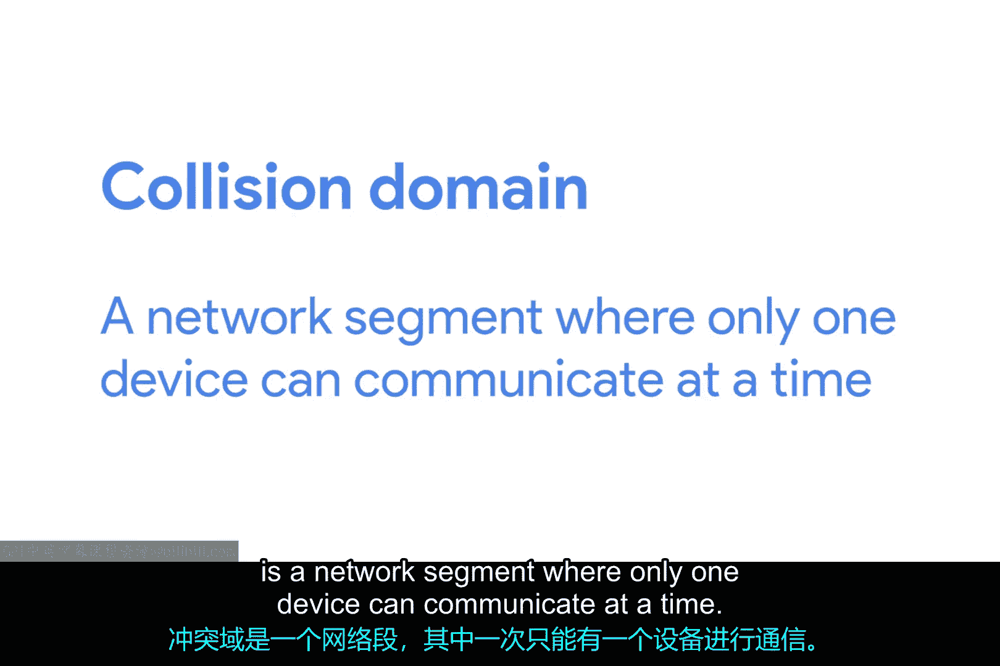

以下是其工作原理：
如果多个系统试图同时发送数据，电缆上传输的电脉冲会相互干扰。这导致这些系统必须等待一个“安静”的时段，然后才能再次尝试发送数据。

这确实会减慢网络通信速度，也是集线器如今相当罕见的主要原因。它们今天主要是一种历史产物。

## 更优的解决方案：网络交换机

既然集线器效率低下，那么连接多台计算机的更常见方式是使用一种更复杂的设备，称为**网络交换机**，最初被称为交换式集线器。

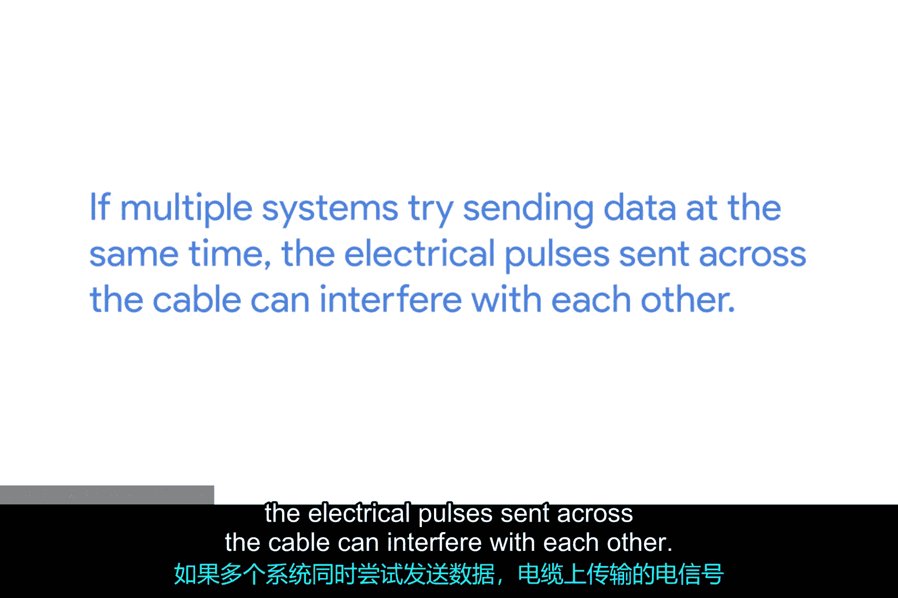

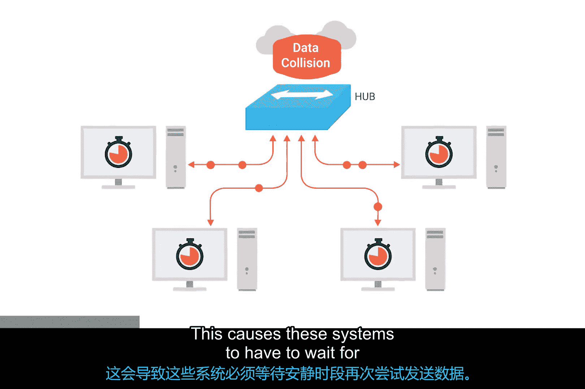

## 交换机的工作原理

交换机与集线器非常相似，因为你可以将许多设备连接到它上面进行通信。区别在于，集线器是**第1层（物理层）**设备，而交换机是**第2层（数据链路层）**设备。

这意味着交换机实际上可以检查网络中传输的以太网协议数据的内容，确定数据是发送给哪个系统的，然后只将数据发送给那一个系统。

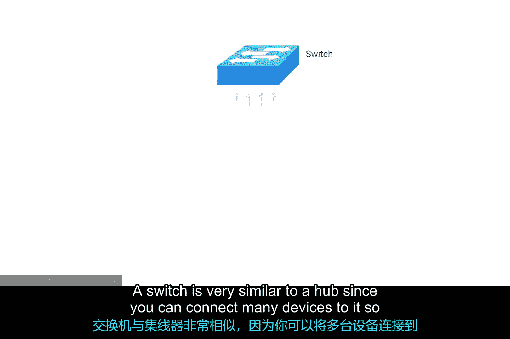
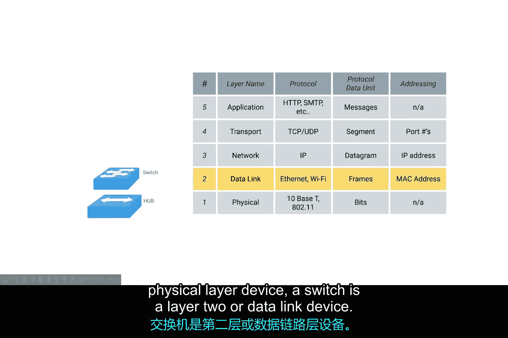
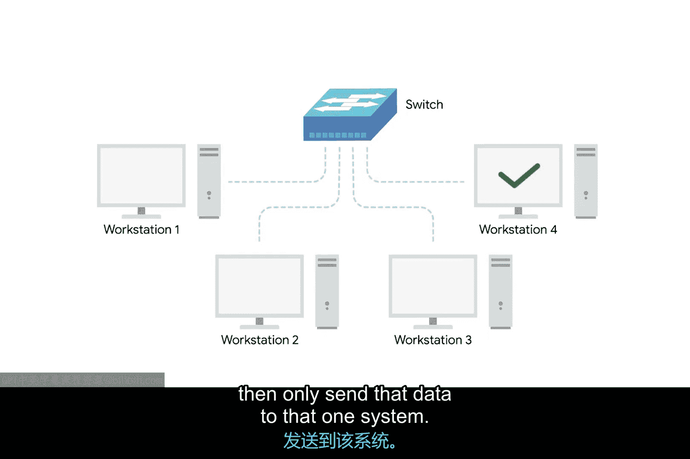

## 交换机的优势

这种工作方式减少甚至完全消除了网络上的冲突域大小。如果你猜测这将导致更少的重传和更高的整体吞吐量，那么你是正确的。

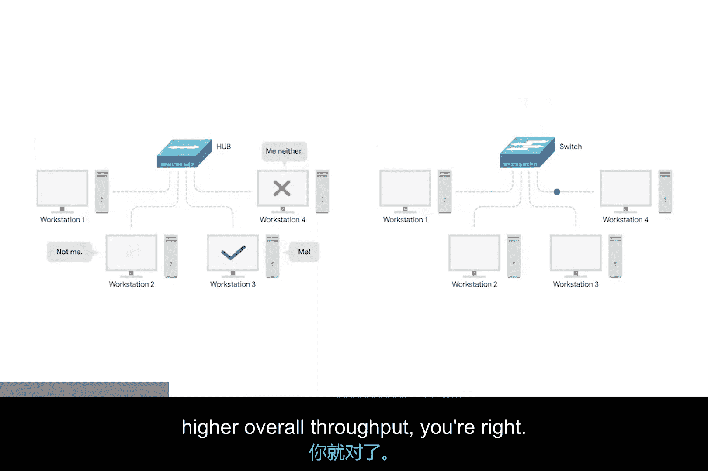

## 总结

本节课中我们一起学习了两种关键的网络连接设备。我们了解了**集线器**作为简单的物理层广播设备，会创建**冲突域**，导致效率低下。而**交换机**作为更智能的数据链路层设备，能够定向转发数据，极大地提升了网络效率和性能。理解这两者的区别是构建和维护高效网络的基础。