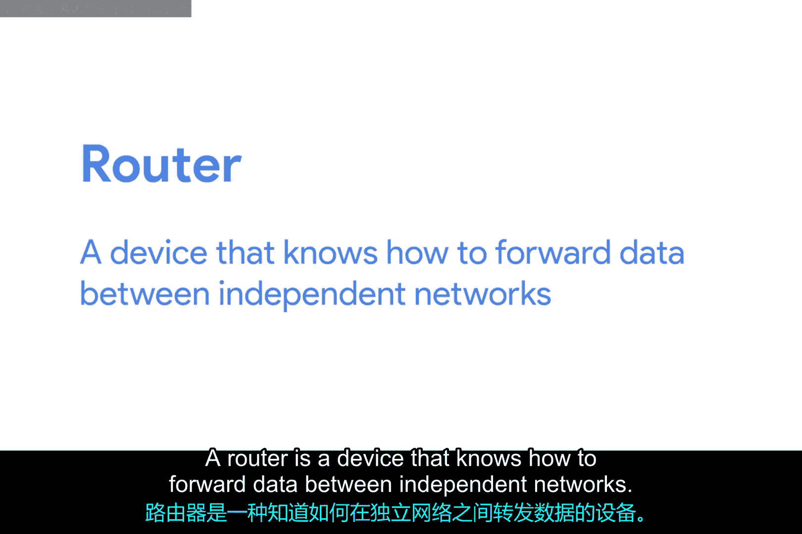
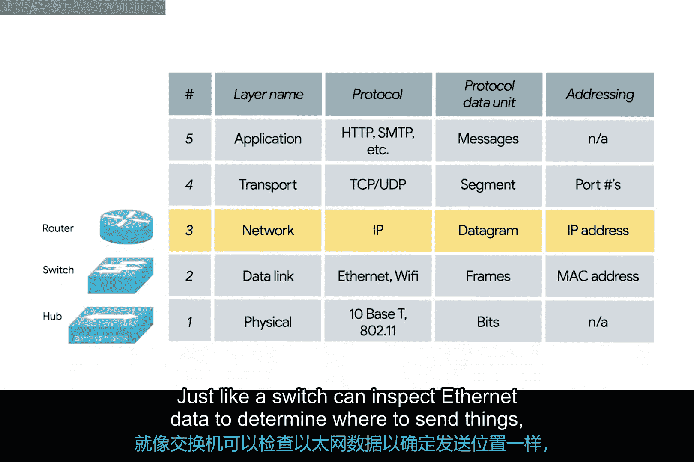
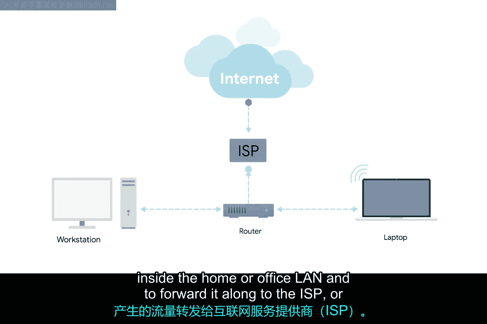
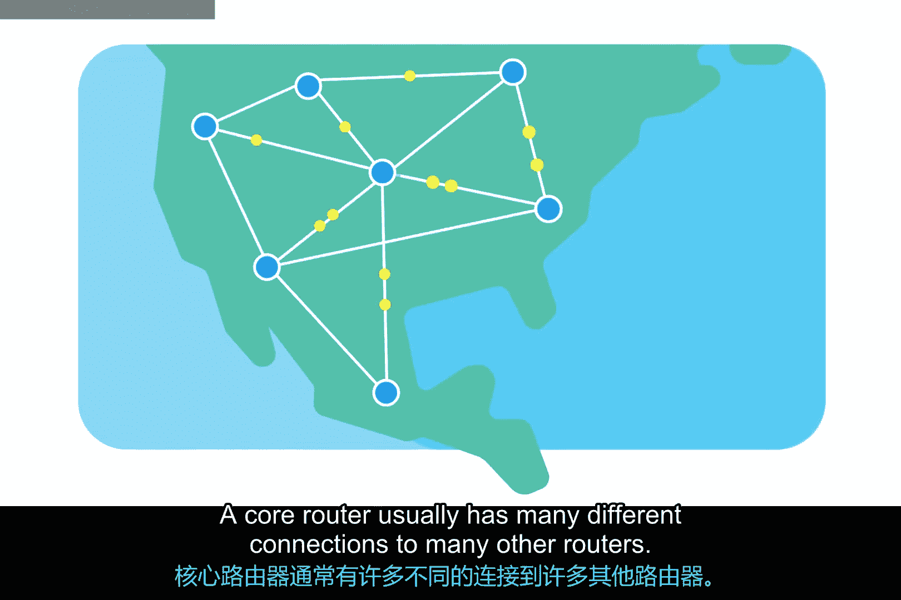
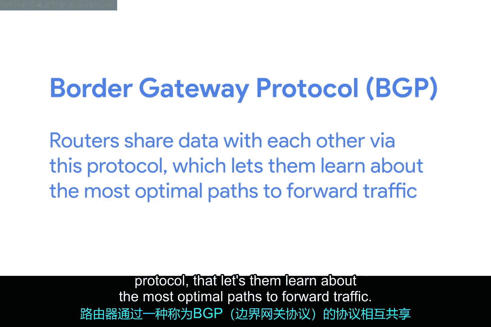

# 007：路由器的工作原理 🚦

在本节课中，我们将要学习网络中的一个关键设备——路由器。我们将了解它与集线器、交换机的区别，以及它在连接不同网络、特别是构成互联网骨干中所扮演的核心角色。

上一节我们介绍了用于连接单个网络内计算机的设备，如集线器和交换机。本节中我们来看看如何实现不同网络之间的通信。

## 路由器的基本概念

集线器和交换机是用于连接**单个网络**内计算机的主要设备，这个网络通常被称为**局域网**。

但我们经常需要向其他网络上的计算机发送或接收数据，这时就需要路由器登场。

**路由器**是一种知道如何在**独立网络**之间转发数据的设备。集线器是**第1层**设备，交换机是**第2层**设备，而路由器则在**第3层**——网络层运行。

就像交换机可以检查以太网数据以确定发送目的地一样，路由器可以检查**IP数据**以确定发送路径。路由器内部存储着路由表，这些表包含了如何在全世界众多不同网络之间路由流量的信息。

## 家用路由器与核心路由器

最常见的路由器类型是用于家庭网络或小型办公室的路由器。这些设备的路由表通常并不详细。

这类路由器的目的主要是将源自家庭或办公室局域网的流量，转发给**互联网服务提供商**。

一旦流量到达ISP，一种复杂得多的路由器就会接管。这些**核心路由器**构成了互联网的骨干，直接负责我们每天在互联网上发送和接收数据的方式。

核心ISP路由器不仅要处理比家庭或小型办公室路由器多得多的流量，还必须在决定流量发送路径时应对复杂得多的局面。

## 路由器如何协同工作

核心路由器通常与许多其他路由器建立多种不同的连接。

路由器之间通过一种称为**BGP**的协议共享数据，这使它们能够了解转发流量的最优路径。

## 数据包的旅程

当你打开网页浏览器加载一个网页时，计算机和网络服务器之间的流量可能已经经过了数十台不同的路由器。

互联网规模极其庞大且复杂，而路由器正是将流量引导至正确目的地的全球向导。

---

本节课中我们一起学习了路由器的基础知识。我们了解到路由器是工作在**网络层**、负责在不同网络间转发数据的设备。它通过检查**IP地址**和查询内部**路由表**来决定数据包的下一跳。从简单的家用路由器到构成互联网骨干的复杂核心路由器，它们共同协作，通过**BGP**等协议共享路由信息，确保了全球数据的顺畅流通。理解路由器是理解互联网如何工作的关键一步。