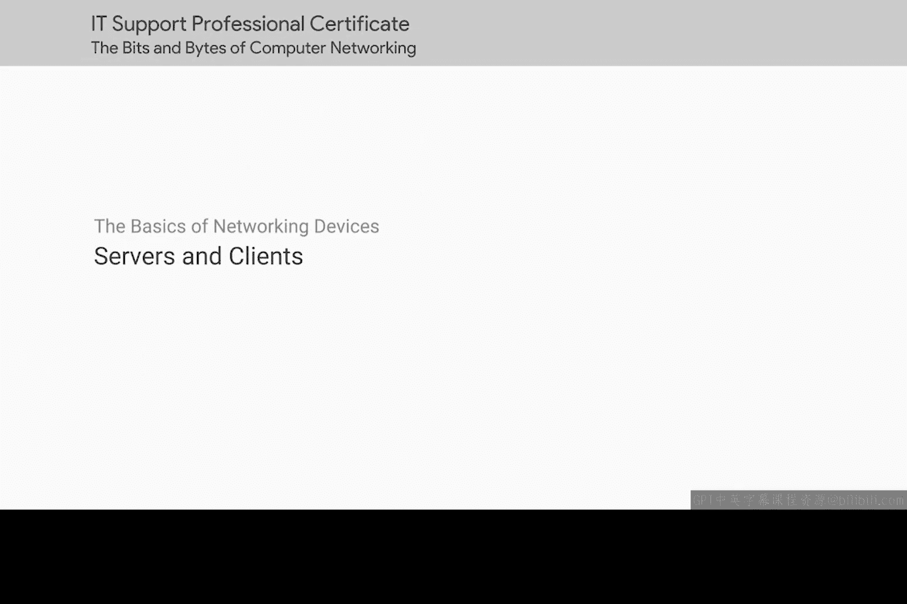
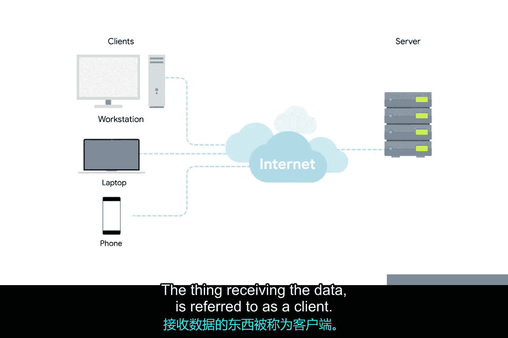
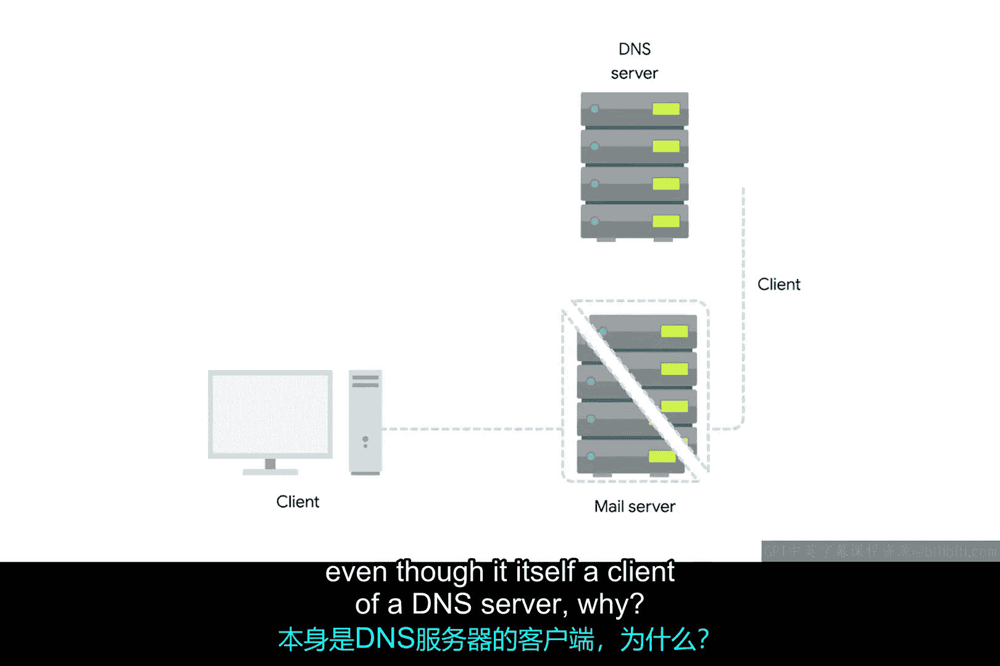

# 008：服务器与客户端 🖥️

在本节课中，我们将要学习计算机网络中的两个核心概念：服务器与客户端。你将了解它们的基本定义、相互关系以及在实际网络环境中的角色。

## 概述

我们之前学习的所有网络设备，无论是位于同一房间还是相距数千英里，其存在的根本目的都是为了让计算机能够相互通信。我们通常将这些设备称为节点，并将继续沿用这个称呼。然而，理解服务器和客户端的概念同样至关重要。

## 服务器与客户端的定义

理解服务器最简单的方式是：**服务器是向请求方提供数据的一方**。接收数据的一方则被称为**客户端**。

## 角色的动态性

虽然我们经常讨论节点作为服务器或客户端的角色，但我们的定义使用了“一方”这样宽泛的词语，这是因为不仅节点可以成为服务器或客户端。在同一节点上运行的独立计算机程序也可以互为服务器和客户端。

同样重要的是，大多数设备并非纯粹是服务器或客户端。几乎所有的节点在某个时间点都同时扮演着两种角色，它们是擅长多任务的“全能选手”。

尽管如此，在大多数网络拓扑结构中，每个节点主要被归类为服务器或客户端。例如，我们有时将电子邮件服务器称为“邮件服务器”，即使它本身也是DNS服务器的客户端。这是因为它存在的主要目的是向客户端提供数据。

同理，如果一台台式机偶尔以服务器的身份向另一台计算机提供数据，它存在的主要目的通常是从服务器获取数据，以便计算机前的用户能够完成工作。

## 核心概念总结

总而言之，**服务器是任何能够向客户端提供数据的一方**，但我们也用这些词语来指代网络中各种节点存在的主要目的。

## 本节总结

本节课中，我们一起学习了服务器与客户端的基本概念。我们明确了服务器是数据的提供者，客户端是数据的请求者与接收者，并理解了网络节点角色的动态性和主要用途的划分。掌握这些概念是理解后续更复杂网络交互的基础。