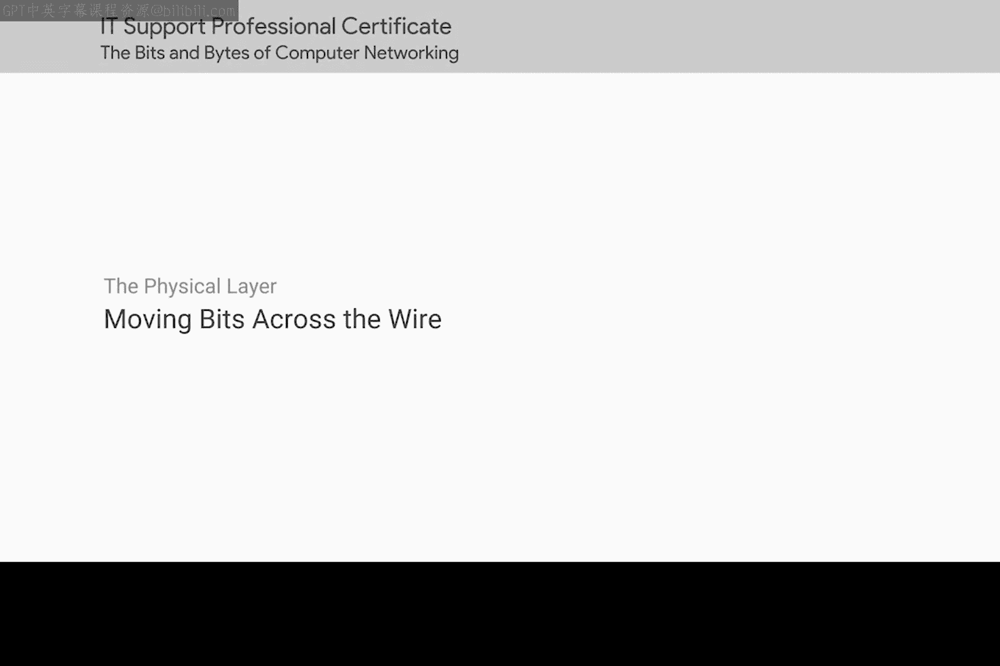
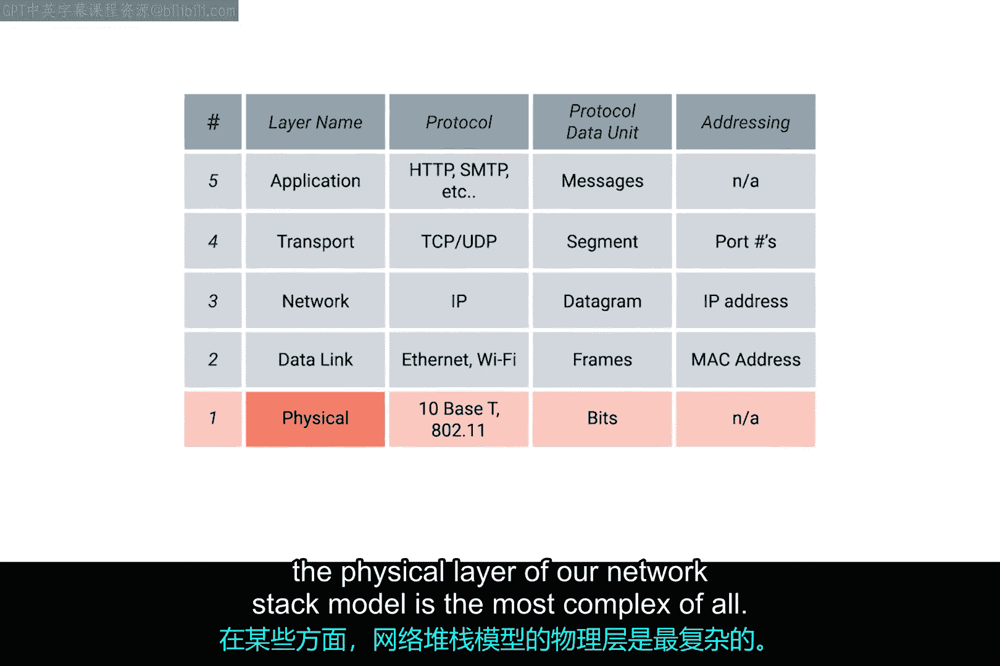
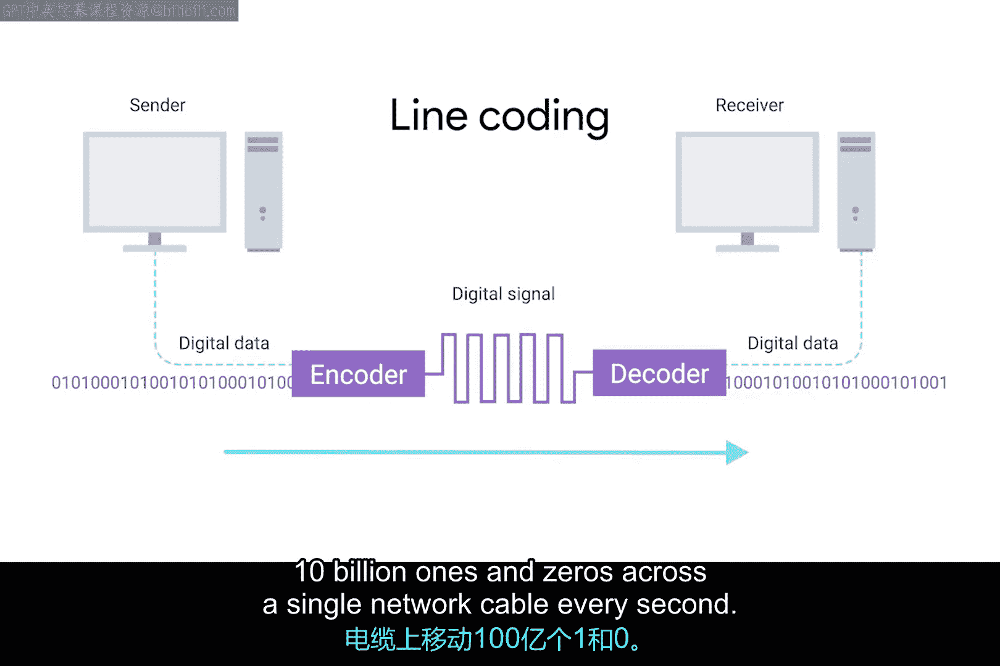

# 010：在线路上传输比特 🔌

在本节课中，我们将学习计算机网络物理层的核心概念，了解比特（0和1）是如何通过各种物理介质（如电缆）进行传输的。我们将探讨调制与线路编码的基本原理，并理解这些基础技术如何支撑起现代高速数据传输。

---

## 物理层的复杂性

从某些方面看，网络栈模型中的物理层是最复杂的。它的主要关注点是将比特（0和1）从链路的一端移动到另一端。为了实现以惊人速度在细小线缆上传输海量数据，背后涉及非常复杂的数学、物理和电气工程原理。

幸运的是，对于立志成为IT支持专家的你而言，需要了解的物理层知识要平易近人得多。学完本课后，你将对物理层的各个方面打下坚实基础，这将帮助你正确地排查网络故障并搭建新的网络。

让我们开始吧。

---

## 比特与物理层

物理层由设备和在计算机网络中传输比特的手段组成。**比特**是计算机能够理解的数据的最小表示单位，它是一个1或一个0。

在最低层级通过网络发送的这些0和1，构成了我们将在学习其他层时了解的数据帧和数据包。关键在于，无论你是在流媒体播放最爱的歌曲、给老板发邮件，还是使用ATM机，你实际上都是在通过你与所交互服务器之间的众多不同网络的物理层，发送着0和1。

---

## 调制与线路编码

一根标准的铜质网络电缆，一旦两端连接到设备，就会承载恒定的电荷。0和1通过一个称为**调制**的过程在这些网络电缆上发送。

调制是一种改变通过电缆移动的电荷电压的方法。当用于计算机网络时，这种调制更具体地被称为**线路编码**。

它允许链路两端的设备理解：处于某种状态的电荷代表0，而另一种状态则代表1。正是通过这种看似简单的技术，现代网络能够每秒在单根网络电缆上传输**100亿个**0和1。

---

## 总结

本节课我们一起学习了计算机网络物理层的基础知识。我们了解到物理层负责传输数据的基本单位——比特（0和1），并介绍了通过调制和线路编码技术，如何利用电缆中的电荷变化来表示这些比特，从而实现高速数据传输。理解这些原理是后续排查物理层网络问题和进行网络设置的重要基础。