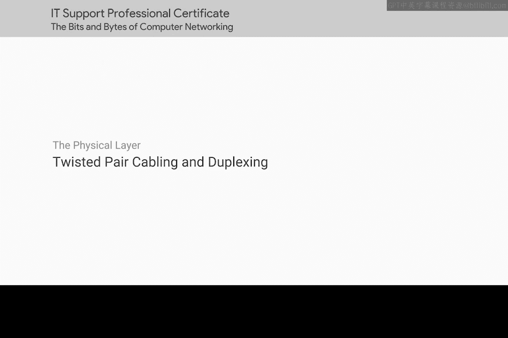
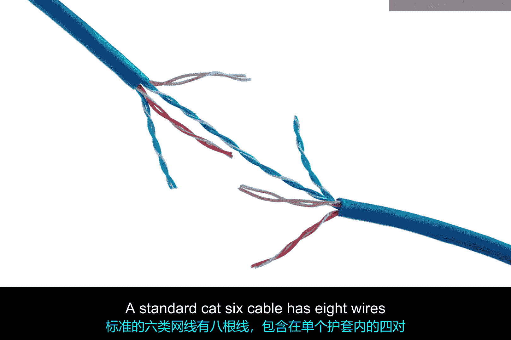
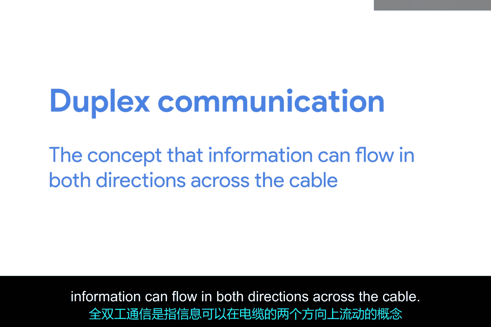
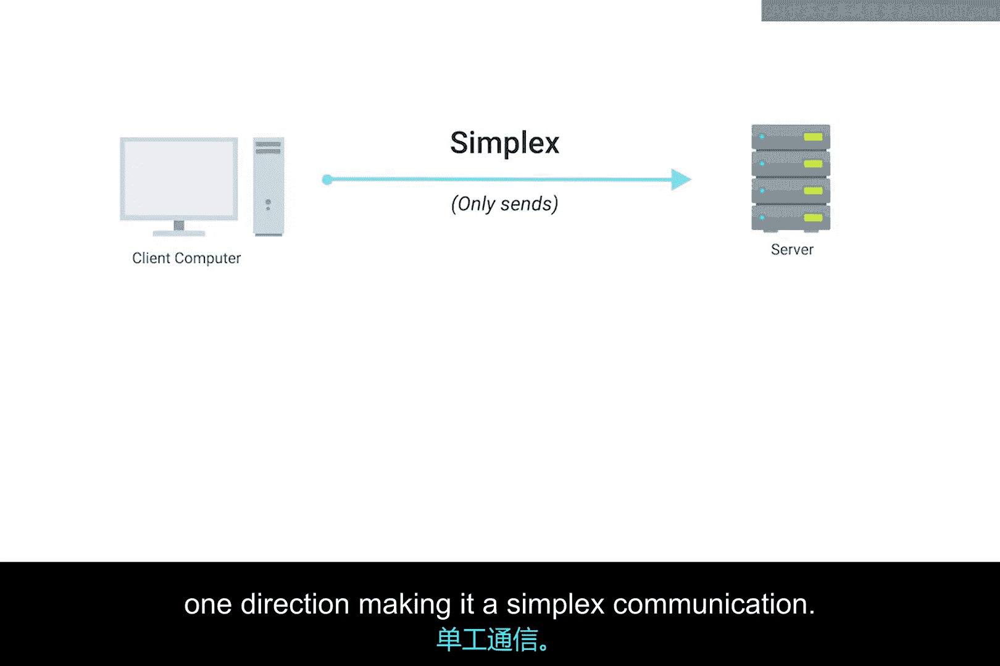
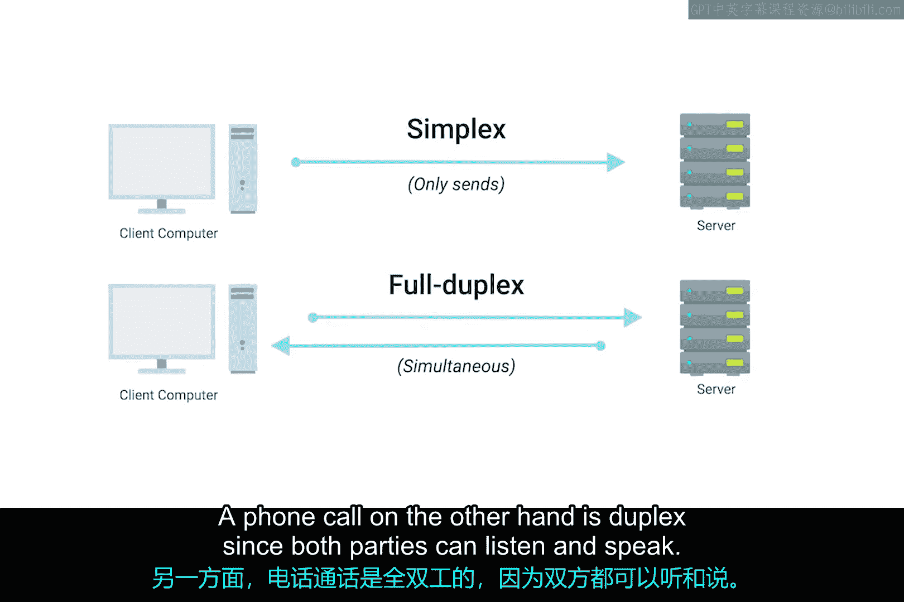
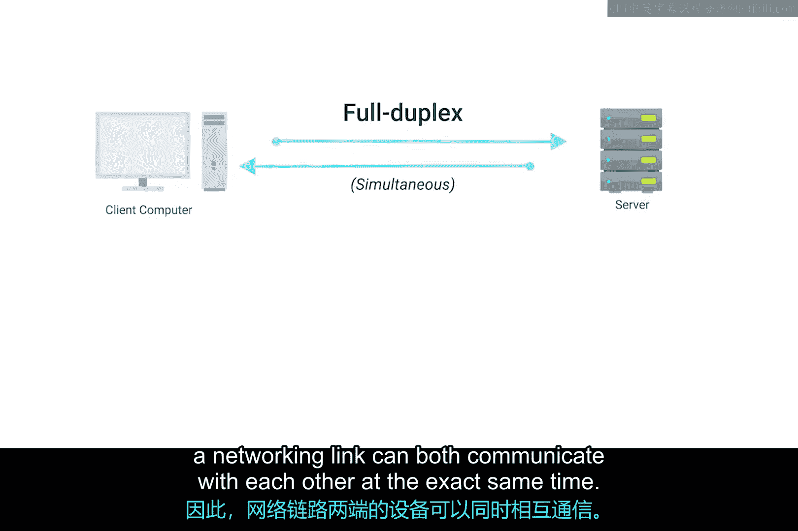
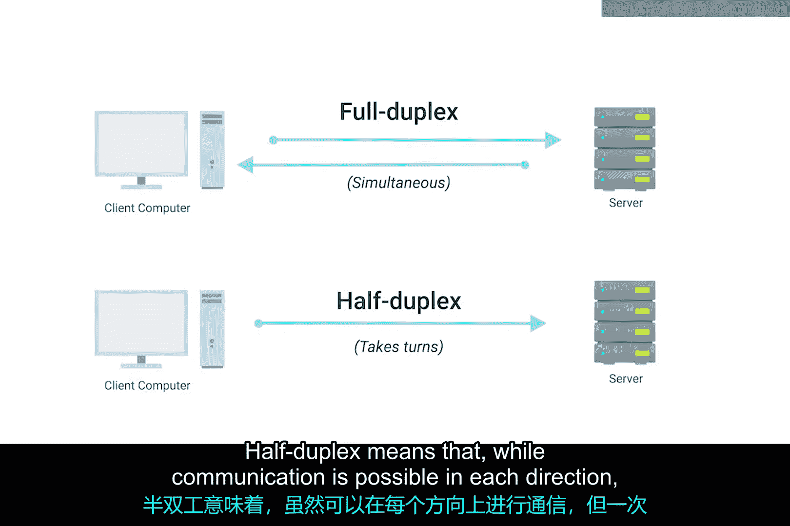

# 011：双绞线电缆与双工模式

在本节课中，我们将要学习计算机网络中最常见的物理连接介质——双绞线电缆，以及数据在电缆上传输的两种基本模式：单工和双工通信模式。理解这些基础知识对于搭建和维护网络至关重要。

## 双绞线电缆概述

连接计算设备最常用的电缆类型被称为双绞线电缆。

它之所以被称为双绞线电缆，是因为它内部包含成对的铜线，这些铜线被绞合在一起。

这些线对作为信息传输的单一通道，其绞合的特性有助于抵御电磁干扰和来自邻近线对的串扰。

一根标准的Cat6电缆内部有八根导线，它们组成了四对双绞线，并包裹在一个外护套内。

实际使用多少对导线取决于所采用的传输技术。

## 双工通信模式

上一节我们介绍了双绞线电缆的物理结构，本节中我们来看看数据是如何在其上传输的。在现代网络的所有形式中，了解这些电缆支持双工通信非常重要。

双工通信是指信息可以沿电缆双向流动的概念。

## 单工通信模式

与双工通信相对，还有一种称为单工通信的过程，它是单向的。

例如，婴儿监视器的数据传输只朝一个方向进行，这使其成为单工通信。

而电话通话则是双工的，因为双方都可以听和说。

## 全双工与半双工

网络电缆确保双工通信成为可能的方式是，预留一对或两对线用于一个方向的通信。

然后使用另外一对或两对线用于另一个方向的通信。

这样，网络链路两端的设备就可以在同一时刻相互通信，这被称为**全双工**。

如果连接出现问题，你可能会看到网络链路降级并报告自己以半双工模式运行。

**半双工**意味着虽然每个方向都可以通信，但一次只能有一个设备进行通信。

## 总结

本节课中我们一起学习了计算机网络的基础物理组件。我们了解了双绞线电缆的构造及其抗干扰原理，并重点区分了单工、半双工和全双工这三种通信模式。全双工模式是现代高效网络通信的基石，它允许数据同时双向传输。理解这些概念有助于诊断网络性能问题，例如识别因故障导致的半双工模式降级。