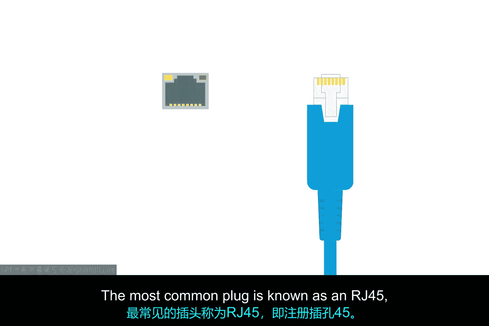
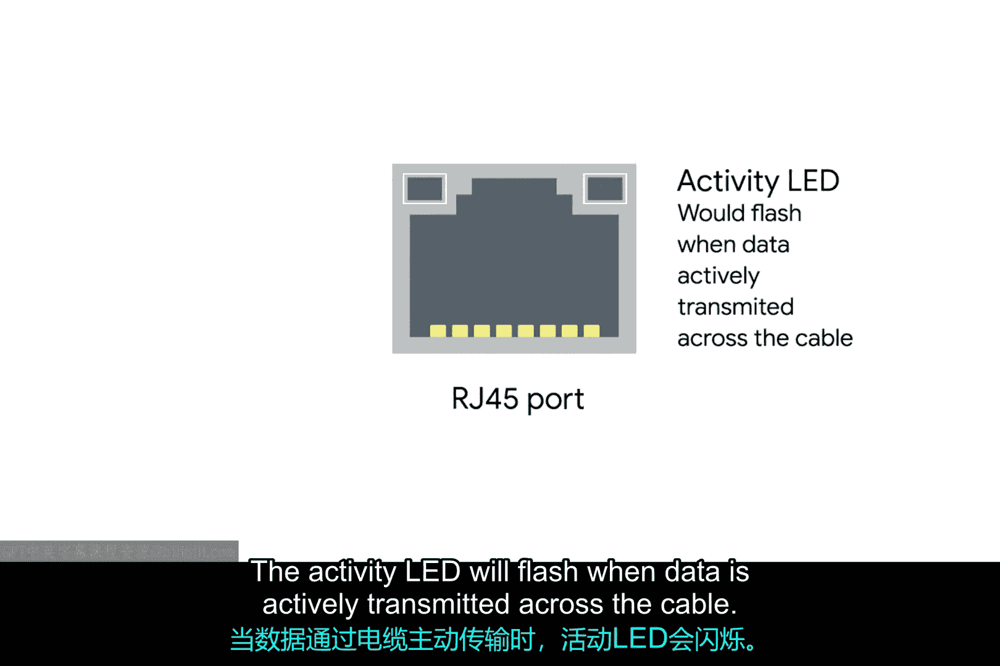
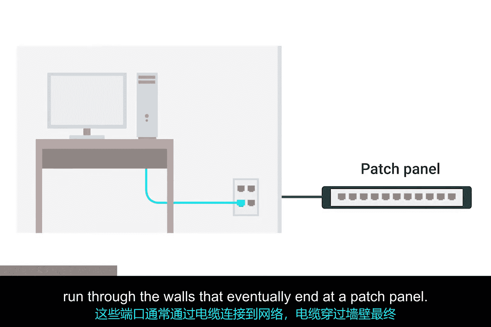
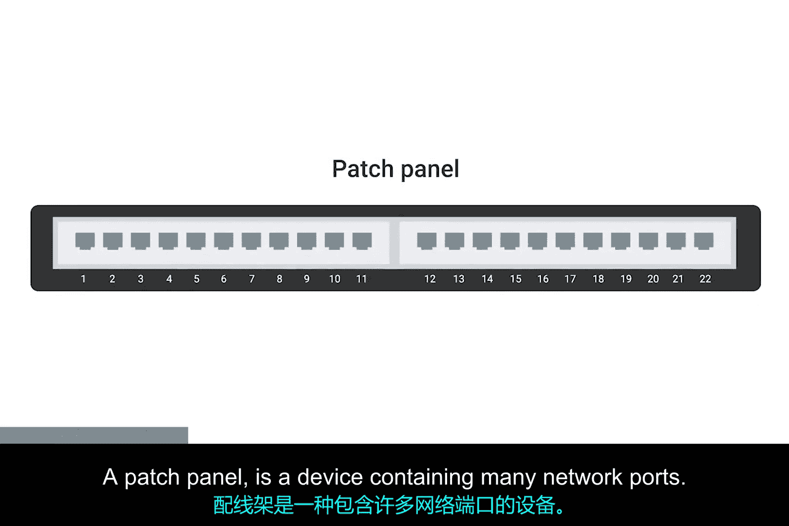

# 012：网络端口与配线架 🖧

在本节课中，我们将要学习物理层工作的最后步骤，即网络链路终端的连接方式。我们将重点介绍RJ45插头、网络端口的状态指示灯以及配线架的作用。

上一节我们介绍了网络电缆的物理构成，本节中我们来看看这些电缆是如何连接到网络设备上的。

## 网络电缆的终端：RJ45插头

双绞线网络电缆的末端需要一个插头，将内部独立的导线暴露并连接起来。最常见的插头被称为**RJ45**（注册插孔45）。它是众多电缆插头规格之一，但迄今为止是计算机网络中最常见的一种。

带有RJ45插头的网络电缆可以连接到RJ45网络端口。

## 网络端口与设备连接

网络端口通常直接连接到构成计算机网络的设备上。以下是不同类型设备端口数量的典型情况：

*   **交换机**：拥有许多网络端口，因为其目的是连接多台设备。
*   **服务器和台式机**：通常只有一到两个端口。
*   **笔记本电脑、平板电脑或手机**：可能没有有线网络端口（无线网络将在后续模块中讨论）。

## 端口状态指示灯

大多数网络端口有两个小型LED指示灯：一个是**连接指示灯**，另一个是**活动指示灯**。

*   当电缆正确连接到两台均已开机的设备时，连接指示灯会常亮。
*   当有数据通过电缆主动传输时，活动指示灯会闪烁。

过去，活动指示灯的闪烁直接对应于发送的二进制1和0。如今，计算机网络速度极快，活动指示灯除了指示是否有流量外，并不能传达太多具体信息。

在交换机上，有时同一个LED会用于指示连接和活动状态，甚至可能指示其他信息，如**链路速度**。你需要查阅正在使用的特定硬件文档，但端口指示灯几乎总能为你提供一些故障排除信息。

## 墙壁端口与配线架

有时，网络端口并非直接连接到设备，而是安装在墙上或桌子下方。这些端口通常通过隐藏在墙内的电缆连接到网络，这些电缆最终终结于一个**配线架**。

配线架是一个包含许多网络端口的设备，但它本身不执行任何其他网络功能。它只是多根电缆线路端点的容器。

随后，通常会使用额外的电缆从配线架连接到交换机或路由器，从而为链路另一端的计算机提供网络接入。

## 总结

本节课中我们一起学习了物理层连接的终端环节。我们认识了标准的**RJ45**插头和端口，了解了**连接指示灯**与**活动指示灯**的用途，并明白了**配线架**作为电缆管理枢纽的角色，它通过跳线将墙内线路与网络设备连接起来，最终完成整个有线网络的物理连通。