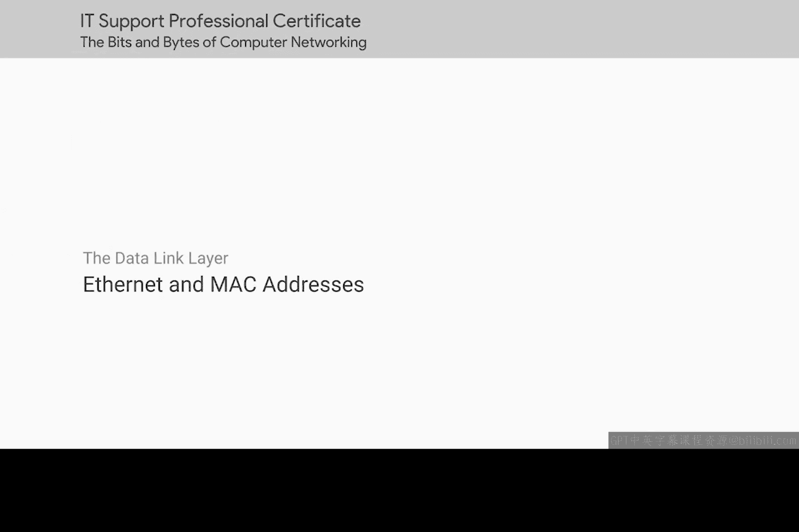
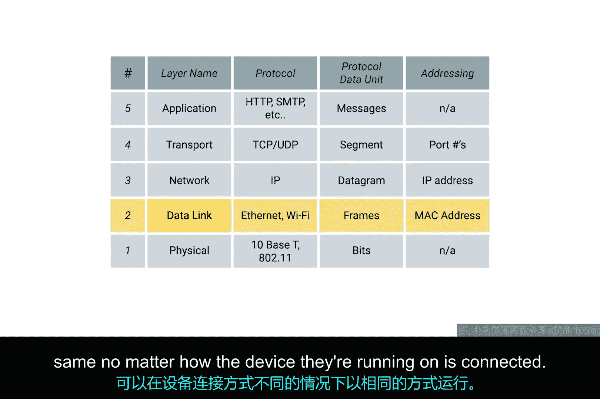
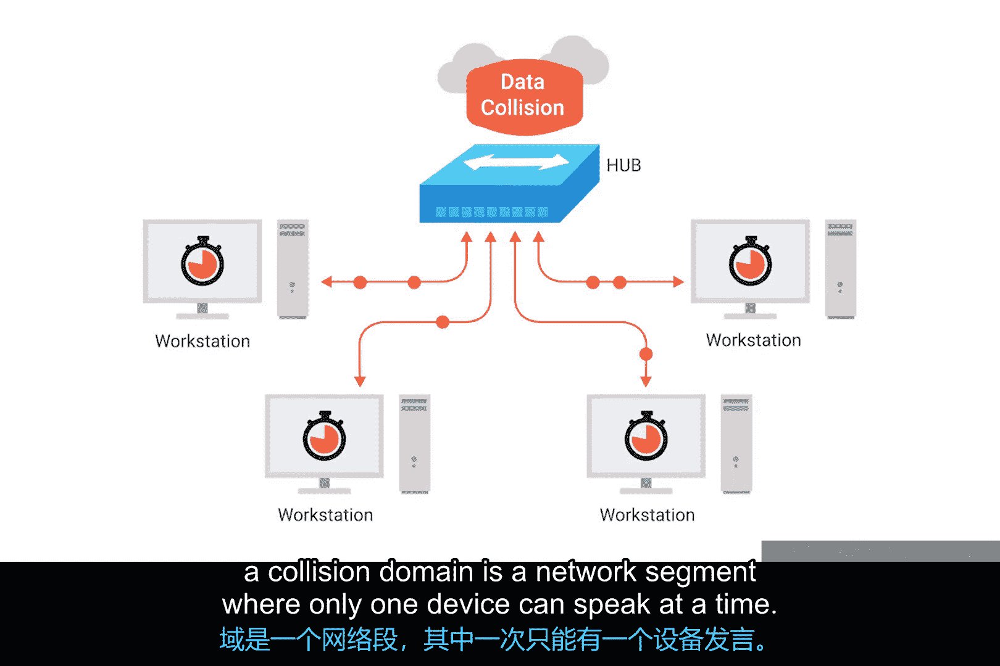
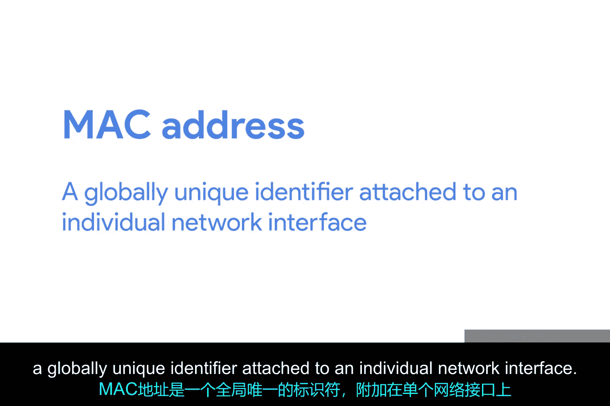
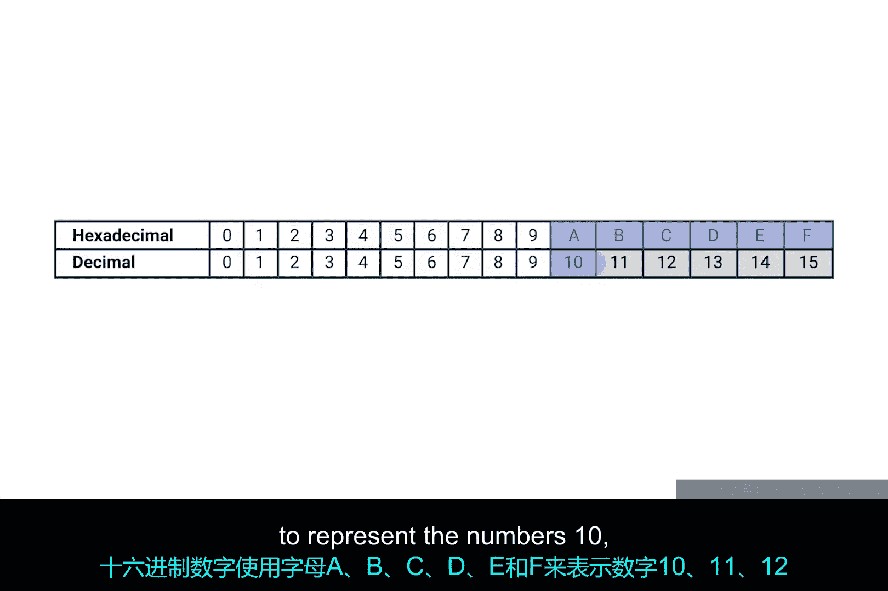
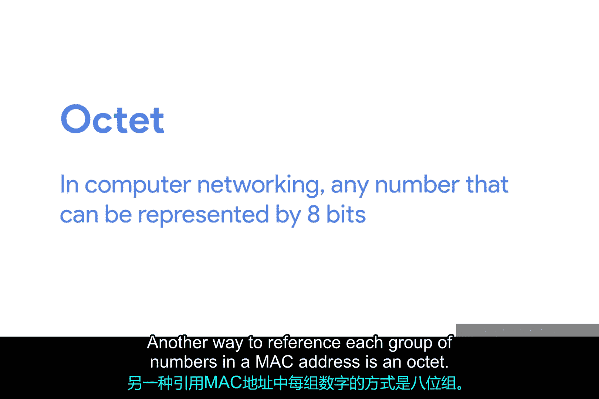
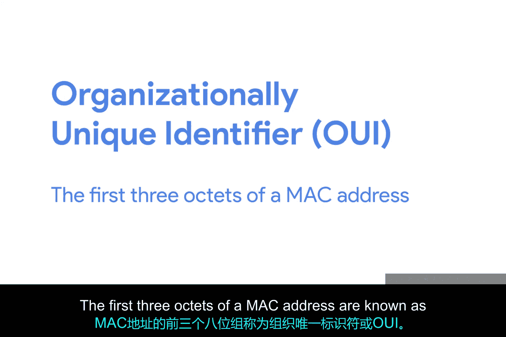
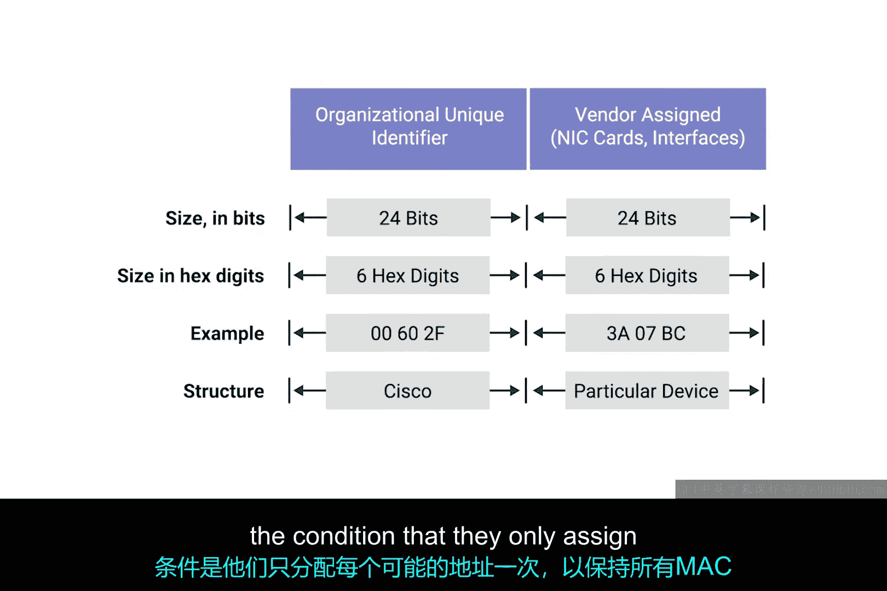
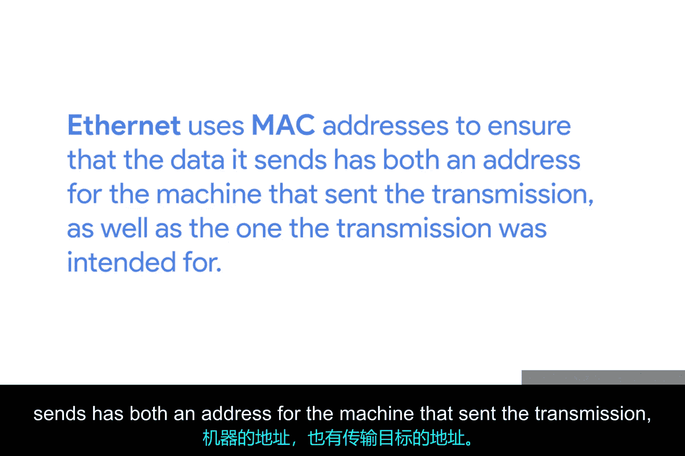

# 013：以太网与MAC地址 📡

在本节课中，我们将学习以太网协议和MAC地址。以太网是数据链路层最广泛使用的协议，用于在单个链路上发送数据。MAC地址则是全球唯一的硬件标识符，用于在网络中识别设备。理解这些概念对于IT支持专家进行网络故障排查至关重要。

---

## 以太网简介 🌐

无线和蜂窝网络接入正迅速成为连接计算设备到网络的常见方式，这很可能也是您当前的连接方式。但您可能会惊讶地发现，传统的有线网络仍然是工作场所，尤其是数据中心中最常见的选项。

在单个链路上发送数据最广泛使用的协议被称为**以太网**。以太网和数据链路层为协议栈更高层的软件提供了发送和接收数据的手段。该层的主要目的之一是，从根本上抽象掉其他层对物理层和使用何种硬件的关注。

通过将这一职责交给数据链路层，无论设备如何连接，其上的互联网层、传输层和应用层都能以相同的方式运行。例如，您的网络浏览器无需知道其运行的设备是通过双绞线还是无线连接，它只需要底层协议为其发送和接收数据。

---

## 课程目标与以太网历史 📜

在本节结束时，您将能够解释什么是MAC地址以及它们如何用于识别计算机。您还将了解如何描述构成以太网帧的各种组件，并能够区分单播、多播和广播地址。最后，您将能够解释循环冗余校验如何帮助确保通过以太网发送的数据的完整性。理解这些概念将帮助您作为IT支持专家排查各种问题。

**注意：** 一段关于传统技术的历史课即将开始。

以太网是一项相当古老的技术，它最早诞生于1980年，并在1983年首次完全发布标准化。自那时起，主要为了支持不断增长的带宽需求，引入了一些变化。但在很大程度上，今天使用的以太网与多年前首次发布的标准是相似的。

在1983年，计算机网络与今天完全不同。一个显著的拓扑结构差异是，交换机或可交换集线器尚未发明。这意味着，网络上的许多或所有设备经常共享一个**冲突域**。您可能还记得我们关于集线器和交换机的讨论，冲突域是一个网络段，其中一次只能有一个设备通信。

---

## 冲突域与CSMA/CD ⚡

这是因为冲突域中的所有数据都被发送到连接至该域的所有节点。如果两台计算机同时通过线路发送数据，这将导致代表我们1和0的电流发生实际碰撞，使得最终结果无法理解。

以太网协议通过使用一种称为**带冲突检测的载波侦听多路访问**的技术解决了这个问题。我们通常将其缩写为 **CSMA/CD**。

CSMA/CD用于确定通信信道何时空闲，以及设备何时可以自由传输数据。CSMA/CD的工作原理其实很简单：如果当前网络段上没有数据传输，节点就会自由地发送数据。如果最终有两台或更多计算机试图同时发送数据，计算机会检测到这种冲突并停止发送。

涉及冲突的每个设备然后会等待一个随机的时间间隔，然后再尝试发送数据。这个随机间隔有助于防止所有涉及冲突的计算机在下一次尝试传输任何数据时再次发生冲突。

---

## MAC地址的作用 🏷️

当一个网络段是一个冲突域时，意味着该段上的所有设备都会接收整个段的所有通信。这意味着我们需要一种方法来识别传输实际上是针对哪个节点的。这就是**媒体访问控制地址**或**MAC地址**发挥作用的地方。

MAC地址是附加到单个网络接口的全球唯一标识符。它是一个48位的数字，通常由六组两位的十六进制数表示。

就像二进制是一种仅用两个数字（0和1）表示数字的方式一样，十六进制是一种使用16个数字表示数字的方式。由于我们没有代表大于9的单个数字的数码，十六进制数字使用字母A、B、C、D、E和F来代表数字10、11、12、13、14和15。

---

## MAC地址的结构与唯一性 🔢

在MAC地址中，每组数字的另一种称呼是**八位组**。在计算机网络中，八位组是任何可以用8位表示的数字。在这种情况下，两个十六进制数字可以表示与8位相同的数字范围。

现在，您可能已经注意到我们提到MAC地址是全球唯一的，这可能会让您疑惑这怎么可能。简短的答案是，48位数字比您想象的要大得多。可能存在的MAC地址总数是2的48次方，即281,474,976,710,656种独特的可能性。这是一个非常庞大的数字。

MAC地址分为两个部分。MAC地址的前三个八位组被称为**组织唯一标识符**或**OUI**。

---

## OUI与地址分配 🏭

这些OUI由**IEEE**（电气和电子工程师协会）分配给各个硬件制造商。这是一个有用的信息，因为它意味着您始终可以通过MAC地址识别网络接口的制造商。

MAC地址的最后三个八位组可以由制造商以他们希望的任何方式分配，条件是每个可能的地址只分配一次，以保持所有MAC地址的全球唯一性。

以太网使用MAC地址来确保其发送的数据既包含发送传输的机器的地址，也包含传输预期接收者的地址。

通过这种方式，即使在一个作为单个冲突域的网络段上，该网络上的每个节点也知道何时有流量是发送给它的。

---

## 总结 📝

本节课中，我们一起学习了以太网协议的基础知识及其历史背景。我们探讨了冲突域的概念以及CSMA/CD机制如何解决数据碰撞问题。核心内容是MAC地址：我们了解了其作为全球唯一硬件标识符的作用、48位的结构（表示为六组十六进制数），以及它如何由OUI（制造商代码）和设备唯一标识符组成。最后，我们明白了MAC地址如何使网络设备能够在共享介质中识别属于自己的数据。

理解以太网帧结构、MAC地址类型（单播、多播、广播）以及数据完整性校验（如CRC），将是后续深入学习和进行实际网络故障排查的重要基础。