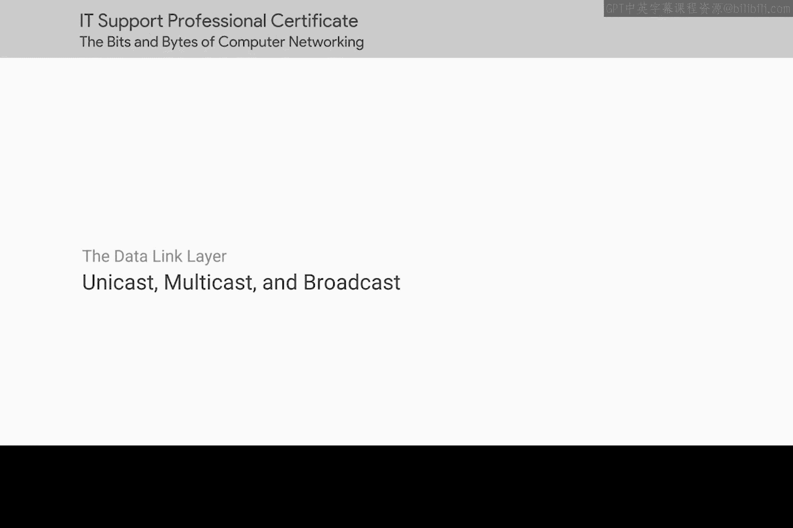
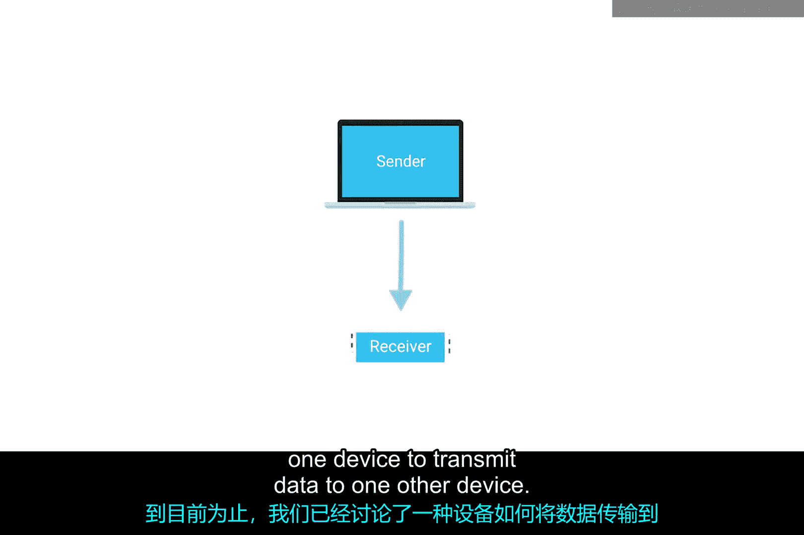
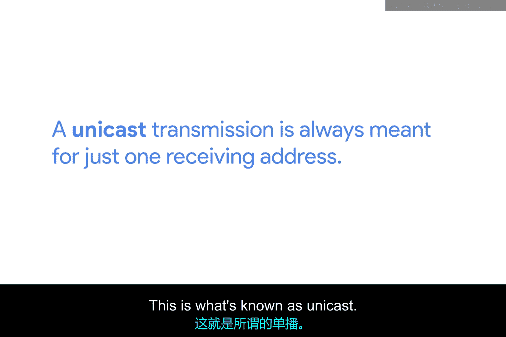
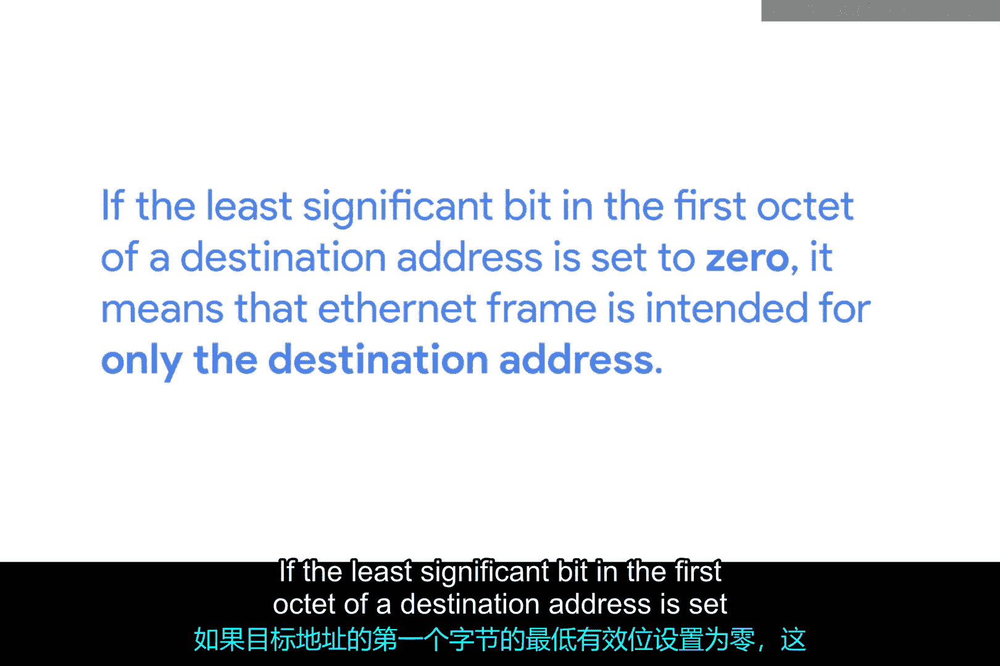
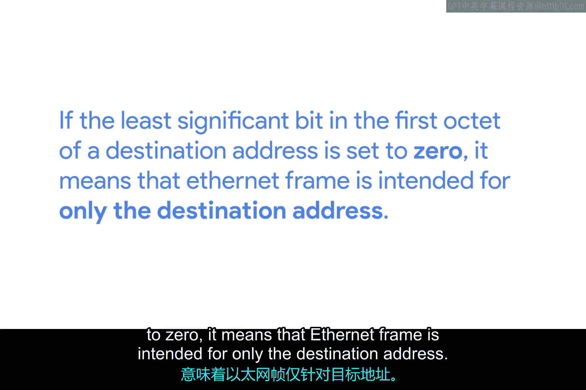
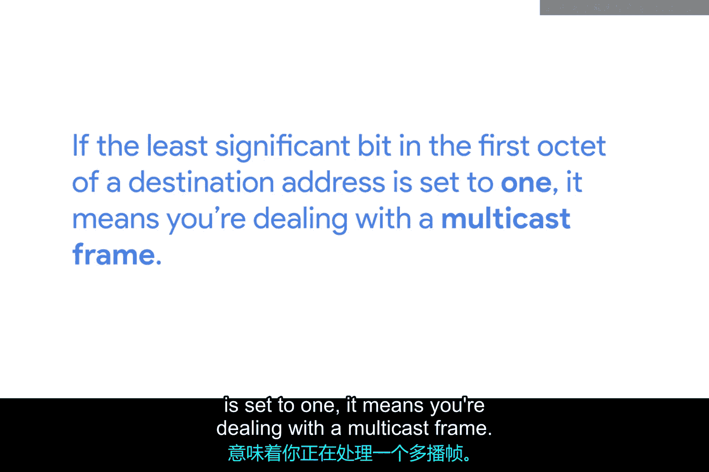
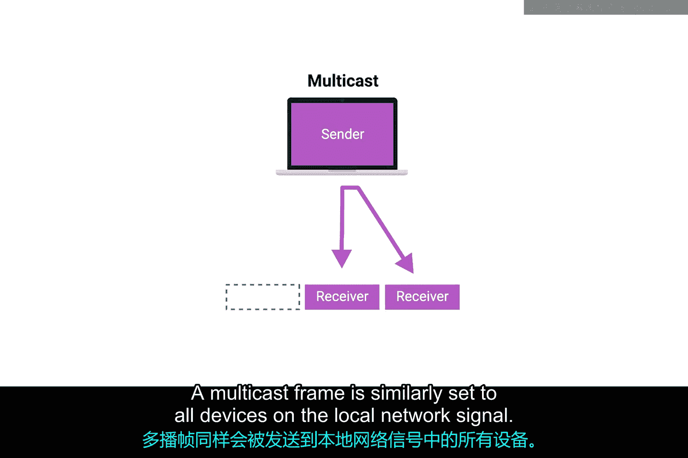
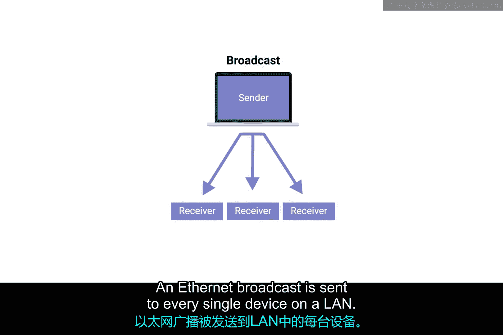
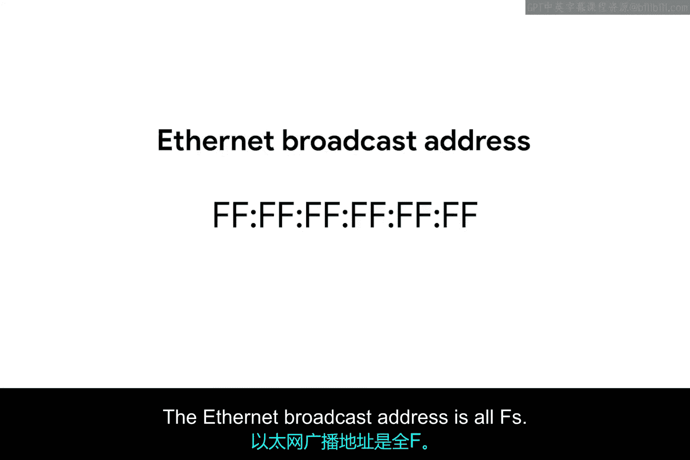

# 014：单播、多播与广播 📡

在本节课中，我们将学习以太网中三种基本的数据传输方式：单播、多播和广播。理解这些概念是掌握网络设备如何相互通信的基础。

到目前为止，我们讨论的都是一个设备向另一个设备传输数据的方式。

## 单播传输 🎯

上一节我们介绍了设备间的基本通信，本节中我们来看看单播传输的具体机制。

这种传输方式被称为**单播**。单播传输始终只针对一个接收地址。

在以太网层面，这是通过查看目标MAC地址中的一个特殊位来实现的。如果目标地址第一个字节的最低有效位被设置为**0**，则意味着该以太网帧仅针对该目标地址。

**公式表示：**
`目标MAC地址第一个字节 & 0x01 == 0`

这意味着该帧会被发送到冲突域中的所有设备，但只有预期的目标设备才会实际接收并处理它。

## 多播传输 👥

了解了点对点的单播后，我们来看看如何向一组特定设备发送数据。

如果目标地址第一个字节的最低有效位被设置为**1**，则意味着你正在处理一个**多播帧**。多播帧同样会被发送到本地网络段上的所有设备。

**公式表示：**
`目标MAC地址第一个字节 & 0x01 == 1`

不同之处在于，每个设备会根据除自身硬件MAC地址之外的其他标准来决定接受还是丢弃该帧。网络接口可以配置为接受一系列指定的多播地址，以参与这类通信。

以下是多播帧的处理流程：
*   帧被发送到网络上的所有设备。
*   每个设备的网络接口检查帧的目标多播地址。
*   如果接口被配置为监听该多播地址，则接受该帧。
*   否则，接口将丢弃该帧。

## 广播传输 📢

最后，我们来学习如何向网络上的每一个设备发送信息。

第三种以太网传输类型被称为**广播**。以太网广播会被发送到局域网上的每一台设备。

这是通过使用一个称为**广播地址**的特殊目标地址来实现的。以太网广播地址是**全F**，即 `FF:FF:FF:FF:FF:FF`。

以太网广播用于让设备能够更多地了解彼此。别担心，在本课程后面，你将学习更多关于广播以及一种称为**地址解析协议**的技术。

## 总结 📝

本节课中我们一起学习了以太网的三种数据传输方式：
*   **单播**：一对一通信，目标地址首位为0。
*   **多播**：一对多通信（特定组），目标地址首位为1，接收设备需预先配置。
*   **广播**：一对所有通信，使用全F地址 `FF:FF:FF:FF:FF:FF`，网络上的所有设备都会接收。

现在，让我们继续前进，深入剖析以太网帧的结构。