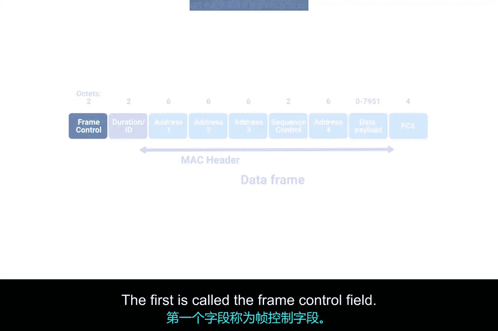
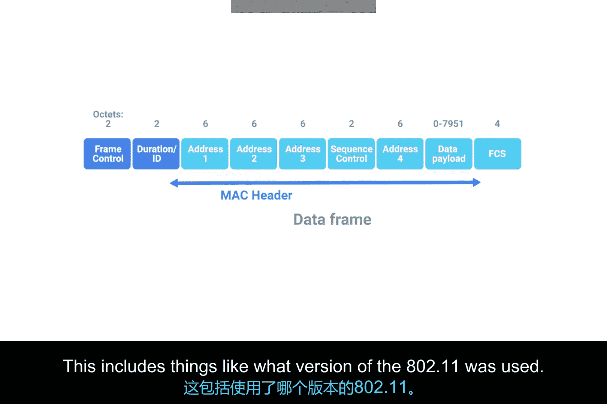
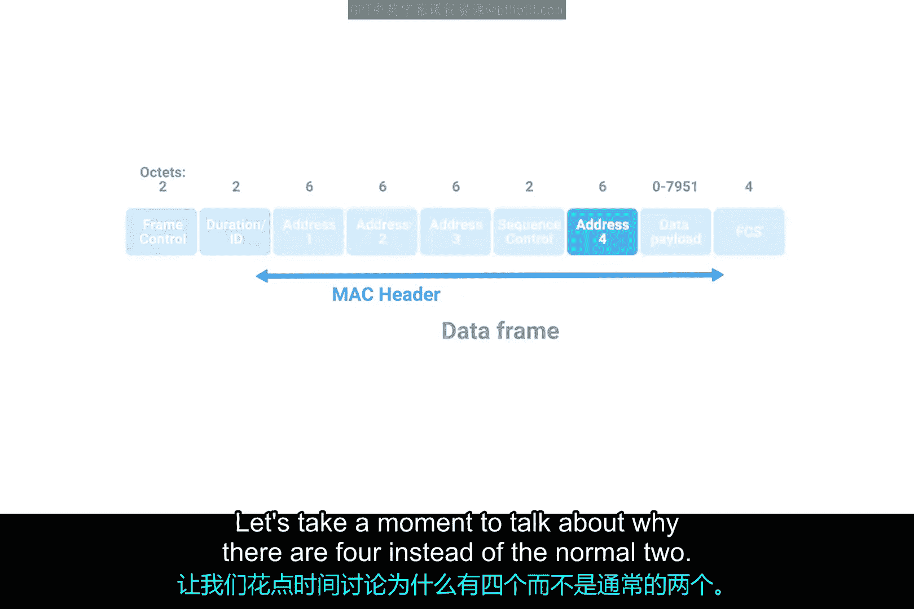
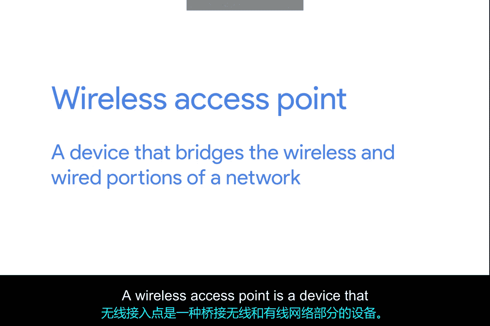
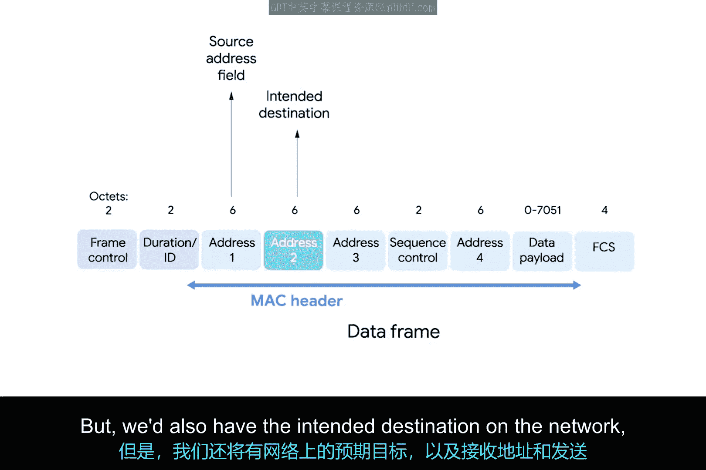
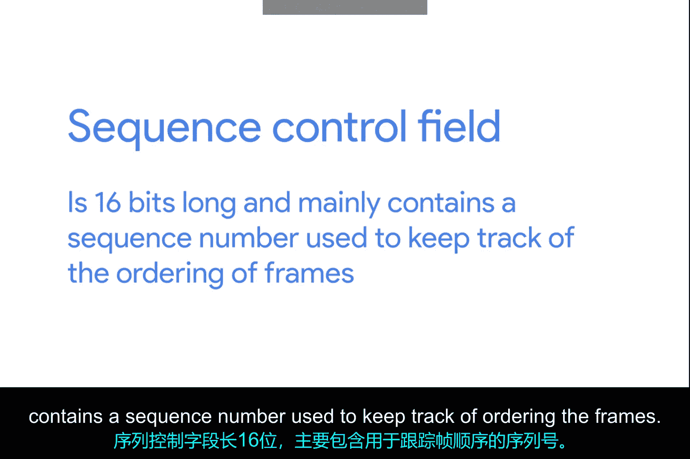
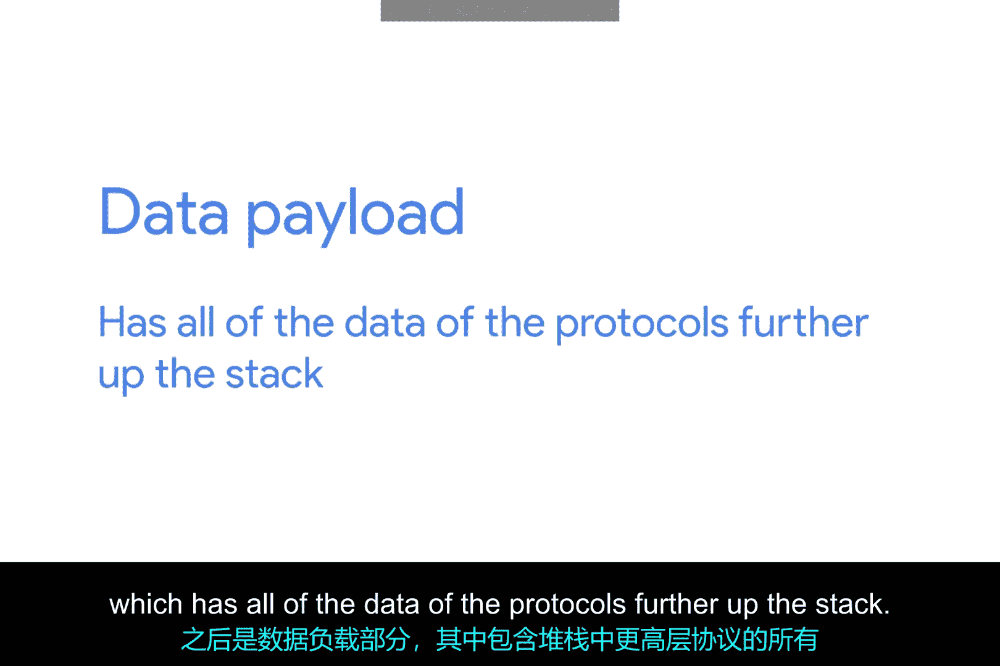

# 070：无线网络基础 📡

## 概述

在本节课中，我们将要学习无线网络的基础知识。随着笔记本电脑、平板电脑和智能手机等便携式计算设备的普及，无线网络技术变得越来越重要。我们将了解无线通信的基本原理、不同类型的无线网络架构、无线信道的作用以及无线安全协议的基础知识。这些知识对于IT支持专家至关重要，因为无线网络在工作场所中正变得越来越普遍。

## 无线网络标准与Wi-Fi

无线网络设备之间通过无线电波进行通信。最常见的无线网络通信规范由IEEE 802.11标准定义。这套规范也被称为802.11系列，构成了我们称之为Wi-Fi的技术集合。

不同的802.11标准通常使用相同的基本协议，但可能在不同的频段上运行。频段是无线电频谱中特定的一部分，被约定用于特定的通信。在北美，FM无线电传输在88至108 MHz之间运行，这个特定的频段被称为FM广播频段。

Wi-Fi网络在几个不同的频段上运行，最常见的是2.4 GHz和5 GHz频段。802.11规范有很多种，包括一些仅用于实验或测试的规范。您可能遇到的最常见规范包括802.11b、802.11a、802.11g、802.11n和802.11ac。我们目前不会详细讨论每一种，只需知道我们按它们被采用的顺序列出了这些规范。每个新版本的802.11规范通常都有一些改进，无论是更高的接入速度还是允许更多设备同时使用网络的能力。

在网络模型中，您应该将802.11协议视为定义了我们在物理层和数据链路层的操作方式。

## 802.11帧结构

一个802.11帧包含多个字段。理解这些字段有助于我们了解无线数据是如何被封装和传输的。

以下是802.11帧的主要组成部分：

*   **帧控制字段**：该字段长16位，包含许多子字段，用于描述帧本身应如何处理。这包括使用了哪个版本的802.11协议等信息。
*   **持续时间字段**：该字段指定整个帧的长度，以便接收方知道需要监听传输多长时间。
*   **地址字段**：共有四个地址字段，每个长6字节，存储MAC地址。这与通常的两个地址（源和目的）不同，原因与无线网络的架构有关，我们将在后面详细讨论。
*   **序列控制字段**：该字段长16位，主要包含一个用于跟踪帧顺序的序列号。
*   **数据载荷部分**：包含协议栈更高层的所有数据。
*   **帧校验序列字段**：包含一个用于循环冗余校验的校验和，其工作原理与以太网相同。

## 无线网络架构与接入点

上一节我们介绍了802.11帧的结构，特别是四个地址字段的用途。本节中我们来看看为什么需要这些地址，这涉及到无线网络最常见的架构。

最常见的无线网络设置包含称为接入点的设备。无线接入点是一种桥接网络无线部分和有线部分的设备。

一个无线网络可能拥有许多不同的接入点以覆盖大面积区域。无线网络上的设备会与某个特定的接入点关联。这通常是物理上最近的接入点，但也可以由其他各种因素决定，例如总体信号强度和无线干扰。

关联不仅对于无线设备与特定接入点通信很重要，它还允许发送给无线设备的传入传输由正确的接入点发出。

之所以有四个地址字段，是因为需要空间来指示应由哪个无线接入点处理该帧。因此，我们有正常的源地址字段（代表发送设备的MAC地址）和网络上的预期目的地址。此外，还有接收地址和发送地址。接收地址是应接收该帧的接入点的MAC地址，发送地址是刚刚发送该帧的设备的MAC地址。在许多情况下，目的地址和接收地址可能是相同的。通常，源地址和发送地址也是相同的。但根据特定无线网络的具体架构方式，情况并非总是如此。有时无线接入点会相互中继这些帧。

## 总结

本节课中我们一起学习了无线网络的基础知识。我们了解到无线通信遵循IEEE 802.11标准（即Wi-Fi），并在特定的无线电频段（如2.4 GHz和5 GHz）上运行。我们剖析了802.11帧的结构，理解了其多个字段的用途，特别是四个地址字段如何支持复杂的无线网络架构。最后，我们探讨了无线网络中最常见的架构，即通过无线接入点桥接有线与无线网络，并解释了设备与接入点关联的重要性。掌握这些核心概念是管理和支持日益普及的职场无线网络的关键第一步。