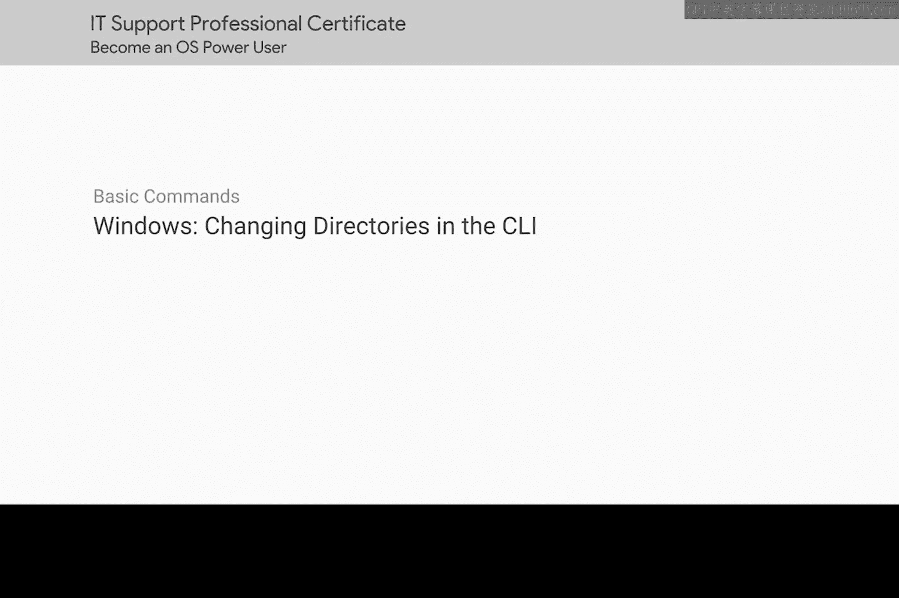
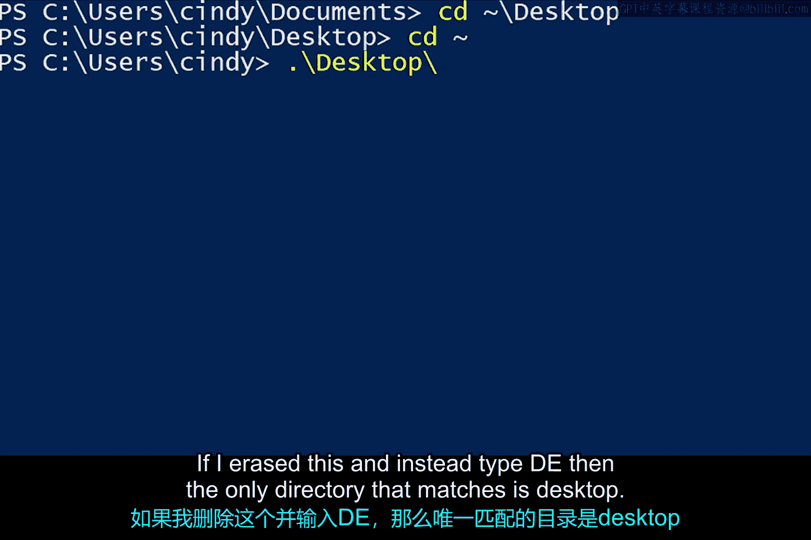

# 100：在CLI中更改目录 🗂️



在本节课中，我们将要学习如何在命令行界面（CLI）中查看和更改当前所在的目录。这是文件系统导航的基础，对于高效使用命令行至关重要。

## 查看当前目录

首次打开PowerShell时，通常会位于你的主目录中。命令行提示符会显示你当前所在的目录，但还有一个专门的命令可以明确告知你的位置。

`pwd` 或 **打印工作目录** 命令会告诉你当前位于哪个目录。

```bash
pwd
```

## 更改当前目录

如果我们想切换到另一个目录，可以使用 `cd` 或 **更改目录** 命令。

```bash
cd [路径]
```

使用此命令时，需要指定要切换到的目标路径。这个路径可以是**绝对路径**，即从驱动器盘符开始，完整地拼写出整个路径。相反，它也可以是**相对路径**，即仅使用部分路径来描述如何从当前位置到达目标位置。

接下来，我将通过示例展示这两种路径的用法。

## 使用绝对路径

假设我们当前位于 `C:\Users\Cindy`。现在，我们想切换到 `C:\Users\Cindy\Documents` 目录。

以下是使用绝对路径的命令：

```bash
cd C:\Users\Cindy\Documents
```

执行后，我们就切换到了Documents目录。虽然绝对路径很明确，但有时输入起来会比较繁琐。

## 使用相对路径

我们知道Documents目录就在Cindy文件夹下。那么，我们能否通过“向上移动一级”再进入该文件夹呢？当然可以。

有一个快捷方式可以让你移动到当前目录的上一级目录：`cd ..`

让我们先运行 `pwd` 命令确认当前位置。现在，我们可以看到我位于 `C:\Users\Cindy`，这是我之前所在目录的父目录。

`..` 被视为一个相对路径，因为它会根据你当前的位置，让你向上移动一级。

让我们回到Documents文件夹，并尝试用新学的命令切换到Desktop文件夹。我们知道Desktop和Documents目录都在主目录下，所以我们可以运行：

```bash
cd ..
cd Desktop
```

但实际上，有一种更简洁的写法：

```bash
cd ..\Desktop
```

让我们再次用 `pwd` 检查一下。现在，它显示我们位于Desktop文件夹。

## 使用主目录快捷方式

另一个很酷的 `cd` 快捷方式是 `cd ~`。波浪号 `~` 是你主目录路径的快捷方式。

假设我想进入主文件夹中的Desktop目录，我可以这样做：

```bash
cd ~\Desktop
```

## 使用Tab键自动补全

到目前为止，我们输入了不少内容。你可能会想，如果我们在输入这些目录名时出错了怎么办？我们怎么可能记住所有东西的位置和正确拼写？

幸运的是，我们不必这样做。我们的Shell内置了一个名为 **Tab键自动补全** 的功能。Tab补全允许我们使用Tab键来自动补全文件名和目录名。

让我们使用Tab补全功能从主目录进入Desktop目录。

如果我输入 `D`，然后按Tab键。第一个以D开头的文件或目录名就会被自动补全。如果这不是我要找的文件或目录，我可以继续按Tab键，路径会在所有匹配我输入开头的选项中循环显示。

例如，我会看到 `Desktop`，然后是 `Documents`，接着是 `Downloads`。

请注意，路径前的 `.\` 仅表示当前目录。如果我删掉它，然后输入 `De`，再按Tab键，唯一匹配的目录就是 `Desktop`。

Tab补全是一个极好的功能，随着你更多地使用命令行，你会越来越频繁地用到它。

## 总结



本节课中，我们一起学习了命令行导航的核心技能。我们了解了如何使用 `pwd` 查看当前目录，以及如何使用 `cd` 命令配合**绝对路径**和**相对路径**（包括 `..` 和 `~` 快捷方式）来切换目录。最后，我们还掌握了利用**Tab键自动补全**来提高输入效率和准确性的技巧。这些是高效管理文件系统的基础，请务必多加练习。