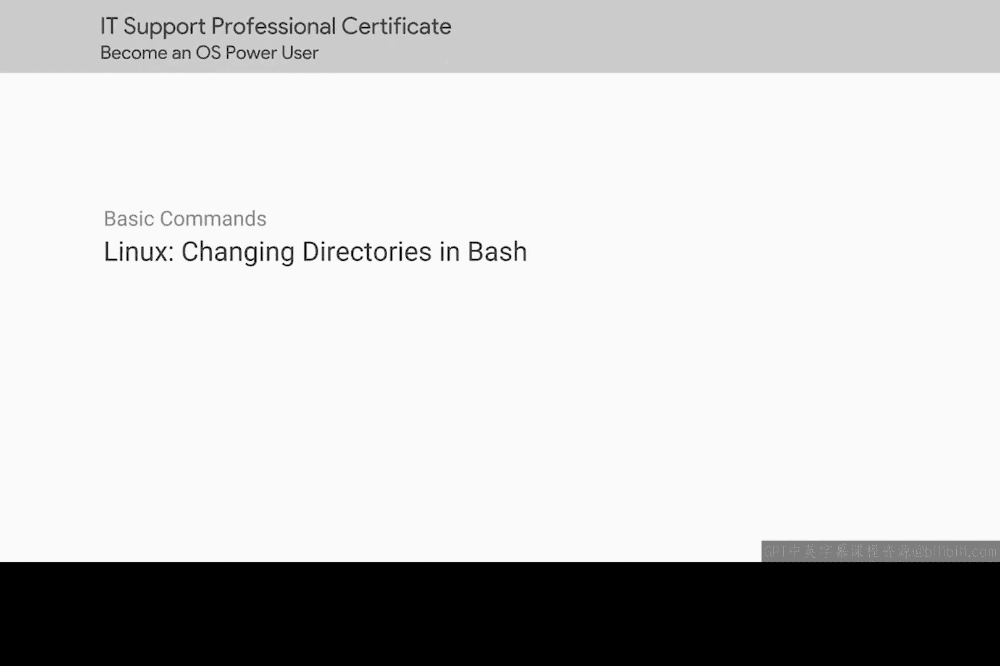
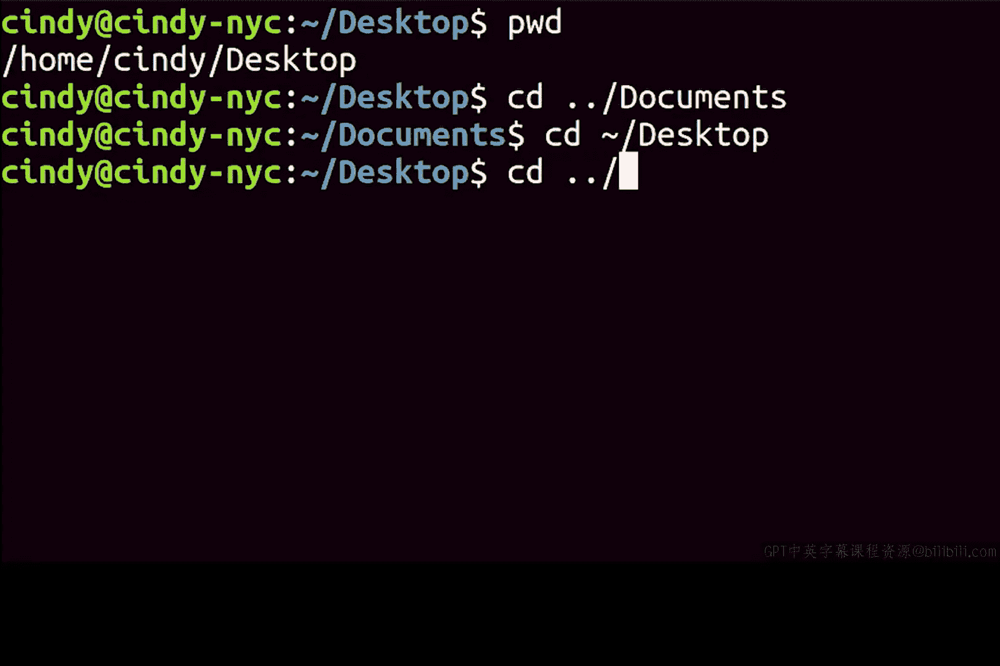

# 101：在Bash中更改目录




在本节课中，我们将学习如何在Linux的Bash命令行环境中更改当前工作目录。我们将介绍几个核心命令，并了解它们与Windows PowerShell的相似之处，帮助你快速上手。

## 从桌面导航到文档文件夹

上一节我们介绍了命令行的基本概念，本节中我们来看看如何在Bash中实际移动位置。我们将从桌面目录开始，导航到文档文件夹。

在Bash中使用的命令与之前在PowerShell中使用的命令完全相同。

## 查看当前目录

在开始移动之前，我们需要知道当前身处何处。`pwd`命令（Print Working Directory的缩写）可以显示我们当前所在的完整路径。

执行`pwd`命令后，输出如下：
```
/home/Cindy/desktop
```
这表明我们当前确实位于桌面目录中。

## 使用`cd`命令导航

要更改目录，我们使用`cd`命令，这与Windows系统一致。`cd`命令可以接受两种类型的路径：绝对路径和相对路径。

以下是使用`cd`命令的两种方式：

1.  **使用绝对路径**：绝对路径从根目录（`/`）开始，指定目标的完整位置。
    ```
    cd /home/Cindy/documents
    ```

2.  **使用相对路径**：相对路径从当前目录开始，指向目标位置。
    ```
    cd ../documents
    ```
    这里的`..`代表上一级目录（即`/home/Cindy`），所以这个命令会从桌面进入Cindy主目录下的文档文件夹。

## 使用特殊符号快速导航

Bash提供了一些特殊符号来简化导航，其中`~`（波浪号）非常有用。它代表当前用户的主目录（例如`/home/Cindy`）。

因此，要快速回到桌面，我们可以使用：
```
cd ~/desktop
```
这个命令等同于`cd /home/Cindy/desktop`。

## Bash的Tab键自动补全功能

与Windows PowerShell类似，Bash也支持Tab键自动补全功能，可以节省输入时间并减少错误。

不过，Bash的Tab补全与Windows有一个区别：当存在多个可能的补全选项时，Bash不会在选项间循环，而是会一次性列出所有可能的选项。

例如，输入`cd D`后按Tab键，如果存在`Documents`和`Downloads`两个文件夹，Bash会同时显示这两个选项供你选择。




## 总结

本节课中我们一起学习了在Linux Bash中导航文件系统的基础知识。我们掌握了`pwd`命令来查看当前位置，使用`cd`命令配合绝对路径或相对路径来切换目录，了解了`~`符号代表主目录的快捷用法，并体验了Bash中Tab键自动补全功能的工作方式。通过这些学习，我们已经可以开始连接Windows与Linux命令行操作之间的桥梁了。