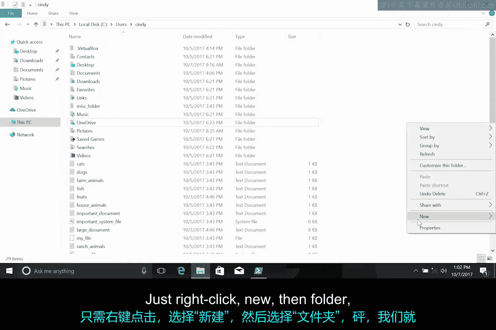
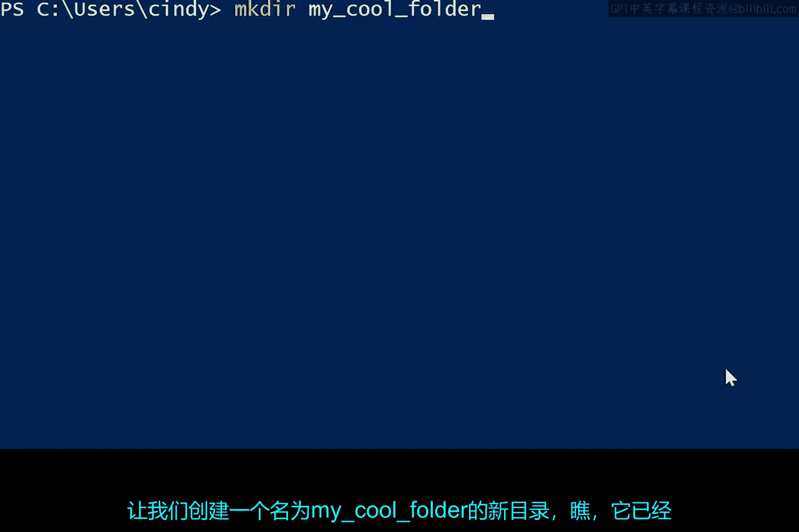
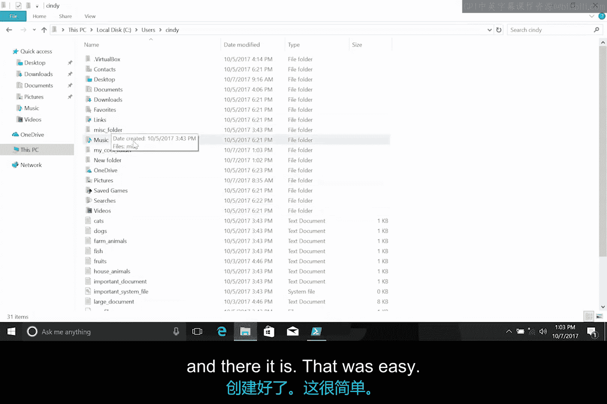
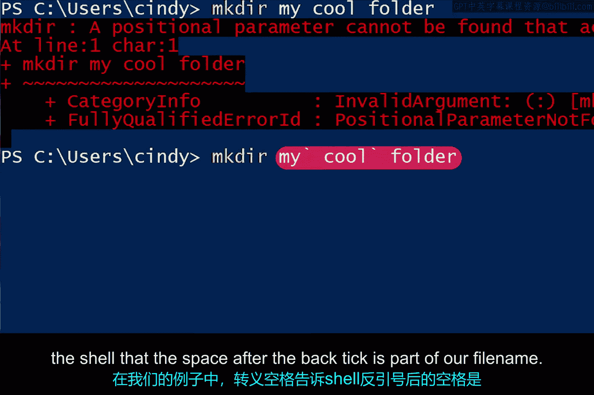

# 102：在GUI与CLI中创建目录

在本节课中，我们将学习如何在图形用户界面和命令行界面中创建新的目录。我们将从简单的图形界面操作开始，然后深入探讨在PowerShell中使用命令创建目录的方法，并解决创建包含空格名称的目录时可能遇到的问题。

## 图形用户界面创建目录 🖱️

上一节我们介绍了如何列出和更改目录，本节中我们来看看如何添加新的目录。

在图形用户界面中创建目录非常简单。

以下是具体步骤：
1.  在文件资源管理器或桌面的空白处右键单击。
2.  在弹出的菜单中选择“新建”。
3.  在子菜单中选择“文件夹”。

操作完成后，一个新的文件夹就创建成功了。

## 命令行界面创建目录 ⌨️

那么，如果我们想在命令行界面中完成同样的操作呢？在PowerShell中，创建新目录的命令是 `mkdir`，它是“make directory”的缩写。

让我们创建一个名为 `My_Cool_Folder` 的新目录。

目录创建成功，这个过程非常直接。

## 处理带空格的目录名 🔤

如果我们想在文件夹名称中使用空格而不是下划线，会发生什么情况呢？

例如，如果我尝试执行 `mkdir my cool folder`，会发生什么？这会导致一个错误。

`mkdir` 命令试图将 `cool` 和 `folder` 解释为命令的其他参数。由于它不理解这些单词是有效的参数，因此操作失败。

事实证明，Shell解释空格的方式与我们通常的理解不同。因此，我们需要明确地告诉它，这个带空格的名字是一个整体。

我们可以通过多种方式来实现这一点。

以下是两种常用方法：
1.  **使用引号**：将整个名称用引号包围起来。例如：`mkdir “my cool folder”`。
2.  **使用转义字符**：在空格前使用反引号进行转义。例如：`mkdir my`cool` folder`。

转义字符在处理代码时是一个相当常见的概念。它意味着反引号后面的下一个字符应被按字面意义处理。在我们的例子中，转义空格告诉Shell，反引号后面的空格是我们文件名的一部分。

需要注意的是，反引号是PowerShell中的转义字符。在其他Shell或编程语言中，可能会使用不同的字符作为转义字符，我们将在下一个视频中看到这一点。

## 总结 📝

本节课中我们一起学习了在Windows系统中创建目录的两种方式。我们首先回顾了在图形用户界面中通过右键菜单创建文件夹的直观方法。接着，我们重点学习了在PowerShell命令行中使用 `mkdir` 命令创建目录，并掌握了如何处理包含空格的目录名称，主要方法是使用引号或反引号进行转义。理解这些基础操作是有效进行文件管理和IT支持工作的关键第一步。