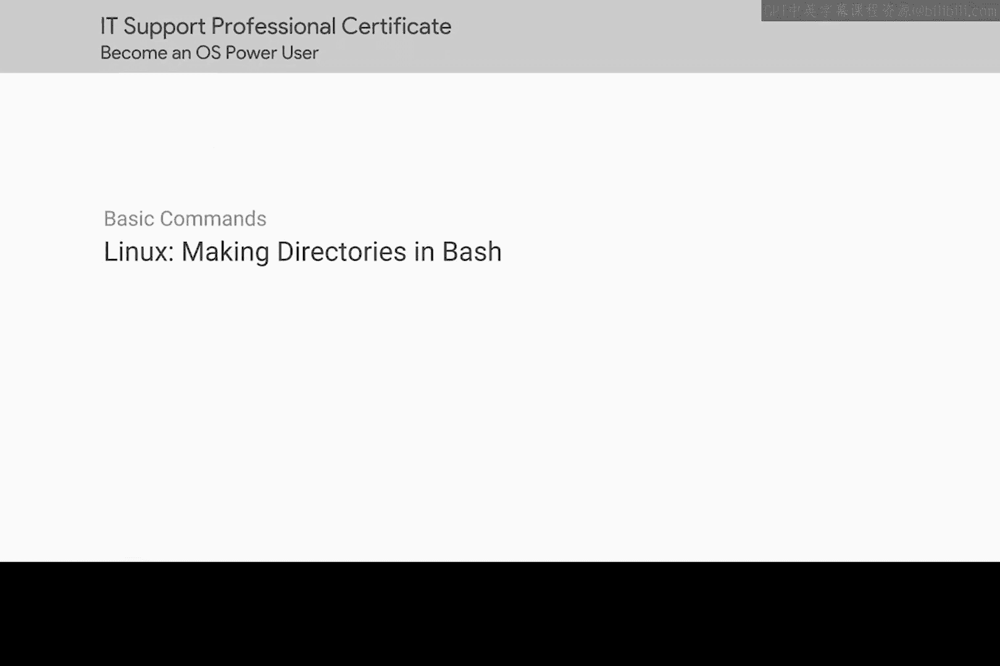
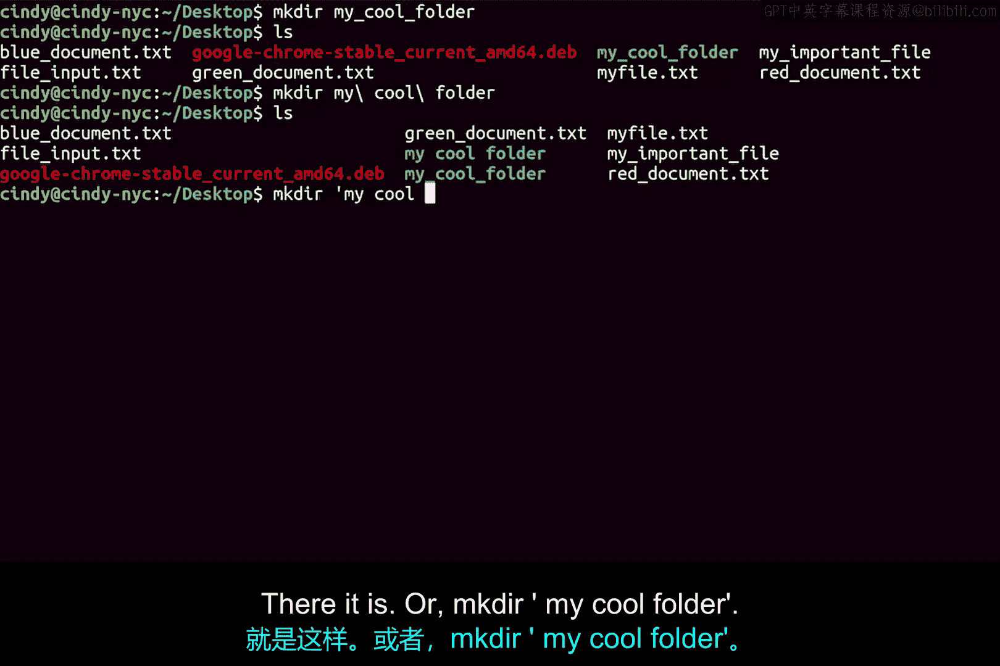

# 103：在Bash中创建目录

在本节课中，我们将学习如何在Linux的Bash命令行环境中创建新的目录。我们将重点介绍创建带空格目录的两种方法，并比较Linux与Windows在命令语法上的异同。



## 概述

在Bash中创建新目录的命令与在Windows中相同。

## 创建目录的基本命令

在Bash中，创建新目录的命令是 `mkdir`，这与Windows系统下的命令一致。

让我们使用 `mkdir` 命令创建一个名为“My cool folder”的新目录。

现在，我们可以验证“My cool folder”目录是否已成功创建在我们的桌面位置。

## 处理带空格的文件名

与Windows系统使用反引号来转义字符不同，在Bash中，你可以使用反斜杠来转义空格等特殊字符。

类似于Windows，你也可以使用引号将整个文件名包裹起来。

## 实践：创建带空格的目录

那么，你认为在Linux中如何创建一个名为“My cool folder”的目录呢？

以下是两种正确的方法：



第一种方法是使用反斜杠转义空格：
```
mkdir My\ cool\ folder
```

第二种方法是使用引号包裹整个名称：
```
mkdir "My cool folder"
```

如果你猜到了这些方法，你是正确的。如果你猜错了，也没有关系，可以重新观看本视频，以便更好地理解我们是如何得出这些结论的。

## 总结

本节课我们一起学习了在Linux Bash中创建目录的命令 `mkdir`，并掌握了两种处理目录名中空格的方法：使用反斜杠转义或使用引号包裹。理解这些基础操作是熟练使用命令行环境的重要一步。