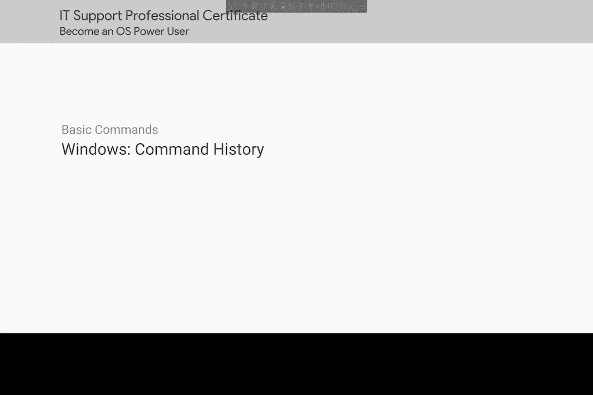
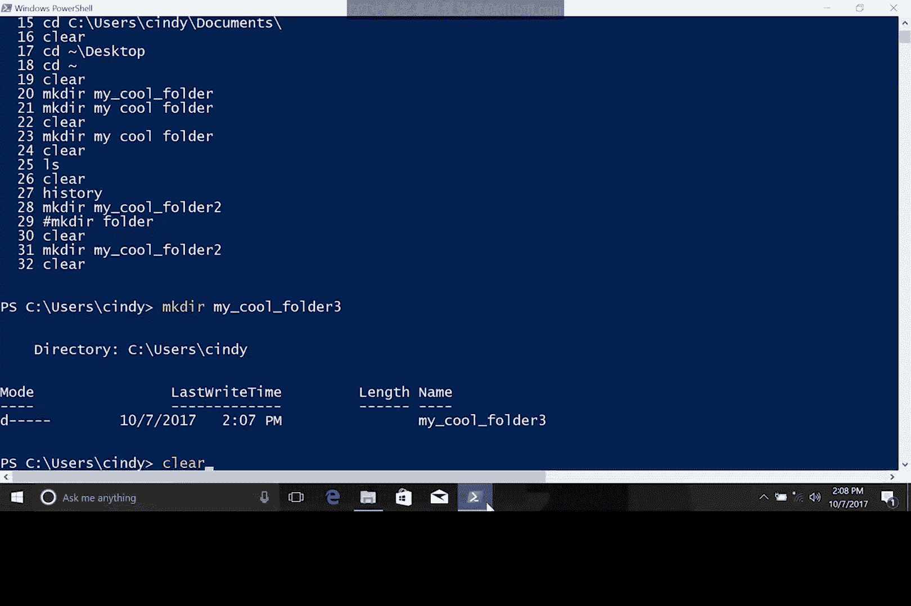

# 104：Windows命令历史 🔍

在本节课中，我们将学习PowerShell中一个非常实用的功能——命令历史。这个功能能帮助我们快速查找和重用之前输入过的命令，从而提升工作效率。我们将了解如何查看历史命令、如何快速调用它们，以及如何清理命令行界面。

---

上一节我们介绍了如何在PowerShell中创建目录。本节中，我们来看看如何利用命令历史功能，避免重复输入相同的命令。

每次在PowerShell中输入命令时，该命令都会被保存到内存中，并添加到一个特殊的文件中。你可以使用`history`命令来查看之前输入过的命令列表。

以下是查看历史命令的步骤：
1.  在PowerShell中输入`history`。
2.  终端会显示一个之前输入过的命令列表。

仅仅查看列表本身作用有限。命令历史更实用的用法是让我们快速滚动浏览这些命令并再次使用它们。

我们可以使用键盘上的**上箭头**或**下箭头**键来滚动浏览这些命令。例如，按上箭头键可以找到之前输入过的`mkdir mycoolfolder`命令。

无需重新输入整个命令来创建新文件夹，我只需在之前的命令后追加数字“2”。这样，无需重复输入所有内容，一个新文件夹就创建好了。

你甚至可以使用快捷键**Ctrl+R**来搜索之前使用过的命令。按下快捷键后，开始输入你想查找的命令片段，它会显示匹配的结果。例如，搜索“folder”一词，就能看到之前使用过的`mkdir`命令。

如果你使用的是旧版本的PowerShell，它可能没有**Ctrl+R**功能。在这种情况下，你可以输入井号`#`，后跟旧命令的某个部分，然后使用**Tab**键补全来循环浏览历史记录中的项目。

在PowerShell中工作时，命令历史功能、Tab键补全和`get-help`命令将成为你最好的帮手。请熟练掌握它们。

---

我们的命令行界面现在看起来有点杂乱，很难看清当前的位置。因此，让我们清理一下界面。我们可以使用`clear`命令来实现。这个命令不会清除你的历史记录，它只是清空屏幕上的输出。

现在，界面看起来清爽多了。

---

本节课中，我们一起学习了PowerShell的命令历史功能。我们掌握了如何使用`history`命令查看列表、用方向键滚动命令、用**Ctrl+R**搜索历史，以及用`clear`命令清理屏幕。熟练运用这些技巧将极大提高你在命令行环境下的操作效率。