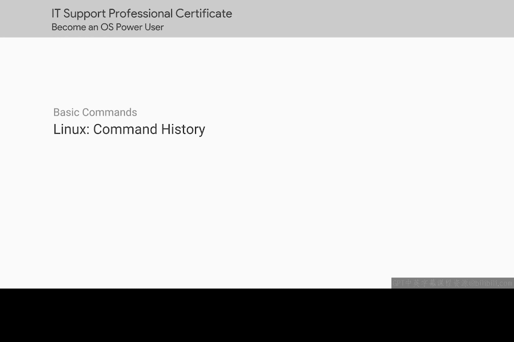
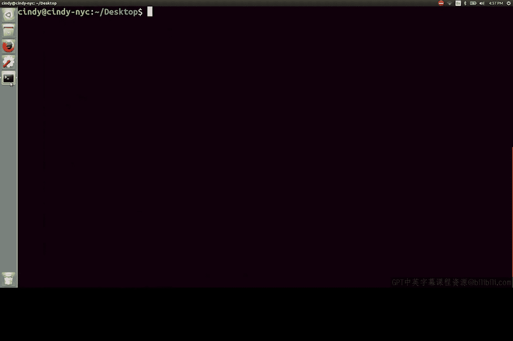

# 105：命令历史与终端控制 🐧

在本节课中，我们将学习Linux系统中两个非常实用的功能：命令历史记录和终端屏幕控制。掌握这些技巧能显著提高你在命令行环境下的工作效率。

## 命令历史记录

上一节我们介绍了基本的命令行操作，本节中我们来看看如何利用命令历史功能。

Linux系统中使用的`history`命令与Windows系统中的完全相同。执行此命令可以查看你之前输入过的所有命令列表。

从历史记录中，我们可以使用键盘的**上箭头**和**下箭头**键来快速浏览和选择之前执行过的命令。

你甚至可以使用`Ctrl + R`组合键来搜索你的命令历史记录。这是一个非常强大的功能，可以让你快速定位并重新执行过去输入过的复杂命令。

## 控制终端显示

了解了如何追溯过去的命令后，我们来看看如何管理当前的终端界面。

当终端屏幕上充满了之前命令的输出，显得杂乱时，你可能希望清理它。那么，你认为应该怎么做呢？

没错，就是使用`clear`命令。这个命令会清空当前终端屏幕的所有内容，给你一个干净的工作区。

以下是本节课涉及的核心命令总结：
*   `history`： 显示命令历史列表。
*   `上/下箭头键`： 浏览历史命令。
*   `Ctrl + R`： 搜索命令历史。
*   `clear`： 清空终端屏幕。

本节课中我们一起学习了Linux命令历史功能的使用方法，包括查看、浏览、搜索历史命令，以及使用`clear`命令来保持终端界面的整洁。这些工具是高效使用命令行环境的基础。