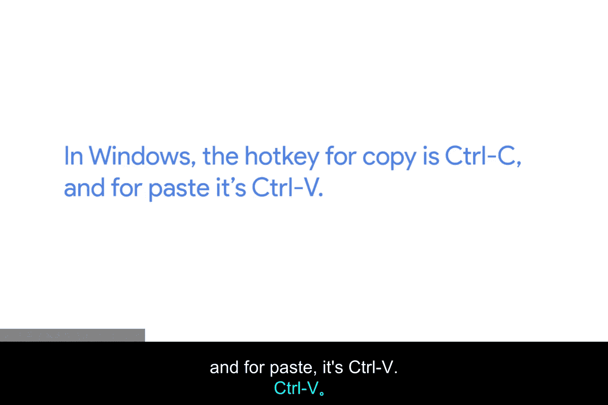
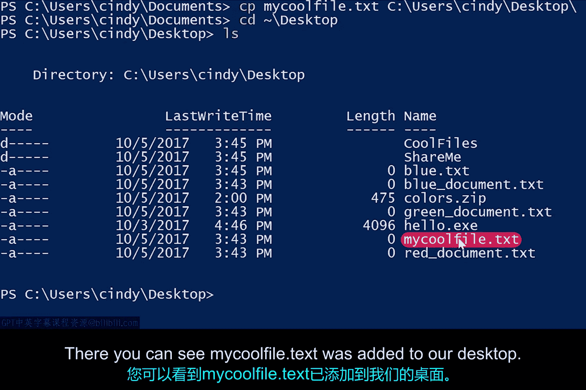
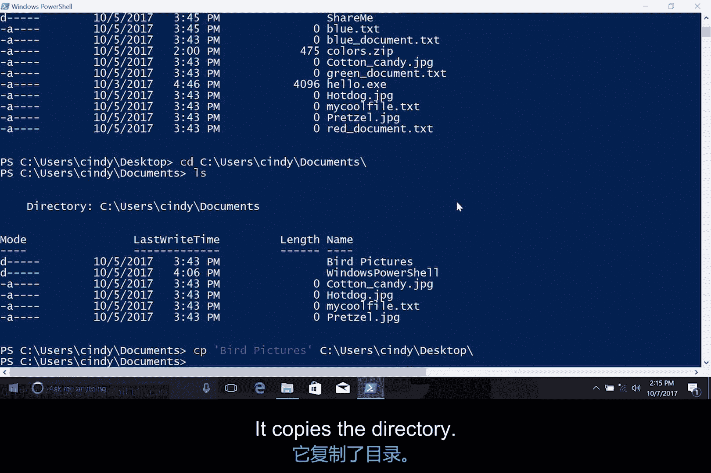
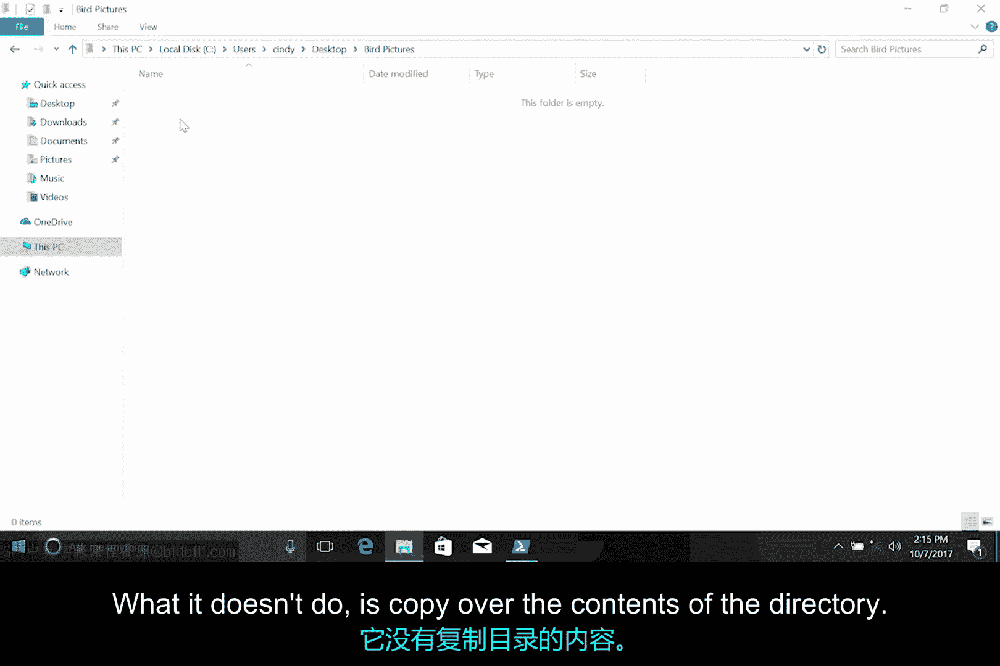
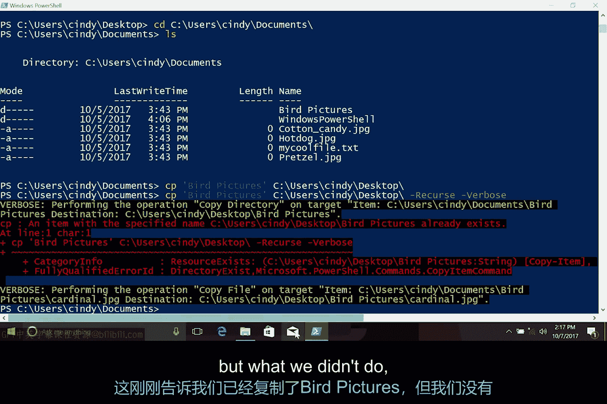

# 106：Windows文件与目录复制操作 🗂️

在本节课中，我们将学习如何在Windows系统中复制文件和目录。我们将涵盖图形界面操作、PowerShell命令，以及如何使用通配符和参数来高效地批量复制文件和包含内容的目录。

## 图形界面复制操作 🖱️

我们已经创建了一些文件和目录，但还需要更多。我们不想从头开始创建所有内容，所以让我们在Windows图形界面中进行复制。

以下是操作步骤：
*   右键点击目标文件或目录。
*   选择“复制”。
*   在目标位置右键点击，选择“粘贴”。



你也可以使用热键来提高效率。热键是Windows中用于执行特定任务的键盘快捷键。复制操作的热键是 **`Ctrl + C`**，粘贴操作的热键是 **`Ctrl + V`**。


## 使用PowerShell复制文件 💻

上一节我们介绍了图形界面的复制方法，本节中我们来看看如何在PowerShell中使用命令完成复制。

在PowerShell中，用于复制文件的命令是 **`cp`**。使用此命令时，我们需要指定要复制的源文件路径以及目标路径。



例如，让我们将 `myCoolFile.txt` 复制到桌面。执行命令后，你可以在桌面上看到 `myCoolFile.txt` 文件。

```
cp .\myCoolFile.txt C:\Users\[用户名]\Desktop\
```

我有好几个文件需要移动，但我不想一遍又一遍地重复运行这个命令。


## 使用通配符批量复制 🃏

为了高效地一次性复制多个文件，我们可以使用通配符。通配符是一种用于根据特定模式选择文件的字符。

假设你想复制所有JPEG格式的图片文件到“我的文档”目录。文件夹里有名为 `hotdog.jpg`、`cottoncandy.jpeg` 和 `pretzel.JPEG` 的文件。我需要想出一个模式来选中所有这些文件。

除了都以美食命名外，它们的共同点是什么？是 `.jpg` 或 `.jpeg` 扩展名。实际上，在 `.jpg` 文件扩展名之前的任何内容都无关紧要。这就是星号 `*` 通配符的作用，它代表“任何内容”。

本质上，我是在说：选择所有符合“任何内容+.jpeg”模式的文件。因此，要复制文件夹中所有JPEG文件，我可以使用以下命令：

```
cp *.jpeg C:\Users\[用户名]\Documents\
```

现在，我们不再需要逐个复制文件，而是可以使用单个命令获取所有需要的文件。目前，我们将使用的唯一选择器是代表“所有”的星号 `*`。


## 复制目录及其内容 📁

接下来，假设我想复制一个目录。我将尝试将一个名为 `BirdPictures` 的文件夹复制到桌面。

让我们回到文档目录。这是 `BirdPictures` 文件夹，现在将其复制到桌面。

```
cp .\BirdPictures\ C:\Users\[用户名]\Desktop\
```



这个命令完全按照我们的指令执行：它复制了目录。




然而，这个目录是空的。它没有做的是复制目录内的内容。


要复制目录的内容，你需要使用另一个命令参数：**`-Recurse`**（递归）。`-Recurse` 参数会列出目录的内容，然后如果该列表中有任何子目录，它会为每个子目录递归或重复目录列表过程。

我们需要将 `-Recurse` 参数与 `copy` 命令一起使用，以连同目录本身一起复制目录的内容。我们还将使用一个新参数 **`-Verbose`**（详细）。默认情况下，除非有错误，否则 `copy` 命令不会向命令行界面输出任何内容。当我们使用 `cp -Verbose` 时，它会为正在复制的目录中的每个文件输出一行信息。

让我们试一下：

```
cp .\BirdPictures\ C:\Users\[用户名]\Desktop\ -Recurse -Verbose
```

这条消息说明我们已经复制了 `BirdPictures` 目录，但我们之前没有做的是复制里面的文件，现在文件就在这里了。



现在，目录及其所有内容都已成功复制到我的桌面。


## 总结 📝

本节课中我们一起学习了Windows环境下的文件与目录复制操作。我们从图形界面的基本复制粘贴操作开始，介绍了快捷键 **`Ctrl+C`** 和 **`Ctrl+V`**。接着，我们深入PowerShell，学习了使用 **`cp`** 命令进行复制，并通过 **`*`** 通配符实现了文件的批量操作。最后，我们掌握了复制目录及其内部所有内容的关键，即使用 **`-Recurse`** 参数，并结合 **`-Verbose`** 参数来查看详细的复制过程。这些技能将帮助你更高效地管理文件和目录。