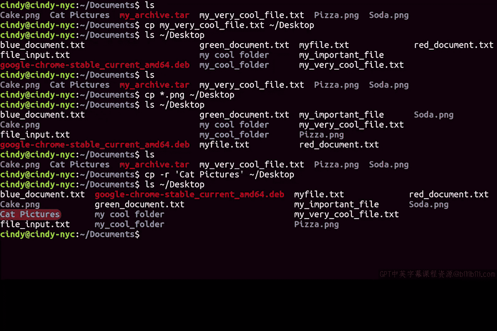

# 107：复制文件和目录 📂


在本节课中，我们将学习如何在Linux的Bash命令行环境中复制文件和目录。我们将了解基本的复制命令、使用通配符进行模式匹配，以及复制目录所需的特殊参数。

## 概述

在Bash中，复制文件所使用的命令与Windows命令行中的命令完全相同。这为熟悉Windows操作的用户提供了便利。本节我们将通过具体示例，演示如何使用`copy`命令及其相关参数。

## 复制单个文件

首先，我们来看一个简单的目录。假设我们想将名为`my_very_cool_file.txt`的文件复制到桌面目录。

执行命令后，文件便成功复制到了桌面。

## 使用通配符复制多个文件

与Windows命令类似，我们也可以使用星号（`*`）通配符来匹配特定模式的文件。

考虑到这个命令与Windows的复制命令相似，你认为我们可以如何复制当前目录下所有`.png`格式的文件呢？

假设目录中有`pizza.png`、`soda.png`、`cake.png`等文件，我们可以使用以下命令模式：
```bash
copy *.png Desktop/
```
以下是具体步骤：
1.  使用`*.png`匹配所有PNG文件。
2.  指定目标目录为`Desktop/`。

现在，再次查看桌面目录，所有匹配的`.png`文件都已成功复制过去。

## 复制整个目录

在Bash中，复制目录时同样适用与文件相似的规则。但是，如果我们想复制一个目录及其内部的所有内容，就必须使用递归复制。

递归复制的命令标志是 `-R`（或 `-r`）。

例如，如果我想将名为`cat_pictures`的文件夹复制到桌面，可以执行如下操作：
```bash
copy -R cat_pictures/ Desktop/
```
执行后，整个`cat_pictures`目录及其所有子文件和子文件夹便完整地复制到了桌面位置。

## 总结



本节课我们一起学习了Linux Bash环境下的复制操作。我们掌握了使用`copy`命令复制单个文件，利用`*`通配符批量复制特定类型的文件，以及通过`-R`参数递归复制整个目录及其内容。这些是文件管理中最基础且重要的命令。