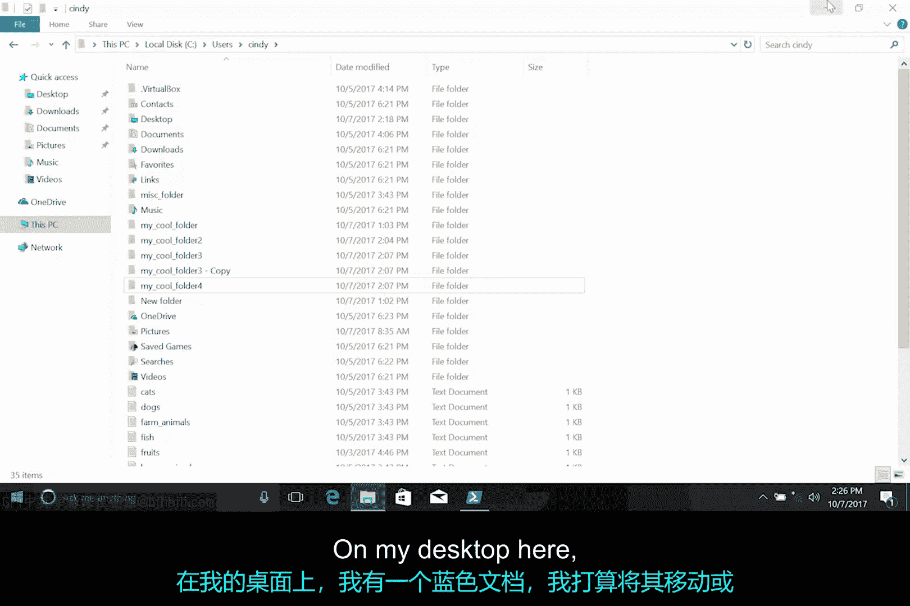
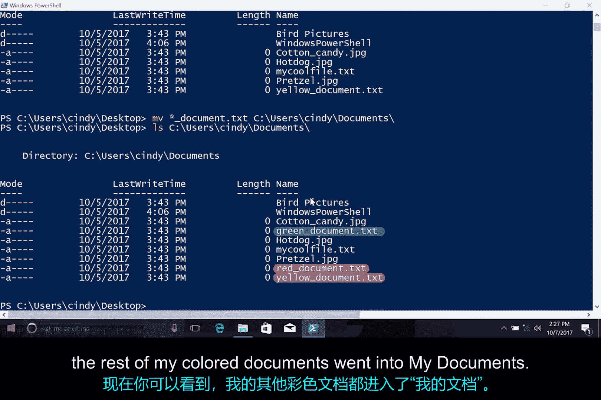

# 108：Windows中移动与重命名文件

在本节课中，我们将学习如何在Windows系统中移动和重命名文件与目录。我们将涵盖图形用户界面（GUI）和命令行两种操作方式，并介绍如何使用通配符批量处理文件。

## 概述

之前我们已经讨论了如何创建和复制文件与目录。本节中，我们将探讨如何重命名已创建的项目，以及如何将文件移动到不同的目录中。我们将从图形界面操作开始，然后深入命令行工具的使用。

## 在图形用户界面中重命名文件

在Windows图形用户界面中，重命名文件的操作非常直观。以下是具体步骤：

1.  在文件或文件夹上单击鼠标右键。
2.  从弹出的上下文菜单中选择“重命名”选项。
3.  输入新的名称并按回车键确认。

## 在命令行中移动与重命名文件

在命令行环境中，我们使用 `Move-Item` 命令（或其别名 `mv`）来重命名或移动文件。这个命令的功能非常灵活。

### 重命名文件（不改变位置）

`Move-Item` 命令允许我们在不改变文件存储目录的情况下，仅对其重命名。其基本语法是：

```powershell
Move-Item -Path “原文件路径\原文件名” -Destination “原文件路径\新文件名”
```

例如，将桌面上的“blue_document.txt”重命名为“yellow_document.txt”：



```powershell
Move-Item -Path “C:\Users\用户名\Desktop\blue_document.txt” -Destination “C:\Users\用户名\Desktop\yellow_document.txt”
```

执行后，桌面上的“blue_document”文件将更名为“yellow_document”。

### 将文件移动到其他目录

顾名思义，`Move-Item` 命令的核心功能是移动文件。我们可以将文件从一个目录转移到另一个目录。

例如，将桌面的“yellow_document.txt”移动到“我的文档”文件夹：

```powershell
Move-Item -Path “C:\Users\用户名\Desktop\yellow_document.txt” -Destination “C:\Users\用户名\Documents\”
```

执行命令后，可以使用 `dir` 命令在目标目录中验证文件是否已成功移动。

### 使用通配符批量移动文件

`Move-Item` 命令的强大之处在于支持使用通配符（如 `*`）来批量操作多个文件。

例如，将桌面上所有以“document”结尾的文件移动到“我的文档”文件夹：

```powershell
Move-Item -Path “C:\Users\用户名\Desktop\*document.*” -Destination “C:\Users\用户名\Documents\”
```

这条命令会匹配桌面所有文件名包含“document”的文件，并将它们全部移动到指定目录。



## 总结

本节课我们一起学习了在Windows系统中管理文件的两种重要操作：移动与重命名。我们了解到，在图形界面中可以通过右键菜单轻松完成重命名，而在命令行中，`Move-Item` 命令是一个多功能工具，既能实现重命名（通过指定新路径下的新文件名），也能将文件移动到不同位置，并且配合通配符可以高效地处理批量文件。掌握这些技能将帮助你更灵活地组织和管理计算机中的文件。