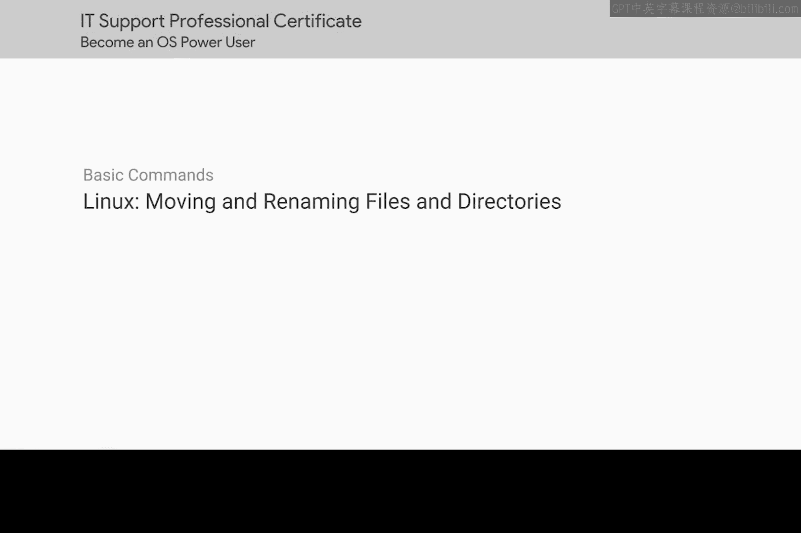
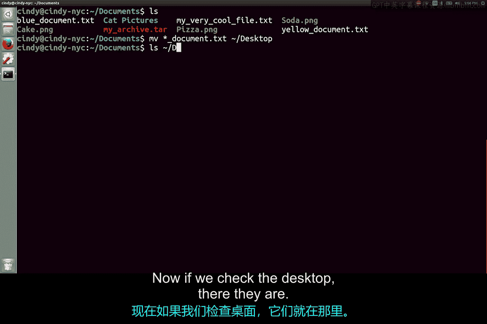

# 109：移动与重命名文件及目录 📂

在本节课中，我们将学习如何在 Linux 系统中使用 `mv` 命令来移动和重命名文件与目录。这是文件管理中的一项基础且重要的操作。



## 命令概述

`mv` 命令在 Linux 中用于移动或重命名文件和目录。其基本语法是：
```bash
mv [源文件或目录] [目标文件或目录]
```
同一个命令可以完成两种功能：重命名和移动。

## 重命名文件

上一节我们介绍了命令的基本概念，本节中我们来看看如何重命名一个文件。

操作过程如下：我将把我的 `red_document` 文件重命名为 `blue_document`。
```bash
mv red_document blue_document
```
现在我们可以看到，它已被重命名为 `blue_document`。

## 移动文件

学会了重命名，接下来我们看看如何移动文件。我将把重命名后的 `blue_document` 移动到 `documents` 文件夹中。
```bash
mv blue_document documents/
```
文件现在位于 `documents` 文件夹内。

## 使用通配符批量移动

与 Windows 系统类似，Linux 也可以使用通配符一次性移动多个文件。以下是具体操作方法：

我们将移动所有以下划线 `_` 开头的 `document` 文件到桌面。
```bash
mv *_document* ~/Desktop
```
现在检查桌面，可以看到这些文件已经全部被移动过来了。



---

本节课中我们一起学习了 Linux 下 `mv` 命令的核心用法，包括重命名单个文件、移动文件到指定目录，以及利用通配符高效地批量移动文件。掌握这些操作是进行有效文件管理的基础。