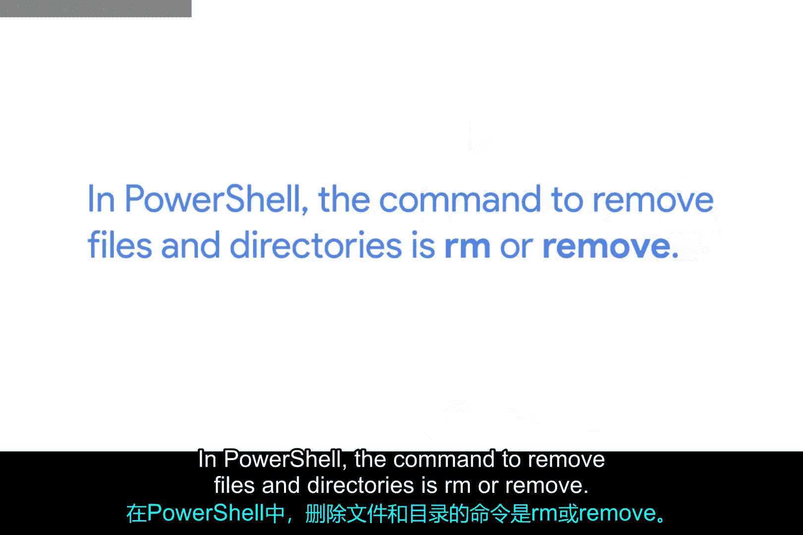
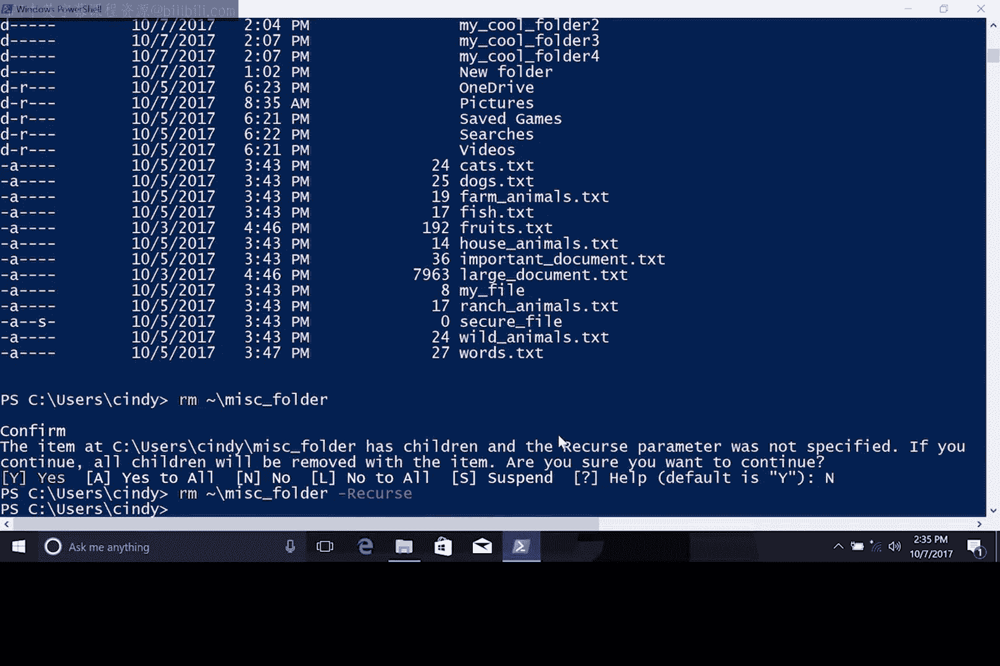

**Windows 操作系统基础：第 2 课：文件与目录管理**

在本节课中，我们将学习如何在 Windows 系统中删除文件和目录。我们将从图形用户界面（GUI）的基本操作开始，然后深入探讨在 PowerShell 中使用命令行进行删除操作的方法、注意事项以及相关的权限概念。

---

上一节我们介绍了如何列出、创建和移动文件与目录。本节中，我们来看看如何删除它们。

在 Windows 图形界面中，如果你想删除一个文件或文件夹，只需右键点击并选择“删除”。被删除的文件会进入“回收站”，你可以在桌面上找到它。

如果你想恢复回收站中的文件，可以右键点击该文件并选择“还原”。但请注意，如果你清空了回收站，将无法再找回那些文件。

---



在 PowerShell 中，删除文件和目录的命令是 `rm` 或 `Remove-Item`。使用 `Remove` 命令时需要格外小心，因为它**不会**使用回收站。一旦文件或目录被删除，它们将永久消失。

让我们删除 Home 目录中一个名为 `test1.txt` 的文件。首先，我们查看一下它是否存在。

```powershell
Get-ChildItem test1.txt
```

确认文件存在后，我们使用 `rm` 命令删除它。

```powershell
rm test1.txt
```

现在，这个文件已经被删除了。

---

`Remove` 命令如果使用不当，可能像一个危险的武器。幸运的是，系统有安全措施，只将删除权限授予真正被授权的用户。我们将在另一节课详细讨论文件权限，但这里先快速了解一下。

尝试删除一个名为 `Important_System_File.txt` 的文件。

```powershell
rm Important_System_File.txt
```

我收到一条错误信息，提示我没有权限删除此文件。在某些情况下（比如本例），是因为该文件被标记为系统文件。在其他情况下，可能是因为我在文件系统中没有足够的权限来删除它。

---

这次，假设我拥有正确的权限，但由于这是一个重要文件，PowerShell 希望确认我确实打算删除它。如果我使用 `-Force` 参数重复该命令，`Remove` 将继续执行并删除文件。

```powershell
rm Important_System_File.txt -Force
```

使用 `-Force` 参数后，可以看到文件被删除了。如果文件属于其他用户，或者我不是管理员，那么我可能没有删除该文件的正确权限。在这种情况下，我需要使用管理员账户来删除文件。

---

接下来，让我们尝试用 `Remove` 命令删除一个目录。这里，PowerShell 会再次询问我们是否真的打算这样做，因为目录中包含其他文件，而我们没有使用 `-Recurse` 参数。

系统会提示我们确认是否真的要删除该目录及其所有内容。我们可以选择“是”或“全是”以继续。我们也可以取消此命令，然后使用 `-Recurse` 参数再次运行它。这样，PowerShell 就知道我们理解此操作的后果。

让我们先取消这个操作，然后使用 `-Recurse` 参数重试。

```powershell
rm MyDirectory -Recurse
```

是的，现在目录被删除了。这就是 `Remove` 命令的基本用法。



---

**总结**

本节课中，我们一起学习了在 Windows 中删除文件和目录的方法。我们了解了图形界面下的删除与回收站机制，并重点掌握了在 PowerShell 中使用 `rm` 命令。关键点包括：命令行删除是永久性的、使用 `-Force` 参数绕过确认提示、使用 `-Recurse` 参数删除包含内容的目录，以及理解文件权限对删除操作的影响。由于此命令的永久性，在删除文件或目录时务必格外小心。