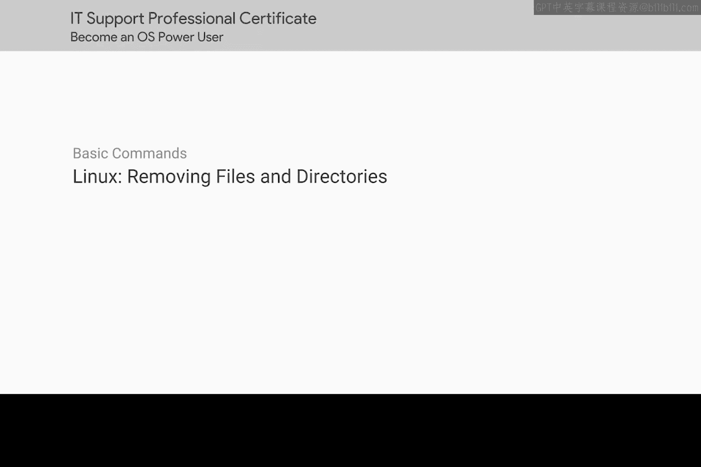
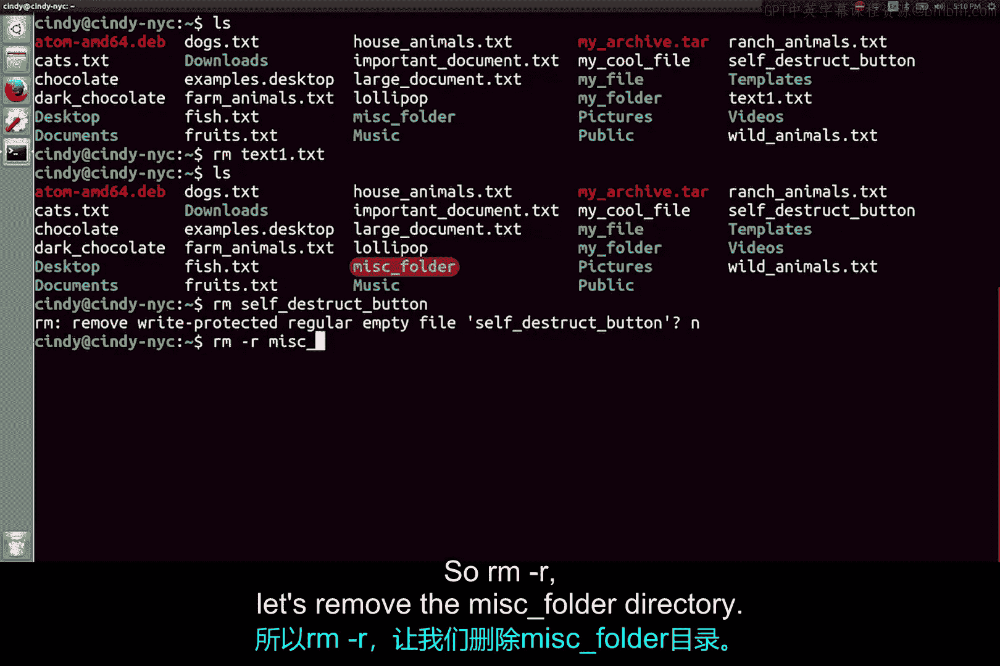

# 111：删除文件与目录




在本节课中，我们将学习如何在Linux系统中删除文件和目录。我们将介绍`rm`命令的基本用法、删除目录的特殊方法，以及使用该命令时需要注意的安全事项。

## 删除文件

在Linux中删除文件，与在Windows中类似，我们可以使用`rm`（即remove）命令。

以下是删除文件的基本命令格式：
```bash
rm [文件名]
```

例如，要删除名为`t1`的文件，只需执行：
```bash
rm t1
```
执行后，该文件即被删除。

与Windows系统类似，当我们尝试删除某些无权删除或不应删除的内容时，系统会给出提示信息。

## 删除目录

上一节我们介绍了如何删除单个文件，本节中我们来看看如何删除整个目录。

如果你认为删除目录也需要递归操作，那么你的推断是正确的。要删除一个目录及其包含的所有子目录和文件，需要使用`-r`（递归）选项。

以下是删除目录的命令格式：
```bash
rm -r [目录名]
```

例如，要删除名为`mi`的文件夹（目录），应执行：
```bash
rm -r mi
```



执行后，如果检查文件系统，会发现`mi`文件夹已经消失。

## 重要安全提示

请务必记住，在使用`rm`命令时，要格外小心，确保不会意外删除重要文件或目录。该命令删除的内容通常无法从回收站恢复。

本节课中我们一起学习了Linux下`rm`命令的使用。我们掌握了删除单个文件的方法，以及使用`rm -r`递归删除目录的操作。最重要的是，我们认识到使用此命令时必须保持谨慎，以避免数据丢失。