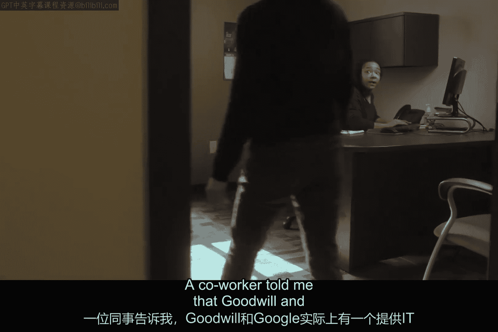
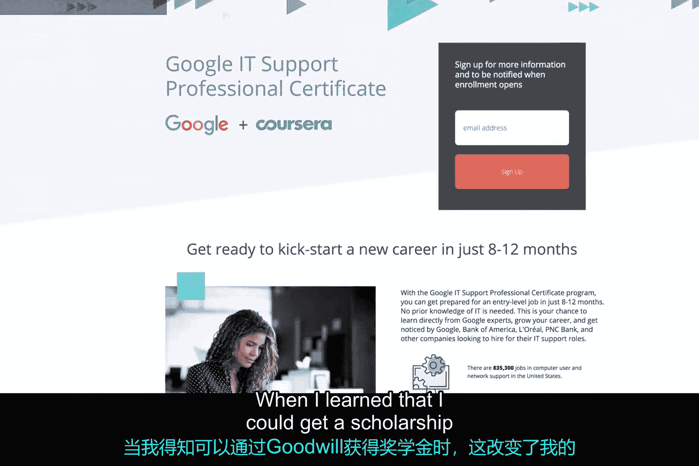
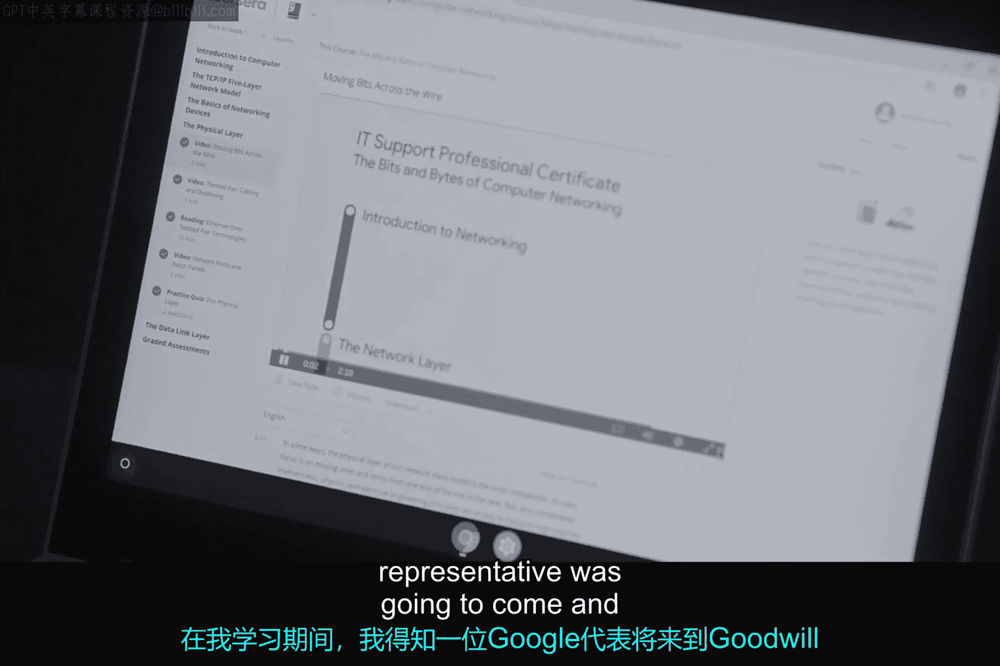
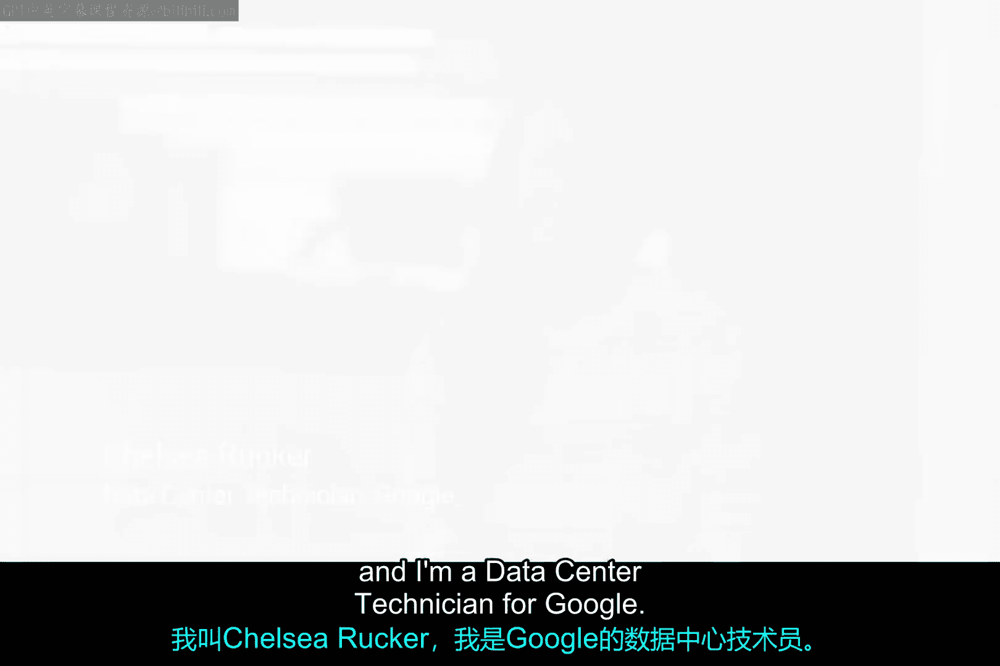

# 113：切尔西的转型之路 🚀

在本节课中，我们将通过切尔西的真实经历，了解如何利用职业培训项目实现人生转折，从困境走向科技行业。这个故事将展示决心、学习与外部支持如何共同作用，改变一个人的职业轨迹。

## 逆境中的榜样力量

作为母亲，最重要的事情是以身作则。当你一无所有时，你会怎么做？一年前，切尔西发现自己和女儿们无家可归。

整个庇护所的经历对她而言是巨大的挑战。为了孩子们，她不断告诉她们，她们只是在度假，等待房子准备好。这是她不得不做的最艰难的事情。切尔西在东纳什维尔的住房项目中长大，因此周围从未有人谈论过职业道路。她不知道该怎么办，也不知道该去哪里，但她不断提醒自己：孩子们在看着你如何处理这件事，你必须为这些女孩树立一个坚实的榜样。

## 发现机遇：善意与谷歌的合作项目

大多数人认为Goodwill只是一家零售商店，但它远不止于此。当切尔西住在庇护所时，她决定联系Goodwill的职业中心，并实际上得到了一份办公室助理的工作。一位同事告诉她，Goodwill和谷歌实际上有一个提供IT培训的项目。这个项目被称为**IT支持专业证书课程**。

当切尔西得知她可以通过Goodwill获得奖学金时，这改变了她的人生。

切尔西正是Goodwill旨在支持的那类人。因此，多亏了Google.org的援助，他们启动了Goodwill数字职业加速器。利用Grow with Google的工具和资源，Goodwill数字职业加速器专注于连接超过一百万人，为他们提供在数字职业中晋升所需的技能。谷歌IT支持专业证书为此提供了一个绝佳的基石。

## 刻苦学习与主动出击

切尔西加入了“凌晨4点俱乐部”。她会在女儿们睡觉时起床做功课。在学习期间，她得知一位谷歌代表将来到Goodwill做一次演讲，她必须参加。在Goodwill的活动上见到切尔西时，她真的脱颖而出。她提出了一些非常有趣的问题，热情是切实可感的，因此鼓励她给我发一份简历。

## 克服自我怀疑，赢得机会

当切尔西得到面试机会时，她非常紧张，不确定自己是否足够优秀。在面试过程中，切尔西不仅展示了她所掌握的基础技术知识，还展现了她的主动性，而这正是我们在数据中心工作人员中所需要的。因此，我们录用她加入了团队。

切尔西绝对热爱她的工作。当她第一次得到这份工作时，她的女儿说：“妈妈，你得到了这份工作，这意味着我们将永远有一个家了。”在与Google.org合作的一年里，我们已经看到超过25万人提升了他们的数字技能，近3万人走上了工作岗位。

## 展望未来

一年前，切尔西不确定自己的生活将走向何方，她以为一切都分崩离析。现在，她对未来充满希望。她希望女儿们知道，她们可以实现为自己设定的任何目标。切尔西的目标是成为一名开发人员，这就是她想做的事。她已经走了这么远，她计划走向星辰大海。

切尔西的名字是切尔西·鲁尔，她是谷歌的一名数据中心技术员。

---

本节课中我们一起学习了切尔西如何从无家可归的困境中，通过Goodwill与谷歌合作的IT支持专业证书项目，抓住学习机会，凭借主动性和刻苦努力，最终成功转型为一名谷歌数据中心技术员的故事。她的经历证明了教育、社区支持和个人决心在职业转型中的强大力量。