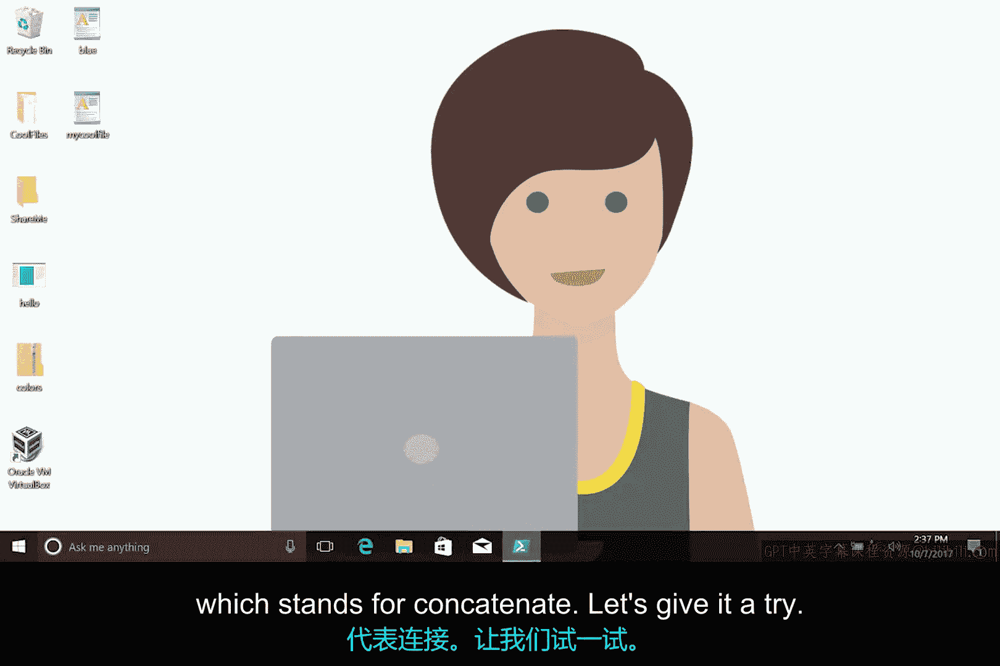
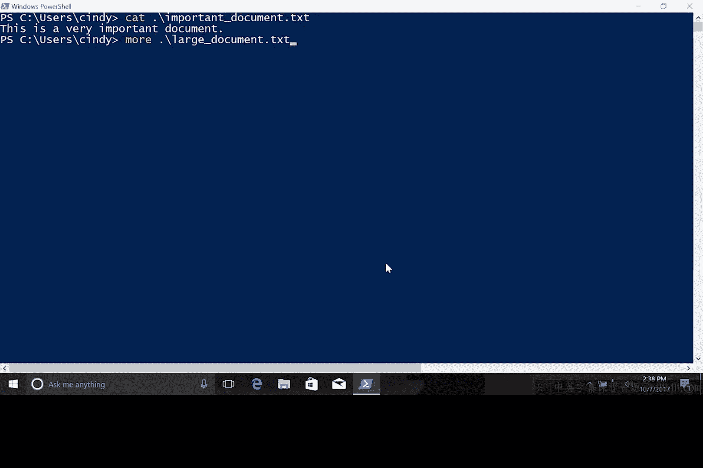
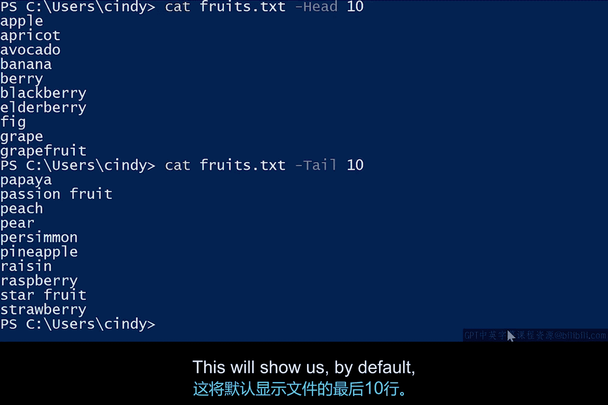

# 114：在Windows中显示文件内容 📄

在本节课中，我们将学习如何在Windows系统中查看和编辑文件的内容。我们将从图形用户界面（GUI）的基本操作开始，然后深入探讨在PowerShell中使用命令行工具来高效地查看文件。

## 概述

上一节我们介绍了文件和目录导航的基础知识。本节中，我们将学习如何查看文件内容、搜索文本，以及使用不同的工具来满足不同的查看需求。

## 在Windows GUI中查看文件

如果我们想打开一个文件并查看其内容，只需双击该文件即可。根据文件类型，Windows会使用默认的应用程序将其打开。例如，文本文件默认会在名为“记事本”（Notepad）的应用程序中打开。

我们可以根据需要更改默认的应用程序。以下是更改默认应用程序的步骤：

1.  右键点击目标文件。
2.  在弹出的菜单中选择“属性”。
3.  在“属性”窗口中，找到“打开方式”选项。
4.  点击“更改”按钮，选择另一个文本编辑器，例如“写字板”（Wordpad）。

本课程中我们将处理的大多数文件都是文本文件和配置文件，因此我们将重点讨论这些文件，而非图像、音乐文件等。

## 在PowerShell中使用命令行查看文件



在PowerShell中查看文件内容非常简单，我们可以使用 `cat` 命令，它代表“连接”（concatenate）。让我们来尝试一下。

```powershell
cat .\sample.txt
```

这个命令会将文件的内容全部输出到我们的Shell窗口中。然而，对于较长的文件，这并不是最佳解决方案，因为它会持续输出内容直到整个文件显示完毕。



如果我们希望一次只查看一页文件内容，可以使用 `more` 命令。

```powershell
more .\sample.txt
```

`more` 命令会获取文件内容，但一旦填满终端窗口就会暂停。现在，我们可以按照自己的节奏来浏览文本。

当我们运行 `more` 命令时，会进入一个独立于Shell的程序。这意味着我们需要使用不同的按键来与 `more` 程序交互。

以下是 `more` 命令的常用交互按键：

*   **回车键（Enter）**：将文件内容向下推进一行。如果你想缓慢地浏览文件，可以使用此键。
*   **空格键（Space）**：将文件内容向下推进一页。这里的“一页”取决于你的终端窗口大小，`more` 会输出足够填满终端窗口的内容。
*   **Q键**：允许你退出 `more` 程序并返回到Shell。

如果我们想离开 `more` 命令并返回Shell，只需按下 **Q** 键即可。


## 查看文件的部分内容

如果我们只想查看文件的一部分内容呢？例如，我们想快速查看一个文本文件的前几行，而不想打开整个文件，只是想大致了解文档内容。这被称为查看文件的“头部”（head）。

为此，我们可以使用 `cat` 命令并加上 `-head` 参数。

```powershell
cat .\sample.txt -Head 10
```

这将显示文件的前10行。

那么，如果我们想查看文件的最后几行，即文件的“尾部”（tail）呢？我猜你已经知道我们要做什么了。

```powershell
cat .\sample.txt -Tail 10
```

默认情况下，这将显示文件的最后10行。



目前，这两个命令可能看起来对你没有立即可见的用处。但在接下来的课程中，当我们处理日志文件时，就会看到它们的巨大优势。

## 总结


本节课中，我们一起学习了在Windows系统中查看文件内容的多种方法。我们首先了解了如何在图形界面中通过双击打开文件，并可以更改默认的打开程序。接着，我们重点学习了在PowerShell中使用命令行工具：`cat` 命令用于显示整个文件，`more` 命令用于分页浏览，而 `cat -Head` 和 `cat -Tail` 则用于快速查看文件的开头或结尾部分。掌握这些方法将帮助你在未来的IT支持工作中更高效地处理文本和配置文件。