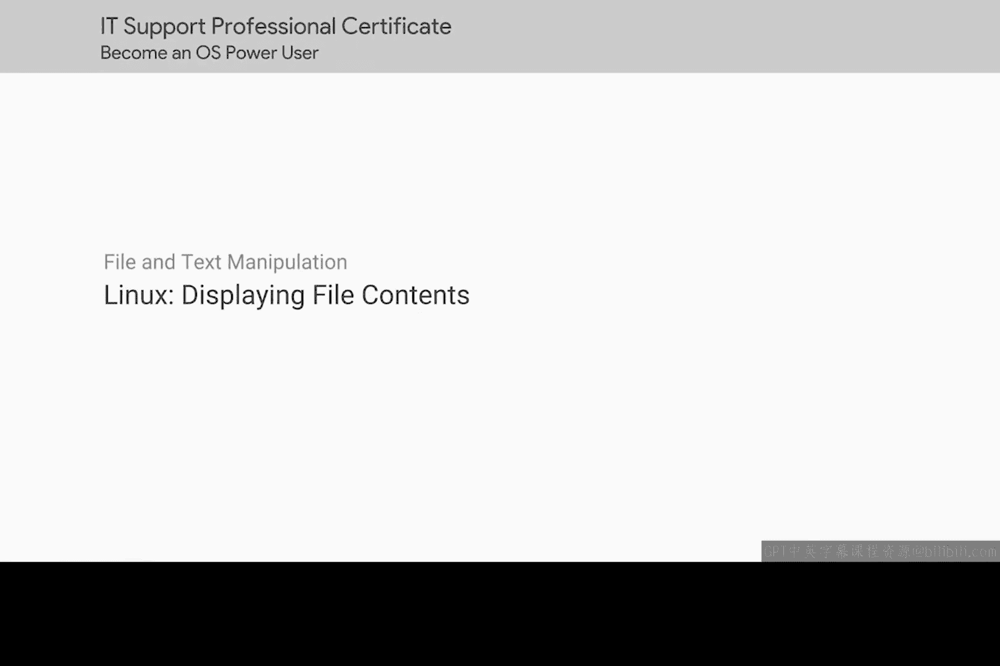
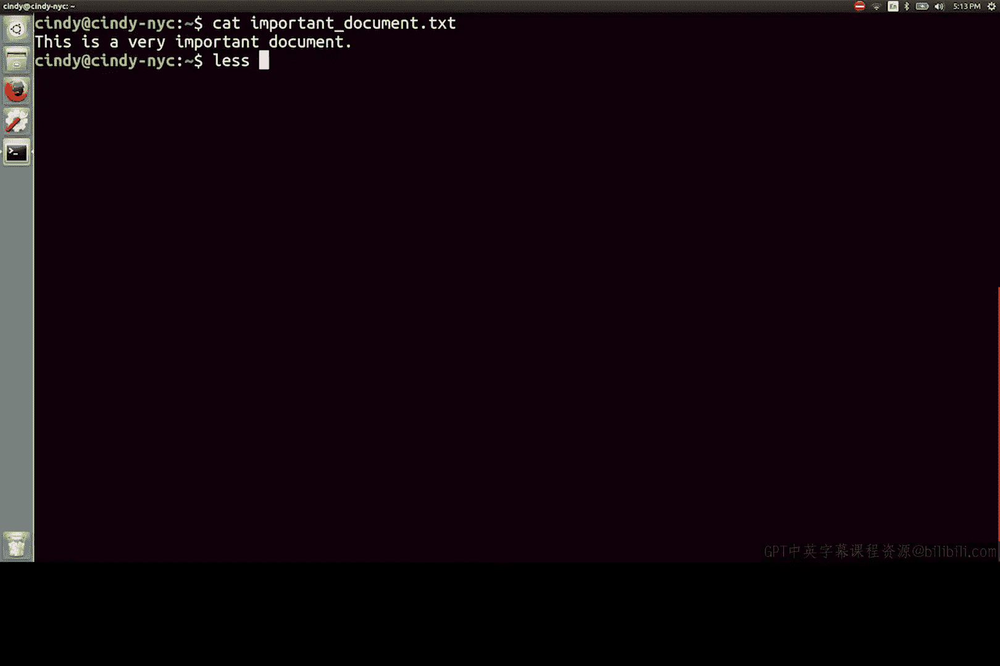
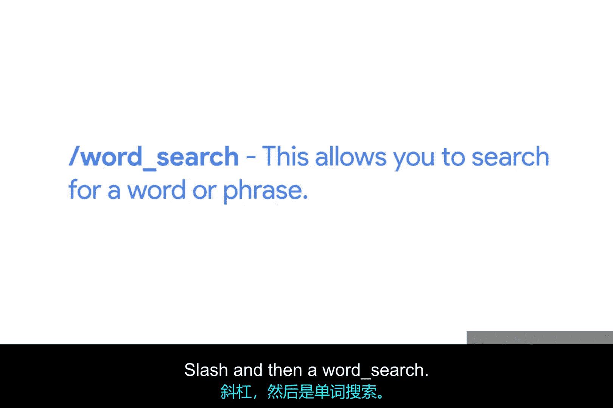
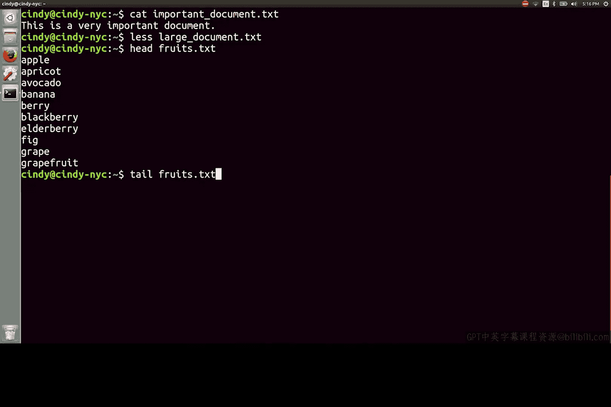

# 115：查看文件内容



在本节课中，我们将学习在Linux系统中查看文件内容的几种常用命令。我们将重点介绍`cat`、`less`、`head`和`tail`命令，并了解它们各自的适用场景和操作方法。

## 使用`cat`命令查看文件



`cat`命令是Linux中用于查看文件内容的基础工具。它的功能类似于Windows系统中的`type`命令。

`cat`命令的语法非常简单：
```bash
cat 文件名
```
例如，要查看名为`important_document.txt`的文件，可以输入：
```bash
cat important_document.txt
```

然而，`cat`命令在处理大型文件时表现不佳，因为它会一次性将整个文件内容输出到终端，导致内容滚动过快，难以阅读。

## 使用`less`命令浏览文件

为了更有效地查看大型文件，我们通常使用`less`命令。`less`的功能类似于Windows系统中的`more`命令，但提供了更多功能。

有趣的是，Linux中确实存在一个名为`more`的命令，但它正逐渐被功能更强大的`less`命令所取代。这正应了那句“少即是多”。

与`more`类似，使用`less`命令会进入一个交互式界面。以下是`less`工具中最常用的一些导航按键：



*   **上下方向键**：逐行滚动浏览文件。
*   **Page Up / Page Down键**：向上或向下翻页。
*   **g键**：跳转到文件的开头。
*   **G键（大写）**：跳转到文件的末尾。
*   **/键**：在文件中搜索。按下`/`键后，输入要查找的单词或短语，即可在文件中搜索匹配的内容。
*   **q键**：退出`less`界面，返回到命令行终端。

`less`命令因其强大的功能（如文件内搜索）而成为查看任意大小文件的优秀工具。作为一名IT支持专家，你无疑会经常使用这个命令。

## 使用`head`和`tail`命令查看文件首尾

除了查看整个文件，有时我们只需要查看文件的开头或结尾部分。

在Linux中，我们可以使用`head`命令来查看文件的开头，默认情况下它会显示文件的前10行。这与Windows系统中`type`命令配合`head`参数的功能类似。

如果我们想查看文件的最后几行，可以使用`tail`命令。默认情况下，`tail`命令会显示文件的最后10行。



本节课中我们一起学习了在Linux中查看文件内容的四种主要方法：使用`cat`快速查看小文件，使用`less`交互式浏览大文件，以及使用`head`和`tail`分别查看文件的开头和结尾部分。掌握这些命令将帮助你更高效地管理和排查系统文件。