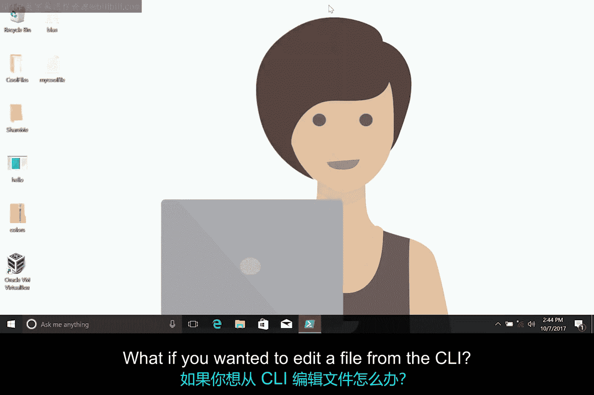
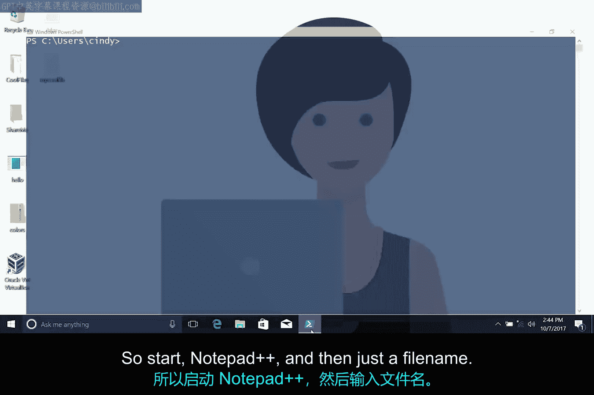
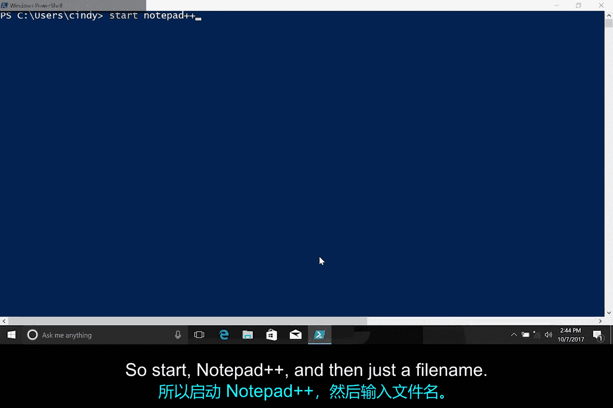
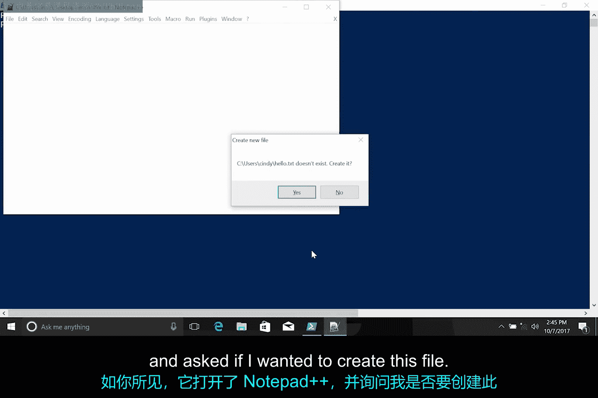

**IT支持：第2课：Windows修改文本文件** 🖥️

在本节课中，我们将学习如何在Windows操作系统中编辑文本文件。我们将介绍图形界面和命令行界面两种编辑方式，并了解一个功能强大的文本编辑器——Notepad++。

---

之前我们已经讨论了如何读取和修改文件，但尚未涉及如何编辑文件内容。接下来，你将学习如何编辑基于文本的文件。

我们之前使用Notepad查看文本文件。Notepad适合基础编辑，但在修改配置文件、脚本或其他复杂文本文件时，你可能需要功能更丰富的工具。

以下是Windows图形界面中一些优秀的编辑器。本次演示我们将使用Notepad++。

Notepad++（可通过补充阅读材料获取）是一款优秀的开源文本编辑器，支持多种文件类型。Notepad++可以打开多个文件和标签页，并为已知文件类型提供语法高亮功能，还具备一系列高级文本编辑特性。

语法高亮是许多文本编辑器提供的功能，它通过不同颜色和字体显示文本，帮助你区分不同类别的内容。

我们已在机器上安装Notepad++，你可以访问其官网进行相同操作。现在，你可以通过右键点击文件并选择“使用Notepad++编辑”来编辑任何文件。

😊



如果你想从命令行界面编辑文件呢？遗憾的是，PowerShell终端中没有默认的优秀编辑器，但我们可以从命令行启动Notepad++文本编辑器，并以此方式开始修改文本。




因此，启动Notepad++的命令是：

```powershell
start notepad++
```





然后只需加上文件名。如你所见，它打开了Notepad++并询问是否要创建此文件。如果你想了解专门在命令行界面中使用的文本编辑器，请查看关于高级文本编辑器VIm的补充阅读材料。



---


本节课中，我们一起学习了在Windows中编辑文本文件的两种方法：使用图形界面的Notepad++和从命令行启动编辑器。掌握这些技能将帮助你更高效地处理配置文件、脚本等文本任务。