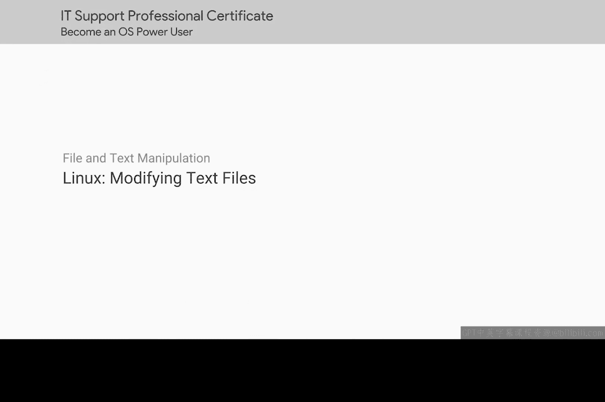
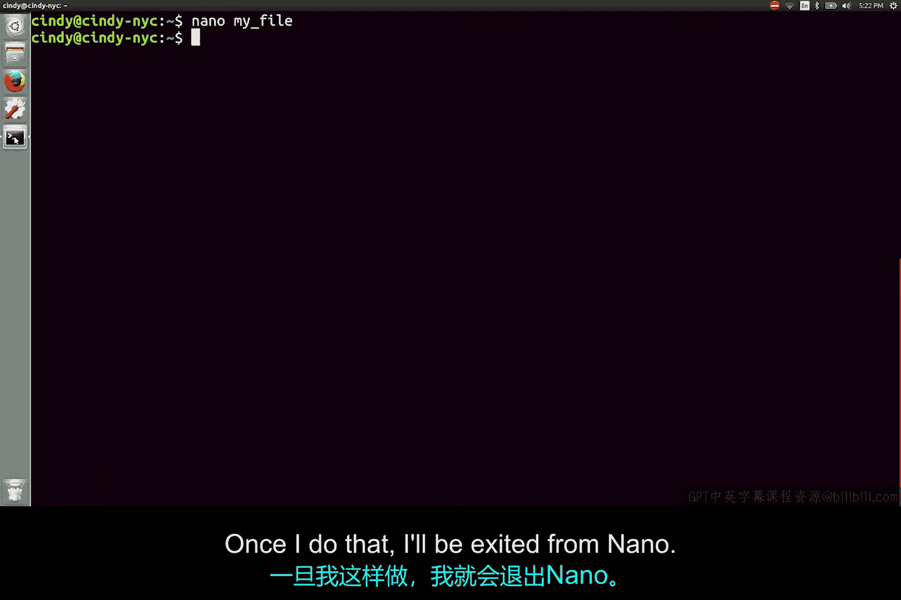

# 117：使用Nano编辑器修改文本文件



在本节课中，我们将学习如何在Linux系统中使用一个名为Nano的文本编辑器来修改文件内容。Nano是一个轻量级且广泛可用的工具，非常适合初学者快速上手。

## 为什么选择Nano？

Linux系统中有许多流行的文本编辑器可供选择。由于时间有限，我们无法逐一介绍。因此，我们将重点介绍一个几乎在所有Linux发行版中都能找到的编辑器：**Nano**。

Nano是一个极其轻量级但非常有用的文本编辑器。我们已在本视频的补充阅读材料中包含了它的详细信息，建议课后查阅。

## 启动与编辑文件

要使用Nano编辑文件，只需在终端中输入 `nano` 命令，后跟文件名。

以下是启动Nano编辑一个名为 `example.txt` 文件的命令：
```bash
nano example.txt
```
执行此命令后，系统将启动Nano程序并打开指定文件。从这里开始，您可以像使用其他任何文本编辑器一样开始编辑内容。

## 界面与基本操作

在Nano编辑器屏幕的底部，您会注意到一些选项提示，例如 `^G` 和 `^K`。这里的 `^` 符号代表键盘上的 `Ctrl` 键，所以 `^G` 即表示按下 `Ctrl+G`。

我们不会讨论所有选项，但有几个可能非常有用：
*   **`Ctrl+G`**：打开帮助页面。
*   **`Ctrl+X`**：当您想保存工作或退出Nano时使用。

## 实战：编辑并保存文件

现在，让我们实际操作一下，编辑一个文件并保存更改。

1.  使用 `nano` 命令打开您想要编辑的文件。
2.  在编辑器中进行所需的修改。
3.  完成编辑后，按下 `Ctrl+X` 准备退出。

此时，Nano会询问您是否要保存文件，或者退出并放弃更改。因为我想保存更改，所以按 `Y` 键确认保存。按下 `Y` 后，系统会退出Nano编辑器，返回到终端命令行。



## 验证更改

退出Nano后，我们可以验证文件是否已被成功修改。使用 `cat` 命令查看文件内容：
```bash
cat example.txt
```
如果文件内容显示了您刚才所做的修改，则说明操作成功。

## 总结与进阶

本节课中，我们一起学习了如何使用Nano编辑器在Linux中快速修改文本文件。Nano是一个超级有用的工具，尤其当您需要在Linux中快速使用一个文本编辑器时。

但是，如果您想成为一名真正的操作系统高级用户，我建议您阅读我提供的补充材料，以了解更多在业界广泛使用的文本编辑器，例如 **Vim** 或 **Emacs**。掌握这些工具将极大地提升您在命令行环境下的工作效率。