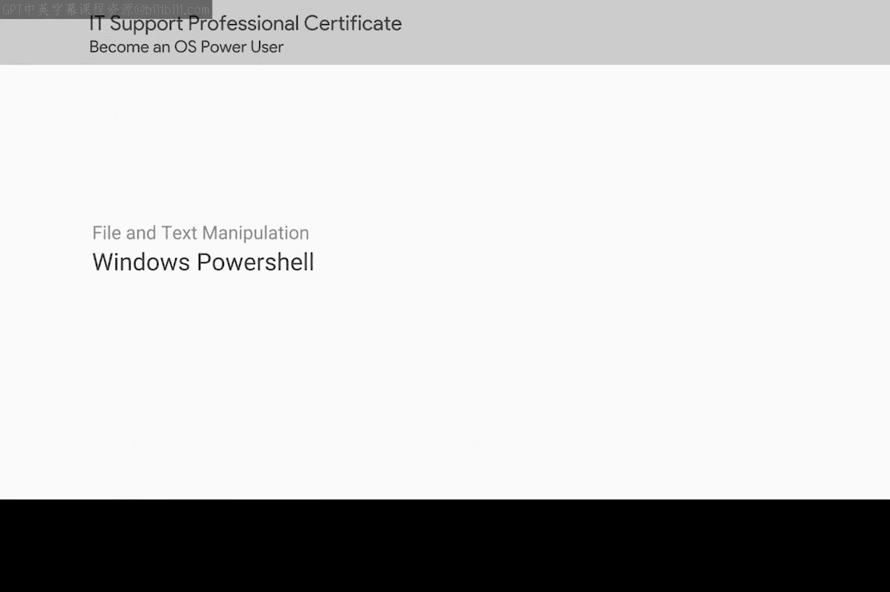
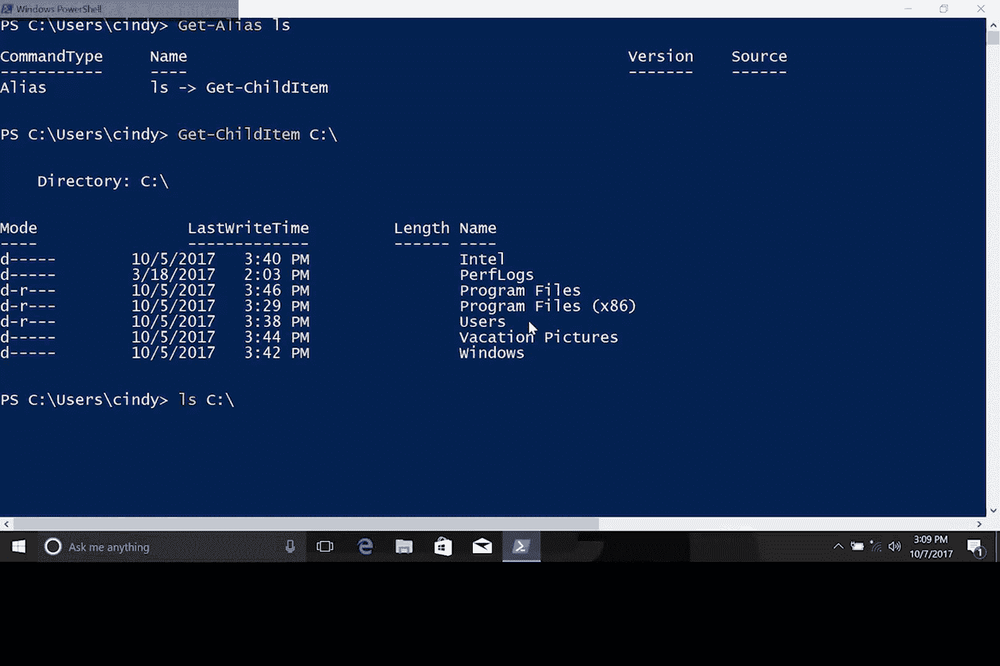
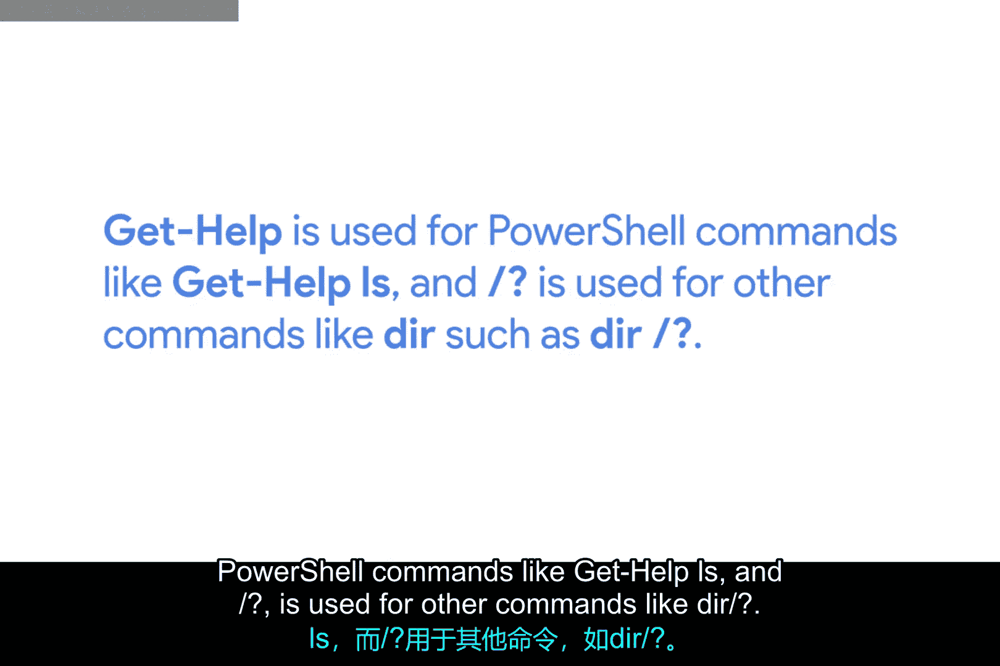

# 118：Windows PowerShell 命令详解 🖥️



在本节课中，我们将深入学习 Windows PowerShell 中的命令类型、别名机制以及如何获取命令帮助。我们将探讨 PowerShell 命令、命令别名以及传统的 Command.EXE 命令之间的区别与联系。

---

## 命令别名与实际 PowerShell 命令 🔄

到目前为止，我们在课程中一直使用 PowerShell 中的命令别名。

PowerShell 是一种复杂且功能强大的命令语言，同时也非常健壮。我们能够使用与 Linux 对应命令完全相同的常见别名。

但从现在开始，我们需要部署一些高级命令行功能，因此我们需要了解真正的 PowerShell 命令。

你已经见过一个真正的 PowerShell 命令示例：`Get-Help`。该命令用于查看关于命令的更多信息。

---

## 探索别名背后的真实命令 🔍

我们可以使用另一个 PowerShell 命令来查看我们一直在使用的别名（例如 `LS` 或 `List directory`）背后实际执行的 PowerShell 命令是什么。

我们可以使用 PowerShell 命令 `Get-Alias`。

有趣的是，当我们调用 `LS` 时，我们实际上是在调用 PowerShell 命令 `Get-ChildItem`。该命令获取或列出给定项（item）的子项（children），即文件和子目录。

让我们实际运行这个 `Get-ChildItem` 命令，参数为 `C:\`。

```powershell
Get-ChildItem C:\
```



你会看到这与运行 `LS C:\` 的输出相同。

---

## PowerShell 命令的特点 ✨

很好，PowerShell 命令非常长且具有描述性，这使得它们更容易理解。但这意味着在 CLI 交互式工作时需要大量额外的输入。对于常用命令，别名是在 PowerShell 中更快工作的好方法。

到目前为止，我们一直在使用别名，以帮助我们在命令行中快速上手。

---

## Windows 中的命令执行方式 🛠️

在 Windows 中，你基本上有三种不同的方式来执行命令：

1.  使用真正的 PowerShell 命令。
2.  使用相关的别名名称。
3.  使用 Command.EXE 命令。

另一种我们提到过但尚未详细讨论的方法是 Command.EXE 命令。Command.EXE 命令来自 Windows 旧的 MS-DOS 时代，但由于向后兼容性，它们仍然可以运行。请记住，它们不如 PowerShell 命令强大。

Command.EXE 命令的一个例子是 `DIR`，巧合的是，它也指向 PowerShell 命令 `Get-ChildItem`，这也是我们的 `LS` 别名指向的地方。

---

## 获取命令帮助 📚

记住 PowerShell 命令 `Get-Help`。或者，你可以使用 `/？` 参数来获取 Command.EXE 命令的帮助。

请记住它们之间的区别：
*   `Get-Help` 用于 PowerShell 命令，例如 `Get-Help LS`。
*   `/?` 用于其他命令，例如 `DIR /?`。

如果我尝试使用 `LS /?`，它将不返回任何内容，因为 `LS` 作为别名的那个 PowerShell 命令不知道如何处理参数 `/？`，反之亦然。

---

## 课程中的命令使用建议 💡

你可以自由使用任何你感觉舒适的命令，但在本课程中，我们将使用常见的别名和 PowerShell 命令。

---

## 总结 📝

本节课中，我们一起学习了 Windows PowerShell 中命令的多样性。我们了解了：
*   **PowerShell 命令**（如 `Get-ChildItem`）是功能强大且描述性的原生命令。
*   **命令别名**（如 `LS` 对应 `Get-ChildItem`）是提高输入效率的快捷方式。
*   **Command.EXE 命令**（如 `DIR`）是遗留命令，功能相对有限。
*   获取帮助的两种主要方式：对 PowerShell 命令使用 `Get-Help`，对 Command.EXE 命令使用 `/?` 参数。



理解这些命令类型及其适用场景，将帮助你在 IT 支持工作中更高效地使用 Windows 命令行环境。