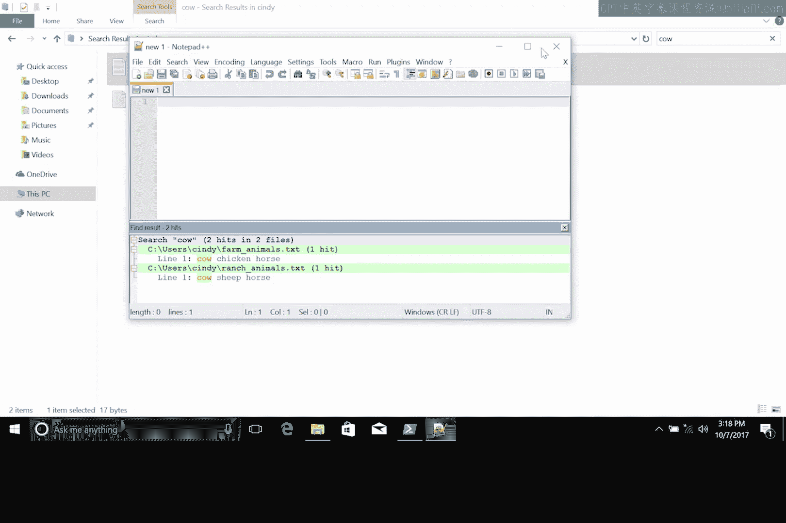
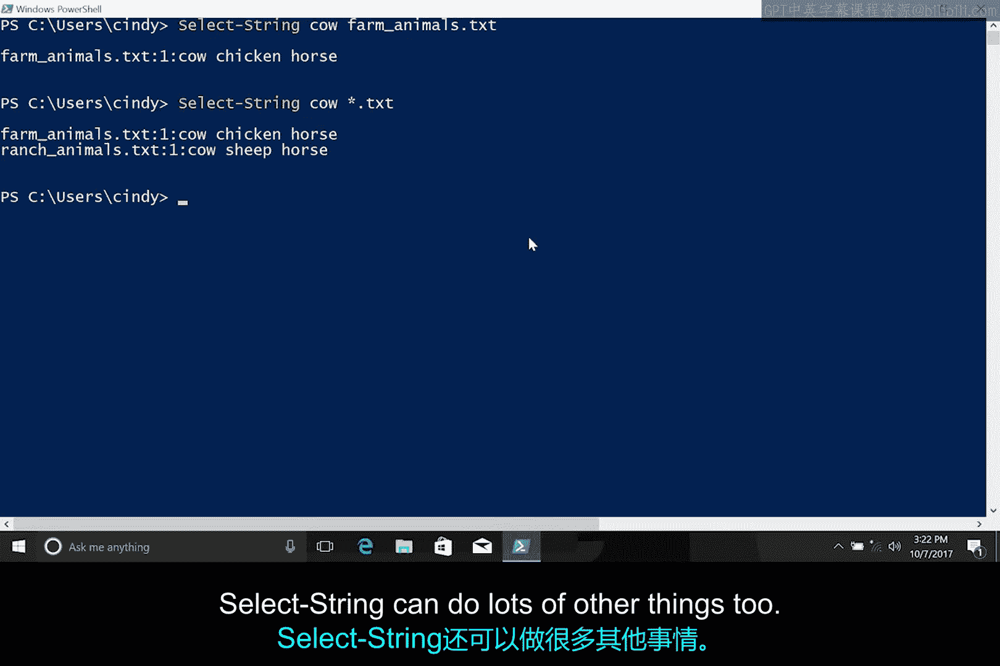

# 119：在文件中搜索 🔍

在本节课中，我们将学习如何在Windows操作系统中搜索文件内的文本内容。我们将探讨图形界面和命令行两种方法，并了解Windows搜索服务的工作原理。

## 概述

搜索文档中的特定词语是常见的操作需求。无论是查找替换词语还是其他目的，掌握高效的搜索方法都至关重要。大多数文本编辑器使用相同的方式进行文档内搜索，但跨文件搜索则需要不同的工具和技巧。本节将介绍Windows搜索服务、Notepad++编辑器以及PowerShell命令行工具，帮助你掌握在单个或多个文件中搜索文本的技能。

## Windows搜索服务

上一节我们提到了常见的文档内搜索，本节中我们来看看如何跨多个文件进行搜索。Windows提供了一项名为“Windows搜索服务”的功能。该服务会按计划扫描计算机上的文件并为其建立索引。随后，它将找到的文件名称和属性编译成一个数据库。这是一个耗时且消耗资源的过程。因此，在许多Windows服务器上，该服务默认未安装或被禁用。在Windows 8和Windows 10桌面电脑上，该服务通常对用户主目录中的文件启用，但不会对整个硬盘驱动器启用。

默认情况下，Windows搜索服务允许你根据文件名、路径、最后修改时间、大小或其他详细信息来查找文件。但默认情况下，你无法搜索文件内部的内容。Windows搜索服务可以配置为搜索文件内容及其属性。这会增加索引器的工作时间。这有点像计算机提前执行了你可能想要进行的所有搜索，而你只需查看结果。

以下是配置该服务以索引文件内容的步骤：

1.  打开“开始”菜单，输入“索引”。
2.  在搜索结果中点击“索引选项”。
3.  选择包含所有主目录的“用户”文件夹。
4.  点击“高级”按钮。
5.  在“文件类型”选项卡中，选择“索引属性和文件内容”。
6.  点击“确定”并关闭索引选项。

完成此操作后，Windows搜索服务将根据新设置开始重建索引。这个过程可能很快，也可能需要一段时间，具体取决于文件的数量和大小。索引重建完成后，你便可以在主目录中使用Windows资源管理器来查找包含特定词语的文件。

## 使用Notepad++搜索

如果你不想使用Windows搜索服务，我们也可以使用Notepad++。这是我们之前课程中安装的编辑器。从Notepad++中，按 `Ctrl+Shift+F` 打开“在文件中查找”对话框。从这里，你可以指定要查找的内容以及要搜索的文件范围。你可以将搜索限制在特定目录、特定文件扩展名，甚至可以在此处选择用另一个词替换找到的词。



## 使用PowerShell搜索

如果我们无法或不想使用图形界面，可以从命令行搜索文件中的词语。在PowerShell中，我们将使用 `Select-String` 命令（或其别名 `sls`）来查找文件中的词语或其他字符序列。你可以将字符串理解为计算机表示文本的一种方式。`Select-String` 命令允许你搜索与你提供的模式匹配的文本。这可以是一个词、词的一部分、一个短语，或者使用称为正则表达式的模式匹配语言描述的更复杂的模式。请记住，我们只是浅尝辄止，这是一项非常强大的功能。

以下是在主目录中搜索文件中词语的示例。让我们再次搜索词语“cow”：
```powershell
Select-String -Path "C:\Users\YourUsername\*" -Pattern "cow"
```
你会看到 `Select-String` 找到了“cow”，并告诉你它所在的文件和行号。

如果你想搜索目录中的多个文件，可以使用模式匹配来选择它们。记住通配符星号 `*` 用于选择所有文件，我们也可以在这里使用它：
```powershell
Select-String -Path "C:\Users\YourUsername\*.txt" -Pattern "cow"
```
现在我们可以看到它找到了“farm animals”和“ranch animals”文件。`Select-String` 还可以做很多其他事情，我们将在后续课程中有机会看到。



## 总结


本节课中我们一起学习了在Windows系统中搜索文件内文本的多种方法。我们了解了Windows搜索服务的索引机制及其配置方法，掌握了使用Notepad++图形界面进行跨文件搜索的技巧，并初步实践了使用PowerShell的 `Select-String` 命令从命令行执行搜索。能够在文件或一组文件中查找字符串，将是本课程以及你未来IT支持工作中的一项关键技能。它也是一个重要的工具，我们将学习将其与其他工具结合使用，以便从命令行执行真正强大的操作。