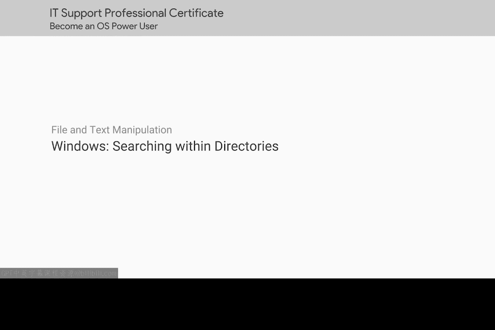
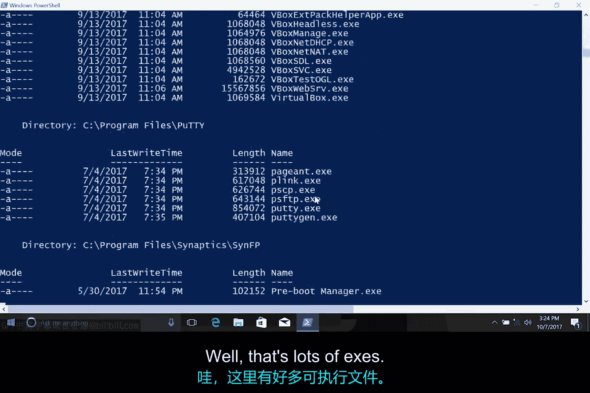
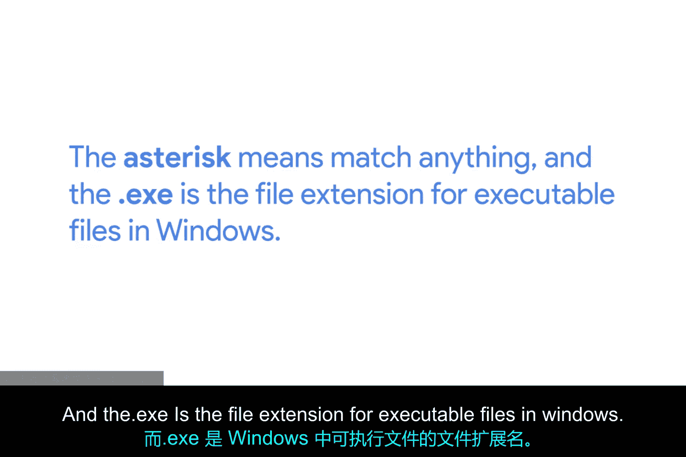

# 120：在目录中搜索文件



在本节课中，我们将学习如何在Windows命令行中，使用特定的参数来搜索目录中的文件，特别是如何过滤出特定类型的文件。

上一节我们介绍了基本的目录列表命令，本节中我们来看看如何对列表结果进行筛选。

## 使用 `-Filter` 参数进行搜索

如果我们想在目录内搜索特定内容，例如，只想查找同一目录中的可执行文件，这时就需要用到 `-Filter` 命令参数。



我将输入命令 `ls` 来列出“我的程序”文件夹中的文件。结合使用 `-Recurse` 和 `-Filter` 参数，并指定搜索 `*.exe`。

```powershell
ls -Recurse -Filter *.exe
```

执行后，命令行会返回大量 `.exe` 文件的结果。

`-Filter` 参数的作用是筛选出文件名符合特定模式的结果。在这个例子中：
*   `*`（星号）是一个通配符，表示匹配任意字符。
*   `.exe` 是Windows系统中可执行文件的扩展名。



因此，`*.exe` 这个模式意味着“匹配所有以 `.exe` 结尾的文件名”。所以，我们得到的结果将仅仅是那些以 `.exe` 结尾的文件。

本节课中我们一起学习了如何在Windows命令行中使用 `ls -Filter` 命令来搜索并筛选特定类型的文件。通过结合通配符 `*` 和文件扩展名（如 `.exe`），我们可以快速定位目录中的可执行文件或其他目标文件。