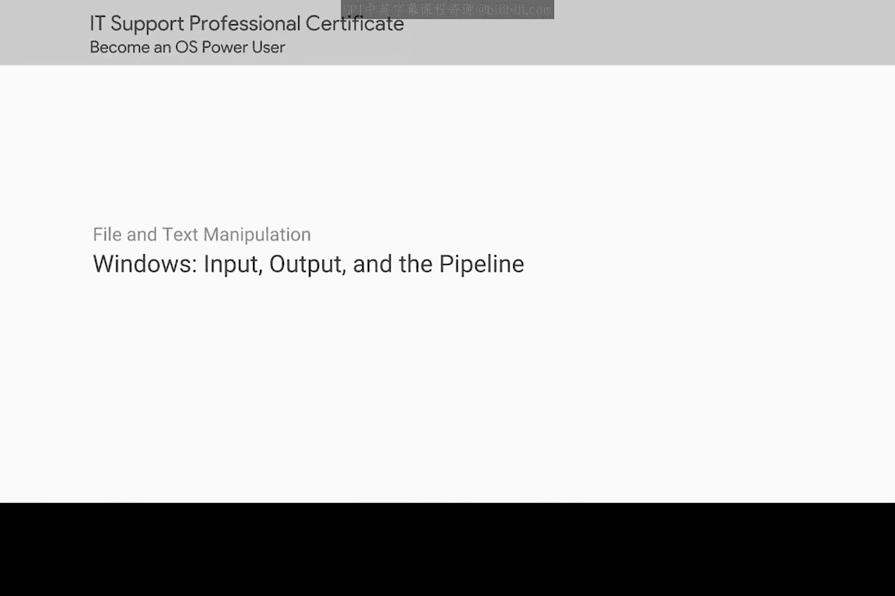
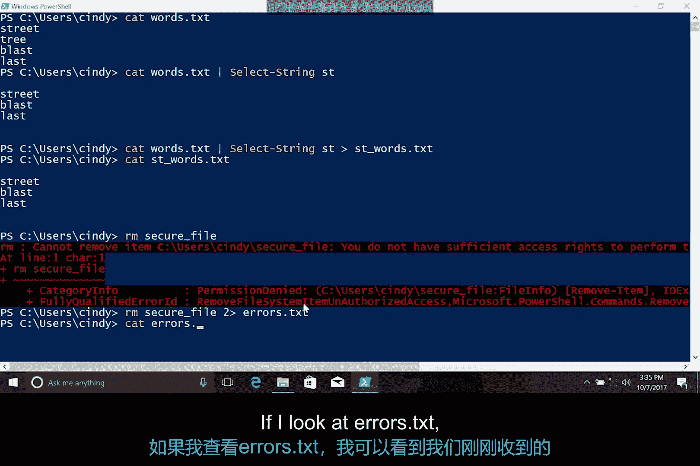
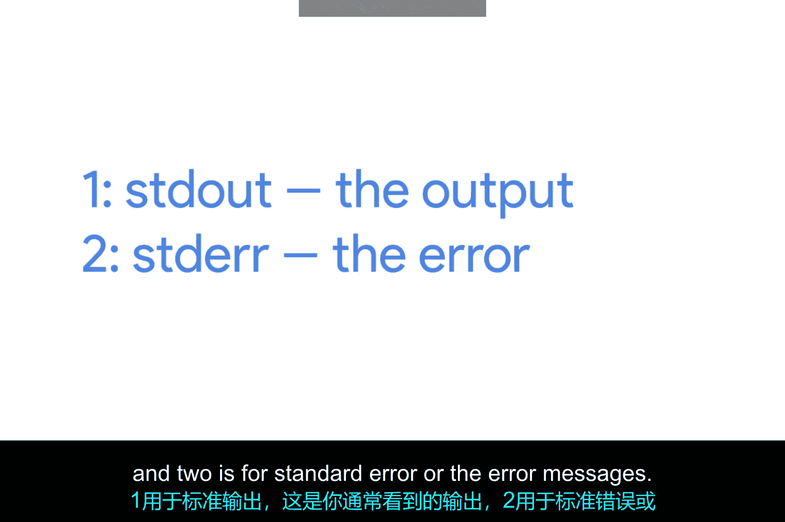
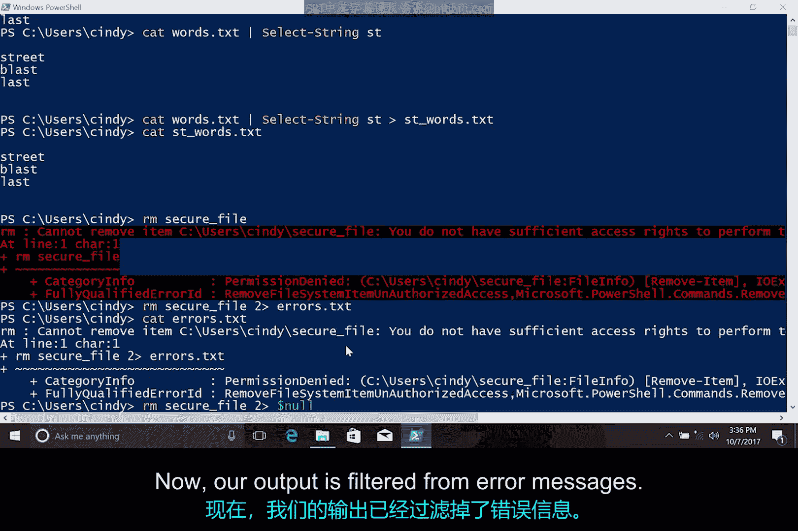

# 122：Windows输入输出与管道 📖



在本节课中，我们将学习如何组合使用PowerShell中的强大工具。我们将重点探讨输入输出流的概念，以及如何通过重定向操作符和管道来连接不同的命令，从而执行更复杂的任务。

---

上一节我们介绍了一些独立的PowerShell命令。本节中，我们来看看如何将这些工具组合起来，使其功能更加强大。

首先，我们在桌面目录中运行以下命令，然后逐步分析其工作原理。

```powershell
cd ~/Desktop
echo wolf > dog.txt
```

运行 `ls` 命令检查桌面，现在可以看到一个名为 `dog.txt` 的文件。查看该文件内容，里面应该是单词 “wolf”。

这里发生了什么？让我们仔细看看 `echo wolf` 命令。在PowerShell中，`echo` 实际上是 `Write-Output` 的别名。这提示了我们其工作原理。我们知道 `echo` 命令会将键盘输入的内容打印到屏幕上，但这是如何实现的呢？

每个Windows进程和每个PowerShell命令都可以接收输入并产生输出。这是通过一种称为 **IO流** 或 **输入输出流** 的机制实现的。

Windows中的每个进程都有三个不同的流：
*   **标准输入**
*   **标准输出**
*   **标准错误**

可以将这些流想象成河流中的水流。你通过向标准输入流添加内容来为进程提供输入，这些内容会“流入”进程。当进程创建输出时，它会将数据添加到标准输出流，这些数据从进程“流出”。

你通过键盘提供的输入会进入你正在交互的进程（无论是PowerShell、文本编辑器还是其他任何程序）的标准输入流。然后，该进程通过将数据放入标准输出流来与你通信，命令行界面会将这些数据显示在你正在查看的屏幕上。

---

那么，如果我们不想在屏幕上看到命令的输出，而是想将其保存到文件中，该怎么办呢？

`>` 符号是一个我们称之为 **重定向操作符** 的工具，它允许我们改变标准输出的去向。

我们可以将标准输出发送到一个文件，而不是发送到屏幕。如果文件已存在，它会覆盖该文件；如果文件不存在，则会创建一个新文件。

如果我们不想覆盖现有文件，可以使用另一个重定向操作符来追加信息：`>>`。

让我们看看它的实际效果。

```powershell
echo wolf >> dog.txt
```

现在再次查看 `dog.txt` 文件，可以看到 “wolf” 被再次添加到了文件中。

---

如果我们想将一个命令的输出发送给另一个命令作为输入，该怎么办呢？为此，我们将使用 **管道操作符** `|`。

首先，让我们看看这个文件里有什么。

```powershell
cat words.txt
```

这是一个单词列表。现在，如果我们只想列出包含字符串 “st” 的单词，可以像以前一样直接对文件使用 `Select-String` 或 `sls`。但这次，让我们使用管道将 `cat` 的输出传递给 `Select-String` 的输入。

以下是具体操作：

```powershell
cat words.txt | Select-String st
```

现在，我们可以看到包含字符串 “st” 的单词列表。

为了整合所学内容，我们可以使用输出重定向将新列表放入一个文件中。

```powershell
cat words.txt | Select-String st > st_words.txt
```

现在，如果我查看 `st_words.txt` 文件，新列表就在那里了。这只是一个非常基础的例子，展示了如何将几个简单的工具组合在一起来执行复杂的任务。

---

现在，我们将学习最后一个IO重定向：**标准错误**。

还记得之前我们尝试删除一个受保护的系统文件时，收到了“拒绝访问”的错误吗？让我们再回顾一次。这次我将尝试删除另一个受保护的文件。

```powershell
rm secure_file
```

我们看到了预期的错误。但是，如果我们不想看到这些错误呢？原来，我们可以将错误消息的输出重定向到另一个称为 **标准错误** 的输出流。

重定向操作符可用于重定向任何输出流，但我们必须告诉它要重定向哪个流。



让我们输入以下命令：

```powershell
rm secure_file 2> errors.txt
```

如果我查看 `errors.txt` 文件，可以看到刚刚得到的错误消息。

那么，`2` 是什么意思呢？所有的输出流都有编号：
*   **1** 代表标准输出（你通常看到的输出）。
*   **2** 代表标准错误（错误消息）。

请注意，PowerShell实际上还有更多我们本节课不会用到的流，但它们可以用同样的方式重定向。你可以在本视频后的补充阅读材料中了解更多信息。



因此，当我们使用 `2>` 时，我们是在告诉PowerShell将标准错误流重定向到文件，而不是标准输出。

---

如果我们不关心错误消息，但又不想把它们放到文件里呢？利用我们新学的重定向操作符，我们实际上可以过滤掉这些错误消息。

在PowerShell中，我们可以通过将标准错误重定向到 `$null` 来实现这一点。

`$null` 是什么？它就是“空无一物”。真的，它是一个包含“无”定义的特殊变量。出于重定向的目的，你可以把它想象成一个黑洞。

所以，这次让我们将错误消息重定向到 `$null`。

```powershell
rm secure_file 2> $null
```



现在，我们的输出中就没有错误消息了。

---

如果你感兴趣，还有很多可以学习的内容。可以尝试在PowerShell中运行 `Get-Help about_Redirection` 查看更多细节。

掌握重定向操作符的使用可能需要一些时间，别担心，这完全正常。一旦你开始习惯使用它们，你会发现你的命令行技能水平提升了，工作也变得更轻松一些。

本节课中，我们一起学习了Windows PowerShell中的输入输出流、重定向操作符和管道。我们了解了如何将命令的输出保存到文件、如何将多个命令连接起来处理数据，以及如何管理和过滤错误消息。这些技能是组合使用命令行工具、实现自动化任务的基础。