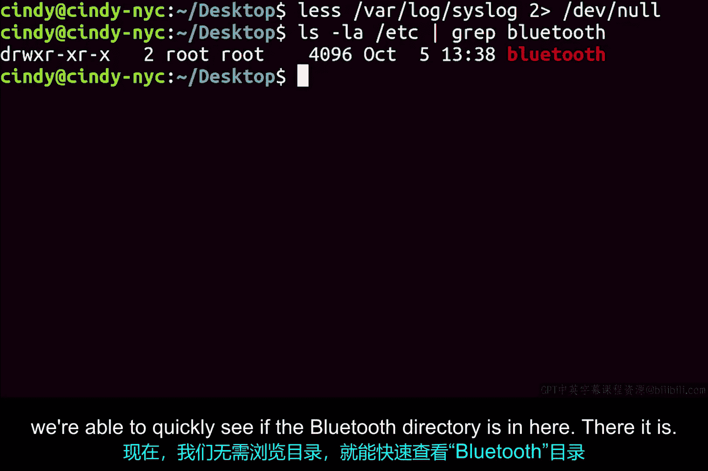

# 123：输入输出与管道


## 概述
在本节课中，我们将要学习Linux系统中的输入输出流概念，以及如何通过重定向和管道操作符来控制数据的流向。这些工具能帮助我们更高效地处理命令的输出和输入。

## 输入输出流
与Windows系统类似，Linux也有三种不同的输入输出流：标准输出、标准输入和标准错误。上一节我们介绍了标准输出的概念，本节中我们来看看这些概念在Linux中的具体应用。

## 标准输出重定向
我们使用`echo`命令输出文本“woof”，但默认情况下不将其显示在屏幕上，而是使用标准输出重定向操作符`>`将其输出重定向到一个文件中。

**命令示例：**
```bash
echo woof > dog.txt
```

我们可以验证文件内容。
**命令示例：**
```bash
cat dog.txt
```
结果显示文件`dog.txt`的内容为“woof”。此操作会覆盖任何名为`dog.txt`的文件内容。

如果我们不想覆盖现有文件，可以使用追加操作符`>>`。
**命令示例：**
```bash
echo woof >> dog.txt
```
我们可以验证内容已被追加。

## 标准输入重定向
在Windows课程中我们讨论过但未展示标准输入重定向操作符的例子。标准输入重定向由小于号`<`表示。我们可以从文件而不是键盘获取输入。

**命令示例：**
```bash
cat < file_input.txt
```
此命令与`cat file_input.txt`效果完全相同。区别在于我们不再使用键盘输入，而是使用文件作为标准输入。

## 标准错误重定向
最后，与Windows类似，我们将讨论标准错误重定向操作符。标准错误用于显示错误消息，你可以使用`2>`重定向操作符来捕获它们。

数字`2`用于表示标准错误。因此，要仅重定向某些输出中的错误消息，可以这样做：
**命令示例：**
```bash
ls fake_directory 2> error_output.txt
```
现在如果我查看这个新文档，就能看到错误消息保存在`error_output.txt`中。

还记得在Windows中我们使用`$null`变量将不需要的输出丢弃到“黑洞”吗？Linux中也有类似的东西。Linux中有一个特殊的文件叫`/dev/null`。

假设我们想过滤掉文件中的错误消息，只查看标准输出消息，我们可以这样做：
**命令示例：**
```bash
ls fake_directory 2> /dev/null
```
现在我们的输出就过滤掉了错误消息。

## 管道
还记得我们讨论过如何使用Windows的管道将一个命令的输出作为另一个命令的输入吗？Linux中也存在同样的功能。`|`管道命令允许我们做到这一点。



假设我们想查看`/etc`目录下的哪些子目录包含“bluetooth”这个词。我们可以这样做：
**命令示例：**
```bash
ls -la /etc | grep bluetooth
```
或者使用管道重定向操作符，将`ls -la /etc`的输出通过管道发送给`grep`命令。现在，我们甚至无需浏览目录就能快速查看“bluetooth”目录是否在其中。

## 总结
本节课中我们一起学习了Linux的输入输出流、重定向操作符（`>`、`>>`、`<`、`2>`）以及强大的管道（`|`）工具。你已经窥见了重定向的强大功能，随着你深入Linux世界，你将经常使用它们。它们是工具箱中非常有价值的工具，现在它们也成为了你技能的一部分。