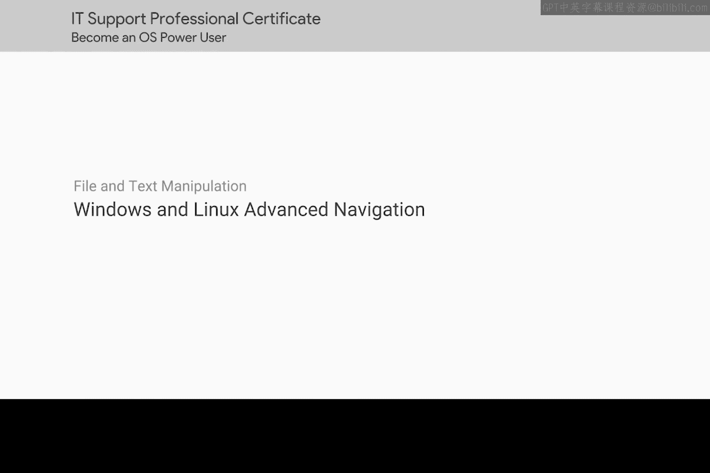
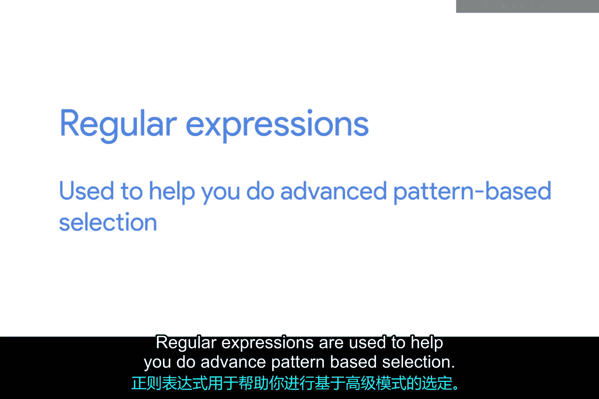

# 124：Windows与Linux高级导航

在本节课中，我们将学习高级命令行导航技术，包括正则表达式和PowerShell的深入学习。这些工具能帮助你更高效地处理复杂的文件搜索和系统管理任务。

## 概述

你已经学习了许多命令和工具，为IT支持工作打下了坚实的基础。还有许多其他命令你尚未接触，这很正常。随着职业生涯的发展，你会逐步接触到它们。你甚至可能会发现，当前使用的工具和命令在功能或效率上已无法满足需求。例如，你可能希望使用更复杂的模式来搜索文件。为此，你需要了解正则表达式这类工具。

## 正则表达式：高级模式匹配

上一节我们介绍了基础命令，本节中我们来看看如何使用正则表达式进行高级模式匹配。正则表达式用于帮助你执行基于模式的高级选择。

以下是正则表达式的核心概念：

*   **模式定义**：使用特殊字符序列定义搜索模式。例如，`^abc` 匹配以“abc”开头的行。
*   **字符类**：使用方括号 `[]` 匹配一组字符中的任意一个。例如，`[aeiou]` 匹配任意一个元音字母。
*   **量词**：指定模式出现的次数。例如，`a{2,4}` 匹配连续出现2到4次的字母“a”。
*   **分组**：使用圆括号 `()` 对模式进行分组，以便应用量词或进行捕获。例如，`(abc)+` 匹配一次或多次重复的“abc”。

## 深入PowerShell

除了正则表达式，PowerShell还有更多强大的功能。有许多优秀的视频和文章可以引导你从目前学到的基础步骤，逐步成为Windows命令行界面的大师。如果这听起来很有趣，我们强烈建议你在观看本视频后立即查阅补充阅读材料。请注意，在这些课程中，我们不会就这些材料的知识对你进行评分。但这些知识在IT支持领域可能对你非常有用。

## 总结与回顾

你已经完成了一些非常出色的工作。我们在本课中涵盖了大量信息。也许这是你第一次接触Linux或Windows。如果是这样，你已经在学习旅程中跨越了一个重要的里程碑。能够凭记忆使用在这里学到的命令至关重要。希望你在观看本课程视频时，已将它们记在了笔记中。

接下来，我们将对你新学的Bash和Windows CLI命令进行测试。如果你想在开始前复习一下，请务必重看视频并练习相关操作。当你准备好后，我们下节课再见。😊