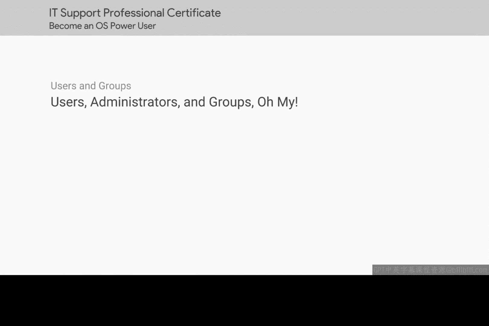
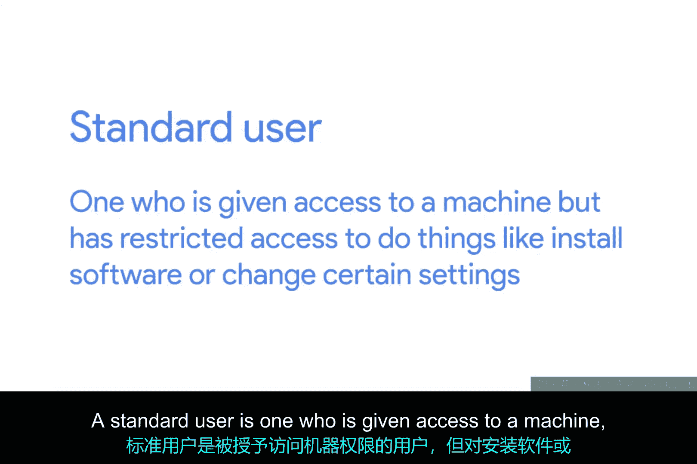
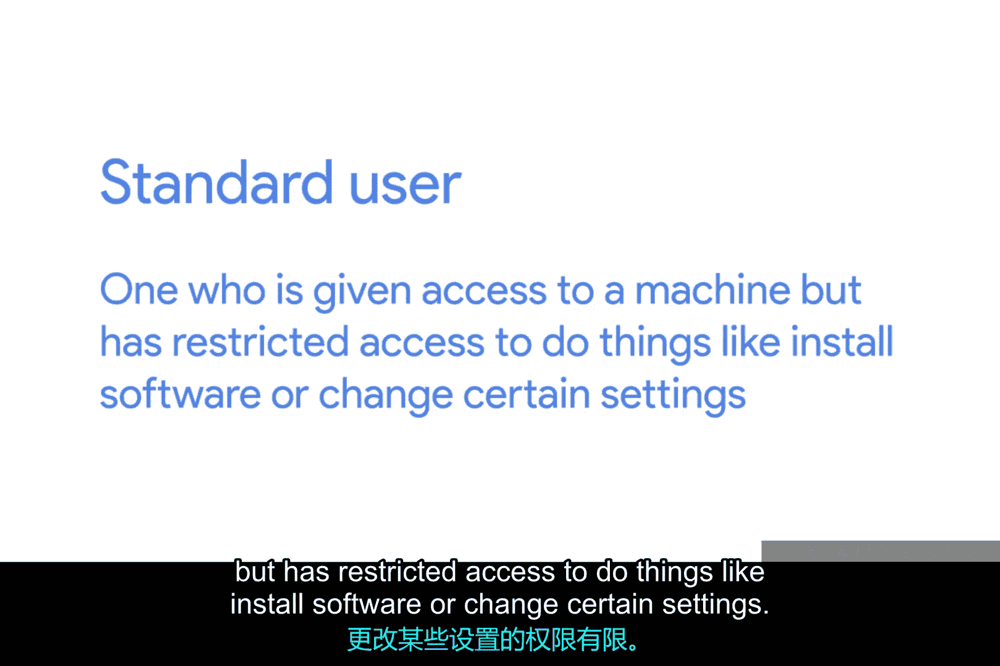
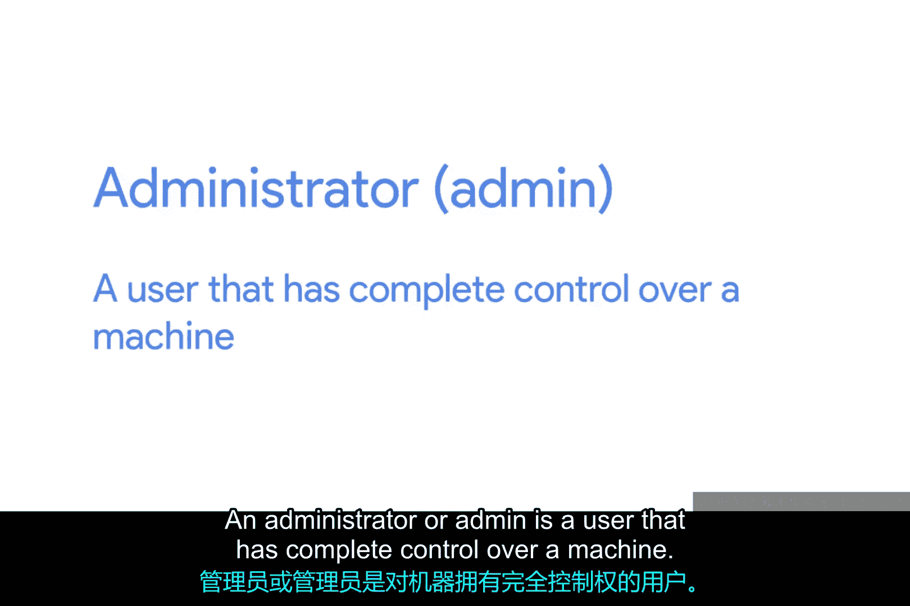
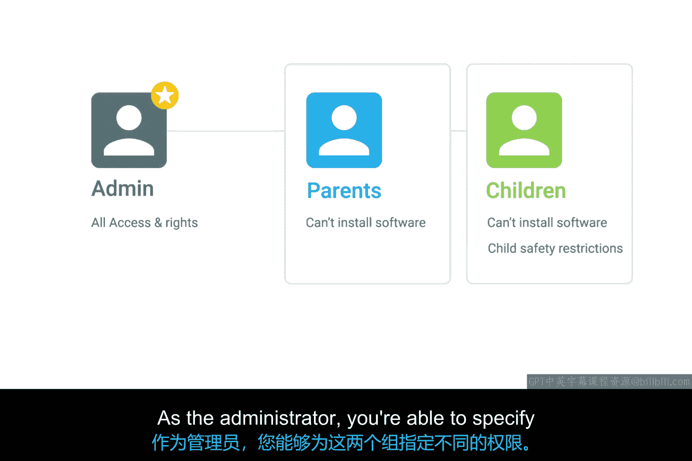

# 126：用户、管理员与组 👥

欢迎回来。在学习了如何在Windows和Linux操作系统中导航之后，现在让我们开始为其他人使用来设置我们的计算机。作为一名IT支持专家，您将负责其他人的机器。人们将依赖您来帮助设置他们的机器、排查问题等。

在本节课中，您将学习如何管理一台机器上的多个账户。您还将了解不同的权限和访问类型、如何添加和移除用户，以及在管理多个用户时应遵循的最佳实践。

## 概述

一台计算机拥有多个用户是很常见的。在您的家用电脑上，可能有您的父母、兄弟姐妹或孩子使用同一台电脑。您所在城镇的图书馆、学校或其他公共场所的电脑也可能有多个用户。

尽管这些机器上有多个用户账户，但计算机上的所有用户彼此是隔离的。这意味着凯文无法看到维克托的文件和文件夹，反之亦然。

## 用户类型

用户主要分为两种类型：标准用户和管理员。

*   **标准用户**：拥有使用机器的权限，但在安装软件或更改某些设置等操作上受到限制。
*   **管理员**：对机器拥有完全控制权的用户。他们可以查看任何人的账户、更改或移除计算机上的任何用户，并查看每一个文件。

一台机器上也可以有多个管理员。在您的个人机器上，您是默认的管理员，因为这使您对系统拥有完全的控制权。毕竟，这是您的机器。但在公共计算机上，管理员通常是实际运行和维护机器的人，例如IT支持专家。他们可以为其他用户授予访问权限、安装软件、更改受限制的系统设置以及执行他们认为合适的其他操作。

试想一下，如果任何使用公共计算机的人都可以随意安装软件，那将多么糟糕。计算机会变得臃肿不堪，各种东西会杂乱无章，最糟糕的是，它们可能会感染恶意软件。

## 用户组

用户根据访问级别和权限被分组，以执行特定任务。这些任务取决于计算机管理员认为什么是合适的。

管理员可以根据用户所在的组类型，授予不同的访问权限和设置。假设您是家用电脑的管理员，家里每个人都使用它。您可以将父母放入一个名为“父母”的组，将孩子放入一个名为“儿童”的组。您可能不希望他们中的任何一方能够安装软件，但同时您希望对“儿童”组添加儿童安全限制。作为管理员，您能够为这两个组指定不同的权限。

## 如何查看用户和组信息

那么，如何区分您在Windows和Linux上是哪种类型的用户，以及您属于哪些组呢？如果您是计算机的管理员，希望您会知道这一点。但如果您不知道，计算机会很好地告诉您。

在接下来的几节课中，我们将看到如何在Windows和Linux中查看用户和组信息。

## 总结

本节课中，我们一起学习了计算机用户管理的基础概念。我们了解了**标准用户**和**管理员**之间的核心区别，认识了通过**用户组**来批量管理权限的方法，并明白了用户隔离对于系统安全和秩序的重要性。这些知识是您作为IT支持专家管理多用户环境的第一步。