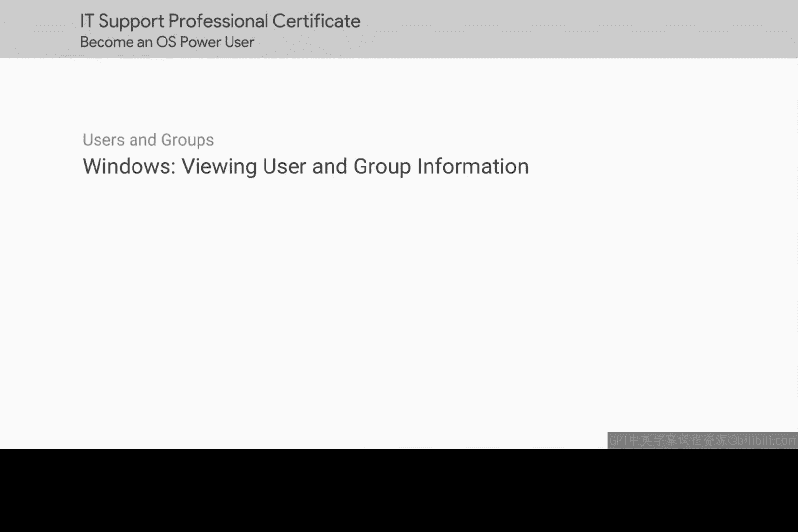
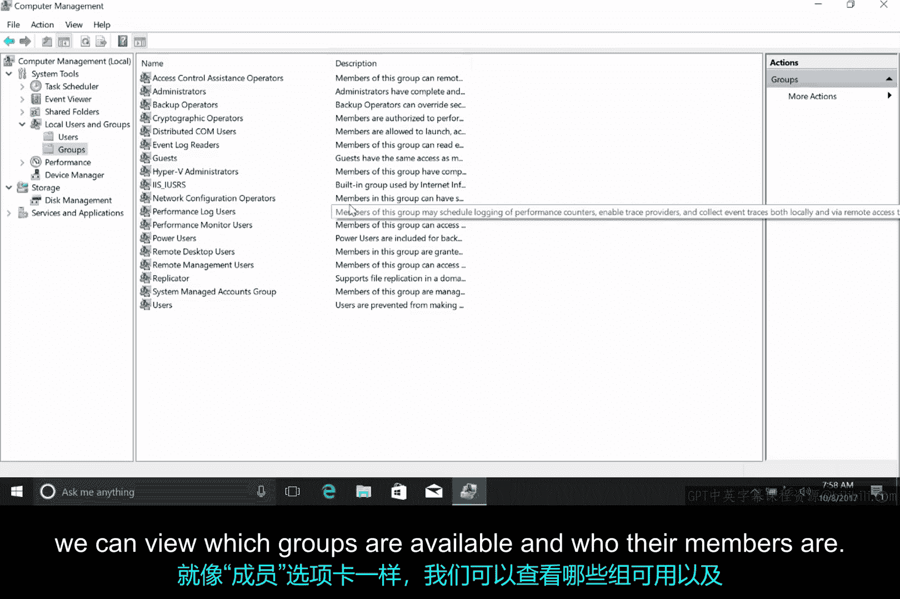

# 127：Windows查看用户与组信息



在本节课中，我们将学习如何在Windows操作系统中查看用户与组信息。我们将通过图形用户界面和命令行界面两种方式来完成这项任务，这是系统管理员日常工作中的一项基本技能。


## 🖥️ 使用计算机管理工具

要查看Windows中的用户和组信息，我们将使用“计算机管理”工具。在应用程序搜索中搜索“计算机管理”并打开它，我们会看到一个包含大量信息的窗口。

在本课程中，我们将频繁使用这个应用程序。因此，让我们花些时间了解一下它。在侧边栏的顶部，你会看到“计算机管理（本地）”。这意味着我们正在本地管理一台单独的计算机。

在企业环境中，你可以在称为“域”的环境中管理多台计算机。一个Windows域是一个由计算机、用户、文件等组成的网络，它们都被添加到一个中央数据库中。如果你是那个域的管理员，你可以从域中的任何一台机器上查看这些账户和计算机。我们将在下一门关于系统管理和IT基础设施服务的课程中了解更多关于域以及如何管理它们的知识。

在这个菜单下方，我们有“系统工具”。让我们逐一介绍这些子菜单。

以下是“系统工具”下的主要功能：

*   **任务计划程序**：允许你安排程序或任务在特定时间运行，例如每晚11点自动关闭计算机。
*   **事件查看器**：这是系统存储其系统日志的地方。我们将在后续课程中深入探讨这个工具。
*   **共享文件夹**：显示计算机上不同用户之间共享的文件夹。还记得我们说过其他用户无法查看任何人的文件吗？这并不完全正确。如果用户将文件存储在共享文件夹中，任何有权访问该文件夹的人都可以查看它。
*   **本地用户和组**：这是我们进行用户和组管理的地方。
*   **性能**：显示计算机资源（如CPU和RAM）的监控信息。
*   **设备管理器**：这是我们管理连接到计算机的设备的地方，例如网卡、声卡、显示器等。

在“存储”菜单下，有一个“磁盘管理”子菜单。我们将在后面的课程中讨论磁盘时使用它。

最后，“服务和应用程序”菜单显示系统上可用的程序和服务。我们可以选择启用或禁用服务，例如这里的DNS服务。

作为管理员需要更改的所有基本设置都可以在计算机管理工具中找到。如果你是一个高级用户，使用这个工具比通过默认的“设置”应用程序更高效。

好的，让我们回到手头的任务。让我们看看我们拥有哪种类型的用户账户以及我们属于哪些组。

让我们回到“本地用户和组”。在“用户”下，我们可以看到一些Windows内置账户，例如“Guest”和“Administrator”。

本地管理员账户允许你使用管理员用户名和计算机上的管理员密码登录。此账户默认是禁用的，因为该账户在计算机上拥有不受限制的访问权限，始终登录该账户可能很危险。

现在，让我们看看我登录的账户“Cindy”。双击它以查看更多信息。

在“常规”选项卡下，我们可以看到一些关于用户的基本信息以及一些选项。

以下是“常规”选项卡下的关键选项：

*   **用户下次登录时须更改密码**：由于我是管理员，我可以强制其他用户更改密码。如果我正在管理某人的账户并且他们的密码已泄露，这很有用。我们不希望其他人登录他们的账户，因此我们强制他们更改密码。
*   **用户不能更改密码**：限制用户自行修改密码。
*   **密码永不过期**：设置密码没有有效期限制。
*   **账户已禁用**：启用或禁用账户意味着使其处于活动或非活动状态。
*   **账户已锁定**：这意味着用户账户将无法登录。也许一个心怀不满的员工想要进行恶意操作，我们可以设置使其无法登录计算机。

在“隶属于”选项卡下，我们可以看到我们属于哪些组。我可以看到我属于“Administrators”组。

请注意，与其一直登录到本地管理员账户，你可以登录到自己的账户，并在需要时使用管理员权限。这要归功于UAC（用户账户控制）的帮助。这是Windows中的一项功能，可防止对系统进行未经授权的更改；这些更改必须由管理员批准。由于我是管理员，我只需要输入密码来确认我想要进行更改。

最后，在“配置文件”选项卡上，你可以更改用户配置文件的相关设置，例如你希望主文件夹的位置。这对于本地账户来说不是特别重要，但当你在域中管理许多用户时，它会派上用场。

现在，如果我们转到侧边栏中的“组”菜单，它看起来应该很熟悉。就像“隶属于”选项卡一样，我们可以查看哪些组可用以及它们的成员是谁。

这就是你如何使用Windows图形界面查看用户和组信息。

## ⌨️ 使用Windows命令行界面

上一节我们介绍了如何使用图形界面查看用户和组信息，本节中我们来看看如何使用命令行界面完成同样的任务。

要使用命令行查看用户和组信息，我们需要打开命令提示符或PowerShell。以下是几个常用的命令。

以下是用于查看用户和组信息的核心命令：

*   **查看本地用户列表**：
    ```cmd
    net user
    ```
    此命令会列出计算机上的所有本地用户账户。

*   **查看特定用户的详细信息**：
    ```cmd
    net user [用户名]
    ```
    例如，`net user Cindy` 将显示用户“Cindy”的详细信息，包括其所属的组。

*   **查看本地组列表**：
    ```cmd
    net localgroup
    ```
    此命令会列出计算机上的所有本地组。

*   **查看特定组的成员**：
    ```cmd
    net localgroup [组名]
    ```
    例如，`net localgroup Administrators` 将显示“Administrators”组的所有成员。

使用命令行界面进行管理通常更快捷，尤其是在需要编写脚本或远程管理多台计算机时。这些`net`命令是Windows中管理本地用户和组的基础工具。

## 📝 总结



本节课中我们一起学习了在Windows操作系统中查看用户和组信息的两种方法。我们首先通过“计算机管理”工具的图形界面，详细了解了用户属性、组隶属关系以及相关管理选项。接着，我们探索了如何使用命令行工具，如`net user`和`net localgroup`命令，来高效地获取相同的信息。掌握这两种方法对于进行有效的系统管理和故障排除至关重要。