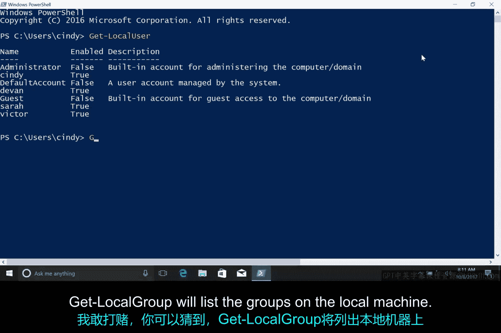

# 128：使用CLI查看Windows用户与组信息

## 概述

在本节课中，我们将学习如何使用命令行界面（CLI）快速查看Windows系统中的本地用户与组信息。我们将重点介绍几个PowerShell命令，帮助您高效完成系统管理任务。

---

上一模块中，我们深入探讨了CI的使用方法。我们了解到，在修改文件和文件夹时，CI可以显著加快测试速度。现在，我们将开始使用命令来协助完成系统上的其他任务。

设想您在一家公司担任IT支持专员。您的上司要求您检查10台计算机上的所有用户信息，以确保本地管理员账户未被启用。当然，您可以在搜索栏中搜索“计算机管理”，点击“计算机管理（本地）”，在“系统工具”下查找，点击“本地用户和组”，然后双击计算机的用户名来确认本地管理员账户是否启用。现在，您只需要再重复九次这个过程。

实际上，有一种更快捷的方法。您可以直接使用CI，通过命令 **`Get-LocalUser`** 快速查看计算机上的用户列表。


如图所示，该命令列出了我的用户账户、其他几个用户以及Windows系统内置的一些默认账户。在这里，您可以看到我的本地管理员账户未被启用。这种方法简便得多。

---


那么，组信息呢？您或许能猜到，查看组的命令是 **`Get-LocalGroup`**。



此命令会列出本地计算机上的所有组。虽然组别众多，但请放心，这些都是系统内置组。每个组都很重要，但我们通常不会对其中大多数进行修改。


我们将频繁修改的一个组是“Administrators”组。请记住，此组控制着谁拥有对计算机的管理员访问权限。了解该组中有哪些成员至关重要，因为组内的任何人都可以对计算机进行任意更改。

我们刚才在输出中看到，我本人属于这个组。但我想知道还有谁在组内。

---

以下是查看特定组成员的方法：

我们可以使用 **`Get-LocalGroupMember`** 命令来查看该组中有哪些成员。我想检查的是“Administrators”组。

```powershell
Get-LocalGroupMember -Group "Administrators"
```

执行后，我们可以看到Administrator用户和我的用户都在Administrators组中，没有其他成员。这看起来没问题。

---

最后请注意，这些本地用户和组的PowerShell命令要求您运行PowerShell 5.1或更高版本。您可能注意到，我一直强调“本地账户”和“本地用户”。

如果您的组织拥有大量Windows计算机，通常使用Active Directory在中央目录服务中管理用户账户。我们将在下一门关于系统管理和IT基础设施服务的课程中了解更多关于Active Directory账户的知识。

但现在，让我们继续专注于本地账户。

---

## 总结

本节课中，我们一起学习了如何使用PowerShell命令行高效管理Windows本地用户和组。我们掌握了 **`Get-LocalUser`**、**`Get-LocalGroup`** 和 **`Get-LocalGroupMember`** 这三个核心命令，它们能帮助您快速查看系统账户信息，从而简化IT支持任务，特别是在需要批量检查多台计算机时。请记住，这些命令适用于管理当前计算机的本地账户。