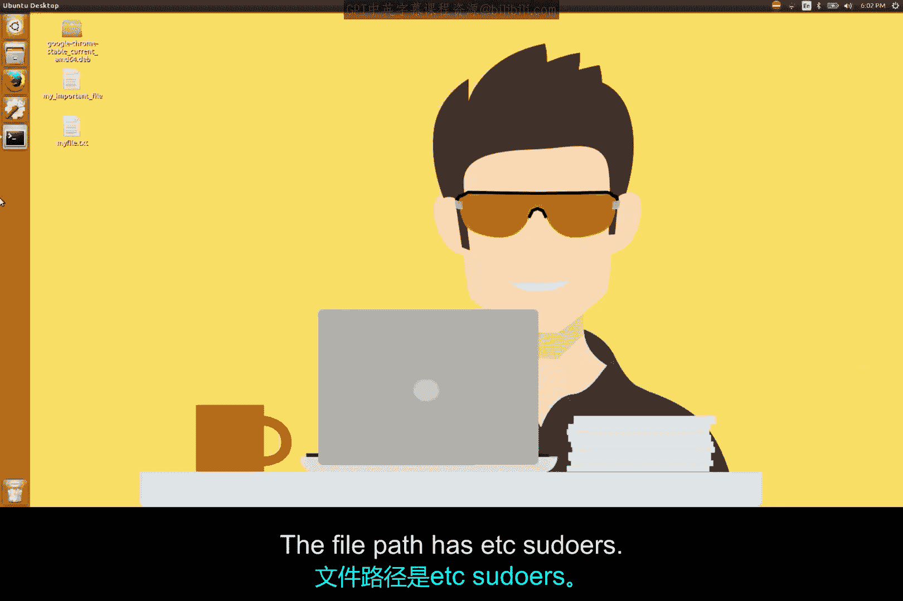
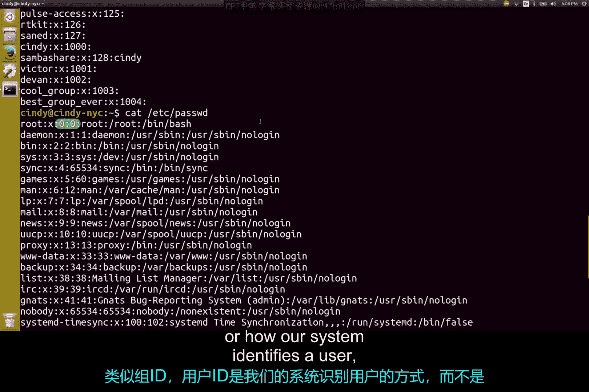

# 129：Linux用户、超级用户及其他 👨‍💻

在本节课中，我们将要学习Linux操作系统中的用户管理机制。我们将了解不同类型的用户、他们的权限，以及如何查看和管理用户与组信息。

## 用户管理与权限

Linux的用户管理和访问控制机制与Windows类似。不同类型的用户拥有不同的权限，并且可以按不同的访问级别进行分组。

然而，Linux在标识方式上存在一些差异。

## 用户类型

Linux系统中存在几种用户类型。

*   **标准用户**：拥有有限的权限，通常用于日常操作。
*   **管理员用户**：拥有比标准用户更高的权限，可以执行系统管理任务。
*   **根用户**：这是一个特殊的用户，请不要与根目录（`/`）混淆。根用户是在安装Linux操作系统时自动创建的第一个用户。

## 超级用户（根用户）

根用户拥有操作系统上的所有权限，因此也被称为**超级用户**。



从技术上讲，系统中只有一个超级用户或根账户。但是，任何被授予根用户权限的人也可以被称为超级用户。

## 访问受限制的文件

现在，让我们尝试查看一个受根用户限制的文件内容。文件路径是 `/etc/sudoers`。

```
cat /etc/sudoers
```

我们收到了一个错误：“Permission denied”。`/etc/sudoers` 是一个受保护的文件，只能由根用户读取。

我们可以以根用户身份登录，然后运行这个命令，这不会有问题。但是，始终以根用户身份操作非常危险。因为根用户就像Windows上的本地管理员账户，对机器拥有无限制的访问权限。即使犯一个小错误，也可能删除或修改重要的东西，这很不好。

## 使用 `sudo` 命令

因此，与其以根用户身份登录，我们可以告诉shell，我们希望以根用户身份运行这一个命令。这听起来类似于Windows的UAC功能，事实也确实如此。

在Linux上，我们可以使用 `sudo` 命令（即“super user do”）来实现。

```
sudo cat /etc/sudoers
```

现在，我们就能看到这个文件的内容了。

## 使用 `su` 命令

如果你不想每次运行需要根权限的命令时都输入 `sudo`，你可以使用 `su` 命令（即“substitute user”）。这个命令允许你切换到另一个用户。如果不指定用户，它默认切换到根用户。

```
su
```

现在，你可以看到我的提示符变成了 `root@cindy-NYC`。再次强调，始终保持以根用户身份登录通常不是一个好习惯。有许多关键服务和文件可能会被误改。如果需要以根用户身份登录，可以，但务必小心。

我现在就退出根用户，回到我的普通用户。

```
exit
```

## 查看用户组

你可以通过查看 `/etc/group` 文件来了解谁有权运行 `sudo`。这也是你查看所有组成员的方式。

```
cat /etc/group
```

这看起来与Windows的图形界面有些不同，但你可以看到它与Windows命令行界面有一些相似之处。即使你现在还不是Bash专家，阅读这个文件实际上也相当简单。

## 解析组文件

文件的每一行代表一个不同的组。让我们看一下 `sudo` 这一行。

```
sudo:x:27:cindy,alice
```

这里有四个由冒号分隔的字段。

*   **第一个字段是组名**。在这个例子中是 `sudo`。
*   **第二个字段是组密码**。我们通常不需要指定组密码，因此它默认为根密码。这里的 `x` 表示密码已被加密并存储在一个单独的文件中，我们将在后续课程中讨论。
*   **第三个字段是组的ID（GID）**。当操作系统运行涉及组的任务时，它使用组ID而不是组名。
*   **最后一个字段是组内的用户列表**。

## 查看系统用户

如果我们想查看机器上的用户，你认为存储这些信息的文件会是哪个？

不幸的是，它不是 `/etc/user`。包含用户信息的文件是 `/etc/passwd`。

```
cat /etc/passwd
```

这里的信息要多得多，用户也更多。这些账户中的大多数实际上并不是使用计算机的人。我们的计算机上有一堆进程在持续运行，我们需要将这些进程与用户关联起来。因此，我们的系统有许多具有不同权限的用户，这些权限是运行这些进程所必需的。

## 解析用户文件

让我们看看第一行，这是一个我们可以登录的实际用户：`root`。

```
root:x:0:0:root:/root:/bin/bash
```

我们不会讨论所有字段，因为并非所有字段都重要，但前三个是相关的。

*   **第一个字段是用户名**。
*   **第二个字段是用户密码**。密码实际上并不存储在这个文件中。它被加密并存储在一个不同的文件中，就像我们的组ID密码一样。
*   **第三个字段是用户ID（UID）**。与组ID类似，用户ID是我们的系统识别用户的方式，而不是通过用户名。

根用户的UID是0。



## 总结

本节课中我们一起学习了Linux用户管理的基础知识。我们了解了**标准用户**、**管理员**和**根用户（超级用户）** 的区别，知道了始终以根用户操作的风险。我们学会了使用 `sudo` 命令临时获取根权限来执行特定命令，以及使用 `su` 命令切换用户。最后，我们探索了 `/etc/group` 和 `/etc/passwd` 文件的结构，学会了如何查看系统中的组和用户信息，包括组名（GID）、用户名（UID）等关键字段。这基本上就是你在Linux中查看用户和组的方式。